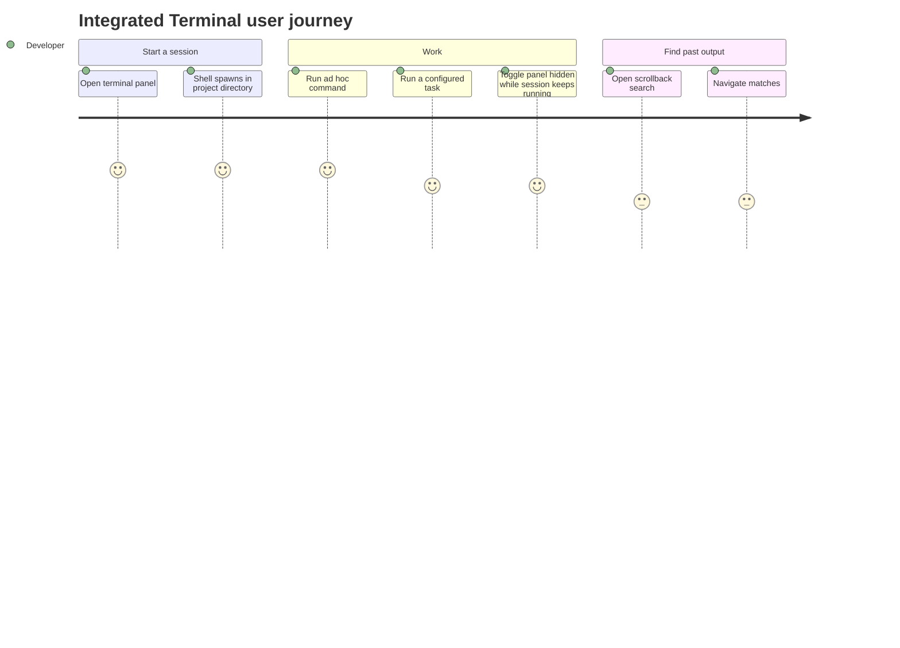

# Screens — F001_Terminal

<!-- generic-source profile: Zode has no route-list.md/screen-list.md (desktop GPUI app, not a
web app with routes). SCR### codes are intentionally omitted rather than fabricated. The table
below describes the GPUI panel/view surface in place of a web Screen List. -->

## Screen List

| View Name | Owning File | What User Sees | What User Can Do |
|-----------|-------------|-----------------|-------------------|
| TerminalPanel | `crates/terminal_view/src/terminal_panel.rs:77` | A dockable panel (bottom/side, per workspace layout) hosting one or more terminal tabs/panes, splittable like an editor pane group | Toggle the panel open/closed (`Toggle`/`ToggleFocus`), open a new terminal, split terminal panes, focus a specific terminal tab |
| TerminalView | `crates/terminal_view/src/terminal_view.rs:123` | A single terminal's live/scrollback content (the Alacritty grid), tab title (auto or custom-renamed), and a bell indicator while unread output has arrived | Type commands, copy/paste, clear the screen, send raw keystrokes/text programmatically, rerun the last task, rename the tab, search scrollback (Cmd-F), scroll |
| Terminal search bar (via `SearchableItem`) | `crates/terminal_view/src/terminal_view.rs:1821-1904` | A find bar overlaying the active terminal, with match count/highlighting | Enter a regex query, jump to next/previous match (no replace option, no case/word-boundary toggles) |

## User Journey

1. Developer arrives at the editor workspace and opens the TerminalPanel (toggle keybinding or command palette) — a shell spawns in the project directory and its output starts streaming into a TerminalView tab.
2. Developer optionally runs a configured task instead — a new (or reused) TerminalView tab shows the task's command output, followed by a summary line once it finishes.
3. Developer hides the TerminalPanel to focus on code — the running session keeps going in the background.
4. Developer reopens the TerminalPanel later — the still-running (or now-finished) session is exactly where they left it.
5. Developer opens the terminal search bar inside a TerminalView tab, searches for a term, and steps through highlighted matches in the scrollback.

