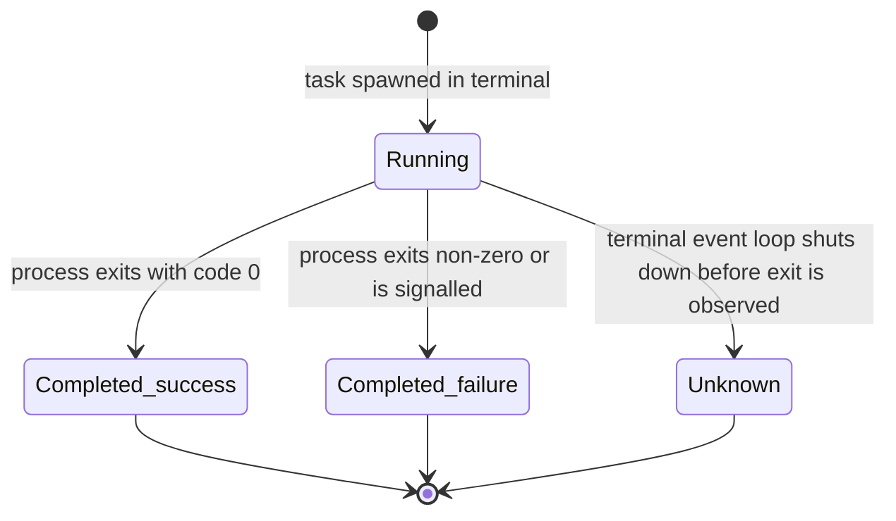

# F001_Terminal: Technical Spec
**Priority**: P0
**Type**: mixed
**Generated**: 2026-08-07

## Overview

The embedded terminal is Alacritty-backed: it spawns and manages interactive shell sessions and
`tasks.json`-configured task processes inside `Project`-owned `Terminal` entities, renders them
through `TerminalView`/`TerminalPanel`, and lets a developer run commands, toggle the panel,
rerun/rename sessions, and search scrollback — all without leaving the editor window. It spans
`crates/terminal` (emulator core, PTY lifecycle), `crates/terminal_view` (GPUI view/panel,
actions, persistence), and `crates/project/src/terminals.rs` (shell/task spawn orchestration,
environment resolution, remote-vs-local routing).

## Polymorphic Behavior

### DISC-012 — Terminal.terminal_type

| Value | Render | Validation | Persistence |
|-------|--------|------------|-------------|
| `Pty { pty_tx, info }` | Live PTY-backed session; renders streamed output, accepts keyboard input, shows a real child-process PID | `client_side_working_directory()` returns the live process's cwd from `info.current` | `TerminalView::serialize` persists cwd/title to `terminals` table (only when `task().is_none()`, see BR-003) |
| `DisplayOnly` | Renders fixed content injected via `write_output` (used e.g. for display-only integrations that feed text without a live process); no PTY event loop | `client_side_working_directory()` always returns `None` — no live process to query | Never has a working directory to persist; `custom_title` may still be saved |

**Source:** `crates/terminal/src/terminal.rs:846-852` (enum definition), `:2178-2187` (`client_side_working_directory` match)

## Cross-Cutting Logic

### Requirements

| Code | Description | Endpoint/Handler | Verifiable |
|------|-------------|------------------|------------|
| FR-001 | Spawn a shell or task process cross-platform (macOS/Linux/Windows) via a single `Command`/`Child` abstraction | `util::command::new_command`/`new_std_command` | yes |
| FR-002 | Capture the user's real login-shell environment (PATH, PYENV, NVM, etc.) so GUI-launched terminals match a real shell session | `util::shell_env::capture` | yes |
| FR-003 | Guarantee cleanup of a spawned process and all its descendants when Zed exits, by running each child in its own process group | `util::process::Child::spawn` | yes |

**Source:** `crates/util/src/command.rs:1-40` (BL118), `crates/util/src/shell_env.rs` (BL122), `crates/util/src/process.rs` (BL120)

### Business Rules

_(See itemized entries below.)_

### BR-001_NoDoubleShrinkOnRepeatHibernate
**Linked FR:** FR-001
**Source:** `crates/terminal/src/terminal.rs:1328-1335`
**Applies to:** `Terminal::limit_scroll_history` (fork-specific hibernation path)
**Rule:** Shrinking a terminal's scrollback cap to save memory on hibernate is a no-op if the
terminal was already shrunk (`pre_hibernate_scroll_history.is_some()`). This prevents a second
hibernate request from overwriting the real original cap with the already-reduced one, which
would corrupt what `restore_scroll_history_limit` restores to on wake.

**Pseudocode:**
```text
fn limit_scroll_history(lines):
    if pre_hibernate_scroll_history.is_some():
        return  # already shrunk, no-op
    pre_hibernate_scroll_history = term_config.scrolling_history
    term_config.scrolling_history = lines
    term.set_options(term_config)
```

### BR-002_TaskSpawnEnvMergesOverInteractiveShell
**Linked FR:** FR-002
**Source:** `crates/project/src/terminals.rs:63-160` (`Project::create_terminal_task`), `crates/project/src/terminals.rs:318-457` (`create_terminal_shell_internal`)
**Applies to:** `Project::create_terminal_task` vs `Project::create_terminal_shell`/`create_local_terminal`
**Rule:** Both spawn paths resolve a base directory environment (`resolve_directory_environment`,
including Python-toolchain venv activation), but a task spawn additionally merges the task's own
`env` map from `tasks.json` on top of that resolved environment and applies `RevealStrategy`/
`HideStrategy` to decide whether the terminal is shown or focused; an interactive shell spawn has
no task `env` to merge and always reveals per its caller.

**Pseudocode:**
```text
env = resolve_directory_environment(shell, cwd, remote_client)
if is_task_spawn:
    env.extend(task.env)
spawn(shell_or_task_command, env, cwd)
```

### BR-003_TaskTerminalsAreNotSerialized
**Linked FR:** FR-001
**Source:** `crates/terminal_view/src/terminal_view.rs:1724-1756` (`TerminalView::serialize`)
**Applies to:** workspace tab persistence for terminal items
**Rule:** A terminal running a `tasks.json` task (`terminal.task().is_some()`) is never persisted
to the `terminals` table — `serialize()` returns `None` immediately. Only interactive-shell
terminals persist their working directory and custom title so they can be restored on relaunch;
task terminals are ephemeral by design (rerunning the task, not restoring old output, is the
expected recovery path).

**Pseudocode:**
```text
fn serialize():
    if terminal.task().is_some():
        return None
    if !needs_serialize:
        return None
    write cwd + custom_title to terminals table
```

### Decision Logic

N/A — no user-facing decision logic beyond DISC-012 Polymorphic Behavior. Task/panel routing
(`RevealStrategy`/`HideStrategy`/`RevealTarget::Center|Dock`) is configuration-driven placement,
not a multi-predicate render/interaction/flow branch authored in this feature's own view code.

### State Machines

_(See itemized entries below.)_

### SM-001_TaskExecutionStatus
**kind:** entity
**Linked FR:** FR-001
**Source:** `crates/terminal/src/terminal.rs:918-928`
**States:** Unknown, Running, Completed { success: bool }



**Transition rules:**
- `Running → Completed{success:true}`: guard = exit code is `0`; side effect = terminal prints "Task `<label>` finished successfully" (`task_summary`, `crates/terminal/src/terminal.rs:2398-2436`)
- `Running → Completed{success:false}`: guard = non-zero exit code or killed by signal; side effect = terminal prints "finished with exit code: N" or "terminated by signal: N"
- `Running → Unknown`: guard = terminal event loop torn down before an exit status is observed; no summary line is guaranteed

### Algorithms

None.

### External Integrations

_(See itemized entries below.)_

### INT-001_CrossPlatformProcessSpawn
**Linked FR:** FR-001
**Source:** `crates/util/src/command.rs:1-40` (dispatch), `crates/util/src/command/darwin.rs` (macOS `posix_spawnp` path)
**Type:** api-call (OS process spawn, not a network integration)
**Target:** OS process/PTY subsystem — `posix_spawnp` on macOS, `smol::process::Command` elsewhere
**Trigger:** any terminal/task spawn (`create_terminal_shell_internal`, `create_terminal_task`)
**Payload:** resolved shell/task program, args, cwd, merged environment map
**Failure handling:** spawn errors propagate as `anyhow::Result` through the `Task<Result<Entity<Terminal>>>`
returned by the `Project::create_terminal_*` methods; interactive-terminal spawn failures are
logged via `detach_and_log_err` with no user-facing toast (see Edge Cases), while task-spawn
failures surface a `Toast` ("Task spawn failed: {e}") via `Workspace::schedule_resolved_task`.

**Pseudocode:**
```text
result = spawn(shell_or_task_cmd, cwd, env)
match result:
    Ok(child) -> continue running, forward pid/output
    Err(e) if interactive -> log_err(e)   # silent
    Err(e) if task        -> show_toast("Task spawn failed: {e}")
```

### Verification

- **SC-001** — Opening a terminal panel spawns a shell in the project's working directory and streams its output (covers FR-001, US045)
- **SC-002** — Toggling the panel hides/shows it without interrupting a running session (covers US046)
- **SC-005** — A terminal spawned from the GUI has PATH/PYENV/NVM and other login-shell environment variables matching a real interactive shell session, not the GUI process's bare environment (covers FR-002)
- **SC-006** — Quitting Zed while a terminal has spawned child processes terminates the entire process group, leaving no orphaned descendant processes (covers FR-003)

---

**Client behavior:** see
[`behavior-logic.md`](../../generated/behavior-logic.md) (client-side patterns — debounce, optimistic UI, polling, upload, realtime),
[`permissions.md`](../../system/permissions.md) (feature flags / experiments / env / locale gates),
[`screen-flow.md`](../../generated/screen-flow.md) (guards / deep-link state restoration / unsaved-changes protection).

## User Stories

### US045_RunCommandInIntegratedTerminal — Run a command in the integrated terminal (Priority: P1)

**What happens:** A developer opens a terminal panel, which spawns a shell process (`Project::create_terminal_shell`/`create_local_terminal`) in the project's working directory (or Zed's own directory for a "break out" local terminal on a remote project); the shell's output streams into the terminal pane as it is produced.
**Why this priority:** This is the feature's core capability — every other terminal user story (toggle, tasks, search) depends on a shell session existing first.
**Independent Test:** Open a terminal, run `ls`, confirm the file listing for the project root appears in the pane.

**Acceptance Scenarios:**

1. **Given** a project is open with a valid shell configured, **When** the developer opens a terminal and runs `ls`, **Then** the shell spawns in the project root and lists its files.
2. **Given** the project is a remote (SSH) project, **When** the developer requests a "local terminal" break-out, **Then** the shell spawns locally in Zed's own directory rather than on the remote host.

**Requirements fulfilled:**
- **FR-001** Spawn a shell or task process cross-platform via a single `Command`/`Child` abstraction — via `Project::create_terminal_shell_internal`
  **Source:** `crates/project/src/terminals.rs:318-457`

**Rules enforced:** BR-002 (see Cross-Cutting Logic) — interactive shell spawn merges the resolved directory environment but no task `env`.

**Verification:**
- **SC-001** (see Cross-Cutting Logic)

---

### US046_ToggleTerminalPanel — Toggle the terminal panel (Priority: P1)

**What happens:** A developer triggers the `terminal_panel::Toggle` action (keybinding or command palette); if the panel is not focused it gains focus/becomes visible, otherwise it closes. A running session inside the panel keeps running while hidden — closing the panel does not kill its terminals.
**Why this priority:** Fast show/hide is a baseline expectation for any editor-embedded terminal; without it the terminal competes permanently for screen space.
**Independent Test:** Start a long-running command, toggle the panel closed, toggle it open again, confirm the command's output continued accumulating while hidden.

**Acceptance Scenarios:**

1. **Given** the terminal panel is hidden with a session running, **When** the developer triggers Toggle, **Then** the panel becomes visible showing the still-running session's output.
2. **Given** the terminal panel is focused, **When** the developer triggers Toggle again, **Then** the panel closes (`Workspace::close_panel::<TerminalPanel>`).

**Requirements fulfilled:**
- **FR-001** (see US045) — panel show/hide does not spawn or kill terminals, it only changes visibility/focus
  **Source:** `crates/terminal_view/src/terminal_panel.rs:45-72`

**Rules enforced:** None beyond the `is_enabled_in_workspace` gate (panel action is a no-op if the terminal feature is disabled for the workspace).

**Verification:**
- **SC-002** (see Cross-Cutting Logic)

---

### US047_RunConfiguredTask — Run a configured task (Priority: P1)

**What happens:** A developer selects a task defined in `tasks.json`; its command/args/cwd/env are resolved (`Workspace::schedule_resolved_task` → `Project::create_terminal_task`), and the task is spawned inside a new or reused terminal per its `RevealStrategy`/`HideStrategy`/`RevealTarget` (center pane vs. dock). Building the task's execution context (cwd, active-editor selection, LSP task sources) runs off the UI thread (BL194) so resolving variables across many worktrees/LSPs doesn't stall the UI. The task's exit status is appended to the terminal as a summary line once it completes (BL202/`task_summary`).
**Why this priority:** Task running is the primary reason developers use the integrated terminal for build/test/lint workflows rather than typing ad hoc shell commands.
**Independent Test:** Define a `cargo test` task in `tasks.json`, run it, confirm a terminal spawns running `cargo test` in the project root and reports its exit code as a summary line.

**Acceptance Scenarios:**

1. **Given** `tasks.json` defines a `cargo test` task, **When** the developer runs it, **Then** a terminal spawns running `cargo test` in the project root and reports its exit code.
2. **Given** a task fails to spawn (e.g. invalid command), **When** the spawn error occurs, **Then** a toast reading "Task spawn failed: {error}" is shown (unlike an interactive-terminal spawn failure, which is only logged).

**Requirements fulfilled:**
- **FR-001** (see Cross-Cutting Logic) — via `Project::create_terminal_task`
  **Source:** `crates/project/src/terminals.rs:63-160`

**Rules enforced:** BR-002 (see Cross-Cutting Logic) — task env merge; BR-003 (see Cross-Cutting Logic) — task terminals excluded from persistence.

**State transitions:** SM-001 (see Cross-Cutting Logic) — Running → Completed{success}/Unknown on this task's own process.

**Verification:**
- **SC-003** A resolved task's exit status is surfaced as a terminal summary line and, on spawn failure, as a toast (covers FR-001, SM-001)

---

### US048_SearchTerminalScrollback — Search terminal scrollback (Priority: P2)

**What happens:** Cmd-F inside a focused terminal pane opens a search bar (`TerminalView` implements `SearchableItem`); `find_matches` runs the regex search across the terminal's scrollback/grid on the background executor (BL195, holding the terminal lock) so it doesn't block rendering, then `update_matches`/`activate_match` highlight and navigate between matches.
**Why this priority:** Useful but not required for the terminal's primary run-a-command workflows — hence `should`, not `must`, in the User Stories inventory.
**Independent Test:** Fill scrollback with the string "error" 3 times, search for it, confirm all 3 occurrences highlight and next/previous navigation visits each in order.

**Acceptance Scenarios:**

1. **Given** terminal scrollback contains the string "error" 3 times, **When** the developer searches "error", **Then** all 3 occurrences are highlighted and navigable.
2. **Given** the developer wants to replace matched text, **When** they look for a replace option, **Then** none is offered — `supported_options()` reports `replacement: false` (terminal search is find-only).

**Requirements fulfilled:**
- **FR-001** (see Cross-Cutting Logic) — search runs off-thread via `Terminal::find_matches`
  **Source:** `crates/terminal/src/terminal.rs:2148-2159`, `crates/terminal_view/src/terminal_view.rs:1821-1904`

**Rules enforced:** None beyond `supported_options()`'s fixed capability set (regex: true; case/word/replace/select_all/find_in_results: false).

**Verification:**
- **SC-004** A scrollback search highlights all matches and supports next/previous navigation without freezing terminal rendering (covers FR-001)

---

### Edge Cases

| Scenario | Behavior |
|----------|----------|
| Interactive terminal shell fails to spawn | Error is logged via `detach_and_log_err` (`TerminalView::deploy`, `crates/terminal_view/src/terminal_view.rs:205-221`); no toast shown to the user |
| Configured task fails to spawn | A toast is shown: "Task spawn failed: {e}" (`Workspace::schedule_resolved_task`, `crates/workspace/src/tasks.rs:101-107`) |
| Task terminal's underlying process exits by signal rather than exit code | Summary line reads "terminated by signal: {signal}" instead of an exit code (`task_summary`, `crates/terminal/src/terminal.rs:2414-2424`) |
| Project hibernates twice in a row without waking in between | `limit_scroll_history` no-ops on the second call (BR-001) — the original scrollback cap is not corrupted |
| Terminal is `DisplayOnly` (no live PTY) | `working_directory()`/`client_side_working_directory()` always return `None`; nothing is written to the `terminals` table's `working_directory` column for that item |
| User searches terminal scrollback expecting find-and-replace | Not supported — `SearchOptions.replacement` is `false` for `TerminalView` (`crates/terminal_view/src/terminal_view.rs:1824-1834`) |

## Key Entities

| Entity | Table | Key Columns | Purpose |
|--------|-------|-------------|---------|
| Terminal (MODEL016) | in-memory only — not a DB table | `terminal_type`, `term`, `task`, `pre_hibernate_scroll_history` | Runtime state for one Alacritty-backed terminal instance; owned by `Project::terminals: Terminals` |
| TerminalDb `terminals` | `terminals` | `workspace_id`, `item_id`, `working_directory`, `working_directory_path`, `custom_title` | Persists cwd + custom title per open interactive-terminal tab so it restores on relaunch (BR-003 excludes task terminals) |
| KeyValueStore (`TerminalPanel` layout) | `kv_store` (generic KV table, keyed by `TERMINAL_PANEL_KEY`/serialization key) | key, value (JSON blob: `SerializedTerminalPanel { items, active_item_id }`) | Persists the terminal panel's pane-group layout (splits, active pane), debounced 50ms (BL196) |

## Artifact References

| Artifact | File | Codes Used | Reviewed |
|----------|------|------------|----------|
| System Overview | [system-overview.md](../../system-overview.md) | — | [x] |
| Feature List | [feature-list.md](../../feature-list.md) | F001 | [x] |
| Entities | [entities.md](../../../../docs/generated/entities.md) | MODEL016 | [x] |
| Behavior Logic | [behavior-logic.md](../../../../docs/generated/behavior-logic.md) | BL067, BL068, BL069, BL113, BL114, BL118, BL119, BL120, BL121, BL122, BL151, BL194, BL195, BL196, BL197, BL202 | [x] |
| Business Rules | [business-rules.md](../../../../docs/system/business-rules.md) | Hibernation Lifecycle | [x] |
| User Stories | [user-stories.md](../../../../docs/generated/user-stories.md) | US045, US046, US047, US048 | [x] |

**Note (generic-source profile):** no `route-list.md`/`screen-list.md` exist for this Rust/GPUI
codebase — `ROUTE###`/`SCR###` references are intentionally omitted rather than fabricated.

## Assumptions

- `DisplayOnly` terminals (non-PTY, fed via `write_output`) are assumed to be used by non-shell integrations that push text into a terminal-shaped view; no first-party caller of this variant was located within `crates/terminal`/`crates/terminal_view` during this pass — flagged in Unresolved Questions.
- The `kv_store` table name for `TerminalPanel` layout persistence is inferred from the shared `KeyValueStore::global(cx)` mechanism used elsewhere in the codebase; this feature's spec does not itself define that table's schema (owned by the `db`/`kv_store` crate, out of scope here).
- Debounce interval for panel-layout serialization (50ms, BL196) is assumed tuned for pane-drag/resize churn rather than any correctness requirement — no test or comment ties the exact value to a specific UX budget.

## Source Code References

| Order | Symbol | Path | Purpose |
|-------|--------|------|---------|
| 1 | `Terminal` struct + `TerminalType` enum | `crates/terminal/src/terminal.rs:846-898` | Core in-memory entity; defines the Pty/DisplayOnly discriminator |
| 2 | `Project::create_terminal_shell`/`create_local_terminal`/`create_terminal_shell_internal` | `crates/project/src/terminals.rs:290-457` | Interactive shell spawn orchestration (env, cwd, remote routing) |
| 3 | `Project::create_terminal_task` | `crates/project/src/terminals.rs:63-288` | Task-spawn orchestration (`tasks.json` command/args/cwd/env resolution) |
| 4 | `TerminalPanel` (actions, serialize, Panel impl) | `crates/terminal_view/src/terminal_panel.rs:45-53, 947-980, 1540` | Panel toggle actions + debounced layout persistence |
| 5 | `TerminalView` (actions, SearchableItem, SerializableItem) | `crates/terminal_view/src/terminal_view.rs:77-98, 1709-1904` | View-level actions (SendText/SendKeystroke/RerunTask/RenameTerminal), search, tab persistence |
| 6 | `TerminalDb` | `crates/terminal_view/src/persistence.rs:375-500` | SQLite-backed cwd/title persistence for interactive terminal tabs |

## Unresolved Questions

1. **`DisplayOnly` terminal usage**: no call site constructing `TerminalType::DisplayOnly` was located in `crates/terminal`/`crates/terminal_view` during this pass — it may be constructed by an out-of-scope crate (e.g. an agent/ACP integration mentioned in a nearby doc comment, `write_output`'s comment references "piped commands (not a PTY) such as codex-acp"). Confirm the concrete caller before relying on this variant's behavior in a downstream spec.
2. **`kv_store` schema ownership**: `TerminalPanel::serialize` writes through `KeyValueStore::global(cx)` rather than a Terminal-specific table; the exact `kv_store` table/column layout lives in the `db` crate and was not verified line-by-line as part of this feature's source reading.

## Source Walkthrough

1. **File:** `crates/terminal/src/terminal.rs:846-928` — start here: defines the `Terminal` entity, its `TerminalType` discriminator, and the `TaskState`/`TaskStatus` state machine that everything else in this feature manipulates.
2. **File:** `crates/project/src/terminals.rs:1-160` — next: `Project::create_terminal_task`, the entry point for task-driven spawns (resolves cwd/env, builds the `TerminalBuilder`).
3. **File:** `crates/project/src/terminals.rs:290-457` — next: `create_terminal_shell`/`create_local_terminal`/`create_terminal_shell_internal`, the entry point for interactive-shell spawns; contrast with step 2 for the task-vs-shell env/routing difference (BR-002).
4. **File:** `crates/terminal_view/src/terminal_panel.rs:45-980` — next: the panel-level view (`Toggle`/`ToggleFocus` actions, `TerminalPanel::serialize`) that hosts spawned terminals and persists pane layout.
5. **File:** `crates/terminal_view/src/terminal_view.rs:77-230, 1709-1904` — last: the per-terminal view (`SendText`/`SendKeystroke`/`RerunTask`/`RenameTerminal` actions, `SerializableItem`/`SearchableItem` impls) that ties spawn, search, and persistence together for a single terminal tab.

### Call Hierarchy

```text
User action (keybinding / task run / panel toggle)
  -> TerminalPanel::Toggle | TerminalView::deploy | Workspace::schedule_resolved_task
       -> Project::create_terminal_shell / create_local_terminal / create_terminal_task
            -> Project::resolve_directory_environment (venv activation, login-shell env)
            -> TerminalBuilder::new -> util::command::new_command (BL118/BL119, cross-platform spawn)
                 -> util::process::Child::spawn (BL120, process-group lifecycle)
       -> TerminalView::new (wraps spawned Entity<Terminal>)
            -> TerminalView::serialize / TerminalDb::save_working_directory|save_custom_title (BR-003 gate)
            -> TerminalPanel::serialize -> KeyValueStore::write_kvp (BL196, 50ms debounce)
```

**Related files:** see `## Source Code References` above.

## DB Impact per Event

| Event/Endpoint | Table | Columns | Operation | Value Derivation | Source |
|----------------|-------|---------|-----------|-------------------|--------|
| Interactive terminal tab closes/serializes (workspace item serialization pass) | `terminals` | `item_id`, `workspace_id`, `working_directory`, `working_directory_path`, `custom_title` | INSERT ... ON CONFLICT DO UPDATE (upsert) | `working_directory` from `Terminal::working_directory()` (live PTY cwd); `custom_title` from user-set tab rename | `crates/terminal_view/src/persistence.rs:436-466` |
| Terminal panel pane-group layout changes (split/resize/close pane) | `kv_store` (generic KeyValueStore table) | key = `TerminalPanel` serialization key; value = JSON `SerializedTerminalPanel` | INSERT/UPDATE (KV upsert), 50ms debounced | Pane-group tree serialized via `serialize_pane_group` from live `PaneGroup`/`Pane` state | `crates/terminal_view/src/terminal_panel.rs:947-980` |

Task-spawned terminals never reach either write path (BR-003) — `TerminalView::serialize`
returns `None` whenever `terminal.task().is_some()`.
