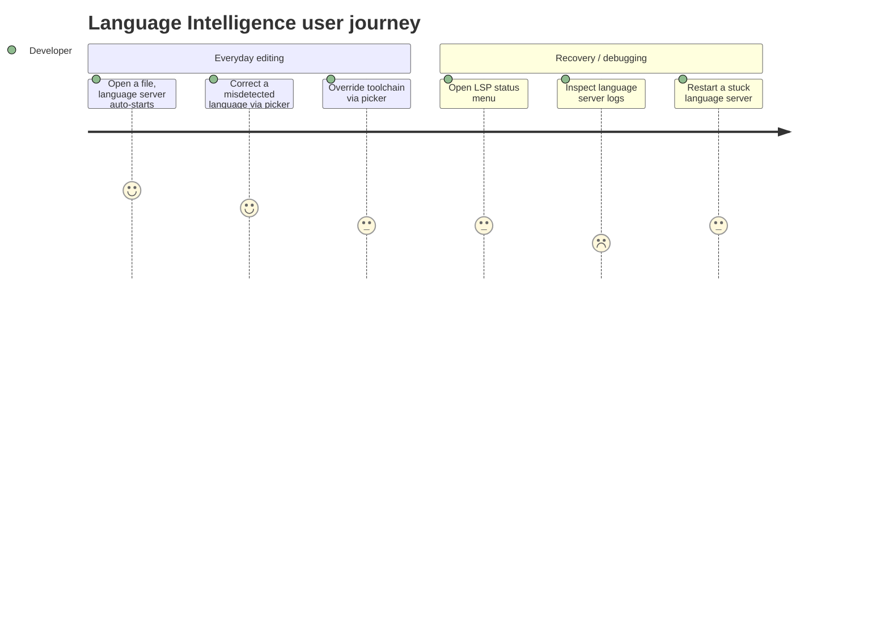

# Screens — F002_LanguageIntelligence

> **Profile note (generic-source, non-web):** Zode is a native GPUI desktop app with no route/screen-code system (`route-list.md`/`screen-list.md` do not exist in this profile). The table below lists the feature's user-facing panels/dev-tool views by name and source location instead of `SCR###` codes.

## Screen List

| Panel Name | What User Sees | What User Can Do | Source |
|------------|-----------------|-------------------|--------|
| Language Selector (modal picker) | A searchable list of available languages, current buffer's language highlighted | Pick a language to re-associate the active buffer with a different grammar/LSP | `crates/language_selector/src/language_selector.rs:33-89` |
| Toolchain Selector (modal picker) | A searchable list of detected toolchains (interpreters/SDKs) for the current worktree/language, plus an "Add Toolchain" path | Select an existing toolchain or manually add a new one by path | `crates/toolchain_selector/src/toolchain_selector.rs:45,561-580` |
| LSP Tool status-bar button + menu | A status-bar indicator summarizing running language-server health, opened as a popover menu | Toggle the menu open/closed; jump into related dev-tool views from it | `crates/language_tools/src/lsp_button.rs:1055-1072` (`BL041`) |
| Language Server Logs view | A scrolling, read-only log/trace/RPC transcript for a selected running language server | Choose which server/log-kind to view; auto-scrolls as new entries arrive | `crates/language_tools/src/lsp_log_view.rs:1074-1091,3056-3081` (`BL042`, `BL131`) |
| Syntax Tree / Highlights Tree dev views | A live tree-sitter parse tree or highlight-layer breakdown for the active buffer | Toggle which highlight layers (text/semantic/syntax tokens) are shown | `crates/language_tools/src/highlights_tree_view.rs:1017-1034` (`BL039`), `crates/language_tools/src/syntax_tree_view.rs` (`BL043`) |
| Outline Panel | A symbol outline of the active buffer, sourced from the language server's document-symbol response | Navigate to a symbol; panel visibility persists across sessions | `crates/outline_panel/src/outline_panel.rs` (`BL050`, `BL175`) |

## User Journey

1. User arrives at the editor and opens a file; no panel is visible yet — the language server for that file's language starts silently in the background.
2. If the user wants a different toolchain, they open the **Toolchain Selector** from the status bar, see the detected options, and pick one — the active language server reconfigures using it.
3. If a file's language was misdetected, the user opens the **Language Selector**, sees the language list with the current one highlighted, and picks the correct one — syntax highlighting updates immediately.
4. If the user suspects a language server is stuck, they open the **LSP Tool** status-bar menu, and from there can jump to the **Language Server Logs** view to inspect recent activity, or trigger a restart.
5. For deeper debugging, a user (typically a Zode contributor) opens the **Syntax Tree** or **Highlights Tree** dev views to inspect how the current buffer is being parsed and highlighted.

