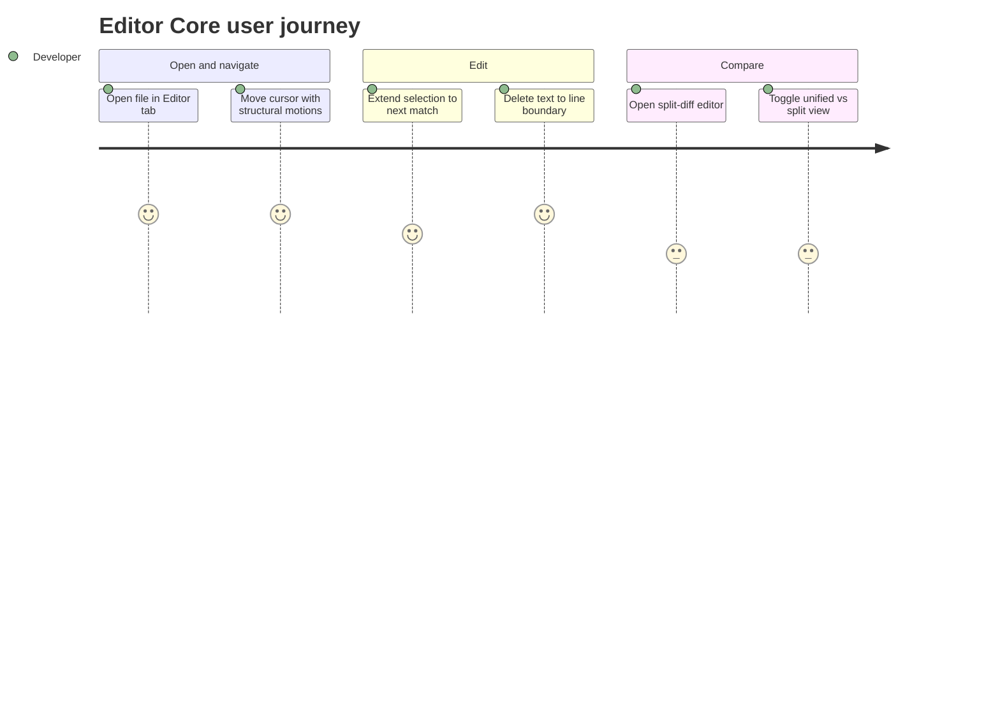

<!-- layout-exempt: rebuild-spec owns all docs/system|features|generated|flows paths -->

# Screens — F008_EditorCore

## Screen List

N/A — `generic-source` profile, no screen-list/route surface for this native desktop app. Editor Core has no dedicated "screen"; it is a reusable `Editor` view (`crates/editor/src/editor.rs:1131`) instantiated as a tab inside any `Pane` (MODEL011) across the workspace — the functional surface analogue is described below.

### Editor Surface (non-route adaptation)

| Surface                                    | What User Sees                                                                                                  | What User Can Do                                                                             |
| ------------------------------------------ | --------------------------------------------------------------------------------------------------------------- | -------------------------------------------------------------------------------------------- |
| Editor tab (single-file)                   | Buffer text with gutter, syntax highlighting, cursor(s)/selection(s), optional inlay hints                      | Navigate with structural motions, extend multi-selection, delete to line boundary, undo/redo |
| Split-diff editor tab                      | Either one unified pane with inline diff markers, or two side-by-side panes (lhs/rhs) comparing buffer versions | Toggle between unified and split diff presentation via `ToggleSplitDiff`                     |
| Status-bar encoding/line-ending indicators | Current buffer text encoding and line-ending convention                                                         | Click to open a picker and switch encoding or line-ending convention                         |

## User Journey

1. Developer opens a file, landing on an Editor tab showing the buffer's text with the cursor at the last-saved (or first) position.
2. Developer navigates using structural motions (word/line/page) to reach the area they want to change.
3. Developer selects a repeated identifier and extends the selection to further occurrences for a multi-point edit, or deletes a stretch of text back to the line start.
4. If comparing two versions of a file, the developer opens a split-diff editor tab and toggles between the unified and side-by-side presentation as needed.
5. Developer closes the tab or the workspace; their cursor, selection, and fold state are quietly preserved for next time.

