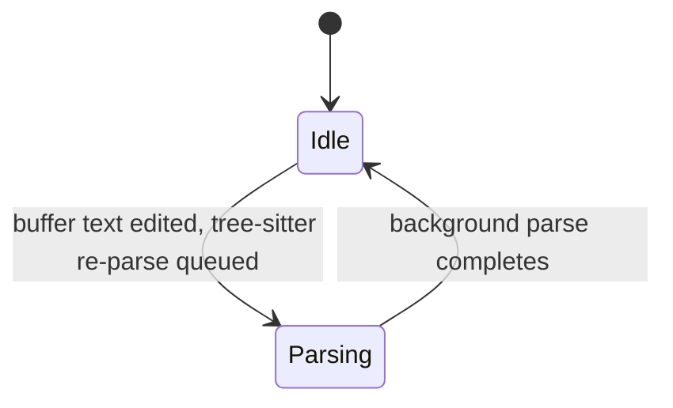

<!-- layout-exempt: rebuild-spec owns all docs/system|features|generated|flows paths -->

# F008_EditorCore: Technical Spec
**Priority**: P0
**Type**: mixed
**Generated**: 2026-08-07

## Overview

Editor Core is the text-editing surface every other panel in Zode ultimately renders through: cursor/selection motions, multi-select, deletion, split-diff comparison, encoding/line-ending switching, inlay hints, and the `TextBuffer` → `Buffer` → `MultiBuffer` → `Editor` stack. It is triggered by keybindings (`keymap.json`) and command-palette invocations dispatched against a focused `Editor` entity, and its output feeds diagnostics, search, git-diff, and debugging panels that all reuse `MultiBuffer`/`Editor` to display text. `Editor` is a `Render`-implementing GPUI view (`crates/editor/src/editor.rs:1131`) owning exactly one `Entity<MultiBuffer>`.

## Polymorphic Behavior

### DISC-007 — Buffer.capability

| Value | Render | Validation | Persistence |
|-------|--------|------------|-------------|
| ReadWrite | Normal editable rendering; cursor/edit affordances active | `Capability::editable()` returns true (`crates/language/src/buffer.rs:86-89`); all edit actions proceed | Edits recorded in `TextBuffer.history` (undo log) and, for file-backed buffers, eventually saved to disk |
| Read | Same visual rendering as ReadWrite, but edit calls are rejected | `editable()` returns false; `Editor::read_only(cx)` (`crates/editor/src/editor.rs:3572-3574`) short-circuits mutation methods (e.g. `crates/editor/src/editor.rs:4130,4144,4163,4785,5288,5527,10313,11211` guard on `self.read_only(cx)`) | No edit-derived writes; buffer stays unchanged |
| ReadOnly | Same as Read for rendering | Structurally rejects edits at the API layer — same `editable()`/`read_only(cx)` gates as Read; no UI dialog on rejection (silent no-op per `docs/system/permissions.md` PERM004) | No edit-derived writes |

**Source:** `crates/language/src/buffer.rs:76-89`; consumer gates verified at `crates/editor/src/editor.rs:3564-3577`.

### DISC-008 — Buffer.parse_status

| Value | Render | Validation | Persistence |
|-------|--------|------------|-------------|
| Idle | Syntax highlighting/tree-sitter-dependent features (folding, structural motions) use the current committed tree | None additional | No persistence effect |
| Parsing | Same features fall back to the last-committed (stale) tree until the in-flight parse completes | `unverified` — exact fallback mechanics not traced in this pass beyond the field's existence at `crates/language/src/buffer.rs` (`parse_status: watch::Sender/Receiver<ParseStatus>`, referenced in data-model.md) | No persistence effect |

**Source:** `crates/language/src/buffer.rs` (field declaration; exact line for `ParseStatus` enum body not individually re-verified this pass — see Unresolved Questions).

### DISC-009 — Editor.mode

| Value | Render | Validation | Persistence |
|-------|--------|------------|-------------|
| SingleLine | No gutter/breadcrumbs/minimap; single-line input widget (e.g. `ProjectPanel.filename_editor`) | `mode.is_single_line()` gates soft-wrap-stop behavior in motion code (e.g. `crates/editor/src/editor.rs:15482` `!self.mode.is_single_line()`) | N/A |
| AutoHeight { min_lines, max_lines } | Grows vertically with content between the two bounds; no full chrome | Height computed from content, clamped to bounds | N/A |
| Full { scale_ui_elements_with_buffer_font_size, show_active_line_background, sizing_behavior } | Full chrome: gutter, breadcrumbs, minimap, active-line background per flag | Multi-line editing permitted | N/A |
| Minimap { parent } | Renders as a zoomed-out overview bound to a parent `Editor`, not independently editable content | `unverified` — this variant exists in current source (`crates/editor/src/editor.rs:507-513`) but is not enumerated in `data-model.md`'s DISC-009 table (documents only SingleLine/AutoHeight/Full) | N/A |

**Source:** `crates/editor/src/editor.rs:498-513` (enum definition, 4 variants — see discrepancy noted in Unresolved Questions: data-model.md's DISC-009 table only lists 3).

### DISC — SplittableEditor.diff_view_style (local to this feature; not a data-model.md DISC-### code — see Assumptions)

| Value | Render | Validation | Persistence |
|-------|--------|------------|-------------|
| Unified | Single pane shows inline diff markers | `toggle_split` collapses the split via `self.unsplit(...)` if currently split | Held only on the in-memory `SplittableEditor` struct; not persisted to DB |
| Split | Two side-by-side panes (lhs/rhs); `self.split(...)` runs unless `too_narrow_for_split` | Skips actually splitting if the pane is below the narrow-width threshold, but the style flag still flips | Same — in-memory only |

**Source:** `crates/editor/src/split.rs:869-887` (`SplittableEditor::toggle_split`); enum defined at `crates/settings_content/src/editor.rs:835-841` (`DiffViewStyle`).

## Cross-Cutting Logic

### Requirements

| Code | Description | Endpoint/Handler | Verifiable |
|------|-------------|------------------|------------|
| FR-001 | Register the bulk cursor/selection/edit keymap action set (`SelectNext`, `SelectPrevious`, `MoveToBeginningOfLine`, `DeleteToBeginningOfLine`, `MovePageUp`/`MovePageDown`, dozens more) via `#[derive(Action)]` under namespace `editor` | N/A (desktop keybinding, no HTTP surface) via `Editor` action handlers | yes |
| FR-002 | Gate every edit-mutating method on `Editor`/`Buffer`/`MultiBuffer` capability (`Capability::ReadWrite` required) | N/A via `Editor::read_only(cx)` | yes |
| FR-003 | Debounce and re-query inlay hints from the LSP semantics provider on buffer edit, scroll, settings change, or LSP server removal | N/A via `Editor::refresh_inlay_hints` | yes |
| FR-004 | Serialize editor selections and folds to the local SQLite `EditorDb` for session restore | N/A via `Editor::serialize_selections` / `Editor::serialize` (items.rs) | yes |

**Source:** `crates/editor/src/actions.rs:1-90`; `crates/editor/src/editor.rs:3564-3577`; `crates/editor/src/inlays/inlay_hints.rs:230-241`; `crates/editor/src/persistence.rs:288-354`.

### Business Rules

_(See itemized entries below.)_

### BR-001_BufferCapabilityGatesEdits
**Linked FR:** FR-002
**Source:** `crates/language/src/buffer.rs:76-89`
**Applies to:** every edit-mutating method on `Editor` (delete, insert, backspace, indent, etc.)
**Rule:** A `Buffer` (and the `MultiBuffer` wrapping it) carries a `Capability` (`ReadWrite`/`Read`/`ReadOnly`). Edit operations check `Editor::read_only(cx)`, which is true if either the editor's own `read_only` flag is set OR the underlying buffer's capability is not `ReadWrite`. A rejected edit is a silent no-op — there is no user-facing dialog.

**Pseudocode:**
```text
fn read_only(editor, cx) -> bool:
    return editor.read_only OR NOT buffer(cx).capability.editable()

fn delete_to_beginning_of_line(editor, action, window, cx):
    if editor.read_only(cx): return  # BR-001 short-circuit (elsewhere in file)
    transact(...)
```

### BR-002_SplitTooNarrowSuppressesActualSplit
**Linked FR:** N/A (feature-local UI rule)
**Source:** `crates/editor/src/split.rs:869-887`
**Applies to:** `ToggleSplitDiff` action on `SplittableEditor`
**Rule:** Toggling from `Unified` to `Split` always flips the stored style flag, but the pane is only physically split (`self.split(...)` invoked) if `too_narrow_for_split` is false; toggling back to `Unified` always calls `self.unsplit(...)` if currently split, unconditionally.

**Pseudocode:**
```text
fn toggle_split(editor):
    match editor.diff_view_style:
        Unified -> editor.diff_view_style = Split
                   if not editor.too_narrow_for_split: editor.split()
        Split   -> editor.diff_view_style = Unified
                   if editor.is_split(): editor.unsplit()
```

### BR-003_HotExitDirtyBufferSerialization
**Linked FR:** FR-004
**Source:** `crates/editor/src/items.rs:1346-1367`
**Applies to:** workspace-item close/quit serialization for singleton-buffer editors
**Rule:** Dirty buffers are always serialized (even for worktree-less/scratch windows) when `BufferSerialization::All`; if the policy is `NonDirtyBuffers` and the item is closing, serialization is skipped entirely rather than partially writing state.

**Pseudocode:**
```text
fn serialize(editor, closing):
    if closing and policy == NonDirtyBuffers: return None
    workspace_id = workspace.database_id()?
    buffer = editor.buffer.as_singleton()?
    # proceeds to compute abs_path, is_dirty, mtime, snapshot and write
```

### Decision Logic

`N/A — no user-facing decision logic beyond DISC-### Polymorphic Behavior.` The reviewed `toggle_split` branch is a single-field enum flip (2 values) already captured as BR-002/DISC (diff_view_style); it does not meet the ≥2-predicate or multi-step-flow bar for DEC.

### State Machines

_(See itemized entries below.)_

### SM-001_ParseStatus
**kind:** entity
**Linked FR:** N/A (cross-cutting to all syntax-dependent editor features)
**Source:** `crates/language/src/buffer.rs:120` (field declaration; enum at `crates/language/src/buffer.rs:174`; referenced in data-model.md MODEL008)
**States:** Idle, Parsing



**Transition rules:**
- `Idle → Parsing`: guard = buffer content changed since last committed tree; side effect = background tree-sitter task spawned
- `Parsing → Idle`: guard = parse task resolves; side effect = syntax-dependent consumers (folding, structural motions, inlay hints) notified to use the fresh tree

### Algorithms

_(See itemized entries below.)_

### ALG-001_InlayHintRefreshDecision
**Linked FR:** FR-003
**Source:** `crates/editor/src/inlays/inlay_hints.rs:230-241, 2921-2932 (behavior-logic.md BL126 cross-reference)`
**Input:** `InlayHintRefreshReason` (one of: `ModifiersChanged`, `Toggle`, `SettingsChange`, `NewLinesShown`, `BufferEdited(BufferId)`, `ServerRemoved`, `RefreshRequested{server_id, request_id}`, `BuffersRemoved(Vec<BufferId>)`)
**Output:** Updated inlay hint set spliced into the `DisplayMap`
**File Schema**: N/A — not a file-exchange type
**Complexity:** O(k) where k = number of buffers/ranges affected by the reason variant (not O(n) over the whole file)
**Description:** Given the fired reason, decides whether to invalidate the entire cached hint set or only append newly-revealed hints, applies an edit-vs-scroll-specific debounce, then re-queries the LSP semantics provider for the affected buffer ranges.

**Pseudocode:**
```text
fn refresh_inlay_hints(reason):
    match reason:
        BufferEdited(id) -> invalidate_cache_for(id); debounce(edit_delay)
        NewLinesShown -> append_only; debounce(scroll_delay)
        SettingsChange(_) | Toggle(_) | ModifiersChanged(_) -> invalidate_all
        ServerRemoved | RefreshRequested{..} -> invalidate_for(server_id)
        BuffersRemoved(ids) -> drop_cached(ids)
    query_lsp_semantics_provider(affected_ranges)
    splice_into(display_map)
```

### ALG-002_CompletionMenuFuzzyFilter
**Linked FR:** N/A (feature-local — completions UX)
**Source:** `crates/editor/src/code_context_menus.rs:1156-1176`
**Input:** current query string, candidate identifier list from the completion provider
**Output:** `Vec<StringMatch>` ranked matches
**File Schema**: N/A
**Complexity:** background-executor-offloaded fuzzy match, not blocking the input thread
**Description:** Runs candidate fuzzy-matching against the query on `cx.background_executor()`, returning a cancellable `Task<Vec<StringMatch>>` so keystroke-driven re-filtering never blocks typing.

**Pseudocode:**
```text
fn do_async_filtering(query, query_end, buffer):
    snapshot = buffer.snapshot()
    return background_spawn(async {
        for (query_start, candidates) in match_candidates:
            query_for_batch = snapshot.text_for_range(query_start..query_end)
            fuzzy_match(query_for_batch, candidates)
    })
```

### External Integrations

`N/A — no external (network/API) integrations in Editor Core proper; LSP semantics/completion providers are pluggable in-process traits (`CompletionProvider`, `SemanticsProvider` on `Editor`, MODEL010) consumed via Diagnostics/Language Intelligence features, not owned here.`

### Verification

- **SC-001** — Motion/selection/deletion actions leave buffer content correct and undoable in one step (covers FR-001, BR-001)
- **SC-002** — No buffer mutation occurs when `Editor::read_only(cx)` is true, regardless of which edit action is dispatched (covers FR-002, BR-001)
- **SC-003** — Reopening a workspace restores prior selections/folds for singleton-buffer editors that were dirty at close (covers FR-004, BR-003)
- **SC-010** — Rapid successive buffer edits/scrolls/settings changes coalesce into a single debounced inlay-hints re-query rather than one query per event, and removing an LSP server also triggers a re-query (covers FR-003)

---

**Client behavior:** see
[`behavior-logic.md`](../../generated/behavior-logic.md) (client-side patterns — debounce, optimistic UI, polling, upload, realtime),
[`permissions.md`](../../system/permissions.md) (feature flags / experiments / env / locale gates),
[`screen-flow.md`](../../generated/screen-flow.md) (guards / deep-link state restoration / unsaved-changes protection).

## User Stories

### US001_NavigateCursorWithMotions — Navigate cursor with structural motions (Priority: must)

**What happens:** A developer presses a motion keybinding (`MoveToBeginningOfLine`, page-up/down, word/line motions) while an `Editor` is focused; the cursor relocates without altering buffer content.
**Why this priority:** Cursor navigation is the most frequent interaction in a text editor; without it the editor is unusable for anything beyond viewing.
**Independent Test:** Open a buffer, place the cursor mid-line, trigger `MoveToBeginningOfLine`, assert cursor is at column 0 and buffer text is byte-identical to before.

**Acceptance Scenarios:**

1. **Given** the cursor is mid-line in an open buffer, **When** the developer triggers `MoveToBeginningOfLine`, **Then** the cursor moves to column 0 (or the first non-whitespace column if `stop_at_indent` is set) and the buffer is unchanged.
2. **Given** the viewport is scrolled to a specific position, **When** the developer triggers `MovePageUp`/`MovePageDown`, **Then** the cursor stays within the newly-visible viewport bounds.

**Requirements fulfilled:**
- **FR-001** Register cursor motion actions — via `Editor::move_to_beginning_of_line`
  **Source:** `crates/editor/src/editor.rs:15476-15497`

**Rules enforced:** BR-001 (applies — motions never mutate text, so the capability gate is not exercised on this path, but the same `Editor` struct is shared with edit paths that are gated)

**Verification:**
- **SC-004** Motion actions never alter `MultiBuffer` content (covers FR-001)

---

### US009_ExtendSelectionToNextMatch — Extend selection to next match (Priority: should)

**What happens:** A developer selects a word, then triggers `SelectNext` (or `SelectPrevious`) to add a new selection at the next (or previous) occurrence of that text, enabling multi-cursor editing of repeated identifiers.
**Why this priority:** High-value productivity feature for renaming/editing repeated tokens, but the editor remains usable without it — hence `should` not `must`.
**Independent Test:** Select a word that recurs later in the buffer, trigger `SelectNext`, assert a second selection now exists at the next occurrence while the first selection is retained.

**Acceptance Scenarios:**

1. **Given** a word is selected and recurs later in the buffer, **When** the developer triggers `SelectNext`, **Then** a second selection is added at the next occurrence without discarding the first.
2. **Given** an active multi-occurrence selection state, **When** the developer triggers `SelectPrevious`, **Then** the newest selection is walked backward symmetrically.

**Requirements fulfilled:**
- **FR-001** `SelectNext`/`SelectPrevious` actions — via `Editor::select_next` / `Editor::select_previous`
  **Source:** `crates/editor/src/editor.rs:16616-16654`

**Rules enforced:** BR-001 (see US001) — selection extension does not mutate text either, same non-gated path.

**Verification:**
- **SC-005** `SelectNext` result set strictly grows by one selection per invocation until no further matches exist (covers FR-001)

---

### US010_DeleteTextToLineBoundary — Delete text to line boundary (Priority: must)

**What happens:** A developer triggers `DeleteToBeginningOfLine`; the editor reverses the current selection, extends it to the line boundary (respecting `stop_at_indent`), then deletes it as a single transacted edit.
**Why this priority:** Line-boundary deletion is a core, frequently-bound editing primitive (bound in most editor keymaps); its absence would break muscle-memory parity with other editors.
**Independent Test:** Place cursor after N characters of line content, trigger `DeleteToBeginningOfLine`, assert exactly those N characters are removed and a single `Undo` restores them.

**Acceptance Scenarios:**

1. **Given** the cursor sits after 10 characters of indentation+text on a line, **When** the developer triggers `DeleteToBeginningOfLine`, **Then** those 10 characters are removed and `Undo` restores them in one step.
2. **Given** the buffer's `Capability` is not `ReadWrite`, **When** the developer triggers `DeleteToBeginningOfLine`, **Then** nothing is deleted (BR-001 gate).

**Requirements fulfilled:**
- **FR-001** `DeleteToBeginningOfLine` action — via `Editor::delete_to_beginning_of_line`
  **Source:** `crates/editor/src/editor.rs:15522-15546`
- **FR-002** Capability gate applied before any mutation proceeds
  **Source:** `crates/editor/src/editor.rs:3564-3577`

**Rules enforced:**

### BR-004_DeleteIsSingleTransaction
**Linked FR:** FR-001
**Source:** `crates/editor/src/editor.rs:15522-15546`
**Applies to:** `DeleteToBeginningOfLine`
**Rule:** The reverse-selection, extend-to-boundary, and backspace steps are wrapped in one `self.transact(...)` block, so `Undo` reverts the entire deletion atomically rather than in three separate undo steps.

**Pseudocode:**
```text
fn delete_to_beginning_of_line(editor, action):
    editor.transact(|this| {
        this.change_selections(|s| s.move_with(|sel| sel.reversed = true))
        this.select_to_beginning_of_line(stop_at_indent=action.stop_at_indent)
        this.backspace()
    })
```

**Verification:**
- **SC-006** A single `Undo` after `DeleteToBeginningOfLine` fully restores the deleted text (covers FR-001, BR-004)
- **SC-007** No deletion occurs when the buffer is not `ReadWrite` (covers FR-002, BR-001)

---

### US011_ToggleSplitDiffView — Toggle split-diff view (Priority: should)

**What happens:** A developer triggers `ToggleSplitDiff` on a `SplittableEditor`; the diff presentation flips between `Unified` (inline markers in one pane) and `Split` (two side-by-side panes), persisting for that editor instance until toggled again or the editor closes.
**Why this priority:** Valuable for comparing diffs in the reader's preferred layout, but not required for baseline editing/diff viewing — `Unified` remains fully functional on its own.
**Independent Test:** Open a split editor comparing two buffers, trigger `ToggleSplitDiff`, assert `diff_view_style()` flips and (if not `too_narrow_for_split`) the pane count changes accordingly.

**Acceptance Scenarios:**

1. **Given** a split editor open in `Unified` style, **When** the developer triggers `ToggleSplitDiff`, **Then** `diff_view_style` becomes `Split` and, if the pane is wide enough, a physical split is created.
2. **Given** a split editor currently split (`Split` style), **When** the developer triggers `ToggleSplitDiff` again, **Then** `diff_view_style` reverts to `Unified` and the split collapses if one exists.

**Requirements fulfilled:**
- **FR-001** `ToggleSplitDiff` action — via `SplittableEditor::toggle_split`
  **Source:** `crates/editor/src/split.rs:869-887`

**Rules enforced:** BR-002_SplitTooNarrowSuppressesActualSplit (see Cross-Cutting Logic)

**Verification:**
- **SC-008** Toggling twice returns `diff_view_style` to its original value and, if the pane started unsplit, ends unsplit again (covers FR-001, BR-002)

### Edge Cases

| Scenario | Behavior |
|----------|----------|
| Edit attempted on a `Read`/`ReadOnly` buffer | `Editor::read_only(cx)` returns true; the mutating method returns early with no buffer change and no error dialog (silent no-op per PERM004) |
| `ToggleSplitDiff` triggered while pane width is below `too_narrow_for_split` threshold | `diff_view_style` flag still flips to `Split`, but `self.split(...)` is skipped — UI stays single-pane despite the internal style now being `Split` |
| `SelectNext` triggered with no further occurrences of the current selection in the buffer | `select_next_match_internal` returns without adding a new selection (existing selection set unchanged) — `unverified` exact no-match return value; confirmed only that the function signature returns `Result<()>` |
| Inlay hints refresh fires with `BufferEdited` while a prior refresh for the same buffer is still debounced | Later `InlayHintRefreshReason` supersedes the pending debounce timer per BL126 description ("debounces (edit vs scroll debounce)") — exact cancel-vs-coalesce semantics not traced to source line level this pass |

## Key Entities

| Entity | Table | Key Columns | Purpose |
|--------|-------|-------------|---------|
| TextBuffer (MODEL007) | N/A — in-memory CRDT rope, not a DB table | `snapshot`, `history`, `lamport_clock`, `BufferId` | Raw undoable/replicated text storage every `Buffer` wraps |
| Buffer (MODEL008) | N/A — in-memory; persisted indirectly via `editors` table (contents/language columns) | `capability`, `parse_status`, `diagnostics`, `file` | Language-aware text + syntax + diagnostics layer the Editor renders |
| MultiBuffer (MODEL009) | N/A — in-memory | `buffers` (BTreeMap<BufferId,BufferState>), `singleton`, `capability` | Combines one-or-more Buffer excerpts into one addressable view; every Editor owns exactly one |
| Editor (MODEL010) | `editors`, `editor_selections`, `editor_folds`, `file_folds` (SQLite, via `EditorDb`) | `item_id`, `workspace_id`, `path`, `contents`, `scroll_top_row`, selection `start`/`end`, fold `start`/`end` | The visual editor view; source of the session-restore DB writes covered below |
| Pane (MODEL011) | N/A — in-memory; item metadata persisted via each `Item::serialize` impl (Editor's included) | `items`, `active_item_index`, `preview_item_id` | Tab-strip container hosting `Editor` (and other `Item`) instances |

## Artifact References

| Artifact | File | Codes Used | Reviewed |
|----------|------|------------|----------|
| System Overview | [system-overview.md](../../system-overview.md) | — | [x] |
| Architecture | N/A (not read this pass — see Unresolved Questions) | — | [ ] |
| Feature List | [feature-list.md](../../feature-list.md) | F008_EditorCore | [x] |
| Entities | [data-model.md](../../data-model.md) | MODEL006, MODEL007, MODEL008, MODEL009, MODEL010, MODEL011 | [x] |
| Screens | N/A — `generic-source` profile, no screen-list upstream | — | [ ] |
| Behavior Logic | [behavior-logic.md](../../behavior-logic.md) | BL013, BL014, BL015, BL044, BL126, BL153, BL154, BL155, BL156, BL176, BL181, BL200, BL030, BL052, BL002, BL031, BL045, BL046, BL064, BL165, BL166, BL171, BL172 | [x] |
| Permissions Matrix | [permissions-matrix.md](../../permissions-matrix.md) | PERM004 | [x] |
| User Stories | [user-stories.md](../../user-stories.md) | US001, US009, US010, US011 | [x] |

**Rule:** Every code listed in Codes Used MUST exist in its source artifact. Orphan refs = reviewer critical.

## Assumptions

- The `SplittableEditor.diff_view_style` field (`crates/editor/src/split.rs:412`, enum at `crates/settings_content/src/editor.rs:835-841`) is treated as a feature-local discriminator (not assigned a DISC-### code) because it is not enumerated in `data-model.md`'s Key Entities discriminator tables — `SplittableEditor` itself is not a documented MODEL### entity in this pass.
- `parse_status`'s exact `ParseStatus` enum body (beyond the two named states `Idle`/`Parsing` already surfaced in data-model.md) was not re-read from `crates/language/src/buffer.rs` in this pass; the two-state description is taken as given from the upstream data-model.md artifact.
- The 12 supplementary buffer-adjacent BLs (BL002 CSV preview, BL031 image zoom, BL045/046 markdown copy/scroll, BL064 SVG preview, BL165 detach-log-err helper, BL166 image path persistence, BL171/172 markdown parsing/search) are included in Artifact References per the feature-list.md mapping but are not separately spec'd as FR/BR/ALG blocks above — they are preview-buffer-adjacent conveniences, not Editor Core's cursor/selection/edit surface, and are deliberately left at citation-only depth to avoid diluting this already-large spec (see Depth Requirements size-adaptive drafting note).

## Source Code References

| Order | Symbol | Path | Purpose |
|-------|--------|------|---------|
| 1 | `Capability` enum | `crates/language/src/buffer.rs:76-89` | Read/write gate every edit operation checks |
| 2 | `Buffer` struct | `crates/language/src/buffer.rs:98-` | Language-aware text/syntax/diagnostics layer |
| 3 | `MultiBuffer` struct | `crates/multi_buffer/src/multi_buffer.rs:73-` | Excerpt-combining view backing every Editor |
| 4 | `Editor` struct + `EditorMode` | `crates/editor/src/editor.rs:1131`, `:498-513` | The visual editor view and its 4 rendering modes |
| 5 | Editor core actions | `crates/editor/src/actions.rs:1-90` | `SelectNext`/`SelectPrevious`/`MoveToBeginningOfLine`/`DeleteToBeginningOfLine`/`MovePageUp`/`MovePageDown` action structs |
| 6 | Motion/selection/delete handlers | `crates/editor/src/editor.rs:15476-15546, 16616-16654` | Implementation of the US001/US009/US010 actions |
| 7 | `SplittableEditor` + `ToggleSplitDiff` | `crates/editor/src/split.rs:400-418, 869-887` | US011 split-diff toggle |
| 8 | `EditorDb` persistence | `crates/editor/src/persistence.rs:130-360` | Session-restore SQLite schema + selection/fold save/load queries |
| 9 | Inlay hint refresh | `crates/editor/src/inlays/inlay_hints.rs:230-241` | `InlayHintRefreshReason` and the refresh decision (BL126) |
| 10 | Completion filtering | `crates/editor/src/code_context_menus.rs:1156-1176` | Background fuzzy-match for completion menu (BL153) |

## Unresolved Questions

1. **`ParseStatus` enum body**: The exact variant list/transitions beyond `Idle`/`Parsing` (e.g. whether there is a distinct "queued but not started" sub-state) was not re-verified against `crates/language/src/buffer.rs` source in this pass; taken from data-model.md's prose.
2. **`EditorMode::Minimap` discrepancy**: Current source (`crates/editor/src/editor.rs:498-513`) defines 4 `EditorMode` variants (adds `Minimap { parent }`), but `data-model.md`'s DISC-009 table only lists 3 (`SingleLine`, `AutoHeight`, `Full`). This spec documents all 4 per the Discriminator Coverage contract's "cover ALL values" rule but flags the upstream artifact as needing a refresh.
3. **Completion menu match-candidate acquisition**: how `match_candidates` (in `do_async_filtering`, `code_context_menus.rs:1165`) is originally populated from the LSP completion response was not traced in this pass — only the filtering step itself.
4. **`architecture.md` not read**: this pass consulted `system-overview.md`, `data-model.md`, `behavior-logic.md`, `permissions-matrix.md`, `user-stories.md`, `feature-list.md`, and `docs/system/business-rules.md` directly, but did not load `architecture.md` in full — any Editor Core architectural framing documented there (e.g. crate dependency diagram) is not cross-checked here.

## Source Walkthrough

1. **File:** `crates/text/src/text.rs:59` — start here: defines the CRDT rope-backed `TextBuffer` that every layer above wraps.
2. **File:** `crates/language/src/buffer.rs:76-98` — next: the language-aware `Buffer` wrapping `TextBuffer`, including the `Capability` enum that gates all edits (BR-001).
3. **File:** `crates/multi_buffer/src/multi_buffer.rs:73-90` — next: `MultiBuffer`, the excerpt-combining view every `Editor` owns.
4. **File:** `crates/editor/src/editor.rs:1131-1170` — next: the `Editor` struct itself (view/entry-point for user interaction).
5. **File:** `crates/editor/src/actions.rs:1-90` — next: the keymap-bound action structs (`SelectNext` etc.) dispatched against `Editor`.
6. **File:** `crates/editor/src/editor.rs:15476-15546` — last: the handler methods implementing those actions (motion/deletion business logic).

### Call Hierarchy

```text
keymap.json binding -> Action dispatch (e.g. DeleteToBeginningOfLine)
    -> Editor::delete_to_beginning_of_line (editor.rs:15522)
        -> Editor::read_only(cx) [BR-001 gate, editor.rs:3572]
        -> Editor::transact(...) [BR-004 atomic undo]
            -> Editor::change_selections(...)
            -> Editor::select_to_beginning_of_line(...)
            -> Editor::backspace(...)
                -> MultiBuffer edit -> Buffer (language) edit -> TextBuffer (CRDT) edit
```

**Related files:** see `## Source Code References` above.

## DB Impact per Event

| Event/Endpoint | Table | Columns | Operation | Value Derivation | Source |
|----------------|-------|---------|-----------|-------------------|--------|
| Editor item serialize (tab close / workspace flush, BL155) | `editors` | `item_id, workspace_id, path, buffer_path, contents, language, mtime_seconds, mtime_nanos` | INSERT ... ON CONFLICT DO UPDATE | `contents`/`language` from the live dirty buffer snapshot; `mtime_*` from `buffer.saved_mtime()`; `path`/`buffer_path` from the resolved absolute file path | `crates/editor/src/persistence.rs:244-260` |
| Selection change debounce-flush (BL154) | `editor_selections` | `editor_id, workspace_id, start, end` | DELETE (existing rows for editor_id/workspace_id) then INSERT OR IGNORE (batched) | `start`/`end` are the current `Selections` collection's offsets, chunked to respect `MAX_QUERY_PLACEHOLDERS` | `crates/editor/src/persistence.rs:322-354` |
| Fold state change for file-backed buffer (BL155/items.rs serialize) | `editor_folds`, `file_folds` | `item_id/editor_id/workspace_id, start, end, start_fingerprint, end_fingerprint` (editor_folds); `workspace_id, path, start, end, start_fingerprint, end_fingerprint` (file_folds) | INSERT | Fold ranges taken from the editor's current fold state at serialize time; fingerprints computed for drift-tolerant restore | `crates/editor/src/persistence.rs:193-224` (schema); write-site query not individually re-verified — `[INFERRED]` for the exact save call |
| Scroll position persist | `editors` | `scroll_top_row, scroll_horizontal_offset, scroll_vertical_offset` | UPDATE OR IGNORE | Current viewport scroll state at time of save | `crates/editor/src/persistence.rs:271-286` |
