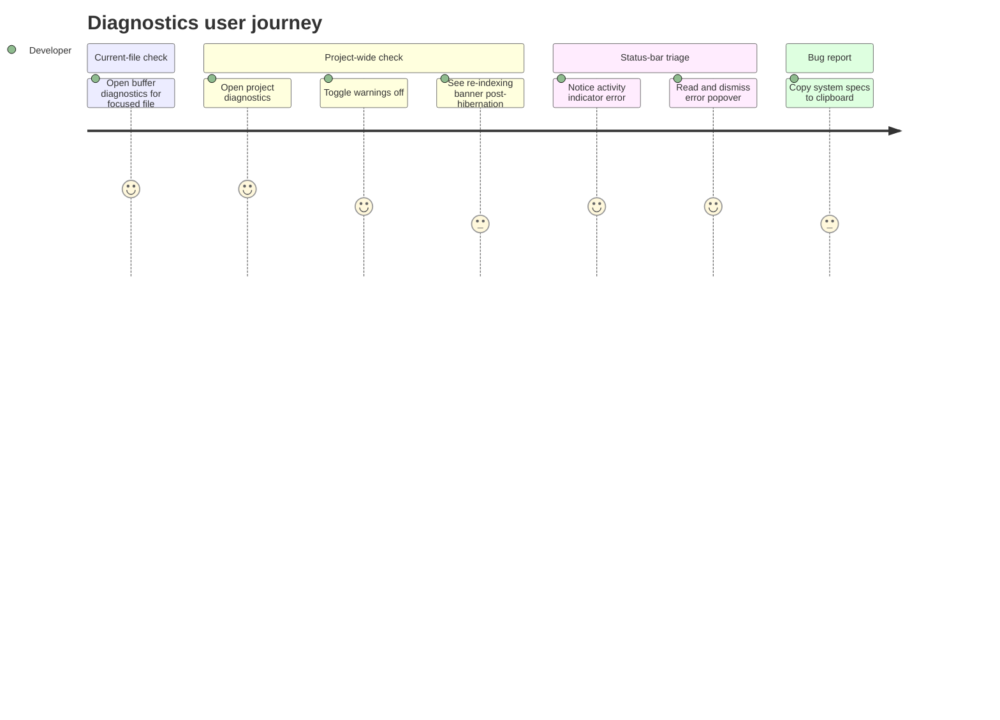

# Screens — F009_Diagnostics

**Non-web adaptation note (`generic-source` profile):** Zode has no route-list/screen-list —
this is a Rust/GPUI desktop app, not a web app. There is no `SCR###` catalog to bridge to; the
surfaces below are panes/panels inside the single-window (or multi-window, multi-project)
workspace, opened by dispatching actions rather than navigating to a URL.

## Screen List

_Non-web adaptation: no `SCR###` codes — `generic-source` profile has no screen-list.md catalog._

| Surface | Kind | What User Sees | What User Can Do |
|---------|------|-----------------|-------------------|
| Buffer Diagnostics Editor | Pane item (tab) | Excerpts of the focused buffer, showing only the ranges around that buffer's LSP diagnostics | Read inline diagnostic messages; jump between excerpts; edit the underlying buffer directly |
| Project Diagnostics Editor | Pane item (tab) | An aggregated multibuffer of excerpts from every file across the project that has a diagnostic, plus (conditionally) a "re-indexing" banner | Toggle warning-level diagnostics on/off; stop/refresh the auto-updating excerpt list; click through to a "show N warnings" affordance when the list is otherwise empty |
| Activity Indicator | Status-bar item | A compact per-language-server status label (binary status or health), optionally prefixed with the server name | Click to open a popover with the last queued error/warning message; dismiss the last recorded formatting failure |
| Project Panel diagnostic badges | Sidebar (file tree) overlay | Per-file error/warning count badges next to file-tree entries; dimmed when the count is known-stale from a hibernated LSP generation | Use the badge as a visual cue only — clicking the file opens it, not the diagnostics view |

## User Journey

1. Developer is editing a file and wants to see just its problems — they dispatch the current-file diagnostics command and a new tab opens (or an existing one for that file is focused) showing only that file's diagnostic excerpts.
2. Developer wants the full picture — they dispatch the project-wide diagnostics command; a tab opens aggregating every file's diagnostics into one scrollable list.
3. Developer toggles warnings off from the project diagnostics toolbar; the list narrows to errors only.
4. If the project just woke from hibernation, the developer notices a banner at the top of the project diagnostics tab noting counts may be stale, and — separately — sees a dimmed badge next to one file in the sidebar file tree until that file's diagnostics are re-verified.
5. Developer notices the status-bar activity indicator flag a language-server error, clicks it, reads the message in a popover, and dismisses it.
6. Developer, preparing a bug report, uses the "copy system specs" command (or, on Windows, records an ETW performance trace) to attach supporting diagnostic info.

