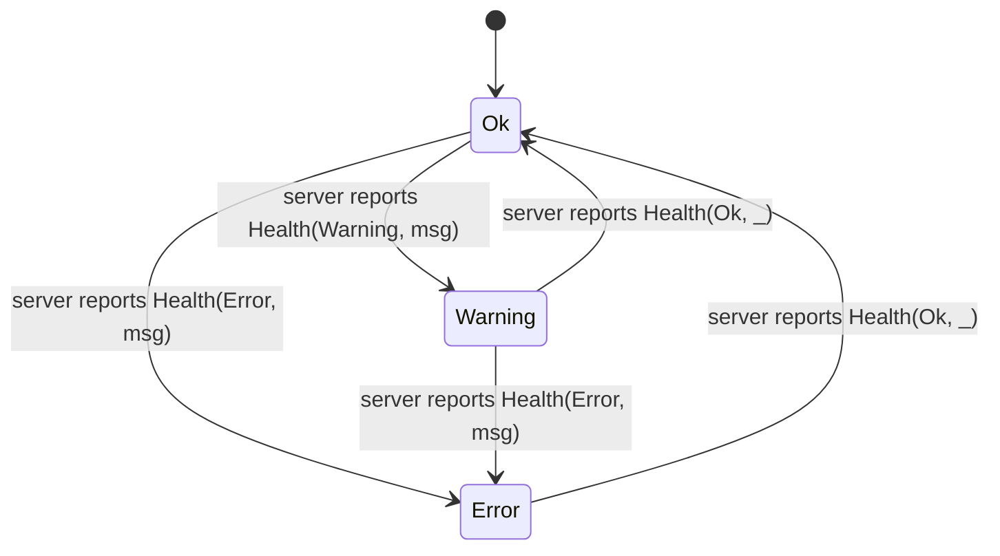

# F009_Diagnostics: Technical Spec
**Priority**: P0
**Type**: mixed
**Generated**: 2026-08-07

## Overview

Diagnostics surfaces LSP (Language Server Protocol) errors/warnings both scoped to the focused
buffer and aggregated project-wide, plus a status-bar affordance for the last language-server
failure. Developers trigger it via `DeployCurrentFile` (buffer-scoped, `crates/diagnostics/src/buffer_diagnostics.rs:212`)
and `Deploy` (project-wide, `crates/diagnostics/src/diagnostics.rs:416`); the status bar's
`ActivityIndicator` (`crates/activity_indicator/src/activity_indicator.rs`) surfaces per-language-server
health independent of either view. In this fork, diagnostics also has to reconcile with the
project hibernation lifecycle: a project waking from `Hibernated` can carry stale diagnostic
counts left over from a torn-down language-server generation, and both the project-wide view and
the project-panel file tree render that staleness explicitly rather than presenting old numbers as
current. Two Windows-only background diagnostic-tooling actions (ETW tracing, system-specs
clipboard copy) round out the feature for bug-report workflows.

## Polymorphic Behavior

N/A — no discriminator fields introduced by this feature's own domain logic. `Buffer.capability`
(DISC-007) and `Buffer.parse_status` (DISC-008) are declared on `MODEL008_Buffer` in
`entities.md`, but neither is a diagnostics-specific behavioral fork — diagnostics are stored and
rendered identically across all three `capability` values (`crates/language/src/buffer.rs:98`
defines `diagnostics: TreeMap<LanguageServerId, DiagnosticSet>` with no `capability` gate), and
`parse_status` (Idle/Parsing) governs tree-sitter re-parse timing, not diagnostic visibility. Per
the contract, this is recorded as `unverified — no behavior branch found` rather than silently
omitted: `Buffer.capability` (ReadWrite/Read/ReadOnly) and `Buffer.parse_status` (Idle/Parsing)
have no diagnostics-specific render/validation/persistence divergence found in
`crates/diagnostics/`. `MODEL017_LanguageServer` has zero declared discriminator fields
(`entities.md` § LanguageServer).

## Cross-Cutting Logic

### Requirements

| Code | Description | Endpoint/Handler | Verifiable |
|------|-------------|-------------------|------------|
| FR-001 | Debounce project-wide diagnostic excerpt rebuilds after an LSP publish so rapid successive publishes coalesce into one rebuild | `ProjectDiagnosticsEditor::update_stale_excerpts` | yes |
| FR-002 | Debounce the project-wide error/warning count summary refresh separately from excerpt rebuilds (faster cadence) | `ProjectDiagnosticsEditor` event handler | yes |
| FR-003 | Show a "re-indexing" banner in the project-wide diagnostics view while any stale (hibernated-generation) diagnostic summaries remain | `ProjectDiagnosticsEditor::render` | yes |
| FR-004 | Dim (not remove) a project-panel file's diagnostic badge while that file's diagnostic entry is known-stale from a hibernated LSP generation | `ProjectPanel::render_entry` | yes |

**Source:** `crates/diagnostics/src/diagnostics.rs:143-178`, `crates/diagnostics/src/diagnostics.rs:220-240`, `crates/diagnostics/src/diagnostics.rs:371-410`, `crates/project_panel/src/project_panel.rs:1084-1102`, `crates/project_panel/src/project_panel.rs:6296-6308`

### Business Rules

_(See itemized entries below.)_

### BR-001_DebounceExcerptRebuild
**Linked FR:** FR-001
**Source:** `crates/diagnostics/src/diagnostics.rs:93,239,371-380`
**Applies to:** `ProjectDiagnosticsEditor` handling `project::Event::DiagnosticsUpdated`
**Rule:** On each `DiagnosticsUpdated` event, the affected paths are queued (`paths_to_update`) and a single `update_stale_excerpts` task is scheduled; if a rebuild task is already in flight, the new event is folded into the existing queue rather than spawning a second task. The task waits `DIAGNOSTICS_UPDATE_DEBOUNCE` (50ms) before draining the queue one path at a time.

**Pseudocode:**
```text
on DiagnosticsUpdated(paths):
  paths_to_update.extend(paths)
  spawn summary-refresh task after 30ms debounce
  update_stale_excerpts(): if a rebuild task already running -> return
  else: spawn task that waits 50ms, then pops paths_to_update one at a time and rebuilds excerpts
```

---

### BR-002_ReindexingBannerWhileStale
**Linked FR:** FR-003
**Source:** `crates/diagnostics/src/diagnostics.rs:143-178`, `crates/project/src/lsp_store.rs:8046-8058`
**Applies to:** `ProjectDiagnosticsEditor.render`, `Project::has_stale_diagnostics`
**Rule:** Before rendering its content, the project-wide diagnostics view checks `Project::has_stale_diagnostics` — true when the local project still has entries in `LocalLspStore::stale_language_servers`, or (remote/guest project) `RemoteLspStore::stale_paths` is non-empty. If true, a warning-styled banner ("Project re-indexing after waking — some counts may be stale") renders above the diagnostics list; the underlying counts are still shown, just flagged as unverified.

**Pseudocode:**
```text
render():
  is_reindexing = project.has_stale_diagnostics()
  if is_reindexing:
    show banner "Project re-indexing after waking — some counts may be stale"
  render diagnostics list/empty-state as usual
```

---

### BR-003_DimStaleDiagnosticBadge
**Linked FR:** FR-004
**Source:** `crates/project_panel/src/project_panel.rs:1064-1102`, `crates/project_panel/src/project_panel.rs:6296-6308`, `crates/project/src/lsp_store.rs:8060-8086`
**Applies to:** `ProjectPanel` entry rendering
**Rule:** `ProjectPanel` recomputes `stale_diagnostic_paths` (exact-path, no ancestor-folder propagation, unlike `diagnostic_counts`) whenever `ProjectPanelSettings.diagnostic_badges` is on and the `ShowDiagnostics` setting is not `Off`, using `Project::is_diagnostic_summary_stale` per path. `render_entry` looks up whether the current entry's path is in `stale_diagnostic_paths` and — per code comments — renders that file's badge/icon dimmed instead of as a verified current count, until a fresh LSP publish or the post-wake reindex sweep clears the path.

**Pseudocode:**
```text
on panel refresh:
  if diagnostic_badges enabled and show_diagnostics != Off:
    diagnostic_counts = aggregate per-path error/warning counts from project.diagnostic_summaries()
    stale_diagnostic_paths = paths where project.is_diagnostic_summary_stale(path)
on render_entry(path):
  is_stale = stale_diagnostic_paths.contains(path)
  # is_stale drives dimmed badge styling at the render call site
```

---

### BR-004_ToggleWarningsFilter
**Linked FR:** N/A (cross-cutting UI preference, not tied to a single FR)
**Source:** `crates/diagnostics/src/diagnostics.rs:65-67,253-264,289-304,449-451`
**Applies to:** `ProjectDiagnosticsEditor`, `IncludeWarnings` global
**Rule:** `ToggleWarnings` flips a process-global `IncludeWarnings` flag (not per-view state). Every open `ProjectDiagnosticsEditor` observes this global and re-derives its `Editor::set_max_diagnostics_severity` threshold to `Warning` (include) or `Error` (exclude), then re-runs `refresh`. Default value on first open comes from `ProjectSettings.diagnostics.include_warnings` unless the global was already set by a prior toggle in this session.

**Pseudocode:**
```text
on ToggleWarnings:
  global.include_warnings = !global.include_warnings
on global change (observed by every open editor):
  editor.set_max_diagnostics_severity(Warning if include_warnings else Error)
  this.refresh()
```

---

### BR-005_CloseDiagnosticlessBuffers
**Linked FR:** N/A (cross-cutting cleanup behavior, not tied to a single FR)
**Source:** `crates/diagnostics/src/diagnostics.rs:326-369`
**Applies to:** `ProjectDiagnosticsEditor`
**Rule:** An excerpt is removed from the aggregated multibuffer when its source buffer has zero remaining diagnostics AND is not dirty AND (if `retain_selections` is true) has no active selection inside it. Triggered on blur, save, and selection-change events, plus explicit `refresh`.

**Pseudocode:**
```text
close_diagnosticless_buffers(retain_selections):
  for each buffer_id backing a current excerpt:
    if retain_selections and buffer_id in selected_buffers: skip
    if this buffer_id still has display blocks: skip
    if buffer is dirty: skip
    remove excerpt for buffer_id
```

### Decision Logic

None.

### State Machines

_(See itemized entries below.)_

### SM-001_ServerHealthStatus
**kind:** ui
**Linked FR:** N/A (cross-cutting status display, not tied to a single FR)
**Source:** `crates/activity_indicator/src/activity_indicator.rs:280-295,608-628`
**States:** Ok, Warning, Error (per language server, `ServerHealth` from `crates/language`)



**Transition rules:**
- Any `Health` state transition is driven by an LSP-forwarded status update (`LspStoreEvent::LanguageServerUpdate`); side effect = status bar label prefix changes (`"(name) "` / `"(name) Warning: "` / `"(name) Error: "`) and click-through eligibility for `ShowErrorMessage`.
- `ShowErrorMessage` only surfaces (and dequeues) the first `statuses` entry whose state is `Error` or `Warning`.

### Algorithms

_(See itemized entries below.)_

### ALG-001_SeverityThresholdFilter
**Linked FR:** BR-004
**Source:** `crates/project/src/project_settings.rs:342-349`, `crates/diagnostics/src/diagnostics.rs:257-264`
**Input:** `DiagnosticSeverity` enum (`Off, Error, Warning, Info, Hint`, ordered), `include_warnings: bool`
**Output:** the effective max-severity threshold passed to `Editor::set_max_diagnostics_severity`
**File Schema**: N/A — not a file-exchange type
**Complexity:** O(1)
**Description:** Maps the boolean `include_warnings` toggle onto one of two threshold values in the 5-level `DiagnosticSeverity` ordering — `Warning` (shows Error+Warning) when true, `Error` (Error only) when false. `Off`, `Info`, and `Hint` are not reachable through this feature's own UI toggle; they are settings-level values outside this feature's Cross-Cutting scope.

**Pseudocode:**
```text
threshold = include_warnings ? DiagnosticSeverity::Warning : DiagnosticSeverity::Error
editor.set_max_diagnostics_severity(threshold)
```

### External Integrations

_(See itemized entries below.)_

### INT-001_ActivityIndicatorLspStatusStream
**Linked FR:** N/A (cross-cutting event stream, not tied to a single FR)
**Source:** `crates/activity_indicator/src/activity_indicator.rs:123-181`
**Type:** event-publish (in-process subscription, not network)
**Target:** `LspStore`'s event stream (`LspStoreEvent::LanguageServerUpdate`)
**Trigger:** Any language server binary-status or health-status change, local or (via `proto::update_language_server`) remote/collab-forwarded
**Payload:** server name, `BinaryStatus` (None/CheckingForUpdate/Downloading/Starting/Stopping/Stopped/Failed{error}) or `ServerHealth` (Ok/Warning/Error) + optional message
**Failure handling:** Malformed/absent server name in a forwarded update is silently skipped (`return` inside the match arm, no error surfaced) — logged nowhere; this is the one place in the feature where a malformed payload is dropped without any visible trace.

**Pseudocode:**
```text
on LanguageServerUpdate(name, message):
  if name is None: return  # silently dropped
  status = decode Binary or Health variant from message
  statuses.retain(|s| s.name != name)
  statuses.push(ServerStatus { name, status })
  notify()
```

### Verification

- **SC-001** — Opening `DeployCurrentFile` on a buffer with N diagnostics shows an editor with excerpts covering exactly those N diagnostic ranges, no more, no fewer (covers US012_OpenBufferDiagnostics, FR-005).
- **SC-002** — Opening `Deploy` aggregates diagnostics from every worktree with at least one diagnostic-carrying file into a single multibuffer (covers US013_OpenProjectDiagnostics, FR-001, FR-002, FR-006).
- **SC-003** — After a hibernate/wake cycle, `has_stale_diagnostics` is true until the post-wake reindex sweep runs, and the "re-indexing" banner is visible for that whole window, and stale file badges in the project panel remain dimmed (not removed) throughout (covers BR-002, BR-003, FR-003, FR-004).

---

**Client behavior:** see
[`behavior-logic.md`](../../generated/behavior-logic.md) (client-side patterns — debounce, optimistic UI, polling, upload, realtime),
[`permissions.md`](../../system/permissions.md) (feature flags / experiments / env / locale gates),
[`screen-flow.md`](../../generated/screen-flow.md) (guards / deep-link state restoration / unsaved-changes protection).

## User Stories

### US012_OpenBufferDiagnostics — Open buffer diagnostics (Priority: P1/must)

**What happens:** A developer with a focused buffer that has LSP diagnostics triggers `DeployCurrentFile`; the app opens (or focuses an existing) `BufferDiagnosticsEditor` tab scoped to just that buffer's diagnostic excerpts.
**Why this priority:** Marked `must` in `user-stories.md` — this is the fastest path to "what's wrong with the file I'm looking at right now," core to the edit loop.
**Independent Test:** Focus a buffer with known diagnostics, invoke `DeployCurrentFile`, confirm the opened tab's excerpt count matches the buffer's diagnostic count and no other file's diagnostics appear.

**Acceptance Scenarios:**

1. **Given** the focused buffer has 3 LSP diagnostics, **When** the developer triggers `DeployCurrentFile`, **Then** a diagnostics pane opens showing exactly those 3 excerpts.
2. **Given** a `BufferDiagnosticsEditor` tab for that same path is already open, **When** `DeployCurrentFile` is triggered again, **Then** the existing tab is focused rather than a duplicate opened.

**Requirements fulfilled:**
- **FR-005** Deploy a buffer-scoped diagnostics editor for the active editor's project path via `DeployCurrentFile` — `BufferDiagnosticsEditor::deploy`
  **Source:** `crates/diagnostics/src/buffer_diagnostics.rs:212-254`

**Rules enforced:**

### BR-006_DeployCurrentFileNoOpWithoutActiveEditor
**Linked FR:** FR-005
**Source:** `crates/diagnostics/src/buffer_diagnostics.rs:212-224`
**Applies to:** `BufferDiagnosticsEditor::deploy`
**Rule:** `DeployCurrentFile` is a silent no-op when the workspace's active pane item is not an `Editor`, or that editor has no resolvable `project_path` (e.g. an unsaved scratch buffer) — no tab opens, no error is shown.

**Pseudocode:**
```text
deploy(workspace):
  if active_item is Editor AND editor.project_path exists:
    reuse or create BufferDiagnosticsEditor for that path
  else:
    return  # no-op, no feedback
```

**Verification:**
- **SC-004** — Triggering `DeployCurrentFile` with no active editor (or an unsaved buffer) produces no new tab and no error (covers BR-006).

---

### US013_OpenProjectDiagnostics — Open project diagnostics (Priority: P1/must)

**What happens:** A developer triggers `Deploy` to open a single aggregated view of every diagnostic-carrying file across all worktrees in the project; `ToggleWarnings` lets them include/exclude warning-severity entries without touching errors.
**Why this priority:** Marked `must` — project-wide error visibility is the baseline "is my project healthy" check developers reach for constantly.
**Independent Test:** Introduce diagnostics in 2+ files across different worktrees, trigger `Deploy`, confirm all affected files' diagnostics appear in one list; toggle warnings and confirm only the warning-severity excerpts disappear/reappear.

**Acceptance Scenarios:**

1. **Given** multiple files across the project have diagnostics, **When** the developer triggers `Deploy`, **Then** a single list aggregates diagnostics from every affected file.
2. **Given** the project-wide view is open with warnings excluded, **When** the developer triggers `ToggleWarnings`, **Then** warning-severity excerpts appear without affecting error-severity excerpts.
3. **Given** the project has just resumed from hibernation with stale diagnostic data, **When** the developer opens `Deploy`, **Then** the re-indexing banner is visible above the (possibly stale) counts.

**Requirements fulfilled:**
- **FR-006** Deploy or focus the project-wide diagnostics view via `Deploy` — `ProjectDiagnosticsEditor::deploy`
  **Source:** `crates/diagnostics/src/diagnostics.rs:416-447`
- BR-001 (see Cross-Cutting Logic), BR-002 (see Cross-Cutting Logic), BR-004 (see Cross-Cutting Logic), BR-005 (see Cross-Cutting Logic)

**Rules enforced:** BR-001, BR-002, BR-004, BR-005 — all apply directly to this US (see Cross-Cutting Logic for the shared blocks).

**State transitions:** N/A — no entity-level state machine local to this US; see SM-001 (Cross-Cutting Logic) for the related but separately-triggered activity-indicator health state.

**Verification:**
- **SC-002** (see Cross-Cutting Logic, Verification)
- **SC-003** (see Cross-Cutting Logic, Verification)

---

### US014_ViewLanguageServerErrorStatus — View language server error status (Priority: P2/should)

**What happens:** The status-bar `ActivityIndicator` tracks per-language-server `BinaryStatus`/`ServerHealth`; clicking it (`ShowErrorMessage`) surfaces the first queued Error/Warning-level message in a popover, and `DismissMessage` clears the last recorded formatting failure without touching the underlying language server.
**Why this priority:** `should` — valuable for fast triage, but the developer can always fall back to logs, so it is not `must`.
**Independent Test:** Force a language-server crash/error, click the activity indicator, confirm the error text renders; invoke `DismissMessage` and confirm the formatting-failure indicator (if any) clears while the server keeps running.

**Acceptance Scenarios:**

1. **Given** a language server crashed and logged an error, **When** the developer clicks the status-bar activity indicator, **Then** the last error message is shown in a status-bar popover.
2. **Given** a formatting failure is recorded, **When** the developer triggers `DismissMessage`, **Then** `Project::reset_last_formatting_failure` clears it and the underlying language server is unaffected.

**Requirements fulfilled:**
- **FR-007** Surface the first queued Error/Warning `ServerStatus` via `ShowErrorMessage` — `ActivityIndicator::show_error_message`
  **Source:** `crates/activity_indicator/src/activity_indicator.rs:267-296`
- **FR-008** Clear the last recorded formatting failure via `DismissMessage` — `ActivityIndicator::dismiss_message`
  **Source:** `crates/activity_indicator/src/activity_indicator.rs:298-307`

**Rules enforced:**

### BR-007_ShowErrorMessageFirstMatchOnly
**Linked FR:** FR-007
**Source:** `crates/activity_indicator/src/activity_indicator.rs:267-296`
**Applies to:** `ActivityIndicator::show_error_message`
**Rule:** Only the first `ServerStatus` entry whose state is a `Failed` binary status or an `Error`/`Warning` health status is surfaced and removed from `statuses`; all others are left queued for a subsequent click. A `Health(Error|Warning, None)` entry (no message text) is dropped silently without being shown.

**Pseudocode:**
```text
show_error_message():
  status_message_shown = false
  statuses.retain(|status|
    if not status_message_shown and status matches Failed{error} or Health(Error|Warning, Some(msg)):
        emit ShowStatus(status.name, msg); status_message_shown = true; drop from statuses
    else if status matches Health(Error|Warning, None):
        drop from statuses silently
    else: keep
  )
```

**State transitions:** SM-001 (see Cross-Cutting Logic) — this US is the click-through consumer of that state machine.

**Verification:**
- **SC-005** — Clicking the activity indicator with 2+ queued error/warning statuses surfaces only the first and leaves the rest queued (covers BR-007, FR-007).
- **SC-006** — `DismissMessage` with no recorded formatting failure is a no-op (covers FR-008).

---

### Background Feature: ETW Tracing (BL016) — Windows-only diagnostic tooling

**What happens:** `RecordEtwTrace` / `RecordEtwTraceWithHeapTracing` start an Event Tracing for Windows (ETW) performance-profiling session via `record_etw_trace`; `SaveEtwTrace` / `CancelEtwTrace` end it, saving or discarding the collected trace.
**Why this priority:** Not in the P0/P1 user-facing surface — background/dev-tooling used for perf bug reports on Windows only (`#![cfg(target_os = "windows")]`).
**Independent Test:** On Windows, trigger `RecordEtwTrace`, then `SaveEtwTrace`, confirm a trace file is written; trigger `CancelEtwTrace` mid-session and confirm no file is written and kernel buffers are released.

**Requirements fulfilled:**
- **FR-009** Start/save/cancel an ETW trace session — `record_etw_trace`, `record_etw_trace_inner`
  **Source:** `crates/etw_tracing/etw_tracing.rs:441-500`

**Rules enforced:**

### BR-008_EtwSessionCleanupGuard
**Linked FR:** FR-009
**Source:** `crates/etw_tracing/etw_tracing.rs:490-496`
**Applies to:** `record_etw_trace_inner`
**Rule:** A `defer` guard is registered immediately after starting the WPR recording so that if the function returns early (error or otherwise) before an explicit `Save`/`Cancel`, the kernel trace-collection buffers are still released via `control_manager.Cancel`. This prevents a resource leak on Windows if any step after `Start` fails.

**Pseudocode:**
```text
record_etw_trace_inner():
  start recording via WPR control_manager
  cancel_guard = defer(|| control_manager.Cancel())  # runs on any return path
  send Started status
  ... wait for Save/Cancel command ...
```

**Verification:**
- **SC-007** — An error partway through an ETW session still releases kernel trace buffers via the defer guard (covers BR-008, FR-009).

---

### Background Feature: Copy System Specs (BL065) — bug-report tooling

**What happens:** `CopySystemSpecsIntoClipboard` builds a `SystemSpecs` struct (app version, release channel, OS name/version, memory, architecture, commit SHA, bundle type, GPU specs) and copies it to the clipboard for inclusion in bug reports.
**Why this priority:** Background/support tooling — not part of the P0/P1 interactive diagnostics surface, but part of the same "diagnose the environment" feature area per `feature-list.md`.
**Independent Test:** Trigger `CopySystemSpecsIntoClipboard`, paste the clipboard contents, confirm all `SystemSpecs` fields are present and non-empty (GPU specs may be `None`).

**Requirements fulfilled:**
- **FR-010** Gather environment/version/GPU diagnostics into `SystemSpecs` and copy to clipboard — `SystemSpecs::new`
  **Source:** `crates/system_specs/src/system_specs.rs:20-34`

**Verification:**
- **SC-008** — Clipboard content after `CopySystemSpecsIntoClipboard` deserializes as valid `SystemSpecs` JSON (covers FR-010).

### Edge Cases

| Scenario | Behavior |
|----------|----------|
| `DeployCurrentFile` triggered with no active editor, or an active editor with no resolvable project path | No-op: no tab opens, no error surfaced (BR-006) |
| `Deploy` opened while `has_stale_diagnostics()` is true (post-hibernate wake) | Re-indexing banner renders above the (possibly stale) counts rather than hiding or discarding them (BR-002) |
| A file's diagnostic entry is stale from a hibernated LSP generation, in the project-panel tree | Badge/icon renders dimmed at that exact path (no ancestor-folder propagation) instead of removed or shown as verified (BR-003) |
| Two rapid `DiagnosticsUpdated` events for overlapping paths before the 50ms debounce elapses | Second event's paths are folded into the same pending queue; only one rebuild task runs (BR-001) |
| Activity indicator receives a forwarded status update with no server name | Update is silently dropped — no crash, no visible trace (INT-001) |
| `ShowErrorMessage` clicked with a `Health(Error, None)` entry queued (no message text) ahead of a `Health(Warning, Some(msg))` entry | The `None`-message entry is dropped silently; the next entry with an actual message is what gets shown (BR-007) |

## Key Entities

| Entity | Table | Key Columns | Purpose |
|--------|-------|-------------|---------|
| Buffer (MODEL008) | N/A — in-memory struct, not a DB table | diagnostics (TreeMap<LanguageServerId, DiagnosticSet>), capability, parse_status | Holds the diagnostic set this feature reads to render buffer-scoped and project-wide excerpts |
| LanguageServer (MODEL017) | N/A — in-memory struct, not a DB table | server_id, name | Identifies which running server a `DiagnosticSet`/status update belongs to |
| Project (via `LspStore`) | N/A — in-memory struct, not a DB table | diagnostic_summaries, stale_language_servers / stale_paths | Aggregates per-path diagnostic summaries project-wide; source of the hibernation-staleness flag (BR-002, BR-003) |

**Note:** `generic-source` profile (Rust/GPUI desktop app) — this feature has no relational database backing; "Key Entities" here are the runtime structs the feature reads/writes in-process. See `## DB Impact per Event` below.

## Artifact References

| Artifact | File | Codes Used | Reviewed |
|----------|------|------------|----------|
| System Overview | [system-overview.md](../../system-overview.md) | — | [x] |
| Feature List | [feature-list.md](../../feature-list.md) | F009 | [x] |
| Entities | [entities.md](../../../../../docs/generated/entities.md) | MODEL008, MODEL017 | [x] |
| User Stories | [user-stories.md](../../user-stories.md) | US012, US013, US014 | [x] |
| Behavior Logic | [behavior-logic.md](../../behavior-logic.md) | BL001, BL011, BL012, BL016, BL065 | [x] |
| Business Rules | [business-rules.md](../../../../../docs/system/business-rules.md) | — | [x] |

**Rule:** Every code listed in Codes Used exists in its source artifact; `generic-source` profile has no `route-list.md`/`screen-list.md`, so no `ROUTE###`/`SCR###` rows are included per session-context instruction.

## Assumptions

- `ProjectSettings.diagnostics.include_warnings` is read only as the *default* for the first `ProjectDiagnosticsEditor`/`BufferDiagnosticsEditor` opened in a session; once the `IncludeWarnings` global is set by a `ToggleWarnings`, it overrides the setting for all subsequently opened editors in that session (inferred from `crates/diagnostics/src/diagnostics.rs:431-434` and `:235-238` both falling back to the global first).
- The post-wake "reindex sweep" that eventually clears `stale_language_servers`/`stale_paths` (referenced by doc comments as `clear_stale_diagnostics_after_reindex_local`/`_remote`) is assumed to always run to completion after every hibernate/wake cycle; this feature's UI has no independent timeout/fallback if that sweep never completes.
- `DiagnosticSeverity::Off/Info/Hint` are assumed reachable only via `editor` settings, not via this feature's own `ToggleWarnings` action (ALG-001 only toggles between `Error`/`Warning`).

## Source Code References

| Order | Symbol | Path | Purpose |
|-------|--------|------|---------|
| 1 | `ProjectDiagnosticsEditor` | `crates/diagnostics/src/diagnostics.rs:75-501` | Project-wide diagnostics view: deploy, refresh, toggle-warnings, stale-banner |
| 2 | `BufferDiagnosticsEditor` | `crates/diagnostics/src/buffer_diagnostics.rs:48-254` | Buffer-scoped diagnostics view: deploy, excerpt updates |
| 3 | `ActivityIndicator` | `crates/activity_indicator/src/activity_indicator.rs:50-341` | Status-bar per-language-server health/binary status, error popover |
| 4 | `ToolbarControls` | `crates/diagnostics/src/toolbar_controls.rs:9-70` | Toolbar buttons: include-warnings toggle, stop/refresh updating |
| 5 | `Project::has_stale_diagnostics` / `is_diagnostic_summary_stale` | `crates/project/src/lsp_store.rs:8046-8086` | Hibernation-staleness query surface consumed by BR-002/BR-003 |
| 6 | `ProjectPanel` diagnostic badge state | `crates/project_panel/src/project_panel.rs:150-165,1055-1102,6296-6308` | Per-path diagnostic counts + stale-path set feeding the dimmed badge |
| 7 | `record_etw_trace` | `crates/etw_tracing/etw_tracing.rs:441-500` | Windows-only ETW trace session lifecycle |
| 8 | `SystemSpecs::new` | `crates/system_specs/src/system_specs.rs:20-34` | Bug-report environment/version/GPU diagnostics gathering |

## Unresolved Questions

1. **Reindex sweep completion guarantee**: `has_stale_diagnostics`/`is_diagnostic_summary_stale` doc comments name `clear_stale_diagnostics_after_reindex_local`/`_remote` as the eventual clearer, but this spec did not trace every code path that could leave `stale_language_servers`/`stale_paths` populated indefinitely (e.g., a language server that fails to restart after wake).
2. **`IncludeWarnings` global scope**: confirmed it is a process-wide `Global`, not per-workspace or per-window — worth confirming with the team whether that is intentional given multi-window/multi-project support in this fork.
3. **`DiagnosticSeverity::Off/Info/Hint` reachability**: not confirmed whether any other in-feature UI path (vs. settings file edits) can set these thresholds.

## Source Walkthrough

1. **File:** `crates/language/src/buffer.rs:98` — why start here: defines `Buffer.diagnostics: TreeMap<LanguageServerId, DiagnosticSet>`, the data every view in this feature ultimately reads.
2. **File:** `crates/diagnostics/src/diagnostics.rs:53-73,416-447` — next: `Deploy` action registration and the project-wide entry point that creates/focuses `ProjectDiagnosticsEditor`.
3. **File:** `crates/diagnostics/src/buffer_diagnostics.rs:37-43,212-254` — next: the buffer-scoped counterpart, `DeployCurrentFile`, showing how a single-buffer view differs from the project-wide one.
4. **File:** `crates/project/src/lsp_store.rs:8007-8086` — next: where `DiagnosticSummary` and the hibernation-staleness query surface (`has_stale_diagnostics`, `is_diagnostic_summary_stale`) live, feeding both diagnostics views and the project panel.
5. **File:** `crates/activity_indicator/src/activity_indicator.rs:123-181,267-307` — last: the independent status-bar surface (US014) that listens to the same `LspStore` event stream but renders health/binary status rather than diagnostic excerpts.

### Call Hierarchy

```text
Deploy action -> ProjectDiagnosticsEditor::deploy -> ProjectDiagnosticsEditor::new
  -> subscribes to Project::Event::{DiagnosticsUpdated, DiskBasedDiagnosticsStarted/Finished}
  -> Project::diagnostic_summaries / has_stale_diagnostics (LspStore)
  -> update_stale_excerpts -> Project::open_buffer -> Editor::update_excerpts

DeployCurrentFile action -> BufferDiagnosticsEditor::deploy -> BufferDiagnosticsEditor::new
  -> subscribes to the same Project events, scoped to one ProjectPath
  -> update_all_excerpts -> Editor::update_excerpts

LanguageServerUpdate event -> ActivityIndicator (independent listener)
  -> ShowErrorMessage -> Event::ShowStatus -> status-bar popover
```

**Related files:** see `## Source Code References` above.

## DB Impact per Event

N/A — read-only feature, no DB writes. This is an in-memory desktop application (`generic-source`
profile); diagnostics are held in `TreeMap`/`HashMap` runtime state (`Buffer.diagnostics`,
`LspStore.diagnostic_summaries`, `ProjectPanel.diagnostic_counts`), not persisted to any database.
Confirmed no `INSERT`/`UPDATE`/`DELETE`-equivalent persistence call exists in
`crates/diagnostics/`, `crates/activity_indicator/`, `crates/system_specs/`, or
`crates/etw_tracing/` beyond writing the ETW trace file itself (`SaveEtwTrace`,
`crates/etw_tracing/etw_tracing.rs`), which is a user-initiated file export, not a feature-internal
database write.
