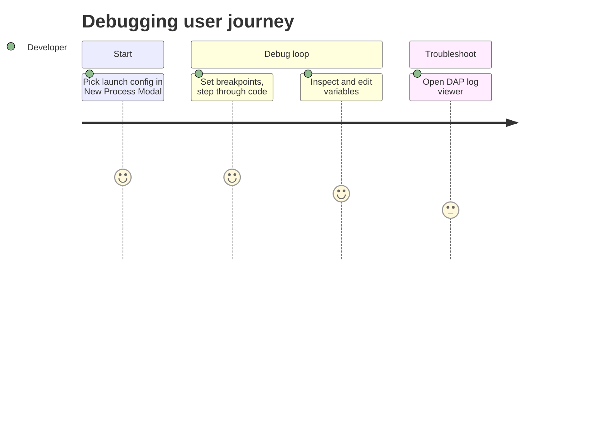

# Screens — F010_Debugging

<!-- generic-source profile: no route-list/screen-list artifact exists for this native GPUI
desktop app. The table below adapts "screens" to the debugger panel's regions/surfaces, each
backed by a distinct Rust view module under crates/debugger_ui/src/. No SCR### codes are assigned
(no screen-list.md to bridge to in this profile). -->

## Screen List

| Screen Name                      | SCR###                                        | What User Sees                                                                                | What User Can Do                                                  |
| -------------------------------- | --------------------------------------------- | --------------------------------------------------------------------------------------------- | ----------------------------------------------------------------- |
| New Process Modal                | N/A (no screen-list artifact in this profile) | Tabbed picker (Task / Debug / Attach / Launch) for starting a new process or debug session    | Switch tabs, pick a launch configuration or task, start a session |
| Debugger Panel — Console         | N/A                                           | REPL-style console with debug output and a query bar                                          | Type expressions, evaluate them, add to watch list                |
| Debugger Panel — Breakpoint List | N/A                                           | List of source breakpoints across all open files, with condition/hit-count/log-message fields | Navigate between editable properties, enable/disable, clear all   |
| Debugger Panel — Variable List   | N/A                                           | Tree of in-scope variables and watched expressions for the paused stack frame                 | Expand/collapse entries, copy name/value, edit value, add watch   |
| Debugger Panel — Memory View     | N/A                                           | Hex/byte view of debuggee memory around a selected address                                    | Jump to an address typed in the query bar                         |
| Attach to Process Modal          | N/A                                           | Live list of local or remote candidate processes (pid, name, command)                         | Select a process to attach the debugger to                        |
| Debug Adapter Log Viewer         | N/A                                           | Raw DAP protocol traffic for a session (request/response/event log)                           | Read protocol traffic for active or recently-ended sessions       |

## User Journey

1. User arrives at the New Process Modal and sees the Debug tab preselected with available launch
   configurations.
2. User selects a configuration — the modal closes and the Debugger Panel opens with Console,
   Breakpoint List, and Variable List visible but empty until the program hits a breakpoint.
3. User is taken to the paused state view where the Variable List and Console populate with the
   current stack frame's data; the user steps through code from here.
4. User optionally opens the Memory View to inspect raw bytes around a variable's address, or opens
   the Attach to Process Modal (on a remote project) to debug an already-running process instead.
5. If debugger behavior looks wrong, user opens the Debug Adapter Log Viewer to see the raw protocol
   exchange for the session, which stays viewable after the session ends.

