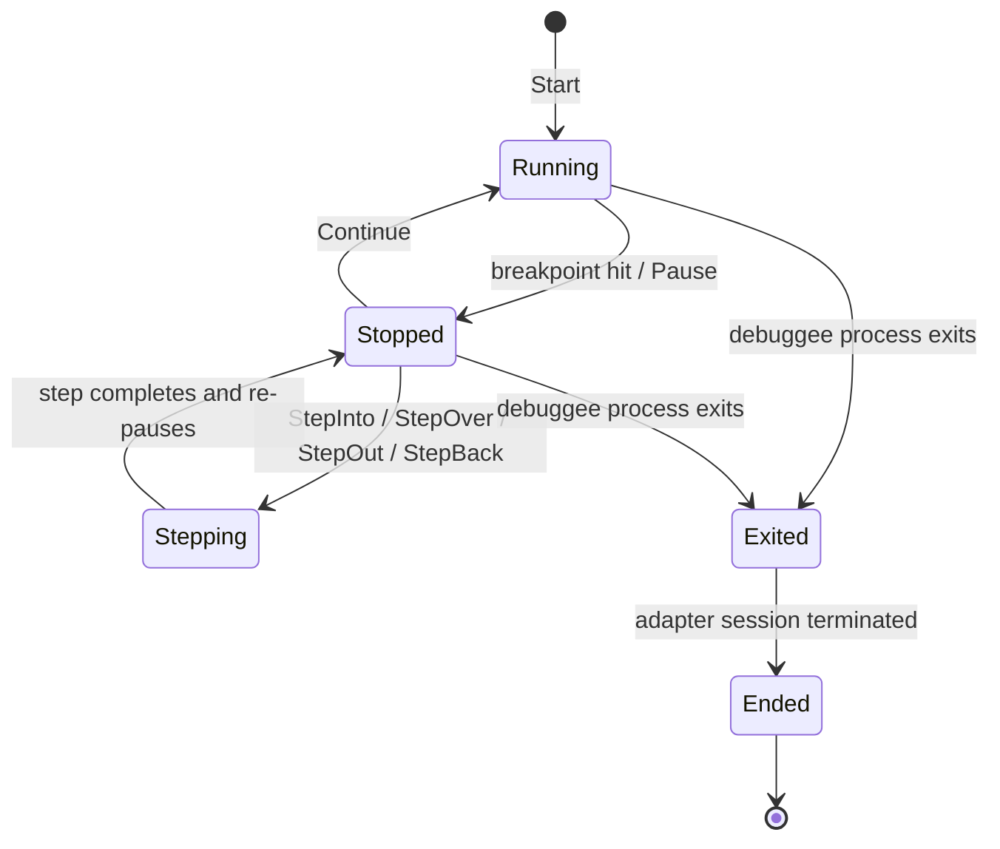

<!-- layout-exempt: rebuild-spec owns all docs/system|features|generated|flows paths -->
<!-- Contract: references/feature-spec-researcher-contract.md -->

# F010_Debugging: Technical Spec
**Priority**: P0
**Type**: mixed
**Generated**: 2026-08-07

## Overview

Full debug-session lifecycle over the Debug Adapter Protocol (DAP): start/stop/step, breakpoint
management, watch expressions, variable inspection/editing, memory viewing, remote-process attach,
and DAP protocol log viewing for adapter troubleshooting. Used by developers running/debugging
their project inside the `debugger_ui` panel. Session state and breakpoints live on `MODEL003_Project`
(`dap_store`, `breakpoint_store` fields) and are shared with the editor (gutter breakpoints), the
git/collab layer (breakpoint forwarding when hosting/joining a shared project), and the remote-dev
(SSH) layer (remote process attach, remote breakpoint forwarding). One background subsystem
(`js-debug-companion`) manages an out-of-process helper binary for the JavaScript debug adapter.

## Polymorphic Behavior

### DISC-002 — Project.client_state

| Value | Render | Validation | Persistence |
|-------|--------|------------|-------------|
| Local | Breakpoint edits apply only to the local `BreakpointStore`; no network forwarding. | No remote round-trip required before a toggle is reflected in the editor gutter. | No forwarding — in-memory only. |
| Shared { remote_id } | Breakpoint edits made locally are also relayed to collab guests via `downstream_client`. | N/A | In-memory; collab guests receive the update over `rpc`. |
| Collab { remote_id, ... } | Breakpoint edits made in a joined session are forwarded upstream to the host via `proto::ToggleBreakpoint` rather than committed as authoritative locally. | Requires an `upstream_client` to exist (`BreakpointStoreMode::Remote`). | Forwarded to host process; local copy is a mirror. |

**Source:** `crates/project/src/debugger/breakpoint_store.rs:553-565` (BL177_ForwardBreakpointToggleToRemote)

### DISC-003 — Project.activity

| Value | Render | Validation | Persistence |
|-------|--------|------------|-------------|
| Active | Debug session runs unrestricted; no hibernation interference. | N/A | N/A |
| Warm | An active debug session or in-flight autosave defers the hibernate transition instead of tearing down project resources. | Hibernation is retried later via `hibernate_retry` task rather than forced. | Deferred retry `Task<()>` held on `Project`; dropping cancels it. |
| Hibernated | If a debug session was active, hibernation for that project is blocked/deferred until the session ends — a hibernated label should not be trusted as "debugger definitely stopped." | Same deferred-retry guard as Warm. | See project memory note: activity label can lag actual resource teardown. |

**Source:** `docs/system/business-rules.md` § Workspace / Worktree Trust & hibernation section (`crates/project` `hibernate_retry` field, `docs/generated/entities.md` § Project)

## Cross-Cutting Logic

### Requirements

| Code | Description | Handler | Verifiable |
|------|-------------|---------|------------|
| FR-010 | Switch between Task/Debug/Attach/Launch tabs in the New Process modal | `new_process_modal::ActivateTaskTab` / `ActivateDebugTab` / `ActivateAttachTab` / `ActivateLaunchTab` | yes |
| FR-011 | Move focus between editable breakpoint properties (condition/hit-count/log message) in the breakpoint list | `breakpoint_list::PreviousBreakpointProperty` / `NextBreakpointProperty` | yes |
| FR-012 | Navigate the memory inspector to an address typed in its query bar | `memory_view::GoToSelectedAddress` | yes |
| FR-013 | Forward a local breakpoint toggle to the collab host when the project is a joined (non-hosting) remote session | `BreakpointStore::toggle_breakpoint` | yes |
| FR-014 | Dispatch `BreakpointStore` update/clear events to every live `Session`, pushing the new breakpoint set to its debug adapter | `Session::new` (BreakpointStoreEvent subscription) | yes |
| FR-015 | Prune all but the newest installed `js-debug-companion` version on `DapStore` construction (local mode) | `DapStore::new` | yes |
| FR-016 | Opportunistically install a newer `js-debug-companion` npm package version in the background while continuing with the current one | `session::get_or_install_companion` (`install_latest_version`) | yes |
| FR-017 | Persist the "only user frames" stack-frame filter preference to the local key-value store, keyed by adapter name + workspace database id | `StackFrameList::toggle_frame_filter` | yes |
| FR-018 | Bind the active debug session id to its window id in the workspace DB when serialization is flushed (window close/quit) | `MultiWorkspace::flush_all_serialization` | yes |

**Source:** see per-row `**Source:**` citations under Business Rules / Algorithms / Integrations below (same call sites).

### Business Rules

_(See itemized entries below.)_

### BR-001_ClearAllBreakpointsIsGlobal
**Linked FR:** FR-004
**Source:** `crates/project/src/debugger/breakpoint_store.rs:610-614`
**Applies to:** `ClearAllBreakpoints` action
**Rule:** Clearing breakpoints empties the entire `breakpoints` map (all files at once) and emits `BreakpointStoreEvent::BreakpointsCleared` with every affected path — there is no per-file or per-session partial clear from this action.

**Pseudocode:**
```text
fn clear_breakpoints():
    paths = breakpoints.keys()
    breakpoints.clear()
    emit BreakpointsCleared(paths)
```

### BR-002_SetVariableRequiresAdapterCapability
**Linked FR:** FR-007
**Source:** `crates/project/src/debugger/session.rs:2716-2744`
**Applies to:** `EditVariable` action / variable list inline edit
**Rule:** A set-variable request is only sent to the debug adapter if `capabilities.supports_set_variable` is true for the active session; otherwise the edit UI has no effect on the adapter (silently ignored at this layer — the editor still opens for input).

**Pseudocode:**
```text
fn set_variable_value(...):
    if capabilities.supports_set_variable:
        request SetVariableValueCommand{name, value, variables_reference}
        on success: invalidate VariablesCommand + ReadMemory cache, clear memory cache,
                    refresh_watchers(stack_frame_id), emit SessionEvent::Variables
```

### BR-003_DetachOnlyWhenAttached
**Linked FR:** FR-003
**Source:** `crates/debugger_ui/src/debugger_ui.rs:161-215`
**Applies to:** `Stop` / `Detach` actions
**Rule:** The `Detach` action is only wired up (`on_action`) when `running_state.session().is_attached()` is true; `Stop` is always available while a thread is running/stopped. `StepBack` is only wired up when `capabilities.supports_step_back` is true for the active adapter.

**Pseudocode:**
```text
if supports_detach: enable Detach -> session.detach_client()
if supports_step_back: enable StepBack -> session.step_back()
```

### BR-004_JsDebugCompanionKeepsNewestOnly
**Linked FR:** FR-015
**Source:** `crates/project/src/debugger/dap_store.rs:196-215`
**Applies to:** `DapStore::new` (local mode construction)
**Rule:** On every local `DapStore` construction, the installed `js-debug-companion` directory is scanned; entries are sorted by parsed semver, and all but the single newest valid-semver version are removed in the background, preventing unbounded growth of the adapter cache across upgrades.

**Pseudocode:**
```text
children = read_dir(js-debug-companion dir)
children.sort_by(semver)
keep = children.pop()  # newest
delete all remaining children
```

### BR-005_BreakpointToggleForwardedUpstreamInCollab
**Linked FR:** FR-013
**Source:** `crates/project/src/debugger/breakpoint_store.rs:553-565`
**Applies to:** `toggle_breakpoint` when `BreakpointStoreMode::Remote`
**Rule:** When the local project is a joined collab session (`BreakpointStoreMode::Remote`), a breakpoint toggle is converted to `proto::ToggleBreakpoint` and sent via `remote.upstream_client` as a detached background request — the local UI does not block on the round-trip.

### Decision Logic

N/A — no user-facing decision logic beyond DISC-002/DISC-003 Polymorphic Behavior. The session
control button set (`Pause`/`StepInto`/`StepOver`/`StepOut`/`StepBack`/`Continue`/`Detach`) is
conditionally wired per single boolean/enum predicate (`ThreadStatus`, `supports_step_back`,
`is_attached`) — each is a single-field condition, so it is captured as BR-003/BR-002 rather than
a DEC (no ≥2-predicate render branch, no interaction reveal, no in-feature flow routing found in
`crates/debugger_ui/src/debugger_ui.rs:160-257`).

### State Machines

_(See itemized entries below.)_

### SM-001_ThreadStatus
**kind:** entity
**Linked FR:** FR-001, FR-002, FR-003
**Source:** `crates/project/src/debugger/session.rs:99-107` (enum definition), `session.rs:589-635` (transitions)
**States:** Running, Stopped, Stepping, Exited, Ended



**Transition rules:**
- `Running -> Stopped`: guard = breakpoint hit, manual `Pause`, or `StoppedEvent` from adapter; side effect = variable list / stack frame list refresh.
- `Stopped -> Running`: guard = `Continue`/`StepInto`/`StepOver`/`StepOut`/`StepBack` (`StepBack` gated on `supports_step_back`); side effect = editor current-line indicator clears until next stop.
- `* -> Exited/Ended`: guard = debuggee process exit or adapter shutdown; side effect = session-scoped panes (variables, call stack) clear.

Note (non-web adaptation): this is in-memory session state on the `Session` entity, not a
persisted DB column — no sqlite/ORM backing exists for debug session state in this desktop app.

### Algorithms

_(See itemized entries below.)_

### ALG-001_JsDebugCompanionVersionSelection
**Linked FR:** FR-015, FR-016
**Source:** `crates/project/src/debugger/dap_store.rs:196-215`, `crates/project/src/debugger/session.rs:3144-3170`
**Input:** directory listing of installed `js-debug-companion` version folders (semver-named)
**Output:** path to the single version folder to keep/launch; background install of a newer version if published
**File Schema**: N/A — not a file-exchange type
**Complexity:** O(n log n) (sort by parsed semver over n installed versions)
**Description:** Parses each child directory name as a `semver::Version`, sorts ascending, keeps
the newest, and deletes the rest. Separately, `get_or_install_companion` compares the newest
locally installed version against the latest published npm version and, if newer, installs it in
the background (`install_latest_version`) while the current session keeps using the
already-installed binary.

**Pseudocode:**
```text
versions = list_dir(companion_dir).filter_map(parse_semver).sort()
newest = versions.pop()
for v in versions: delete(v)
if latest_published_version > newest:
    background_spawn(install_latest_version(companion_dir))
use newest for current session launch
```

### External Integrations

_(See itemized entries below.)_

### INT-001_DebugAdapterProtocol
**Linked FR:** FR-001, FR-002, FR-003, FR-007
**Source:** `crates/project/src/debugger/session.rs:2716-2760`, `crates/dap/src/client.rs`
**Type:** api-call
**Target:** external Debug Adapter Protocol (DAP) server process (per-language adapter: codelldb, gdb, go, javascript, python — `crates/dap_adapters/src/*.rs`)
**Trigger:** session start, step/continue actions, variable edit, expression evaluation
**Payload:** DAP requests (`launch`/`attach`, `next`/`stepIn`/`stepOut`/`continue`, `setVariable`, `evaluate`) — no secrets.
**Failure handling:** adapter binary missing/misconfigured surfaces a diagnostic and no session panes are shown as active (US015 Error Case); a rejected `setVariable` leaves the panel showing the original value and surfaces the adapter's rejection message (US017 Error Case).

### INT-002_JsDebugCompanionNpmInstall
**Linked FR:** FR-016
**Source:** `crates/project/src/debugger/session.rs:3144-3170`
**Type:** api-call
**Target:** npm registry, package `@zed-industries/js-debug-companion-cli`
**Trigger:** a newer published version is detected than what is installed locally
**Payload:** package name + `"latest"` tag, via `NodeRuntime::npm_install_packages`
**Failure handling:** install errors are wrapped with `.context(...)` and propagate as a background task failure; the current (older) companion binary keeps serving the active session regardless.

### INT-003_RemoteProcessListForAttach
**Linked FR:** FR-008
**Source:** `crates/debugger_ui/src/attach_modal.rs:360-395`
**Type:** api-call
**Target:** remote SSH project's `proto_client` (`proto::GetProcesses`) or local `sysinfo::System` process table
**Trigger:** user opens the "Attach to Process" modal
**Payload:** `proto::GetProcesses{project_id}` request; response is a process candidate list (pid, name, command).
**Failure handling:** a failed remote request falls back to an empty process list (`unwrap_or_else`) rather than blocking the modal.

### INT-004_CollabBreakpointForward
**Linked FR:** FR-013
**Source:** `crates/project/src/debugger/breakpoint_store.rs:553-565`
**Type:** event-publish
**Target:** collab host, via `remote.upstream_client` (`proto::ToggleBreakpoint`)
**Trigger:** breakpoint toggle in a joined (non-hosting) collab project
**Payload:** `project_id`, absolute file path, serialized breakpoint.
**Failure handling:** detached background request; failure is not surfaced to the toggling user beyond normal request-error logging (no retry policy found in this call site).

### Verification

- **SC-001** Starting a session with a valid launch configuration results in a running `DebugSession` and populated debugger panes (covers FR-001, US015).
- **SC-002** `ClearAllBreakpoints` leaves the breakpoint list empty across every previously-tracked file (covers FR-004, BR-001).
- **SC-003** Editing a variable either shows the new value (adapter accepted) or leaves the original value with a visible rejection (covers FR-007, BR-002).
- **SC-010** Switching tabs in the New Process modal updates the visible pane to match the selected Task/Debug/Attach/Launch tab with no stale content from the prior tab (covers FR-010).
- **SC-011** Moving focus between breakpoint properties with `PreviousBreakpointProperty`/`NextBreakpointProperty` cycles through condition/hit-count/log-message fields in order without skipping or looping early (covers FR-011).
- **SC-012** Typing an address in the memory inspector's query bar and confirming navigates the view to that address (covers FR-012).
- **SC-013** Toggling a breakpoint while joined (non-hosting) to a remote session forwards the toggle to the collab host rather than committing it as authoritative locally (covers FR-013, DISC-002).
- **SC-014** Updating or clearing a breakpoint dispatches the new set to every live `Session`'s debug adapter, not just the session that triggered the change (covers FR-014).
- **SC-015** On `DapStore` construction, exactly one (the newest) `js-debug-companion` version remains installed; older versions are removed (covers FR-015, BR-004).
- **SC-016** A newer `js-debug-companion` npm package installs in the background while the current session continues uninterrupted (covers FR-016).
- **SC-017** Toggling "only user frames" persists across a restart, scoped per adapter name and workspace database id (covers FR-017).
- **SC-018** Closing or quitting the window with an active debug session writes the session-to-window binding to the workspace DB before the flush completes (covers FR-018).

---

**Client behavior:** see
[`behavior-logic.md`](../../generated/behavior-logic.md) (client-side patterns — debounce, optimistic UI, polling, upload, realtime),
[`permissions.md`](../../system/permissions.md) (feature flags / experiments / env / locale gates),
[`screen-flow.md`](../../generated/screen-flow.md) (guards / deep-link state restoration / unsaved-changes protection).

## User Stories

### US015_StartDebugSession — Start a debug session (Priority: P1, must)

**What happens:** Developer triggers `Start`, which opens the New Process modal (Debug tab) and, on
launch-config selection, starts a `DebugSession` against the configured adapter.
**Why this priority:** Entry point for the entire feature — no other debugging capability is
reachable without a running session.
**Independent Test:** Trigger `Start` with a valid launch config and confirm the debugger panes
(console, variables, breakpoint list) populate.

**Acceptance Scenarios:**
1. **Given** a valid debug launch configuration exists, **When** developer triggers `Start`, **Then** a `DebugSession` starts and the debugger panes populate.
2. **Given** the debug adapter binary is missing/misconfigured, **When** developer triggers `Start`, **Then** session start fails with a diagnostic message and no session panes show as active.

**Requirements fulfilled:**
- **FR-001** Start a debug session for the active launch configuration — `debugger::Start` via `debugger_ui.rs::register_action` -> `NewProcessModal::show(.., NewProcessMode::Debug, ..)`
  **Source:** `crates/debugger_ui/src/debugger_ui.rs:123-125`

**Rules enforced:** BL005_DebuggerSessionControlActions registers the full `actions!(debugger, [...])` surface this and the following stories dispatch through (see `## Source Code References`).

**Verification:**
- **SC-001** (covers FR-001)

---

### US016_StepThroughCodeWhileDebugging — Step through code while debugging (Priority: P1, must)

**What happens:** While paused at a breakpoint, developer triggers `Continue`/`StepInto`/`StepOver`/
`StepOut`/`StepBack` to advance or rewind execution one unit at a time; editor current-line and
variable list refresh after each step.
**Why this priority:** Core debugging loop — stepping is the primary reason to use a debugger.
**Independent Test:** From a paused session, trigger `StepOver` and confirm execution advances to
the next statement in the same frame and pauses again.

**Acceptance Scenarios:**
1. **Given** a session paused at a breakpoint, **When** developer triggers `StepOver`, **Then** execution advances past the current line and pauses again at the next statement in the same frame.

**Requirements fulfilled:**
- **FR-002** Step/continue/pause the active thread — `debugger::{StepInto,StepOver,StepOut,StepBack,Continue,Pause}` via `on_action` handlers gated by `ThreadStatus`
  **Source:** `crates/debugger_ui/src/debugger_ui.rs:166-207`

**Rules enforced:** BR-003 (StepBack gated on adapter capability).
**State transitions:** SM-001 (Stopped -> Running on any step/continue action).

**Verification:**
- **SC-004** Stepping while `ThreadStatus::Stopped` advances the frame and re-pauses; stepping is unavailable while `Running` (covers FR-002).

---

### US002_StopDebugSession — Stop a debug session (Priority: P1, must)

**What happens:** Developer triggers `Stop` to terminate the debuggee (or `Detach` to leave it
running, if the adapter supports detach); the debugger panes clear session-scoped state.
**Why this priority:** Without a reliable stop path, the debugger UI and debuggee process would leak
across runs.
**Independent Test:** With a running session, trigger `Stop` and confirm the debuggee terminates and
the session is removed from the UI.

**Acceptance Scenarios:**
1. **Given** a running debug session, **When** developer triggers `Stop`, **Then** the debuggee process terminates and the session is removed from the debugger UI.

**Requirements fulfilled:**
- **FR-003** Stop/Detach the active session — `debugger::{Stop,Detach}` via `on_action`
  **Source:** `crates/debugger_ui/src/debugger_ui.rs:208-237`

**Rules enforced:** BR-003_DetachOnlyWhenAttached.

**Verification:**
- **SC-005** `Detach` is only actionable when `is_attached()`; `Stop` always terminates the debuggee and clears session-scoped panes (covers FR-003).

---

### US003_ClearAllBreakpoints — Clear all breakpoints (Priority: P2, should)

**What happens:** Developer triggers `ClearAllBreakpoints`; every breakpoint tracked by the
project's `BreakpointStore` is removed, across every file.
**Why this priority:** Convenience/cleanup action, not required for a minimal debugging loop.
**Independent Test:** With breakpoints across 3 files, trigger `ClearAllBreakpoints` and confirm the
breakpoint list panel shows empty.

**Acceptance Scenarios:**
1. **Given** 5 breakpoints across 3 files, **When** developer triggers `ClearAllBreakpoints`, **Then** all 5 are removed and the breakpoint list panel shows empty.

**Requirements fulfilled:**
- **FR-004** Clear every tracked breakpoint — `debugger::ClearAllBreakpoints` via `DebugPanel::load` registered action -> `BreakpointStore::clear_breakpoints`
  **Source:** `crates/debugger_ui/src/debugger_panel.rs:161-167`

**Rules enforced:** BR-001_ClearAllBreakpointsIsGlobal.

**Verification:**
- **SC-002** (covers FR-004, BR-001)

---

### US004_AddWatchExpression — Add a watch expression (Priority: P2, should)

**What happens:** Developer types an expression in the debug console and triggers `WatchExpression`;
the expression is added to the watch list and re-evaluates on every subsequent stop/step.
**Why this priority:** High-value inspection convenience but not required for basic step-debugging.
**Independent Test:** Type `myVar.count` in the console, trigger `WatchExpression`, confirm it
appears in the watch panel and updates on the next step.

**Acceptance Scenarios:**
1. **Given** developer types `myVar.count` in the debug console, **When** developer triggers `WatchExpression`, **Then** `myVar.count` appears in the watch panel and updates on the next step.

**Requirements fulfilled:**
- **FR-005** Add current console expression to the watch list and evaluate it — `console::WatchExpression` via `Console::watch_expression`
  **Source:** `crates/debugger_ui/src/session/running/console.rs:273-306`

**Rules enforced:** none beyond BR-002-style adapter-capability gating on evaluate (implicit; no explicit guard found in this call site — see Unresolved Questions).

**Verification:**
- **SC-006** After `WatchExpression`, the expression is present in `session.add_watcher(...)` state and re-evaluates on next stop (covers FR-005).

---

### US005_InspectVariableInDebugPanel — Inspect a variable in the debug panel (Priority: P2, should)

**What happens:** Developer expands a struct/object variable in the variable list to reveal its
child fields (`ExpandSelectedEntry`/`CollapseSelectedEntry`), and can copy the displayed value
(`CopyVariableValue`).
**Why this priority:** Read-only inspection convenience — helpful but not essential to stepping.
**Independent Test:** With a paused session showing a struct-typed variable, trigger
`ExpandSelectedEntry` and confirm child fields render as nested rows.

**Acceptance Scenarios:**
1. **Given** a paused session shows a struct-typed variable, **When** developer triggers `ExpandSelectedEntry`, **Then** the variable's fields are listed as child rows beneath it.

**Requirements fulfilled:**
- **FR-006** Expand/collapse/copy a variable entry — `variable_list::{ExpandSelectedEntry,CollapseSelectedEntry,CopyVariableValue,CopyVariableName}`
  **Source:** `crates/debugger_ui/src/session/running/variable_list.rs:565-598, 852-896`

**Rules enforced:** none (pure UI tree expansion; no adapter round-trip needed once children are cached).

**Verification:**
- **SC-007** Expand/collapse toggles child-row visibility without a new adapter request when children are already cached (covers FR-006).

---

### US017_EditVariableValueWhileDebugging — Edit a variable's value while debugging (Priority: P2, should)

**What happens:** Developer edits a variable's displayed value via `EditVariable`; the new value is
sent to the adapter as a set-variable request and the panel reflects the confirmed write.
**Why this priority:** Enables state-based bug reproduction without restarting, valuable but
secondary to core stepping/inspection.
**Independent Test:** Edit `count = 3` to `10` via `EditVariable` on a paused session and confirm the
panel shows `count = 10` once the adapter accepts the write.

**Acceptance Scenarios:**
1. **Given** a paused session shows `count = 3`, **When** developer edits it to `10` via `EditVariable`, **Then** the adapter accepts the write and the panel shows `count = 10`.
2. **Given** the adapter rejects the set-variable request (e.g. read-only binding), **When** developer edits the value, **Then** the panel keeps the original value and surfaces the adapter's rejection.

**Requirements fulfilled:**
- **FR-007** Edit and submit a variable's new value — `variable_list::EditVariable` via `VariableList::edit_variable` -> `Session::set_variable_value`
  **Source:** `crates/debugger_ui/src/session/running/variable_list.rs:898-917`, `crates/project/src/debugger/session.rs:2716-2744`

**Rules enforced:** BR-002_SetVariableRequiresAdapterCapability.

**Verification:**
- **SC-003** (covers FR-007, BR-002)

---

### US018_AttachDebuggerToRemoteProcess — Attach debugger to a remote process (Priority: P2, should)

**What happens:** On a remote (SSH) project, developer opens "Attach to Process"; the modal fetches
the live remote process list and, on selection, starts a session attached to that PID.
**Why this priority:** Needed for debugging long-lived remote services without restarting them, but
narrower audience than local debugging.
**Independent Test:** On a remote SSH project with a running target process, open Attach-to-Process,
select it, and confirm a session attaches to that remote PID.

**Acceptance Scenarios:**
1. **Given** a remote SSH project has a running target process, **When** developer opens Attach-to-Process and selects it, **Then** a debug session attaches to that remote PID.

**Requirements fulfilled:**
- **FR-008** Fetch and select a remote process to attach to — `attach_modal::get_processes_for_project` (remote branch) via `proto::GetProcesses`
  **Source:** `crates/debugger_ui/src/attach_modal.rs:360-380`

**Rules enforced:** INT-003_RemoteProcessListForAttach (fallback to empty list on request failure).

**Verification:**
- **SC-008** Opening Attach-to-Process on a remote project issues a `GetProcesses` request and populates the candidate list from the response (or an empty list on failure) (covers FR-008).

---

### US067_OpenDebugAdapterLogs — Open Debug Adapter Protocol logs (Priority: P3, could)

**What happens:** Developer opens the DAP log viewer (`OpenDebugAdapterLogs`), backed by a
`LogStore` observing all active debug sessions; logs for a session remain viewable after the
session ends, until the viewer is closed.
**Why this priority:** Troubleshooting tool for adapter authors/power users, not needed for the
common debugging path.
**Independent Test:** With an active debug session, trigger `OpenDebugAdapterLogs` and confirm a log
pane opens showing that session's DAP traffic.

**Acceptance Scenarios:**
1. **Given** a debug session is active, **When** developer triggers `OpenDebugAdapterLogs`, **Then** a log pane opens showing that session's DAP protocol traffic.

**Requirements fulfilled:**
- **FR-009** Open the DAP log viewer for active/recent sessions — `dev::OpenDebugAdapterLogs` via `LogStore`
  **Source:** `crates/debugger_tools/src/dap_log.rs:151, 954-972`

**Rules enforced:** none beyond the retention rule described in "What happens" above.

**Verification:**
- **SC-009** Log pane remains open and populated for a session that has since terminated, until the user closes the viewer (covers FR-009).

### Edge Cases

| Scenario | Behavior |
|----------|----------|
| Debug adapter binary missing/misconfigured on `Start` | Session start fails with a diagnostic message; no session panes are shown as active (US015 Error Case). |
| Adapter rejects a `setVariable` request | Panel keeps the original value and surfaces the adapter's rejection message (US017 Error Case, BR-002). |
| Remote `GetProcesses` request fails during attach | Falls back to an empty candidate list rather than blocking the modal (`unwrap_or_else`, `attach_modal.rs:367-370`). |
| Debug session active while its project is a hibernation candidate | Hibernation is deferred/retried instead of tearing the project down mid-session (DISC-003). |

## Key Entities

| Entity | Table | Key Columns | Purpose |
|--------|-------|-------------|---------|
| Project | N/A (in-memory `Entity<Project>`) | dap_store, breakpoint_store, activity, client_state | Per-workspace-root coordinator owning the debug-session and breakpoint stores this feature operates on. |
| DapStore | N/A (in-memory `Entity<DapStore>`) | mode (Local/Remote/Collab), sessions, adapter_options | Manages DAP session lifecycle, adapter binary resolution, and per-adapter persisted options (e.g. exception breakpoints). |
| BreakpointStore | N/A (in-memory `Entity<BreakpointStore>`) | breakpoints (path -> BreakpointsInFile), mode | Owns all source breakpoints for the project; forwards toggles to remote/downstream clients. |
| Session | N/A (in-memory `Entity<Session>`) | global_state (ThreadStatus), capabilities, thread_states | One active DAP debug session: thread status, capabilities, stack frames, variables, watchers. |
| debugger_kvp (sqlite key-value store) | `kv_store` (crates/db) | key (`stack_frame_filter/{adapter}/{workspace_id}`), value | Persists the "only user frames" stack-frame filter preference across restarts (only genuine DB write in this feature). |

## Artifact References

| Artifact | File | Codes Used | Reviewed |
|----------|------|------------|----------|
| System Overview | [system-overview.md](../../system-overview.md) | — | [x] |
| Feature List | [feature-list.md](../../feature-list.md) | F010 | [x] |
| Entities | [data-model.md](../../data-model.md) | MODEL003 | [x] |
| Behavior Logic | [behavior-logic.md](../../behavior-logic.md) | BL004, BL005, BL006, BL007, BL008, BL009, BL010, BL133, BL150, BL152, BL177, BL178, BL179, BL201 | [x] |
| User Stories | [user-stories.md](../../user-stories.md) | US015, US016, US002, US003, US004, US005, US017, US018, US067 | [x] |
| Screens (this feature) | [screens.md](screens.md) | — | [x] |

**Rule:** No `ROUTE###`/`SCR###`/`PERM###` codes apply — `generic-source` profile carries no
route-list/screen-list/permissions-matrix artifacts for this native-desktop fork.

## Assumptions

- The debug console's `evaluate`/`WatchExpression` path is assumed to rely on the same
  `capabilities.supports_set_variable`-style adapter-capability gating pattern used for
  `EditVariable`, but no explicit capability check was found guarding `Console::watch_expression`
  itself (`console.rs:273-306`) — treated as adapter-side validation, not app-side.
- `BL152_PersistStackFrameFilterPreference`'s `kv_store` write is assumed to be the only
  DB-backed persistence this feature performs; all other state (sessions, breakpoints, variables)
  is in-memory only for the lifetime of the app process.
- Remote-attach (`US018`) is assumed scoped to SSH remote-dev projects only (`remote_client`
  presence check in `attach_modal.rs:362`), not collab-shared projects.

## Source Code References

| Order | Symbol | Path | Purpose |
|-------|--------|------|---------|
| 1 | `Session` (ThreadStatus, capabilities) | `crates/project/src/debugger/session.rs:100-116, 2716-2760` | Core per-session state and DAP request dispatch (step/continue/evaluate/set-variable). |
| 2 | `DapStore` | `crates/project/src/debugger/dap_store.rs:94-215` | Session registry, adapter resolution, js-debug-companion pruning. |
| 3 | `BreakpointStore` | `crates/project/src/debugger/breakpoint_store.rs:404-620` | Breakpoint CRUD, clear-all, remote/collab forwarding. |
| 4 | `debugger_ui` actions + control wiring | `crates/debugger_ui/src/debugger_ui.rs:29-401` | Registers the `debugger`/`dev` action surface and wires session-control buttons to `Session` methods. |
| 5 | `DebugPanel` | `crates/debugger_ui/src/debugger_panel.rs:153-175` | Panel-level `ClearAllBreakpoints` registration; top-level debugger panel host. |
| 6 | `VariableList` | `crates/debugger_ui/src/session/running/variable_list.rs:565-953` | Expand/collapse/copy/edit/watch variable interactions. |
| 7 | `Console` | `crates/debugger_ui/src/session/running/console.rs:273-334` | Watch-expression and REPL evaluate actions. |
| 8 | `AttachModal` | `crates/debugger_ui/src/attach_modal.rs:360-400` | Remote/local process listing for attach. |
| 9 | `LogStore` (`debugger_tools`) | `crates/debugger_tools/src/dap_log.rs:72-972` | DAP protocol log capture and viewer action. |
| 10 | `StackFrameList` | `crates/debugger_ui/src/session/running/stack_frame_list.rs:838-857` | Stack-frame filter toggle + KVP persistence. |

## Unresolved Questions

1. **Watch-expression capability gating**: does `Console::evaluate`/`watch_expression` check any
   adapter capability before sending the `evaluate` DAP request, or does it always send and rely on
   the adapter to reject unsupported contexts? Not confirmed from `console.rs:273-334`.
2. **`BL150`/remote attach auth**: whether the remote `GetProcesses` request is subject to any
   project-trust/permission gate beyond the existing SSH connection was not verified in
   `attach_modal.rs`.
3. **Exception-breakpoint persistence scope**: `PersistedAdapterOptions.exception_breakpoints`
   (`dap_store.rs:106-116`) is serialized "best-effort" per the doc comment, but the exact
   read/write call sites for this persistence were not traced in this pass.

## Source Walkthrough

1. **File:** `crates/project/src/debugger/session.rs:1-220` — why start here: defines `Session`,
   `ThreadStatus`, and the DAP request/response plumbing every other file in this feature drives.
2. **File:** `crates/project/src/debugger/dap_store.rs:94-220` — next: the store that owns all
   `Session`s for a project and resolves/launches debug adapters (including js-debug-companion).
3. **File:** `crates/project/src/debugger/breakpoint_store.rs:404-620` — next: breakpoint CRUD and
   remote/collab forwarding that every `Session` subscribes to on construction.
4. **File:** `crates/debugger_ui/src/debugger_ui.rs:29-401` — last: the UI action surface
   (`actions!(debugger, [...])`) wiring keybindings/toolbar buttons to the `Session`/`BreakpointStore`
   methods walked above.

### Call Hierarchy

```text
debugger_ui::actions (Start/Continue/StepOver/.../EditVariable)
  -> DebugPanel / VariableList / Console / AttachModal (crates/debugger_ui)
    -> Session (crates/project/src/debugger/session.rs) — DAP request/response
    -> DapStore (crates/project/src/debugger/dap_store.rs) — session registry, adapter binary
    -> BreakpointStore (crates/project/src/debugger/breakpoint_store.rs) — breakpoint CRUD + forwarding
      -> remote.upstream_client / downstream_client (rpc proto) — collab forwarding
```

**Related files:** see `## Source Code References` above — the **Order** column is this section's
related-files table, re-cast with the reading sequence.

## DB Impact per Event

| Event/Endpoint | Table | Columns | Operation | Value Derivation | Source |
|----------------|-------|---------|-----------|-------------------|--------|
| Toggle "only user frames" stack-frame filter | `kv_store` (crates/db sqlite KVP) | key, value | INSERT/UPDATE (upsert via `write_kvp`) | key = `stack_frame_filter_key(adapter_name, workspace_database_id)`; value = `self.list_filter` serialized to string | `crates/debugger_ui/src/session/running/stack_frame_list.rs:838-857` |
| Bind session id to window id on serialization flush | workspace DB (crates/db, per-workspace) | session_id, window_id | UPDATE | literal ids taken from the live `Session`/window at flush time | `crates/workspace/src/multi_workspace.rs` (`MultiWorkspace::flush_all_serialization`, cited from `behavior-logic.md` BL201; exact line range not re-verified in this pass) `[INFERRED]` |

All other debugger state (sessions, breakpoints, variables, watch expressions, memory views) is
in-memory only for the process lifetime and is not written to the database.
