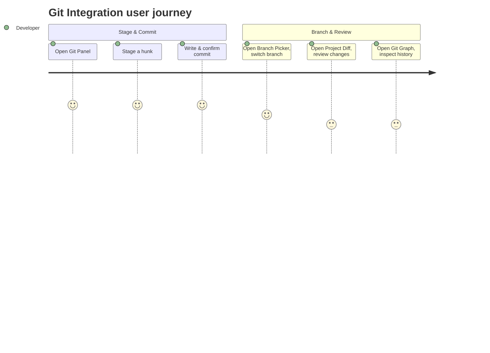

# Screens — F011_GitIntegration

<!-- generic-source profile: no route-list.md/screen-list.md exists for this project, so canonical
SCR### codes are not available. Panels are listed by their crate-level identifier instead, per
session-context guidance to omit ROUTE###/SCR### entirely for this profile. -->

## Screen List

| Panel Name                | Source Identifier                                | What User Sees                                                                                       | What User Can Do                                                                                                                  |
| ------------------------- | ------------------------------------------------ | ---------------------------------------------------------------------------------------------------- | --------------------------------------------------------------------------------------------------------------------------------- |
| Git Panel                 | `crates/git_ui/src/git_panel.rs::GitPanel`       | List of changed files/hunks grouped by staged/unstaged, a commit message editor                      | Stage/unstage a hunk, file, directory, or everything; discard a file's changes; write and confirm a commit; amend the last commit |
| Branch Picker             | `crates/git_ui/src/branch_picker.rs::BranchList` | Fuzzy-searchable list of local/remote branches, with a create-new-branch entry                       | Switch to a branch; create a new branch from HEAD or a base branch; delete a branch; add a new remote                             |
| Commit View               | `crates/git_ui/src/commit_view.rs::CommitView`   | Details of a selected commit or stash entry                                                          | Apply, pop, or drop the currently selected stash entry                                                                            |
| Stash Picker              | `crates/git_ui/src/stash_picker.rs`              | List of stash entries                                                                                | Show a stash's diff; drop a stash entry                                                                                           |
| Project Diff              | `crates/git_ui/src/project_diff.rs::ProjectDiff` | Combined multibuffer diff of every changed file in the project (or a diff against a chosen branch)   | Jump from a listed hunk to its location in the corresponding file; stage a file from the diff view                                |
| Git Graph                 | `crates/git_graph/src/git_graph.rs::GitGraph`    | Visual commit graph with parent/child lane edges, a search field, and commit detail/diff-stats panel | Open a commit's detail view; search commits; jump to a specific commit via `OpenAtCommit`                                         |
| Git Picker (combined tab) | `crates/git_ui/src/git_picker.rs`                | Tabbed container switching between Branches and Stash lists                                          | Switch between the Branches tab and Stash tab                                                                                     |
| Worktree Picker           | `crates/git_ui/src/worktree_picker.rs`           | List of linked `git worktree` checkouts for the current repo                                         | Delete a linked worktree from disk and from the project                                                                           |

## User Journey

1. Developer opens the Git Panel and sees the current repository's changed files split into
   staged and unstaged sections.
2. Developer stages a hunk or a whole file — it moves into the staged section; unstaged edits in
   the same file remain untouched.
3. Developer writes a commit message in the Git Panel and confirms — the staged changes become a
   new commit and the staged list clears.
4. Developer opens the Branch Picker to switch context, selects a different branch, and the Git
   Panel and status bar update to reflect the newly checked-out branch.
5. Developer opens Project Diff to review every changed file in the project together before a
   larger commit, or opens Git Graph to see how recent branches and merges fit together.

