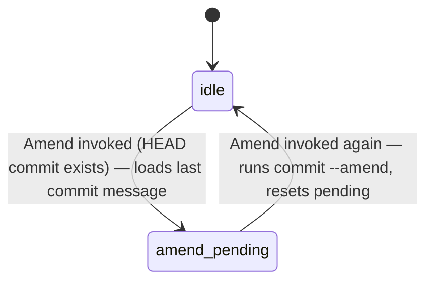

<!-- layout-exempt: rebuild-spec owns all docs/system|features|generated|flows paths -->

# F011_GitIntegration: Technical Spec
**Priority**: P0
**Type**: mixed
**Generated**: 2026-08-07

## Overview

Git Integration wraps a local `git` install (`libgit2` for reads, the system/bundled `git` binary
for everything else) so a developer can stage/unstage hunks, switch or create branches, stash,
discard, commit, review a whole-project diff, and inspect a visual commit graph — all from within
the editor. It is triggered by the Git panel, Branch Picker, Stash Picker, Commit View, Project
Diff, and Git Graph UIs, and it is the sole owner of `Repository`/`RepositorySnapshot` state in
`GitStore`. There is no server-side collaboration component in this fork.

## Polymorphic Behavior

N/A — no discriminator fields in Key Entities. `MODEL014_Repository`'s data-model entry
(`plans/260726-1400-rebuild-spec/artifacts/data-model.md:519`) explicitly delegates its only
discriminator (`WorkDirectory`) to the `Worktree` entity, which is outside this feature.

## Cross-Cutting Logic

### Requirements

| Code | Description | Endpoint/Handler | Verifiable |
|------|-------------|------------------|------------|
| FR-001 | Stage/unstage a single hunk, a directory, or all files via `update-index`/`reset` | `Repository::stage_paths`/`unstage_paths` via `git.rs::ToggleStaged` | yes |
| FR-002 | Switch to an existing local/remote branch (`git checkout <branch>`) | `Repository::change_branch` | yes |
| FR-003 | Create a new branch from HEAD or a chosen base (`git switch -c`) | `Repository::create_branch` | yes |
| FR-004 | Stash all uncommitted changes (`git stash push --include-untracked`) | `Repository::stash_all`/`stash_entries` | yes |
| FR-005 | Discard (checkout from HEAD) or trash a file's uncommitted changes | `GitPanel::revert_entry`/`perform_checkout` → `Repository::checkout_files` | yes |
| FR-006 | Commit staged changes with a message, optional amend/signoff | `GitPanel::commit_changes` → `Repository::commit` | yes |
| FR-007 | View a combined diff of every changed file in the project | `ProjectDiff::deploy_at`/`deploy_branch_diff` | yes |
| FR-008 | Render the repository's commit graph with parent/child edges | `GitGraph::new` + `Repository::graph_data` | yes |

**Source:** `crates/git/src/repository.rs:2205-2405`, `crates/git_ui/src/git_panel.rs:1489-1946,2127-2369`, `crates/git_ui/src/branch_picker.rs:827-895,1999-2033`, `crates/project/src/git_store.rs:5429-5470`, `crates/git_ui/src/project_diff.rs:88-140`, `crates/git_graph/src/git_graph.rs:993-1160`

### Business Rules

_(See itemized entries below.)_

### BR-001_NoStagedCommitBlocked
**Linked FR:** FR-006
**Source:** `crates/git_ui/src/git_panel.rs:2317-2335`
**Applies to:** commit action
**Rule:** If there are no staged entries and the caller is not amending, the commit is refused with `"No changes to commit"` rather than silently producing an empty commit. If nothing is staged but tracked files changed, all non-created (tracked) files are auto-staged before the commit runs.

**Pseudocode:**
```text
if has_staged_changes:
    commit(message, options)
else:
    changed = tracked_files_with_status()
    if changed.is_empty() and not options.amend:
        error("No changes to commit"); return
    stage(changed); commit(message, options)
```

### BR-002_ConflictsMustBeResolvedBeforeCommit
**Linked FR:** FR-006
**Source:** `crates/git_ui/src/git_panel.rs:2297-2304`
**Applies to:** commit action
**Rule:** If the repository has unresolved (unstaged) merge conflicts, the commit is blocked with `"There are still conflicts. You must stage these before committing"`.

**Pseudocode:**
```text
if has_unstaged_conflicts():
    warn("There are still conflicts. You must stage these before committing")
    return
```

### BR-003_AmendRequiresHeadCommit
**Linked FR:** FR-006
**Source:** `crates/git_ui/src/git_panel.rs:2165-2197`
**Applies to:** amend action
**Rule:** Amend is a two-stage gesture: the first invocation only loads the last commit message into the editor (no git call) and requires a HEAD commit to exist; the second invocation performs the actual `git commit --amend`.

**Pseudocode:**
```text
if head_commit.is_none(): return false
if not amend_pending:
    amend_pending = true; load_last_commit_message(); return false
else:
    commit_changes(amend=true); return true
```

### BR-004_StashRaceCheckedBeforeApply
**Linked FR:** FR-004
**Source:** `crates/git_ui/src/commit_view.rs:520-599`
**Applies to:** stash apply/pop/drop
**Rule:** Before applying, popping, or dropping a stash entry selected in Commit View, the code re-verifies the target stash's SHA still matches its expected index (`stash_matches_index`); if the stash list has changed underneath the user, the operation is aborted with an explicit error instead of acting on the wrong stash.

**Pseudocode:**
```text
if not stash_matches_index(sha, stash_index, repo):
    error("Stash has changed, not applying/pop/drop aborted"); return
repo.stash_apply(stash_index) # or stash_pop / stash_drop
```

### BR-005_CheckoutRefusedOnConflictingUncommittedChanges
**Linked FR:** FR-002
**Source:** `crates/git/src/repository.rs:1956-1997`
**Applies to:** branch switch
**Rule:** `change_branch` shells out to `git checkout <branch>`; git itself refuses the checkout (non-zero exit propagated as an error, surfaced via `detach_and_prompt_err("Failed to change branch", ...)`) when uncommitted local changes would be overwritten — the app does not pre-empt this with its own dirty-check, it relies on and surfaces the underlying git error.

**Pseudocode:**
```text
result = repo.change_branch(branch.name())
if result.is_err(): show_error_dialog("Failed to change branch", result.error)
```

### BR-006_DiscardCreatedFilesGoToTrashNotCheckout
**Linked FR:** FR-005
**Source:** `crates/git_ui/src/git_panel.rs:1489-1535`
**Applies to:** discard/revert action
**Rule:** Reverting a status entry unstages it first if staged, then branches on whether the file is newly created: tracked files are reverted via `checkout_files("HEAD", ...)`; untracked/newly-created files are instead sent through a confirmation prompt ("Trash {filename}?") and deleted via `project.delete_file`, never checked out.

**Pseudocode:**
```text
if entry.status.has_staged(): unstage(entry)
if not entry.status.is_created():
    checkout_files("HEAD", [entry.path])
else:
    if confirm("Trash {filename}?"): project.delete_file(entry.path)
```

### Decision Logic

N/A — no user-facing decision logic beyond DISC-### Polymorphic Behavior. Git Integration's branching
(stage vs unstage, checkout vs trash, amend two-stage gesture) is captured above as BR-### business
rules — each is a single-field/status-driven branch or a linear two-step gesture, not a
multi-predicate render/interaction/flow decision per the contract's DEC scope.

### State Machines

_(See itemized entries below.)_

### SM-001_AmendGesture
**kind:** ui
**Linked FR:** FR-006
**Source:** `crates/git_ui/src/git_panel.rs:2165-2197`
**States:** idle, amend_pending



**Transition rules:**
- `idle → amend_pending`: guard = `head_commit(cx).is_some()`; side effect = loads the last commit message into the commit editor, no git write yet.
- `amend_pending → idle`: guard = commit editor still focused; side effect = runs `commit_changes(amend: true)` and clears `amend_pending` on success.

### Algorithms

None.

### External Integrations

_(See itemized entries below.)_

### INT-001_GitCliAndLibgit2DualPath
**Linked FR:** FR-001, FR-002, FR-003, FR-004, FR-005, FR-006, FR-007, FR-008
**Source:** `crates/git/src/repository.rs:2205-2405`
**Type:** api-call (local process/library, not network)
**Target:** system or bundled `git` executable (via `GitBinary`/`util::command::new_command`) plus an in-process `libgit2` handle (`git2::Repository`)
**Trigger:** any staging, branch, stash, discard, or commit action from the Git panel/pickers/graph
**Payload:** command-line args (paths, branch names, commit message, commit options), plus process env (for askpass/credential helper)
**Failure handling:** non-zero exit status is turned into an `anyhow::Error` carrying `stderr`; UI call sites surface it via `detach_and_prompt_err(...)` (a dialog) rather than retrying automatically. No queue/DLQ — a failed operation simply does not mutate repository state.

**Pseudocode:**
```text
output = git_binary.build_command(args).envs(env).output().await
if not output.status.success():
    return Err("Failed to {op}:\n{stderr}")
Ok(())
```

### Verification

- **SC-001** — Staging a hunk leaves only that hunk in the index; other unstaged hunks in the same file remain unstaged (covers FR-001).
- **SC-002** — Committing with 2 staged hunks produces a commit containing exactly those 2 hunks; committing with nothing staged is blocked (covers FR-006, BR-001).
- **SC-003** — Switching branches with a clean tree checks out the target and updates the status-bar branch label; switching with conflicting uncommitted changes is refused rather than silently discarding them (covers FR-002, BR-005).
- **SC-004** — Creating a new branch from HEAD or a chosen base results in that branch existing and becoming the checked-out HEAD (covers FR-003).
- **SC-005** — Stashing all uncommitted changes leaves a clean working tree and adds exactly one new stash entry (covers FR-004).
- **SC-006** — Discarding a tracked file's changes checks it out from HEAD; discarding an untracked file moves it to trash rather than deleting it outright (covers FR-005, BR-006).
- **SC-007** — Opening the project-wide diff view shows exactly the set of files with uncommitted changes, each with an accurate hunk-level diff (covers FR-007).
- **SC-008** — The commit graph renders every commit reachable from HEAD with correct parent/child edges matching `git log --graph` (covers FR-008).

---

**Client behavior:** see
[`behavior-logic.md`](../../generated/behavior-logic.md) (client-side patterns — debounce, optimistic UI, polling, upload, realtime),
[`permissions.md`](../../system/permissions.md) (feature flags / experiments / env / locale gates),
[`screen-flow.md`](../../generated/screen-flow.md) (guards / deep-link state restoration / unsaved-changes protection).

## User Stories

### US019_StageGitHunk — Stage a git hunk (Priority: must)

**What happens:** From the editor gutter or git panel context menu, a developer triggers the stage
action (`ToggleStaged`) on a specific hunk/status entry; only that hunk's lines are added to the
git index via `git update-index --add --remove --`.
**Why this priority:** Hunk-level staging is the entry point to every downstream git workflow
(commit, diff review) — without it the panel can only operate at whole-file granularity.
**Independent Test:** Stage one hunk of a 2-hunk file and run `git status` — only the staged hunk
should appear under staged changes.

**Acceptance Scenarios:**
1. **Given** a file has 2 unstaged hunks, **When** the developer stages hunk 1 from the gutter, **Then** `git status` shows hunk 1 staged and hunk 2 still unstaged.

**Requirements fulfilled:**
- **FR-001** Stage a single hunk via `update-index` — `BL021_GitHunkStagingActions`
  **Source:** `crates/git/src/repository.rs:2205-2230`

**Rules enforced:** none specific to this US (see Cross-Cutting Logic).

**Verification:**
- **SC-001** (covers FR-001)

---

### US006_UnstageGitHunk — Unstage a git hunk (Priority: must)

**What happens:** The developer triggers the unstage action on a currently staged hunk; the hunk
is removed from the index via `git reset --quiet --` while working-tree content is untouched.
**Why this priority:** Symmetric counterpart to staging — required for building a commit out of
only part of a file's changes.
**Independent Test:** Unstage a staged hunk and confirm the working-tree file content is
byte-identical to before.

**Acceptance Scenarios:**
1. **Given** a hunk is currently staged, **When** the developer unstages it, **Then** it returns to "unstaged changes" with file content unchanged.

**Requirements fulfilled:**
- **FR-001** Unstage a single hunk via `reset` — `BL021_GitHunkStagingActions`
  **Source:** `crates/git/src/repository.rs:2232-2259`

**Verification:**
- **SC-001** (covers FR-001)

---

### US007_SwitchGitBranch — Switch git branch (Priority: must)

**What happens:** The developer selects a branch in the branch picker; `Repository::change_branch`
resolves the local/tracking branch and runs `git checkout <branch>`, updating the status bar and
Git panel branch label.
**Why this priority:** Branch switching is a daily-driver workflow for any multi-branch git repo.
**Independent Test:** Select a different branch in the picker and confirm the status bar reflects
the new branch.

**Acceptance Scenarios:**
1. **Given** working tree is clean on `main` and `feature-x` exists, **When** the developer selects `feature-x`, **Then** the repo checks out `feature-x` and the status bar reflects it.
2. **Given** the working tree has uncommitted changes conflicting with the target branch, **When** the developer selects a different branch, **Then** checkout is refused/errors rather than silently discarding the changes.

**Requirements fulfilled:**
- **FR-002** Checkout an existing branch — `BL023_BranchPickerActions`
  **Source:** `crates/git/src/repository.rs:1956-1997`

**Rules enforced:** BR-005_CheckoutRefusedOnConflictingUncommittedChanges

**Verification:**
- **SC-003** (covers FR-002, BR-005)

---

### US008_CreateGitBranch — Create a git branch (Priority: should)

**What happens:** The developer types a new branch name in the branch picker's create flow and
confirms; `Repository::create_branch` runs `git switch -c <name> [<base>]`, creating and checking
out the branch from the current HEAD or a chosen base branch.
**Why this priority:** Convenience over "must" flows — a developer could still create branches via
an external terminal, but doing it inline keeps them in the editor.
**Independent Test:** Type a novel branch name and confirm; verify the branch is checked out and
reselectable in the picker on reopen.

**Acceptance Scenarios:**
1. **Given** the developer types a novel branch name in the picker's create flow, **When** they confirm, **Then** a new branch is created at current HEAD (or chosen base) and checked out.

**Requirements fulfilled:**
- **FR-003** Create and checkout a new branch — `BL023_BranchPickerActions`
  **Source:** `crates/git_ui/src/branch_picker.rs:466-490`, `crates/git/src/repository.rs:1999-2033`

**Verification:**
- **SC-004** (see Cross-Cutting Logic — covers FR-003)

---

### US020_StashUncommittedChanges — Stash uncommitted changes (Priority: should)

**What happens:** The developer triggers `StashAll`; `Repository::stash_all` collects every
currently-changed repo path and calls `stash_entries`, which shells out to
`git stash push --quiet --include-untracked --`, returning the working tree to match HEAD.
**Why this priority:** Useful for quick context switches but not required for the core
stage/commit loop.
**Independent Test:** With 3 files dirty, trigger stash and confirm `git stash list` gains one
entry and the working tree is clean.

**Acceptance Scenarios:**
1. **Given** 3 files have uncommitted edits, **When** the developer triggers stash, **Then** a stash entry is created and the working tree matches HEAD.

**Requirements fulfilled:**
- **FR-004** Stash all uncommitted changes — `BL024_CommitViewStashActions`
  **Source:** `crates/project/src/git_store.rs:5429-5470`, `crates/git/src/repository.rs:2261-2285`

**Rules enforced:** BR-004_StashRaceCheckedBeforeApply (applies to apply/pop/drop, not the initial stash-all push)

**Verification:**
- **SC-005** (see Cross-Cutting Logic — covers FR-004)

---

### US021_DiscardFileChangesInGitPanel — Discard file changes in git panel (Priority: must)

**What happens:** The developer triggers "Discard" on a file entry in the git panel;
`GitPanel::revert_entry` unstages it if staged, then for tracked files calls
`Repository::checkout_files("HEAD", ...)` to revert working-tree content, or for newly-created
files prompts to trash and deletes via `project.delete_file`.
**Why this priority:** A destructive but essential recovery action — without it a developer has no
in-editor way to revert unwanted local edits.
**Independent Test:** Edit a tracked file, discard it from the panel, confirm content matches HEAD
and it disappears from the changed-files list.

**Acceptance Scenarios:**
1. **Given** a file has unstaged edits, **When** the developer triggers "Discard" from the git panel, **Then** the file's content reverts to HEAD and it disappears from the changed-files list.

**Requirements fulfilled:**
- **FR-005** Discard/trash uncommitted file changes — `BL025_GitPanelActions`
  **Source:** `crates/git_ui/src/git_panel.rs:1489-1535`, `crates/git/src/repository.rs:1408-1435`

**Rules enforced:** BR-006_DiscardCreatedFilesGoToTrashNotCheckout

**Verification:**
- **SC-006** (see Cross-Cutting Logic — covers FR-005, BR-006)

---

### US022_CommitStagedChanges — Commit staged changes (Priority: must)

**What happens:** The developer enters a commit message in the git panel and confirms; if staged
changes exist, `commit_changes` runs `repo.commit(...)` directly; if not, it first auto-stages all
tracked changed files before committing (see BR-001). The commit shells out to
`git commit --quiet -m <message> --cleanup=strip --no-verify [--amend] [--signoff] [--allow-empty]`.
**Why this priority:** The core "save a checkpoint" action of the whole feature — everything else
(staging, stashing, discarding) exists to feed this.
**Independent Test:** Stage 2 hunks, enter a message, commit, and confirm `git log -1` shows a
commit containing exactly those hunks.

**Acceptance Scenarios:**
1. **Given** 2 hunks are staged and a commit message is entered, **When** the developer confirms commit, **Then** a new commit is created containing exactly those 2 hunks.
2. **Given** nothing is staged, **When** the developer attempts to commit, **Then** the commit is blocked/no-ops rather than silently creating an empty commit.

**Requirements fulfilled:**
- **FR-006** Commit staged changes with a message — `BL163_CommitStagedChanges`, `BL025_GitPanelActions`
  **Source:** `crates/git_ui/src/git_panel.rs:2280-2369`, `crates/git/src/repository.rs:2362-2405`

**Rules enforced:** BR-001_NoStagedCommitBlocked, BR-002_ConflictsMustBeResolvedBeforeCommit, BR-003_AmendRequiresHeadCommit (amend flow)

**State transitions:** SM-001_AmendGesture (amend flow only)

**Verification:**
- **SC-002** (covers FR-006, BR-001)

---

### US023_ViewProjectWideDiff — View project-wide diff (Priority: should)

**What happens:** The developer opens the Project Diff view (`Diff`/`BranchDiff` action);
`ProjectDiff::deploy_at`/`deploy_branch_diff` finds or creates a `ProjectDiff` item that lists
every file with uncommitted changes (or a diff against a chosen branch) in one multibuffer, with
hunk selection jumping to the corresponding buffer location.
**Why this priority:** A review convenience over the per-file git panel — valuable before a large
commit, but the panel alone covers the "must" workflow.
**Independent Test:** With 4 files dirty across the project, open Project Diff and confirm all 4
files' diffs are listed in one view.

**Acceptance Scenarios:**
1. **Given** 4 files across the project have uncommitted changes, **When** the developer opens Project Diff, **Then** all 4 files' diffs are listed in one view.

**Requirements fulfilled:**
- **FR-007** Render a combined multi-file diff view — `BL027_ProjectDiffActions`
  **Source:** `crates/git_ui/src/project_diff.rs:63-140,408`

**Verification:**
- **SC-007** (see Cross-Cutting Logic — covers FR-007)

---

### US024_ViewGitCommitGraph — View git commit graph (Priority: should)

**What happens:** The developer opens the Git Graph tab; `GitGraph::new` subscribes to
`GitStoreEvent::RepositoryUpdated` and pulls `Repository::graph_data` (built from
`git log --format=%H%x00%P%x00%D` via `CommitDataReader`, see BL106) to render commits and their
parent/child lane edges; the view invalidates and re-fetches on `HeadChanged`/`BranchListChanged`.
**Why this priority:** Visualization-only — useful for understanding history but not required for
the core edit/stage/commit loop.
**Independent Test:** With 3 branches and a recent merge, open Git Graph and confirm the merge
point and both parent branches render.

**Acceptance Scenarios:**
1. **Given** a repository has 3 branches with a recent merge, **When** the developer opens Git Graph, **Then** the merge point and both parent branches are rendered.

**Requirements fulfilled:**
- **FR-008** Render the commit graph with parent/child edges — `BL022_GitGraphActions`
  **Source:** `crates/git_graph/src/git_graph.rs:993-1170`

**Verification:**
- **SC-008** (see Cross-Cutting Logic — covers FR-008)

---

### Edge Cases

| Scenario | Behavior |
|----------|----------|
| Commit attempted with unresolved conflicts | Blocked with `"There are still conflicts. You must stage these before committing"` (BR-002) |
| Commit attempted with nothing staged and no tracked changes | Blocked with `"No changes to commit"` (BR-001) |
| Stash apply/pop/drop after the stash list changed underneath the user | Operation aborted with `"Stash has changed, not applying"`/`"...pop aborted"`/`"...drop aborted"` (BR-004) |
| Branch checkout would overwrite conflicting uncommitted changes | git itself refuses the checkout; error surfaced as `"Failed to change branch"` dialog (BR-005) |
| Discard triggered on a newly-created (untracked) file | Routed to a trash-confirmation prompt and `project.delete_file`, not `checkout_files` (BR-006) |
| Any git CLI/libgit2 call exits non-zero | Wrapped as `anyhow::Error` with stderr; surfaced via `detach_and_prompt_err` dialog, no automatic retry (INT-001) |

## Key Entities

| Entity | Table | Key Columns | Purpose |
|--------|-------|-------------|---------|
| GitStore | (in-memory, not a DB table) | `repositories: HashMap<RepositoryId, Entity<Repository>>`, `active_repo_id` | Owns every detected `Repository` within a `Project`'s worktrees; tracks which one the Git panel shows |
| RepositorySnapshot | (in-memory) | `statuses_by_path`, `branch`, `branch_list`, `head_commit`, `merge`, `stash_entries`, `linked_worktrees` | Immutable, cheaply-cloned read view of a repo's status/branch/history state |
| Repository | (in-memory) | `commit_message_buffer`, `pending_ops`, `job_sender`/`active_jobs` | Live, mutable repo handle that dispatches git operations as background jobs |
| project_diffs | `project_diffs` (SQLite, `WorkspaceDb`) | `workspace_id`, `item_id`, `diff_base` | Persists which diff base (HEAD/branch) an open Project Diff tab was showing, for restore-on-relaunch |
| git_graphs | `git_graphs` (SQLite, `WorkspaceDb`) | `workspace_id`, `item_id`, `is_open`, `repo_working_path` | Persists which repository an open Git Graph tab was pointed at, for restore-on-relaunch |

## Artifact References

| Artifact | File | Codes Used | Reviewed |
|----------|------|------------|----------|
| System Overview | [system-overview.md](../../system-overview.md) | — | [x] |
| Architecture | [business-rules.md](../../business-rules.md) | — | [x] |
| Feature List | [feature-list.md](../../feature-list.md) | F011 | [x] |
| Entities | [data-model.md](../../data-model.md) | MODEL014 | [x] |
| Screens | [screens.md](screens.md) | N/A — no screen-list.md in this generic-source profile | [x] |
| Behavior Logic | [behavior-logic.md](../../behavior-logic.md) | BL021, BL022, BL023, BL024, BL025, BL026, BL027, BL028, BL106, BL132, BL144, BL145, BL160, BL161, BL162, BL163, BL164, BL180 | [x] |
| User Stories | [user-stories.md](../../user-stories.md) | US019, US006, US007, US008, US020, US021, US022, US023, US024 | [x] |

**Rule:** Every code listed in Codes Used exists in its source artifact (verified by grep against
each artifact above). This is a `generic-source` profile (no routes/screens); ROUTE###/SCR### are
omitted per session context rather than left as unresolved placeholders.

## Assumptions

- No server-side collaboration for git state in this fork — `GitStoreEvent`/`RepositoryEvent` are
  local-process pub/sub, not networked, except the `RepositoryState::Remote` proto path used only
  for SSH-remote-development projects (`crates/project/src/git_store.rs:5450-5463`).
- Branch-checkout conflict detection is delegated entirely to the underlying `git checkout`
  process (no client-side dirty-file pre-check before invoking it) — confirmed by
  `crates/git/src/repository.rs:1956-1997` containing no pre-flight status comparison.
- Commit messages are always passed with `--cleanup=strip --no-verify`, i.e. pre-commit hooks are
  intentionally bypassed by the app's own commit path (`crates/git/src/repository.rs:2376-2380`);
  hooks are instead run elsewhere per `BL106`'s description of hook support in `RealGitRepository`.

## Source Code References

| Order | Symbol | Path | Purpose |
|-------|--------|------|---------|
| 1 | `MODEL014_Repository` / `GitStore` | `crates/project/src/git_store.rs:95-517` | Entity that owns all detected repos and their status/branch/stash state |
| 2 | `GitPanel` | `crates/git_ui/src/git_panel.rs:1489-2369` | Stage/unstage, discard, commit, amend UI actions |
| 3 | `BranchList` | `crates/git_ui/src/branch_picker.rs:37-895` | Branch checkout/create/delete UI actions |
| 4 | `RealGitRepository` | `crates/git/src/repository.rs:1408-2405` | libgit2 + git-CLI backend for checkout/stage/stash/commit |
| 5 | `ProjectDiff` | `crates/git_ui/src/project_diff.rs:63-140` | Project-wide combined diff view |
| 6 | `GitGraph` | `crates/git_graph/src/git_graph.rs:898-1170` | Commit-graph visualization |

## Unresolved Questions

1. **Stash conflict resolution UX**: the source shows `stash_pop`/`stash_apply` returning a plain
   `anyhow::Error` on conflict (git's own merge-conflict output); it is not confirmed from source
   whether the Commit View surfaces this as a distinct "conflicts on stash pop" message versus a
   generic error toast — needs a UI walkthrough to confirm the exact user-facing text.
2. **Push/pull/fetch scope**: `RealGitRepository::push` exists (`crates/git/src/repository.rs:2426`)
   but push/pull/fetch are not covered by any US### in this feature slice (they are absent from
   `feature-list.md`'s `Related User Stories` for F011) — left out of scope here; flag to
   confirm whether they belong in a follow-up feature spec or were simply not enumerated.

## Source Walkthrough

1. **File:** `crates/project/src/git_store.rs:95-517` — start here: defines `GitStore`/`Repository`/`RepositorySnapshot`, the entity every other file below reads or mutates.
2. **File:** `crates/git/src/repository.rs:1408-2405` — next: the `RealGitRepository` backend that actually shells out to `git`/`libgit2` for every operation (checkout, stage, stash, commit).
3. **File:** `crates/git_ui/src/git_panel.rs:1489-2369` — next: the primary UI surface driving stage/unstage/discard/commit/amend against the `Repository` entity.
4. **File:** `crates/git_ui/src/branch_picker.rs:37-895` — next: the branch/remote picker UI driving checkout/create/delete.
5. **File:** `crates/git_graph/src/git_graph.rs:898-1170` — last: the read-only visualization layer built on top of the same `Repository`/`GitStore` state.

### Call Hierarchy

```text
GitPanel (stage/commit UI)  --\
BranchList (branch UI)        >--> Repository (per-repo entity) --> RealGitRepository (git2 + git CLI) --> git process / libgit2
ProjectDiff / GitGraph (read) --/        |
                                          v
                                      GitStore (owns all Repository entities in a Project)
```

**Related files:** see `## Source Code References` above.

## DB Impact per Event

| Event/Endpoint | Table | Columns | Operation | Value Derivation | Source |
|----------------|-------|---------|-----------|-------------------|--------|
| Project Diff tab serialization (workspace close/save) | `project_diffs` | `workspace_id, item_id, diff_base` | INSERT OR REPLACE | `diff_base` is the in-memory `DiffBase` (HEAD or branch name) of the open tab | `crates/git_ui/src/project_diff.rs:1166-1184,1201-1220` |
| Git Graph tab serialization (workspace close/save) | `git_graphs` | `workspace_id, item_id, is_open, repo_working_path` | INSERT OR REPLACE | `repo_working_path` derived from the graph's currently bound `RepositoryId`'s working directory | `crates/git_graph/src/git_graph.rs:3050-3085` (`save_git_graph`) |

Note: the actual git-history mutations themselves (stage/unstage/commit/stash/checkout/branch
create) write to the `.git` directory on disk via the external `git`/`libgit2` process, not to
zode's own SQLite `workspace.db` — the two rows above are the only zode-owned DB writes this
feature performs (UI-tab restoration state).
