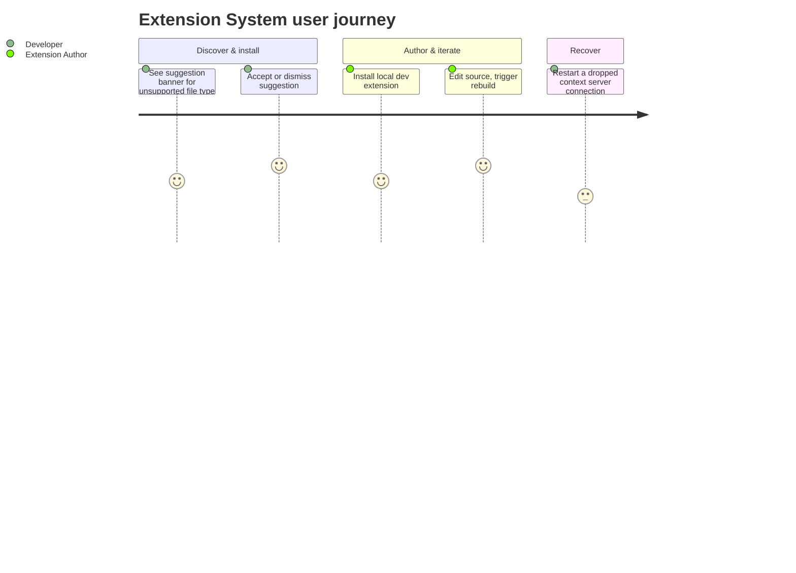

# Screens — F012_ExtensionSystem

> **Non-web adaptation note:** Zode is a native Rust/GPUI desktop application (`generic-source`
> profile). There is no `route-list.md`/`screen-list.md` upstream for this profile, so this file
> describes editor panels/pages and their in-app triggers instead of the standard web
> `SCR###`-coded screen table.

## Screen List

| Panel / Surface                      | Trigger                                                                                     | What User Sees                                                                                                           | What User Can Do                                                                                                                                                    |
| ------------------------------------ | ------------------------------------------------------------------------------------------- | ------------------------------------------------------------------------------------------------------------------------ | ------------------------------------------------------------------------------------------------------------------------------------------------------------------- |
| Extensions page                      | Command palette "zed: extensions", or clicking "Install Dev Extension" prompt flow          | A list of installed extensions (published and dev), a search box, and an empty-state/upsell view when none are installed | Search extensions, install a published extension, install a local dev extension (opens a directory picker), trigger a dev extension rebuild, uninstall an extension |
| Language-extension suggestion banner | Opening a file whose type has no active language support, matched against a known extension | An inline notification: "Do you want to install the recommended '{id}' extension for '{ext}' files?" with Yes/No actions | Accept (installs and activates the extension) or dismiss (banner never reappears for that file type again)                                                          |
| Context-server status view           | Opening a context server's status/detail panel                                              | The current connection state (starting, running, stopped, errored, needs authentication, authenticating)                 | Trigger "Restart" to tear down and re-establish the connection                                                                                                      |

## User Journey

1. User opens a file with an unsupported extension and sees the language-extension suggestion
   banner appear inline.
2. User accepts the suggestion — the matching extension installs and activates immediately, or user
   dismisses it and the banner never appears again for that file type.
3. Separately, user opens the Extensions page to browse installed extensions, or clicks "Install
   Dev Extension" to pick a local folder for testing.
4. After editing a dev extension's source, the user triggers a rebuild from the Extensions page and
   watches the running instance update in place.
5. If a connected context server's connection drops, the user opens its status view and triggers
   "Restart" until it shows connected again.

