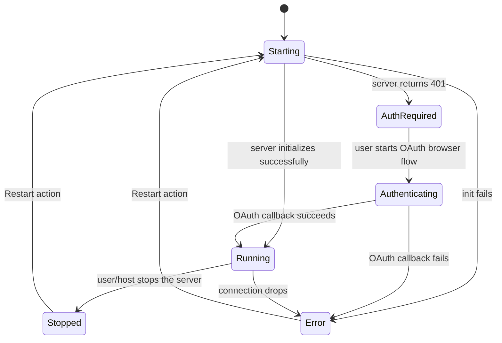

# F012_ExtensionSystem: Technical Spec
**Priority**: P0
**Type**: mixed
**Generated**: 2026-08-07

## Overview

The WASM extension platform: install, reload, and iterate on extensions (published or local dev),
connect to MCP context servers, and enforce a two-layer sandbox capability allowlist
(`ProcessExec` / `DownloadFile` / `NpmInstallPackage`) that fences what an extension's WASM guest
code can do on the host machine at runtime. Developers use it from the Extensions page and command
palette; extension authors use it by declaring capabilities in `extension.toml`.

## Polymorphic Behavior

### DISC-013 — ExtensionManifest.capabilities (per-entry `ExtensionCapability`)

| Value | Render | Validation | Persistence |
|-------|--------|------------|-------------|
| `ProcessExec(ProcessExecCapability { command, args })` | Extensions page lists the extension normally; no distinct UI per capability variant | `ProcessExecCapability::allows` — exact or `*` command match, then positional arg match where `*` = one wildcard arg and a trailing `**` = any remaining args (`crates/extension/src/capabilities/process_exec_capability.rs:15-43`) | No DB write; gates `WasmState::run_command` (`crates/extension_host/src/wasm_host/wit/since_v0_8_0.rs:870-889`) |
| `DownloadFile(DownloadFileCapability { host, path })` | No distinct UI | `DownloadFileCapability::allows` — exact or `*` host match, then positional path-segment match, `*`/`**` wildcards (`crates/extension/src/capabilities/download_file_capability.rs:13-46`) | No DB write; gates `WasmState::download_file` (`crates/extension_host/src/wasm_host/wit/since_v0_8_0.rs:1043-1051`) |
| `NpmInstallPackage(NpmInstallPackageCapability { package })` | No distinct UI | `NpmInstallPackageCapability::allows` — exact or `*` package name match (`crates/extension/src/capabilities/npm_install_package_capability.rs:11-13`) | No DB write; gates `WasmState::npm_install_package` (`crates/extension_host/src/wasm_host/wit/since_v0_8_0.rs:764-777`) |

**Source:** `crates/extension/src/capabilities.rs:11-20`

## Cross-Cutting Logic

### Requirements

| Code | Description | Endpoint/Handler | Verifiable |
|------|-------------|------------------|------------|
| FR-001 | Reload all installed WASM extensions from disk without an editor restart | `ReloadExtensions` action → `ExtensionStore::reload` | yes |
| FR-002 | Install a local directory as a dev extension, compiling it and symlinking it into the extensions dir | `InstallDevExtension` action → `ExtensionStore::install_dev_extension` | yes |
| FR-003 | Recompile a dev extension's Rust/WASM source on demand and hot-swap the running instance | `ExtensionStore::rebuild_dev_extension` | yes |
| FR-004 | Restart a stopped/errored MCP context server from its status UI | `context_server::Restart` action | yes |
| FR-005 | Accept an MCP client connection on the local per-session Unix socket and dispatch JSON-RPC notifications | `McpServer::serve_connection` | yes |
| FR-006 | Enforce a two-layer allowlist (manifest-declared capability AND host-granted capability) before permitting `process:exec`, `download_file`, or `npm:install` from WASM guest code | `CapabilityGranter::grant_exec` / `grant_download_file` / `grant_npm_install_package` | yes |

**Source:** `crates/extension_host/src/capability_granter.rs:23-83`

### Business Rules

#### BR-001_DualGateCapabilityCheck
**Linked FR:** FR-006
**Source:** `crates/extension_host/src/capability_granter.rs:23-47`
**Applies to:** `process:exec` WASM host call
**Rule:** `grant_exec` requires the desired command+args to match BOTH (a) an entry the extension declared in its own `extension.toml` manifest (`ExtensionManifest::allow_exec`, `crates/extension/src/extension_manifest.rs:168-187`) AND (b) an entry the local user has separately granted via `extension.granted_extension_capabilities` in settings (`crates/extension_host/src/extension_settings.rs:43-63`). Either gate failing rejects the call before the process spawns — a malicious/compromised extension cannot escalate beyond what it declared, and a declared-but-not-locally-granted capability still cannot execute.

**Pseudocode:**
```text
fn grant_exec(command, args):
    manifest.allow_exec(command, args)?          # gate 1: extension's own declaration
    granted_capabilities.any(|c| c.ProcessExec.allows(command, args))  # gate 2: user-granted
        or bail("not granted by the extension host")
```

#### BR-002_UndeclaredCapabilityRejectedBeforeSideEffect
**Linked FR:** FR-006
**Source:** `crates/extension_host/src/wasm_host/wit/since_v0_8_0.rs:870-889,1043-1051,764-777`
**Applies to:** `process:exec` / `download_file` / `npm:install` WASM host calls
**Rule:** Each of the three sandboxed host functions calls its `capability_granter.grant_*` check as the FIRST statement in the function body, before any external side effect (spawning a process, making an HTTP request, or running `npm install`) occurs. A failed grant returns an `Err` through `?` and no side effect is attempted.

**Pseudocode:**
```text
async fn run_command(command):
    capability_granter.grant_exec(command.command, command.args)?  # first line, no side effect yet
    new_command(command.command).args(...).output().await
```

#### BR-003_UninstallBeforeDevOverwrite
**Linked FR:** FR-002
**Source:** `crates/extension_host/src/extension_host.rs:929-1012`
**Applies to:** `install_dev_extension`
**Rule:** Installing a dev extension over an existing published extension of the same id uninstalls the published version first (only if `extension_index` shows a non-dev entry). If a symlink already exists at the install path for a dev-to-dev reinstall it is removed; if a REAL directory (not a symlink) is found at that path, installation aborts with an error rather than overwriting real installed content.

**Pseudocode:**
```text
if extensions[id] exists and not dev:
    uninstall_extension(id)
if outstanding_operations already has id: return  # coalesce concurrent installs
compile_extension(source_path, manifest, dev_options)
if output_path.metadata.is_symlink:
    remove_file(output_path)
elif output_path.exists:
    bail("extension {id} is still installed")
create_symlink(output_path, source_path)
reload(None)
```

### Decision Logic

N/A — no user-facing decision logic beyond DISC-013 Polymorphic Behavior. All three capability
classes are handled by uniform allow/deny plumbing (single boolean outcome: side effect proceeds
or an `Err` propagates to the WASM caller); there is no ≥2-predicate render branch, no
interaction-driven UI reveal, and no in-feature step/wizard routing in this feature's source
(`extension_host.rs`, `wasm_host.rs`, `capability_granter.rs`, `extensions_ui.rs`,
`extension_suggest.rs`, `context_server_store.rs`, `listener.rs`, `protocol.rs`).

### State Machines

#### SM-001_ContextServerLifecycle
**kind:** entity
**Linked FR:** FR-004
**Source:** `crates/project/src/context_server_store.rs:49-108`
**States:** Starting, Running, Stopped, Error, AuthRequired, Authenticating



**Transition rules:**
- `Error → Starting` / `Stopped → Starting`: guard = user or code triggers `context_server::Restart`; side effects = existing connection torn down, new connection re-established
- `Starting → AuthRequired`: guard = server responds 401; side effect = holds an `OAuthDiscovery` for the browser flow

### Algorithms

None. (No file-import/export, batch-transform, or scoring computation in this feature — capability
matching is a small allowlist predicate, not an algorithm in the ALG-### sense.)

### External Integrations

#### INT-001_McpUnixSocketListener
**Linked FR:** FR-005
**Source:** `crates/context_server/src/listener.rs:33-80`
**Type:** api-call
**Target:** local Unix domain socket (`{tempdir}/mcp.sock`) created per editor session
**Trigger:** `McpServer::new` binds the listener at extension-host startup; each accepted connection spawns `serve_connection`
**Payload:** JSON-RPC 2.0 requests/notifications (`CallTool`, `ListTools`, and free-form notification methods)
**Failure handling:** connection loop `while let Ok((stream, _)) = listener.accept().await` — a single connection error simply ends that connection's task; the listener loop continues accepting new connections. No retry/DLQ (this is a local IPC listener, not a network client).

**Pseudocode:**
```text
McpServer::new():
    bind UnixListener at temp socket path
    spawn loop:
        while accept() succeeds:
            spawn serve_connection(stream)  # detached background task (BL148)
```

#### INT-002_McpNotificationDispatch
**Linked FR:** FR-005
**Source:** `crates/context_server/src/protocol.rs:118-124` (module docs), `on_notification` registration
**Type:** event-publish
**Target:** in-process callback table keyed by MCP notification method name
**Trigger:** an unsolicited JSON-RPC notification arrives on the underlying `Client` transport after `initialize` handshake completes
**Payload:** notification method name + raw JSON params (e.g. progress/log messages)
**Failure handling:** no matching registered callback → notification is silently dropped (observer pattern, not a queue — no DLQ)

**Pseudocode:**
```text
on_notification(method, callback):
    handlers[method] = callback
# inner Client transport invokes handlers[method](params) when a notification with that method arrives
```

### Verification

- **SC-001** — a `process:exec`/`download_file`/`npm:install` call with no matching manifest-declared AND host-granted capability entry errors before any side effect and does not crash the host (covers FR-006, BR-001, BR-002)
- **SC-002** — triggering "Reload Extensions" leaves every previously-loaded extension either running the latest disk version or reporting an isolated error, without crashing the extension host process (covers FR-001)

---

**Client behavior:** see
[`behavior-logic.md`](../../generated/behavior-logic.md) (client-side patterns — debounce, optimistic UI, polling, upload, realtime),
[`permissions.md`](../../system/permissions.md) (feature flags / experiments / env / locale gates),
[`screen-flow.md`](../../generated/screen-flow.md) (guards / deep-link state restoration / unsaved-changes protection).

## User Stories

### US025_ReloadExtensions — Reload all extensions (Priority: P2 - should)

**What happens:** A developer runs "Reload Extensions" from the command palette; the extension host tears down and re-initializes every loaded WASM extension instance so a newly installed or updated extension takes effect without an editor restart.
**Why this priority:** Convenience/iteration-speed feature for extension development — not required for the platform to function, but materially speeds up the author-a-dev-extension loop, hence `should` not `must`.
**Independent Test:** Modify an installed extension's files on disk, trigger `ReloadExtensions`, and observe the new version active without restarting the app.

**Acceptance Scenarios:**

1. **Given** an extension was just updated on disk, **When** the developer triggers "Reload Extensions", **Then** the new extension version is loaded and active.

**Requirements fulfilled:**
- **FR-001** Reload all installed WASM extensions — `ReloadExtensions` action via `ExtensionStore::reload`
  **Source:** `crates/extension_host/src/extension_host.rs:188-223,403-418`

**Verification:**
- **SC-002** (covers FR-001)

---

### US026_InstallDevExtension — Install a local dev extension (Priority: P2 - should)

**What happens:** A developer selects a local directory containing `extension.toml` via "Install Dev Extension"; the directory is compiled and symlinked into the extensions directory, then loaded and marked as a dev extension distinct from published ones.
**Why this priority:** Needed for local extension authoring/testing but not a `must` for the base editor experience.
**Independent Test:** Point "Install Dev Extension" at a directory with a valid `extension.toml` and confirm it appears active and dev-flagged on the Extensions page.

**Acceptance Scenarios:**

1. **Given** a valid local extension directory with `extension.toml` exists, **When** the developer selects it via "Install Dev Extension", **Then** the extension loads and is marked as a dev extension.

**Requirements fulfilled:**
- **FR-002** Install a local dev extension directory — `InstallDevExtension` action via `ExtensionStore::install_dev_extension`
  **Source:** `crates/extensions_ui/src/extensions_ui.rs:44-49,111-140`; `crates/extension_host/src/extension_host.rs:929-1028`

**Rules enforced:**

### BR-003 (see Cross-Cutting Logic) — applies directly to this story's install path

**Verification:**
- **SC-003** installing a dev extension over a real (non-symlinked) existing install directory is rejected with an error rather than silently overwritten (covers FR-002, BR-003)

---

### US027_CompileDevExtension — Compile a dev extension (Priority: P2 - should)

**What happens:** A developer triggers a rebuild of a locally-installed dev extension; its Rust/WASM source is recompiled and the running instance is hot-swapped to the new build, without requiring a manual reinstall.
**Why this priority:** Iteration-speed feature for extension authors, `should` not `must` — the extension still functions without it (a manual reinstall is a viable, if slower, fallback).
**Independent Test:** Edit a dev extension's source since its last build, trigger rebuild, and confirm the running instance reflects the new code.

**Acceptance Scenarios:**

1. **Given** dev extension source was edited since last build, **When** the developer triggers rebuild, **Then** the extension recompiles and the running instance reflects the new code.

**Requirements fulfilled:**
- **FR-003** Recompile and hot-swap a dev extension — `ExtensionStore::rebuild_dev_extension`
  **Source:** `crates/extension_host/src/extension_host.rs:1030-1064`

**Verification:**
- **SC-004** a compile error during rebuild is surfaced (via `detach_and_log_err`) rather than silently keeping the stale build loaded, and the in-flight `outstanding_operations` marker is always cleared regardless of success/failure (covers FR-003)

---

### US028_RestartContextServer — Restart a context/MCP server (Priority: P2 - should)

**What happens:** A developer triggers "Restart" from a context server's status UI after it has crashed or its configuration changed; the existing connection is torn down and re-established, and the status UI reflects the new connection state.
**Why this priority:** Recovery convenience for a server that already failed — the broader context-server connection flow (US029) is the `must`-adjacent system path; a manual restart trigger is `should`.
**Independent Test:** With a context server whose connection has dropped, trigger restart from the status UI and observe it reconnect.

**Acceptance Scenarios:**

1. **Given** a context server's connection has dropped, **When** the developer triggers restart from the status UI, **Then** the connection re-establishes and the status UI shows it connected.

**Requirements fulfilled:**
- **FR-004** Restart a stopped/errored context server — `context_server::Restart` action
  **Source:** `crates/project/src/context_server_store.rs:40-46`

**State transitions:** SM-001 (see Cross-Cutting Logic) — `Error → Starting` / `Stopped → Starting` on `Restart`

**Verification:**
- **SC-005** after Restart, the server's `ContextServerStatus` reflects `Starting` then converges to `Running` or `Error` (covers FR-004, SM-001)

---

### US029_ConnectToContextServerOverMcp — Connect to a context server over MCP (Priority: P2 - should)

**What happens:** An external MCP client connects to Zode's local per-session Unix socket; the listener accepts the connection and begins dispatching incoming JSON-RPC notifications to registered subscribers.
**Why this priority:** Enables external MCP tooling integration; valuable but not core-editor-critical, hence `should`.
**Independent Test:** With the context-server listener active, connect an MCP client to its Unix socket and confirm the connection is accepted and notifications dispatch.

**Acceptance Scenarios:**

1. **Given** the context-server listener is active, **When** an MCP client connects to its Unix socket, **Then** the connection is accepted and notifications begin dispatching.

**Requirements fulfilled:**
- **FR-005** Accept MCP client connections and dispatch notifications — `McpServer::serve_connection`
  **Source:** `crates/context_server/src/listener.rs:33-80`
- (secondary) notification dispatch — `InitializedContextServerProtocol::on_notification`
  **Source:** `crates/context_server/src/protocol.rs:118-124`

**Verification:**
- **SC-006** a connection accept failure ends only that connection's task; the listener continues accepting subsequent connections (covers FR-005, INT-001)

---

### US030_DeclareProcessExecCapability — Declare a process-exec capability (Priority: P1 - must)

**What happens:** An extension author lists a `ProcessExec` capability with a command+args match rule in `extension.toml`; at runtime, a spawn request matching that rule is permitted.
**Why this priority:** `must` — this is the foundational sandbox mechanism; without it there is no way for any extension to run an external process at all, which blocks core extension functionality (e.g. language server installers that shell out).
**Independent Test:** Declare `ProcessExec` for `git` with wildcard args in the manifest, call `allow_exec("git", ["status"])`, and confirm the call is permitted.

**Acceptance Scenarios:**

1. **Given** the manifest declares `ProcessExec` for `git` with wildcard args, **When** the extension calls `allow_exec("git", ["status"])`, **Then** the call is permitted and the process spawns.

**Requirements fulfilled:**
- **FR-006** Enforce dual-layer capability check — `CapabilityGranter::grant_exec` / `ExtensionManifest::allow_exec`
  **Source:** `crates/extension/src/extension_manifest.rs:168-187`; `crates/extension_host/src/capability_granter.rs:23-47`

**Rules enforced:** BR-001 (see Cross-Cutting Logic), BR-002 (see Cross-Cutting Logic)

**Verification:**
- **SC-001** (see Cross-Cutting Logic, covers FR-006, BR-001, BR-002)

---

### US031_DeclareDownloadFileCapability — Declare a download-file capability (Priority: P2 - should)

**What happens:** An extension author declares a `DownloadFile` capability for a specific host in `extension.toml`; a runtime fetch request to a matching host is permitted, and a request to any other host is rejected before the fetch is attempted.
**Why this priority:** Important sandbox coverage but narrower blast radius than process execution — `should`, not `must`.
**Independent Test:** Declare `DownloadFile` for `github.com`, request a download from `github.com`, and confirm the fetch proceeds.

**Acceptance Scenarios:**

1. **Given** the manifest declares `DownloadFile` for `github.com`, **When** the extension requests a download from `github.com`, **Then** the fetch proceeds.

**Requirements fulfilled:**
- **FR-006** (see US030) — via `DownloadFileCapability::allows` / `CapabilityGranter::grant_download_file`
  **Source:** `crates/extension/src/capabilities/download_file_capability.rs:13-46`; `crates/extension_host/src/capability_granter.rs:49-65`

**Rules enforced:** BR-001 (see Cross-Cutting Logic) — applies here as the DownloadFile variant of the dual gate; BR-002 (see Cross-Cutting Logic)

**Verification:**
- **SC-001** (see Cross-Cutting Logic, covers FR-006, BR-001, BR-002)

---

### US032_DeclareNpmInstallCapability — Declare an npm-install capability (Priority: P2 - should)

**What happens:** An extension author declares an `NpmInstallPackage` capability for a specific package in `extension.toml`; a runtime request to install that package is permitted, and a request for any other package is rejected before install is attempted.
**Why this priority:** Same class of sandbox coverage as US031 — `should`, not `must`.
**Independent Test:** Declare `NpmInstallPackage` for `pyright`, request installing `pyright`, and confirm the install proceeds.

**Acceptance Scenarios:**

1. **Given** the manifest declares `NpmInstallPackage` for `pyright`, **When** the extension requests installing `pyright`, **Then** the install proceeds.

**Requirements fulfilled:**
- **FR-006** (see US030) — via `NpmInstallPackageCapability::allows` / `CapabilityGranter::grant_npm_install_package`
  **Source:** `crates/extension/src/capabilities/npm_install_package_capability.rs:9-13`; `crates/extension_host/src/capability_granter.rs:67-83`

**Rules enforced:** BR-001 (see Cross-Cutting Logic), BR-002 (see Cross-Cutting Logic)

**Verification:**
- **SC-001** (see Cross-Cutting Logic, covers FR-006, BR-001, BR-002)

---

### US033_RejectUndeclaredExtensionCapability — Reject an undeclared capability request (Priority: P1 - must)

**What happens:** When a `ProcessExec`/`DownloadFile`/`NpmInstallPackage` request has no matching declared+granted capability entry, the request errors out before the underlying operation runs, and the denial surfaces as an error result to the WASM call site rather than crashing the host process.
**Why this priority:** `must` — this is the negative-path enforcement that makes the whole sandbox meaningful; without a guaranteed deny-by-default, the allowlist in US030-032 is unenforceable.
**Independent Test:** With no `ProcessExec` capability declared, call `allow_exec("curl", [...])` and confirm the call errors before any process spawns.

**Acceptance Scenarios:**

1. **Given** the manifest declares no `ProcessExec` capability, **When** the extension calls `allow_exec("curl", [...])`, **Then** the call errors before any process is spawned.

**Requirements fulfilled:**
- **FR-006** (see US030) — deny path of `CapabilityGranter::grant_exec`/`grant_download_file`/`grant_npm_install_package`
  **Source:** `crates/extension_host/src/capability_granter.rs:23-83`

**Rules enforced:** BR-001 (see Cross-Cutting Logic), BR-002 (see Cross-Cutting Logic)

**Verification:**
- **SC-001** (see Cross-Cutting Logic, covers FR-006, BR-001, BR-002)

---

### Edge Cases

| Scenario | Behavior |
|----------|----------|
| Extension calls `run_command`/`download_file`/`npm_install_package` for a target with no matching manifest-declared capability | `bail!` error returned through `wasmtime::Result`/`anyhow` before any process spawn, HTTP fetch, or npm install begins; the WASM caller receives an `Err`, host process does not crash |
| Extension calls a target that IS declared in `extension.toml` but NOT also granted in local user settings (`granted_extension_capabilities`) | Rejected — `grant_exec`/`grant_download_file`/`grant_npm_install_package` require both gates; manifest declaration alone is insufficient |
| "Install Dev Extension" targets a directory whose install path already holds a real (non-symlink) directory | `bail!("extension {id} is still installed")` — install aborts rather than overwriting |
| Extension fails to reload during "Reload Extensions" | That extension's reload error is reported without crashing the extension host process or blocking reload of the other extensions |
| MCP Unix-socket `listener.accept()` errors on a given connection attempt | Only that iteration's connection is skipped/ends; the outer accept loop continues serving future connections |

## Key Entities

| Entity | Table | Key Columns | Purpose |
|--------|-------|-------------|---------|
| ExtensionManifest | (in-memory, parsed from `extension.toml`; not a DB table) | id, capabilities, lib, language_servers, context_servers | The author-declared contract this feature validates every sandboxed call against |
| ExtensionSettings | (settings.json, not a DB table) | granted_capabilities, auto_install_extensions, auto_update_extensions | The host/user-side grant list — the second gate in the dual-check |
| ContextServerStatus / ContextServerState | (in-memory `ContextServerStore`, not persisted) | status (Starting/Running/Stopped/Error/AuthRequired/Authenticating) | Tracks a context server's connection lifecycle for the status UI and Restart action |
| KeyValueStore (`kv_store` table) | `kv_store` | key, value | Persists the "dismissed" marker for a language-extension suggestion banner so it is not re-shown |

## Artifact References

| Artifact | File | Codes Used | Reviewed |
|----------|------|------------|----------|
| System Overview | [system-overview.md](../../system-overview.md) | — | [x] |
| Feature List | [feature-list.md](../../generated/feature-list.md) | F012_ExtensionSystem | [x] |
| Entities | [entities.md](../../generated/entities.md) | MODEL018_ExtensionManifest | [x] |
| Behavior Logic | [behavior-logic.md](../../generated/behavior-logic.md) | BL017, BL018, BL054, BL125, BL148, BL157, BL158 | [x] |
| Permissions Matrix | [permissions-matrix.md](../../generated/permissions-matrix.md) | PERM001, PERM002, PERM003 | [x] |
| User Stories | [user-stories.md](../../generated/user-stories.md) | US025, US026, US027, US028, US029, US030, US031, US032, US033 | [x] |
| Screens | [screens.md](../screens.md) | N/A — non-web adaptation, no SCR### codes generated for this profile | [x] |

**Rule:** Every code listed in Codes Used MUST exist in its source artifact. This profile (`generic-source`, non-web Rust desktop app) has no `route-list.md`/`api-map.md`/`screen-list.md` upstream artifacts, so the API Map and Screens rows from the standard template are omitted/adapted per the session context's "no route-list/screen-list for this profile" instruction.

## Assumptions

- `granted_extension_capabilities` in user settings is assumed to be authored/maintained by the user (or a settings profile) directly — no in-app UI was found in the scanned crates for granting/revoking capabilities interactively; it is treated as a settings.json-only surface.
- The MCP Unix socket's temp directory (`zed-mcp` prefix) is assumed to be per-editor-session — no code path was found that persists or reuses a socket path across restarts.
- `SUPPRESSED_EXTENSIONS` (referenced in `extensions_updated`) is assumed to be a fixed denylist of extension ids the host refuses to load, though its full definition was not read as part of this pass (out of scope — no capability implications found).

## Source Code References

| Order | Symbol | Path | Purpose |
|-------|--------|------|---------|
| 1 | `ExtensionManifest` | `crates/extension/src/extension_manifest.rs:168-194` | Manifest schema + `allow_exec` (gate 1) + `allow_remote_load` |
| 2 | `ExtensionCapability` (+ 3 capability structs) | `crates/extension/src/capabilities.rs:11-20`, `crates/extension/src/capabilities/{process_exec_capability.rs:1-44,download_file_capability.rs:1-47,npm_install_package_capability.rs:1-14}` | The DISC-013 enum and its per-variant `allows` predicates |
| 3 | `CapabilityGranter` | `crates/extension_host/src/capability_granter.rs:7-84` | Dual-gate enforcement point (manifest + host-granted) called from WASM host functions |
| 4 | `ExtensionSettings` | `crates/extension_host/src/extension_settings.rs:8-65` | Deserializes the user-side `granted_extension_capabilities` (gate 2 source) |
| 5 | `WasmState` host functions | `crates/extension_host/src/wasm_host/wit/since_v0_8_0.rs:764-777,870-889,1043-1051` | The 3 sandboxed WASM host calls that invoke the capability gate before their side effect |
| 6 | `ExtensionStore` | `crates/extension_host/src/extension_host.rs:110-223,403-418,929-1064` | `reload`, `install_dev_extension`, `rebuild_dev_extension` |
| 7 | `ExtensionsPage` | `crates/extensions_ui/src/extensions_ui.rs:44-140,313,611-1732` | Extensions page UI + `InstallDevExtension` action registration |
| 8 | `extension_suggest::suggest` | `crates/extensions_ui/src/extension_suggest.rs:137-207` | Language-extension suggestion banner (install/dismiss) |
| 9 | `ContextServerStore` | `crates/project/src/context_server_store.rs:40-108` | `Restart` action + `ContextServerStatus`/`ContextServerState` (SM-001) |
| 10 | `McpServer` | `crates/context_server/src/listener.rs:33-80` | Unix-socket MCP listener + per-connection dispatch |

## Unresolved Questions

1. **Interactive capability-granting UI**: no UI surface was found for a user to grant/revoke `granted_extension_capabilities` from inside the app (unlike, say, the worktree-trust prompt in PERM005) — it appears to be settings.json-only. Confirm whether this is intentional or a gap versus upstream Zed.
2. **`Restart` action dispatch site**: the `context_server::Restart` action is declared (`crates/project/src/context_server_store.rs:40-46`) but this pass did not locate the `on_action`/`register_action` call site wiring it to the context-server status UI button referenced in US028's acceptance criteria — likely lives in a `context_server_ui` or `agent_ui` crate not scanned in this pass.
3. **`SUPPRESSED_EXTENSIONS` contents**: referenced in `extensions_updated` (`crates/extension_host/src/extension_host.rs` near line 1082) but its definition/rationale was not read; unclear if any of the 3 sandbox capability classes interact with suppression.

## Source Walkthrough

1. **File:** `crates/extension/src/capabilities.rs:11-20` — start here: defines the `ExtensionCapability` enum (DISC-013) that every other file in this feature branches on.
2. **File:** `crates/extension/src/extension_manifest.rs:168-194` — next: `ExtensionManifest::allow_exec` is gate 1 of the dual capability check, and the manifest struct is what `extension.toml` deserializes into.
3. **File:** `crates/extension_host/src/capability_granter.rs:1-84` — next: `CapabilityGranter` is the single enforcement point combining gate 1 (manifest) with gate 2 (host-granted settings) for all three capability classes.
4. **File:** `crates/extension_host/src/wasm_host/wit/since_v0_8_0.rs:764-1051` — last: the actual WASM host functions (`npm_install_package`, `run_command`, `download_file`) that call the granter before performing their side effect.

### Call Hierarchy

```text
WASM guest (extension code)
  -> zed::process::run_command / zed::http_client::download_file / zed::node::npm_install_package
       (crates/extension_host/src/wasm_host/wit/since_v0_8_0.rs)
  -> WasmState.capability_granter.grant_exec / grant_download_file / grant_npm_install_package
       (crates/extension_host/src/capability_granter.rs)
       -> ExtensionManifest::allow_exec (gate 1, manifest-declared)
       -> granted_capabilities.iter().any(...) (gate 2, host/user-granted)
  -> [only if both gates pass] std::process::Command / http_client::get / node_runtime::npm_install_packages
```

**Related files:** see `## Source Code References` above — the **Order** column on that table
IS this section's related-files table, re-cast with the reading sequence.

## DB Impact per Event

| Event/Endpoint | Table | Columns | Operation | Value Derivation | Source |
|----------------|-------|---------|-----------|-------------------|--------|
| Dismiss language-extension suggestion banner ("No, don't install it") | `kv_store` | key, value | INSERT/UPDATE (upsert) | key = `"{extension_id}_extension_suggest"`, value = literal `"dismissed"` | `crates/extensions_ui/src/extension_suggest.rs:196-203`; `crates/db/src/kvp.rs:72-78` |

All other feature events (reload, install dev extension, rebuild dev extension, context-server
restart, MCP connection dispatch, capability grant/deny) write only to the filesystem (extension
symlinks/compiled WASM in the extensions dir) or hold state purely in memory (`ContextServerStore`,
`ExtensionStore::extension_index`) — no other SQLite/DB writes were found in the scanned source.
