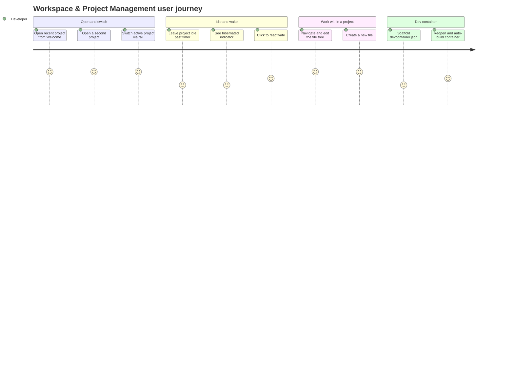

<!-- layout-exempt: rebuild-spec owns all docs/system|features|generated|flows paths -->

# Screens — F013_WorkspaceAndProjectManagement

## Screen List

N/A — `generic-source` profile, no screen-list/route surface for this native desktop app. This feature has no single "screen"; it is the window-level chrome (rail, panels, modals) that every other feature's screens render inside. The functional surface analogue is described below.

### Workspace & Project Surfaces (non-route adaptation)

| Surface | What User Sees | What User Can Do |
|---------|----------------|-------------------|
| Welcome screen | Recent-projects list (`WelcomePage`, `crates/workspace/src/welcome.rs`) shown when no folder is open, or as a fallback tab | Click a recent entry to reopen that project; dismiss to a blank workspace |
| Project rail (always-visible sidebar) | A narrow, always-visible column of project squares (initials/icon), one per open project, with a muted clock icon on hibernated entries and a warning icon while re-indexing; below them, a fixed block of left-dock panel icons acting as the VS Code-style activity bar (`crates/sidebar/src/rail.rs`, `rail_panels.rs`, `project_item.rs`) | Click a project to switch to it; use `NextProject`/`PreviousProject` to cycle; click a panel icon to bring that panel forward, or click the active one to hide the dock; toggle the wider sidebar panel open/closed |
| Sidebar panel (expanded) | The same project list with full names/paths and a filter input, plus per-project context menu | Filter/search open projects; access per-project actions (e.g. move to new window) via the ellipsis menu |
| Project panel (file tree) | The active project's worktree(s) as an indented, collapsible file/folder tree with diagnostic badges (dimmed when stale from a hibernated project) | Navigate with the keyboard, expand/collapse folders, create/rename/delete files, open a file into the active pane |
| Recent Projects picker (command-palette modal) | A searchable list of recently-opened projects/folders and open git worktrees | Search, select, and confirm to open in the current or a new window |
| Worktree picker (git worktrees) | A list of git worktrees attached to the current repository | Select a worktree; trigger "Delete Worktree" to detach it (without deleting the folder) |
| Dev Container modal | A wizard picking a base template and optional features for a new `.devcontainer/devcontainer.json` | Search templates/features, confirm to scaffold the config file into the project |
| Security/trust modal | A prompt asking whether to trust a newly-opened folder/file (or its parent) before tooling runs against it | Grant trust at file, folder, or transitive-parent scope, or opt out globally |
| Tab switcher (quick-switcher modal) | An overlay listing open tabs in most-recently-used order while a modifier key is held | Cycle with repeated taps of the trigger key; release the modifier to confirm the highlighted tab |

## User Journey

1. Developer launches Zode and lands on the Welcome screen, seeing a list of recently-opened projects.
2. Developer clicks a recent project entry; a workspace opens showing that project's file tree in the Project panel and a new entry appears in the Project rail.
3. Developer opens a second project; the Project rail now shows two entries, and the developer switches between them by clicking, or by cycling with a keyboard shortcut.
4. Developer leaves the second project idle; after its idle timer elapses, its rail entry shows a small hibernated indicator.
5. Developer clicks the hibernated entry; it becomes active again and the Project panel/editor for that project responds normally within moments.
6. Developer opens the Project panel, navigates to a folder, and creates a new file, which opens immediately for naming.
7. Developer opens the Dev Container modal, picks a template, and confirms; on next open, the project's containerized environment builds and starts automatically.

