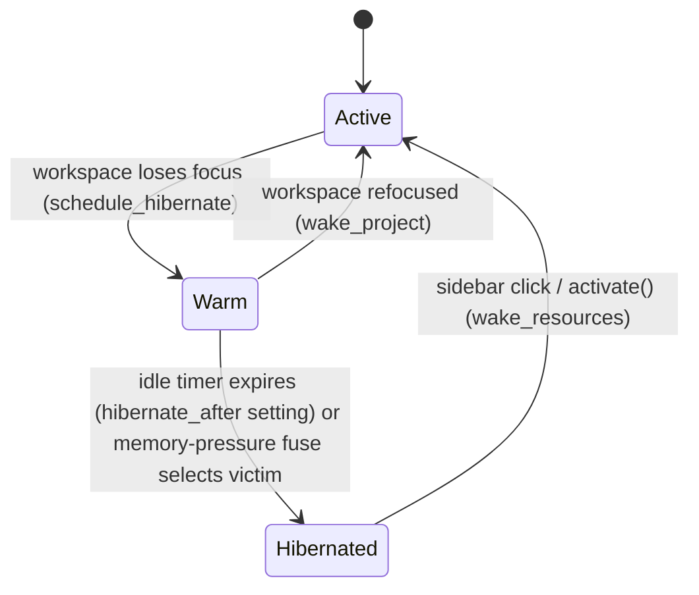
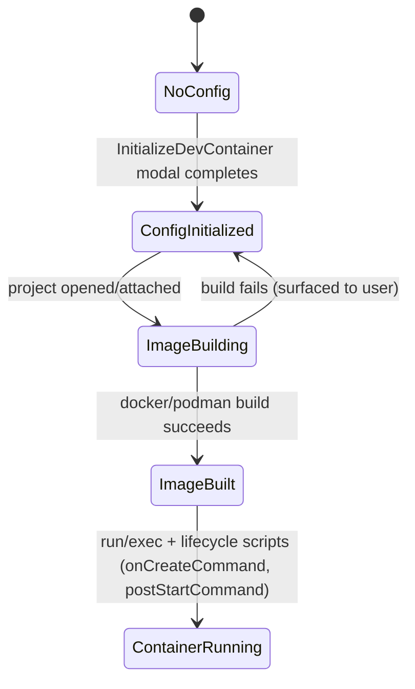

<!-- layout-exempt: rebuild-spec owns all docs/system|features|generated|flows paths -->

# F013_WorkspaceAndProjectManagement: Technical Spec

**Priority**: P0
**Type**: mixed
**Generated**: 2026-08-07

## Overview

Opening/navigating projects and their worktrees, the project-panel file tree, the always-visible multi-project sidebar rail (this fork's signature feature), the fork-specific idle-hibernation lifecycle for background projects, dev-container bootstrap, the worktree-trust security gate, and window-level tab/pane navigation. Driven by `MultiWorkspace` (one per OS window, `crates/workspace/src/multi_workspace.rs:317`), which owns N `Workspace`/`Project` pairs and decides which is `Active` at any moment; the always-visible `Sidebar` rail (`crates/sidebar`) is the primary UI for switching between them. Triggered by welcome-screen clicks, sidebar clicks, keybindings (`NextProject`/`PreviousProject`/`ToggleWorkspaceSidebar`), idle timers, and (for dev containers) opening a project that carries a `.devcontainer` config.

## Polymorphic Behavior

### DISC-001 — Workspace (call-param `OpenMode`)

| Value     | Render                                                                                                                                                                                              | Validation                                                                   | Persistence                                                                                 |
| --------- | --------------------------------------------------------------------------------------------------------------------------------------------------------------------------------------------------- | ---------------------------------------------------------------------------- | ------------------------------------------------------------------------------------------- |
| NewWindow | A brand-new OS window is created to host the workspace                                                                                                                                              | No pre-existing `MultiWorkspace` required                                    | New window/workspace DB rows created on first serialize                                     |
| Add       | Workspace is attached to an existing window's `MultiWorkspace` (covers both deserialization-restore on relaunch and a live add-or-activate call, e.g. opening a second project from the Files menu) | Existing `MultiWorkspace` container must be resolvable for the target window | Adds to `project_groups`/`retained_workspaces`; existing window's DB session record updated |

**Source:** `crates/workspace/src/workspace.rs:1422`

### DISC-003 — Project.activity

| Value      | Render                                                                                                                                                                                                                                                                              | Validation                                                                                                                                                                                                                                                       | Persistence                                                                                                                                                                                                                                                                                                                                                                                                                                                                                                                    |
| ---------- | ----------------------------------------------------------------------------------------------------------------------------------------------------------------------------------------------------------------------------------------------------------------------------------- | ---------------------------------------------------------------------------------------------------------------------------------------------------------------------------------------------------------------------------------------------------------------- | ------------------------------------------------------------------------------------------------------------------------------------------------------------------------------------------------------------------------------------------------------------------------------------------------------------------------------------------------------------------------------------------------------------------------------------------------------------------------------------------------------------------------------ |
| Active     | Sidebar row shown at full opacity, no badge; this project's workspace is the one visibly rendered                                                                                                                                                                                   | Never a hibernation candidate — `Project::set_activity` blocks any `Active -> Hibernated` edge outright (`crates/project/src/project.rs:4754-4760`)                                                                                                              | No special persistence; ordinary session state                                                                                                                                                                                                                                                                                                                                                                                                                                                                                 |
| Warm       | Sidebar row unchanged visually (label muted only if not selected); resource layer still fully live                                                                                                                                                                                  | Runs on the idle timer scheduled by `MultiWorkspace::schedule_hibernate` (`crates/workspace/src/multi_workspace.rs:1692-1737`); reverts to `Active` if refocused before the timer fires                                                                          | `warm_since` bookkeeping entry recorded in-memory for the memory-pressure fuse (see ALG-001); nothing written to DB                                                                                                                                                                                                                                                                                                                                                                                                            |
| Hibernated | Sidebar row shows a muted clock icon with tooltip "Hibernated — will wake when opened" (`crates/sidebar/src/project_item.rs:70-81`); re-indexing (a warning icon) takes rendering priority over the hibernated icon once waking begins (`crates/sidebar/src/project_item.rs:52-68`) | `try_hibernate_resources` (`crates/project/src/project.rs:4838-4879`) only actually runs if no active debug session and no autosave-racing dirty buffer — otherwise deferred and retried (`schedule_hibernate_retry`, `crates/project/src/project.rs:4926-4938`) | `Workspace`/`Project` entities and their on-disk session record persist through hibernation (`MultiWorkspaceState` — see DB Impact); **caveat**: this label is a lifecycle _intent_, not a real-time resource-state oracle — `set_activity` flips the label and emits `Event::ActivityChanged` synchronously, but `LspStore::hibernate` (`crates/project/src/lsp_store.rs:11612`) returns a detached background `Task`, so the underlying LSP/Prettier teardown can still be in flight after the UI already shows `Hibernated` |

**Source:** `crates/project/src/project.rs:342-357` (enum), `:4740-4768` (`set_activity`), `:4788-4807` (`reconcile_resource_activity`)

## Cross-Cutting Logic

### Requirements

| Code   | Description                                                                                                                                                                      | Endpoint/Handler                                                       | Verifiable |
| ------ | -------------------------------------------------------------------------------------------------------------------------------------------------------------------------------- | ---------------------------------------------------------------------- | ---------- |
| FR-001 | Register `ToggleWorkspaceSidebar`/`CloseWorkspaceSidebar`/`FocusWorkspaceSidebar`/`NextProject`/`PreviousProject`/`MoveProjectToNewWindow`/`DumpProjectResourceStats` action set | N/A (desktop keybinding, no HTTP) via `MultiWorkspace` action handlers | yes        |
| FR-002 | Idle-hibernation lifecycle: transition an unfocused project `Active -> Warm -> Hibernated` on a configurable timer, and back to `Active` on refocus                              | `MultiWorkspace::activate`/`schedule_hibernate`/`wake_project`         | yes        |
| FR-003 | Memory-pressure fuse: proactively hibernate one eligible `Warm` project every 30s poll when system memory is under threshold, independent of the per-project idle timer          | `MultiWorkspace` background poll loop                                  | yes        |

**Source:** `crates/workspace/src/multi_workspace.rs:37-55` (actions!), `:1692-1737` (`schedule_hibernate`), `:283-310` (fuse constants)

### Business Rules

_(See itemized entries below.)_

### BR-001_ActiveProjectNeverHibernatedDirectly

**Linked FR:** FR-002
**Source:** `crates/project/src/project.rs:4740-4768`
**Applies to:** `Project::set_activity`
**Rule:** `Active -> Hibernated` is a structurally-blocked edge — an `Active` project (its workspace currently focused) is never hibernated directly, not even by the memory-pressure fuse. The only path to `Hibernated` is `Active -> Warm -> Hibernated`. The mirror edge `Hibernated -> Warm` is also blocked; the only way out of `Hibernated` is back to `Active` via `MultiWorkspace::activate`.

**Pseudocode:**

```text
fn set_activity(current, requested):
    if (current, requested) in [(Active, Hibernated), (Hibernated, Warm)]:
        return  # no-op, blocked edge
    if current != requested:
        emit ActivityChanged(requested)
        reconcile_resource_activity(current, requested)
```

### BR-002_HibernationDeferredByActiveDebugSessionOrRacingAutosave

**Linked FR:** FR-002
**Source:** `crates/project/src/project.rs:4838-4919`
**Applies to:** `Project::try_hibernate_resources`
**Rule:** A project with a running (non-terminated) debug session is never hibernated — the LSP even stays up. A project with a dirty buffer under a _live_ autosave setting (anything other than `Off`, resolved per-buffer's own `SettingsLocation`) is also deferred, since stopping the LSP mid-format-on-save would silently drop the format. Both cases retry on a fixed interval (`schedule_hibernate_retry`) rather than abandoning the transition, so `activity() == Hibernated` never permanently diverges from actual resource state once the blocker clears.

**Pseudocode:**

```text
fn try_hibernate_resources():
    if has_active_debug_session(): schedule_retry(); return
    if autosave_would_race_hibernate(): schedule_retry(); return
    lsp_store.hibernate()          # detached async task
    prettier_store.hibernate()
    pause_scanning(all_worktrees)
    if background_scroll_history_lines set: shrink_terminal_scrollback()
```

### BR-003_WakeDistinguishesRealHibernateFromMereDefocus

**Linked FR:** FR-002
**Source:** `crates/project/src/project.rs:4770-4807`
**Applies to:** `Project::reconcile_resource_activity`
**Rule:** `wake_resources` only runs on `Hibernated -> Active` (a real wake — servers were actually stopped). A bounce between two retained `Warm` projects (`Warm -> Active`) never calls `wake_resources`, because nothing was ever torn down for a merely-defocused-but-still-Warm project. Matching on the previous label, not just the new one, is what prevents stopping-and-restarting every language server on every ordinary project switch.

**Pseudocode:**

```text
fn reconcile_resource_activity(previous, new):
    match new:
        Hibernated -> try_hibernate_resources()
        Active if previous == Hibernated -> wake_resources()
        _ -> hibernate_retry = None   # Warm->Active or ->Warm: nothing to undo
```

### BR-004_WorktreeTrustGatesToolingSpawn

**Linked FR:** N/A (system-level, cross-referenced)
**Source:** `crates/project/src/trusted_worktrees.rs:452` (`TrustedWorktreesStore::can_trust`), consumed at `crates/project/src/lsp_store.rs:449`, `crates/project/src/git_store.rs:1595`
**Applies to:** Any worktree opened in a `Project`
**Rule:** A worktree only gets a language server (and certain git operations) once it is both trusted (via `SecurityModal`, PERM005_WorktreeTrustGate) and actually needed (a buffer opened in a detected language). Trust is hierarchical (file < directory < parent-directory-transitive) and persists across restarts once granted.

### BR-005_DevContainerConfigValidatedBeforeBuild

**Linked FR:** N/A
**Source:** `crates/dev_container/src/devcontainer_json.rs:269-303` (`build_type`, `validate_devcontainer_contents`)
**Applies to:** `InitializeDevContainer` modal output, and any existing `.devcontainer/devcontainer.json` read on project open
**Rule:** For a Dockerfile-backed config, `workspaceMount` and `workspaceFolder` must both be set or both be absent — one without the other fails validation. For a Docker-Compose-backed config, a connecting `service` must be specified. An `Image`-backed config has no additional constraint.

**Pseudocode:**

```text
fn validate_devcontainer_contents():
    match build_type():
        Image(_) => Ok
        Dockerfile(_) =>
            if workspace_folder.is_some() != workspace_mount.is_some():
                Err("workspaceMount and workspaceFolder must both be defined, or neither")
        DockerCompose =>
            if service.is_none(): Err("must specify a connecting service for docker-compose")
```

### Decision Logic

N/A — no user-facing decision logic beyond DISC-001/DISC-003 Polymorphic Behavior. Sidebar rendering branches (activity indicator, remote-host icon) are single-field enum lookups already captured as DISC-003, not multi-predicate/interaction/flow decisions.

### State Machines

_(See itemized entries below.)_

### SM-001_ProjectActivityLifecycle

**kind:** entity
**Linked FR:** FR-002
**Source:** `crates/project/src/project.rs:342-357,4740-4807`
**States:** Active, Warm, Hibernated



**Transition rules:**

- `Active -> Warm`: guard = the workspace that was active just lost focus in `MultiWorkspace::activate`; side effect = `warm_since` stamped, hibernate timer scheduled (`hibernate_after` setting; `None` disables the timer entirely).
- `Warm -> Active`: guard = the same workspace regains focus (manual click) before its timer fires; side effect = `hibernate_timers`/`warm_since` entries cleared, `manually_woken_at` stamped (grants immunity from the memory fuse for one poll cycle).
- `Warm -> Hibernated`: guard = either the per-workspace idle timer elapses, or the memory-pressure fuse selects this project as a victim (only eligible once `Warm` for `>= MEMORY_FUSE_MIN_WARM_DURATION` = 60s and not immune under `manually_woken_at`); side effect = `try_hibernate_resources` runs (BR-002).
- `Hibernated -> Active`: guard = user clicks the hibernated project's sidebar entry, driving `MultiWorkspace::activate` → `wake_project`; side effect = `wake_resources` runs (BR-003).

### SM-002_DevContainerLifecycle

**kind:** entity
**Linked FR:** N/A
**Source:** `crates/dev_container/src/devcontainer_json.rs:364` (`run`), `crates/dev_container/src/docker.rs:188-249`
**States:** NoConfig, ConfigInitialized, ImageBuilding, ImageBuilt, ContainerRunning



### Algorithms

_(See itemized entries below.)_

### ALG-001_MemoryPressureFuseVictimSelection

**Linked FR:** FR-003
**Source:** `crates/workspace/src/multi_workspace.rs:1769-1850` (`poll_memory_fuse`/`select_memory_fuse_victim`), `:283-310` (constants)
**Input:** Current system available-memory percentage (via injected `MemoryPressureReader`, production default `SysinfoMemoryPressureReader`), the set of `Warm` projects with their `warm_since`/`manually_woken_at` timestamps
**Output:** At most one `Entity<Project>` chosen to hibernate this poll cycle, or `None`
**File Schema**: N/A — not a file-exchange type
**Complexity:** O(n) over currently-tracked workspaces
**Description:** Every `MEMORY_FUSE_POLL_INTERVAL` (30s) tick, prunes dead `warm_since`/`manually_woken_at` entries, reads available-memory percentage, and — only if under the configured threshold — hibernates at most one eligible victim (a project `Warm` for `>= MEMORY_FUSE_MIN_WARM_DURATION` = 60s and not within one poll interval of a manual wake). Deliberately caps at one victim per tick rather than looping until pressure eases, because `LspStore::hibernate` is a detached async task — a same-tick re-measurement would not yet reflect the memory just freed.

**Pseudocode:**

```text
every MEMORY_FUSE_POLL_INTERVAL:
    prune_dead_warm_entries(now)
    if not fuse_enabled: return
    available = memory_pressure_reader.available_memory_percent()
    if available is None or available >= threshold: return
    victim = select_memory_fuse_victim(now)  # oldest-eligible Warm project
    if victim: victim.set_activity(Hibernated)
```

### External Integrations

_(See itemized entries below.)_

### INT-001_DockerPodmanCliIntegration

**Linked FR:** N/A
**Source:** `crates/dev_container/src/devcontainer_api.rs:295-300` (`check_for_docker`), `crates/dev_container/src/docker.rs:188-249`
**Type:** api-call (local CLI subprocess)
**Target:** Local `docker` or `podman` executable (selection via `use_podman` setting)
**Trigger:** Opening/attaching to a project with a valid `.devcontainer/devcontainer.json` (build), and after a successful build (run/exec of lifecycle scripts)
**Payload:** Image/Compose build arguments derived from the parsed `devcontainer.json` (`build`, `dockerComposeFile`, `service`, `workspaceMount`/`workspaceFolder`); lifecycle command strings (`onCreateCommand`, `postStartCommand`, etc.)
**Failure handling:** Build/exec failures surface to the developer (error toast/dialog) rather than silently leaving a stale or missing image (US043 acceptance criterion)

**Pseudocode:**

```text
fn open_project_with_devcontainer(config):
    check_for_docker(use_podman)
    validate_devcontainer_contents(config)
    build_result = docker_cli.build_or_compose_up(config)
    if build_result.is_err(): surface_error_to_user(build_result); return
    docker_cli.run_or_exec(config)
    run_lifecycle_scripts(config.on_create_command, config.post_start_command)
```

### Verification

- **SC-001** — An unfocused project's `activity()` transitions Active → Warm within one focus-loss event and Warm → Hibernated within `hibernate_after` (or the memory fuse interval under pressure) (covers FR-002, SM-001)
- **SC-002** — Clicking a hibernated project's sidebar entry results in `activity() == Active` and LSP/git/terminal resources responsive again (covers FR-002, BR-003)
- **SC-003** — A `devcontainer.json` failing `validate_devcontainer_contents` never reaches the build step (covers BR-005)
- **SC-013** — Under simulated memory pressure, the background poll loop hibernates exactly one eligible `Warm` project per 30s tick rather than none or many (covers FR-003)
- **SC-014** — Running `InitializeDevContainer` on a project with no `.devcontainer` and completing the modal results in a valid `devcontainer.json` written to disk (covers FR-008)

---

**Client behavior:** see
[`behavior-logic.md`](../../generated/behavior-logic.md) (client-side patterns — debounce, optimistic UI, polling, upload, realtime),
[`permissions.md`](../../system/permissions.md) (feature flags / experiments / env / locale gates),
[`screen-flow.md`](../../generated/screen-flow.md) (guards / deep-link state restoration / unsaved-changes protection).

## User Stories

### US034_OpenRecentProjectFromWelcomeScreen — Open a recent project from Welcome (Priority: P1)

**What happens:** The welcome screen renders a recent-projects section (`WelcomePage`, `crates/workspace/src/welcome.rs:236-395`) when `fallback_to_recent_projects` is true and the list is non-empty. Clicking an entry (backed by the same `RecentProjectsDelegate` picker used by the `OpenRecent` command, `crates/recent_projects/src/recent_projects.rs:1093-1170`) reopens that project's worktree(s), either replacing the current window or opening a new one.
**Why this priority:** Must — this is the primary reopen path for a returning developer; without it every session would start from a blank workspace.
**Independent Test:** Have one prior project in the recent list, click its entry, confirm the workspace opens with that project's worktrees.

**Acceptance Scenarios:**

1. **Given** a previously-opened project appears in the recent list, **When** the developer clicks its entry, **Then** the project opens in a new/current workspace.
2. **Given** a recent project's folder has since moved or been deleted, **When** the developer clicks its entry, **Then** an error is surfaced rather than opening a broken workspace silently.

**Requirements fulfilled:**

- **FR-004** Render recent-projects section on Welcome and delegate confirm to the shared recent-projects picker logic
  **Source:** `crates/workspace/src/welcome.rs:367-395`, `crates/recent_projects/src/recent_projects.rs:1139-1170`

**Rules enforced:** BR-004 (see Cross-Cutting Logic) — a moved/missing folder is not itself a trust issue but surfaces through the same "open workspace" path.

**Verification:**

- **SC-004** Clicking a valid recent entry results in that project's worktree(s) open in a workspace (covers FR-004)

---

### US035_NavigateProjectPanelEntries — Navigate project panel entries (Priority: P1)

**What happens:** Keybindings move the selected entry up/down/into/out of folders in the `ProjectPanel` tree (`crates/project_panel/src/project_panel.rs:135` struct, action registry at `:343-380`). Confirming a selected file entry opens it in the active pane.
**Why this priority:** Must — keyboard-only file navigation is core to a keyboard-first editor.
**Independent Test:** Focus the project panel with a folder collapsed, navigate to and expand it, confirm children become visible/selectable.

**Acceptance Scenarios:**

1. **Given** the project panel is focused with a folder collapsed, **When** the developer navigates to it and expands it, **Then** the folder's children become visible and selectable.

**Requirements fulfilled:**

- **FR-005** Registers the project-panel navigation/selection action set (BL055_ProjectPanelActions)
  **Source:** `crates/project_panel/src/project_panel.rs:343-380`

**Verification:**

- **SC-005** Expanding a folder via keybinding reveals its children in the tree (covers FR-005)

---

### US036_CreateFileInProjectPanel — Create a file in the project panel (Priority: P1)

**What happens:** The `NewFile` action (`crates/project_panel/src/project_panel.rs:2091-2094`) creates an empty file entry at the selected location and immediately opens it for inline rename via `filename_editor` (MODEL015_ProjectPanel's inline single-line `Editor`). The actual disk write is dispatched to the background executor (BL205_CreateWorktreeEntryOnDisk, `crates/worktree/src/worktree.rs`, `Worktree::create_entry`) so the UI thread never blocks on the filesystem call.
**Why this priority:** Must — file creation from the panel is a baseline project-management operation.
**Independent Test:** Select a folder, trigger "New File", confirm a new empty file appears under that folder and is opened for naming.

**Acceptance Scenarios:**

1. **Given** a folder is selected in the project panel, **When** the developer triggers "New File", **Then** a new empty file appears under that folder and is opened for naming.

**Requirements fulfilled:**

- **FR-006** `NewFile` action creates entry + opens inline rename editor
  **Source:** `crates/project_panel/src/project_panel.rs:2091-2094`, `:1835` (`confirm_edit`)

**Verification:**

- **SC-006** New file appears on disk under the selected folder and the panel enters rename mode (covers FR-006)

---

### US037_DeleteWorktreeFromPicker — Delete a worktree (Priority: P2)

**What happens:** `DeleteWorktree` (`crates/git_ui/src/worktree_picker.rs:31,305-344`) removes the selected **git worktree** (via `Repository::remove_worktree`) from the project's set of open worktrees without deleting the underlying folder from disk. Note: despite the shared name, this is a _git worktree_ (a `git worktree add`-managed checkout), a distinct concept from MODEL004_Worktree (the project's own filesystem-index abstraction) — see Unresolved Questions.
**Why this priority:** Should — a cleanup convenience, not a blocking daily-driver flow.
**Independent Test:** Open a project with 2 git worktrees, delete one from the picker, confirm only the remaining worktree shows and the deleted folder still exists on disk.

**Acceptance Scenarios:**

1. **Given** a project has 2 worktrees open, **When** the developer deletes one from the picker, **Then** the project now shows only the remaining worktree, and the deleted folder still exists on disk.

**Requirements fulfilled:**

- **FR-007** `DeleteWorktree` calls `repo.remove_worktree(path, false)` (force=false) on a background task, surfacing failures via a toast
  **Source:** `crates/git_ui/src/worktree_picker.rs:305-344`

**Verification:**

- **SC-007** After deletion, the git worktree list omits the removed entry and the folder remains on disk (covers FR-007)

---

### US038_ToggleMultiProjectSidebar — Toggle the multi-project sidebar (Priority: P1)

**What happens:** `ToggleWorkspaceSidebar` hides the sidebar panel when visible and shows it when hidden, driven by `MultiWorkspace.sidebar_open: bool` (MODEL001). Visibility persists across window restarts via `MultiWorkspaceState.sidebar_open` (see DB Impact).
**Why this priority:** Must — the sidebar is this fork's primary navigation surface; users need to reclaim its screen space.
**Independent Test:** With the sidebar visible, trigger toggle, confirm it hides and the editor pane reclaims its space.

**Acceptance Scenarios:**

1. **Given** the sidebar is visible, **When** the developer triggers toggle, **Then** the sidebar hides and the editor pane reclaims its space.

**Requirements fulfilled:**

- **FR-001** (see Cross-Cutting Logic) — `ToggleWorkspaceSidebar` action registration
  **Source:** `crates/workspace/src/multi_workspace.rs:37-45`

**Verification:**

- **SC-008** Sidebar visibility flips and persists across restart (covers FR-001)

---

### US039_SwitchActiveProjectInSidebar — Switch active project in sidebar (Priority: P1)

**What happens:** `NextProject`/`PreviousProject` call `MultiWorkspace::cycle_project` (`crates/workspace/src/multi_workspace.rs:1947-1967`), which finds the current workspace's index in iteration order and calls `activate()` on the neighbor, wrapping at either end. `activate()` synchronously wakes the incoming project and schedules hibernation for the outgoing one (see SM-001).
**Why this priority:** Must — concurrent multi-project work is this fork's headline capability.
**Independent Test:** Open two projects in one window, trigger `NextProject`, confirm the second becomes active and its panes render.

**Acceptance Scenarios:**

1. **Given** two projects are open in the same window, **When** the developer triggers `NextProject`, **Then** the second project becomes active and its panes render.

**Requirements fulfilled:**

- **FR-001** (see Cross-Cutting Logic) — `NextProject`/`PreviousProject` actions
  **Source:** `crates/workspace/src/multi_workspace.rs:1937-1967`

**Rules enforced:** BR-001, BR-003 (see Cross-Cutting Logic) — apply to every `activate()` call this action drives.

**Verification:**

- **SC-009** After cycling, the new active project's panes render and the old one's `activity()` is `Warm` (covers FR-001, SM-001)

---

### US040_HibernateIdleProject — Hibernate an idle project (Priority: P2)

**What happens:** A project idle past its configured `hibernate_after` timer (or selected by the memory-pressure fuse) transitions `Active -> Warm -> Hibernated`; its LSP, Prettier, and worktree-scanner resources are torn down or deferred (SM-001, BR-002).
**Why this priority:** Should — a resource-efficiency feature; valuable but not blocking for a single-project session.
**Independent Test:** Leave a project inactive past its idle timer, confirm `activity()` moves to `Hibernated` and LSP/terminal/prettier resources are torn down or deferred.

**Acceptance Scenarios:**

1. **Given** a project has been inactive past its idle timer, **When** the timer fires, **Then** the project's activity moves to `Hibernated` and its LSP/terminal/prettier resources are torn down or deferred behind a barrier.

**Requirements fulfilled:**

- **FR-002** (see Cross-Cutting Logic)
  **Source:** `crates/project/src/project.rs:355` (`ProjectActivity::Hibernated`), `:4740` (`set_activity`), `crates/project/src/lsp_store.rs:11612` (`LspStore::hibernate`), `crates/project/src/prettier_store.rs:118` (`PrettierStore::hibernate`)

**Rules enforced:** BR-001, BR-002 (see Cross-Cutting Logic)
**State transitions:** SM-001 (see Cross-Cutting Logic)

**Verification:**

- **SC-001** (see Cross-Cutting Logic)

---

### US041_ReactivateHibernatedProject — Reactivate a hibernated project (Priority: P1)

**What happens:** Selecting a hibernated project's sidebar entry triggers `MultiWorkspace::activate` → `wake_project` → `Project::set_activity(Active)` → `wake_resources` (`crates/project/src/project.rs:4958-5010`), restoring LSP, worktree scanning, and git status. The sidebar entry's "Hibernated" tooltip clears once `activity()` reports `Active` again.
**Why this priority:** Must — without a reliable, obvious wake path, hibernation would make the sidebar untrustworthy.
**Independent Test:** With a project's sidebar entry showing Hibernated, click it, confirm `wake_resources` runs and the project becomes fully interactive.

**Acceptance Scenarios:**

1. **Given** a project's sidebar entry shows as Hibernated, **When** the developer clicks it, **Then** `wake_resources` runs and the project becomes fully interactive again.

**Requirements fulfilled:**

- **FR-002** (see Cross-Cutting Logic)
  **Source:** `crates/project/src/project.rs:4958` (`wake_resources`), `crates/sidebar/src/project_item.rs:70-79` (hibernated-entry UI)

**Rules enforced:** BR-003 (see Cross-Cutting Logic)

**Verification:**

- **SC-002** (see Cross-Cutting Logic)

---

### US042_InitializeDevContainerForProject — Initialize a dev container (Priority: P2)

**What happens:** `InitializeDevContainer` (`crates/dev_container/src/lib.rs:154-156`) opens a modal (`DevContainerModal`, `:246-1349`) that scaffolds a `devcontainer.json` from a template/feature picker. The generated config is checked by `validate_devcontainer_contents` (BR-005) before being written.
**Why this priority:** Should — valuable for reproducible environments but not required for ordinary single-machine development.
**Independent Test:** Open a project with no `.devcontainer`, run `InitializeDevContainer`, complete the modal, confirm a valid `devcontainer.json` is written.

**Acceptance Scenarios:**

1. **Given** a project has no existing `.devcontainer`, **When** the developer runs `InitializeDevContainer` and completes the modal, **Then** a valid `devcontainer.json` is written to the project.

**Requirements fulfilled:**

- **FR-008** `InitializeDevContainer` action opens the scaffold modal
  **Source:** `crates/dev_container/src/lib.rs:154-156`, `crates/dev_container/src/devcontainer_json.rs:264-266` (`deserialize_devcontainer_json`)

**Rules enforced:** BR-005 (see Cross-Cutting Logic)

**Verification:**

- **SC-003** (see Cross-Cutting Logic)
- **SC-014** (see Cross-Cutting Logic — covers FR-008)

---

### US043_BuildDevContainerImage — Build a dev container image (Priority: P2)

**What happens:** Opening/attaching to a dev-container-configured project builds the image/Compose stack via the Docker (or Podman) CLI (`crates/dev_container/src/docker.rs:188-249`, `devcontainer_api.rs:295-300`). Build failures surface to the developer rather than silently leaving a stale/missing image.
**Why this priority:** Should — required for the dev-container feature to be usable at all, but only for the subset of projects that opt in.
**Independent Test:** Open/attach a project with a valid `devcontainer.json`, confirm the image/Compose stack builds successfully.

**Acceptance Scenarios:**

1. **Given** a project has a valid `devcontainer.json`, **When** the developer opens/attaches the project, **Then** the container image/Compose stack builds successfully.

**Requirements fulfilled:**

- **FR-009** Docker/Podman CLI build integration
  **Source:** `crates/dev_container/src/docker.rs:188-249`

**Rules enforced:** BR-005 (see Cross-Cutting Logic) — an invalid config never reaches this step.

**Verification:**

- **SC-010** Build failure surfaces a visible error rather than a silently stale image (covers FR-009)

---

### US044_RunDevContainerLifecycleScripts — Run a dev container's lifecycle scripts (Priority: P2)

**What happens:** After a successful build, the editor runs/exec's into the container via the Docker/Podman CLI (`crates/dev_container/src/devcontainer_json.rs:364`, `run`), executing lifecycle scripts (`onCreateCommand`, `postStartCommand`, etc.) as part of the run/exec flow.
**Why this priority:** Should — completes the dev-container automation chain begun by US043.
**Independent Test:** With a built image and an `onCreateCommand` configured, confirm the run/exec flow executes it.

**Acceptance Scenarios:**

1. **Given** the dev container image built successfully and the config has an `onCreateCommand`, **When** the editor runs/execs into the container, **Then** `onCreateCommand` executes as part of the run flow.

**Requirements fulfilled:**

- **FR-010** Lifecycle-script execution as part of container run/exec
  **Source:** `crates/dev_container/src/devcontainer_json.rs:364`

**Rules enforced:** N/A

**Verification:**

- **SC-011** `onCreateCommand`/`postStartCommand` execute after a successful build (covers FR-010)

---

### US066_SwitchBetweenOpenTabs — Switch between open tabs (Priority: P1)

**What happens:** Holding the tab-switcher modifier and pressing the trigger key opens/cycles a quick-switcher modal through open tabs in most-recently-used order (BL066_TabSwitcherActions, `crates/workspace/src/workspace.rs:1550` area). Releasing the modifier confirms the highlighted tab and focuses it.
**Why this priority:** Must — MRU tab switching is a baseline keyboard-navigation expectation for any multi-tab editor.
**Independent Test:** With 3 tabs open and tab C focused most recently before tab A, hold the switcher modifier and tap the trigger key once, confirm tab C is the highlighted/confirmed selection.

**Acceptance Scenarios:**

1. **Given** 3 tabs are open and tab C was focused most recently before tab A, **When** the developer holds the switcher modifier and taps the trigger key once, **Then** tab C becomes the highlighted/confirmed selection.

**Requirements fulfilled:**

- **FR-011** MRU tab-switcher modal, confirm-on-modifier-release
  **Source:** `crates/workspace/src/workspace.rs` (BL066_TabSwitcherActions registration)

**Verification:**

- **SC-012** Releasing the modifier focuses the highlighted (most-recently-used-before-current) tab (covers FR-011)

---

### Edge Cases

| Scenario                                                                                          | Behavior                                                                                                                                                                                                        |
| ------------------------------------------------------------------------------------------------- | --------------------------------------------------------------------------------------------------------------------------------------------------------------------------------------------------------------- |
| Recent project's folder moved/deleted since last session                                          | Opening it surfaces an error rather than a silently broken/empty workspace                                                                                                                                      |
| Hibernate timer fires while a debug session is active                                             | Hibernation deferred, retried on `HIBERNATE_RETRY_INTERVAL`; LSP/terminal stay up until the debug session ends                                                                                                  |
| Hibernate timer fires while a dirty buffer has live autosave enabled                              | Hibernation deferred (BR-002) to avoid dropping a format-on-save mid-flight                                                                                                                                     |
| Sidebar shows `Hibernated` label but resource teardown (`LspStore::hibernate`) is still in flight | Consumers must treat the label as intent, not a real-time guarantee — a request against the "hibernated" project may still momentarily hit a live LSP connection                                                |
| Memory-pressure fuse fires immediately after a manual wake                                        | Blocked by `manually_woken_at` immunity window (one `MEMORY_FUSE_POLL_INTERVAL` = 30s) — the just-woken project cannot be re-selected as a victim                                                               |
| `devcontainer.json` has `workspaceFolder` but no `workspaceMount` (or vice versa)                 | `validate_devcontainer_contents` rejects it before any build attempt                                                                                                                                            |
| Docker/Podman build fails                                                                         | Failure surfaced to the developer; no stale/missing image is silently left in place                                                                                                                             |
| First workspace in a window loses focus without ever being independently retained                 | Its `warm_since` entry has no strong reference anywhere once `activate()` reassigns `active_workspace`; `prune_dead_warm_entries` evicts the now-dangling entry once its `WeakEntity<Project>` fails to upgrade |

## Key Entities

| Entity                                 | Table                                                     | Key Columns                                                               | Purpose                                                                                |
| -------------------------------------- | --------------------------------------------------------- | ------------------------------------------------------------------------- | -------------------------------------------------------------------------------------- |
| MultiWorkspace                         | (no direct table — see `multi_workspace_state` KVP below) | window_id, active_workspace, retained_workspaces, hibernate_timers        | Per-window container tracking all open project/workspace pairs and driving hibernation |
| Workspace                              | `workspaces` (via `WorkspaceDb`)                          | database_id, project, panes, active_pane                                  | Top-level window-content model; one per open project-in-a-window slot                  |
| Project                                | (in-memory only; activity not persisted as a column)      | activity, lsp_store, worktree_store, git_store, terminals                 | Central per-project coordinator carrying the hibernation `activity` field              |
| Worktree                               | (in-memory index; not a DB table)                         | id, abs_path, entries_by_path, scanning_paused                            | Live filesystem-root index/watcher backing the project panel tree                      |
| Entry                                  | (in-memory, part of Worktree's SumTree)                   | id, kind, path, is_ignored                                                | A single file/dir entry in a worktree's index                                          |
| ProjectPanel                           | (UI state only, some via item-serialization)              | marked_entries, selection, stale_diagnostic_paths                         | File-tree sidebar UI rendering worktree/entry data                                     |
| `kv_store` (multi_workspace_state key) | `kv_store`                                                | key=`multi_workspace_state/{window_id}`, value=JSON `MultiWorkspaceState` | Persists active-workspace id, project groups, sidebar open/expanded state per window   |
| `welcome_pages` (WelcomePagesDb)       | via `db::sqlez_macros`                                    | item_id, workspace_id, shown                                              | Persists welcome-page tab presence across relaunch                                     |

## Artifact References

| Artifact           | File                                                          | Codes Used                                                                                                                                                                    | Reviewed |
| ------------------ | ------------------------------------------------------------- | ----------------------------------------------------------------------------------------------------------------------------------------------------------------------------- | -------- |
| System Overview    | [system-overview.md](../../system-overview.md)                | —                                                                                                                                                                             | [x]      |
| Architecture       | [architecture.md](../../../../../docs/system/architecture.md) | —                                                                                                                                                                             | [x]      |
| Feature List       | [feature-list.md](../../feature-list.md)                      | F013                                                                                                                                                                          | [x]      |
| API Map            | N/A (`generic-source` profile, no route surface)              | N/A                                                                                                                                                                           | [x]      |
| Entities           | [data-model.md](../../data-model.md)                          | MODEL001, MODEL002, MODEL003, MODEL004, MODEL005, MODEL015                                                                                                                    | [x]      |
| Screens            | [screens.md](./screens.md)                                    | N/A (no SCR###, non-route adaptation)                                                                                                                                         | [x]      |
| Behavior Logic     | [behavior-logic.md](../../behavior-logic.md)                  | BL003, BL029, BL033, BL034, BL055, BL056, BL057, BL062, BL066, BL094, BL095, BL097, BL098, BL102, BL103, BL104, BL128, BL141, BL186, BL187, BL200, BL203, BL204, BL205, BL208 | [x]      |
| Permissions Matrix | [permissions-matrix.md](../../permissions-matrix.md)          | PERM005                                                                                                                                                                       | [x]      |
| User Stories       | [user-stories.md](../../user-stories.md)                      | US034, US035, US036, US037, US038, US039, US040, US041, US042, US043, US044, US066                                                                                            | [x]      |

**Rule:** Every code listed in Codes Used MUST exist in its source artifact. Orphan refs = reviewer critical.

## Assumptions

- `hibernate_after` and the memory-pressure fuse threshold/interval are read from `WorkspaceSettings`/global settings; this pass did not trace every settings-file precedence path for these specific keys beyond confirming `Settings::get_global` is used (see `docs/system/business-rules.md` § Settings Precedence for the general rule).
- `retain_background_projects` (`WorkspaceSettings::multi_project.retain_background_projects`) is assumed to be the single global switch controlling whether a non-active workspace is kept alive at all vs. detached on switch-away; per-project overrides were not found in this pass.
- The git-worktree `DeleteWorktree` action (US037) and the project's own `Worktree` filesystem-index abstraction (MODEL004) are two distinct concepts sharing the word "worktree" — treated here as a naming collision, not a shared implementation, based on their disjoint source locations (`crates/git_ui` vs `crates/worktree`).

## Source Code References

| Order | Symbol                                              | Path                                                                                            | Purpose                                                        |
| ----- | --------------------------------------------------- | ----------------------------------------------------------------------------------------------- | -------------------------------------------------------------- |
| 1     | `MultiWorkspace`                                    | `crates/workspace/src/multi_workspace.rs:317-2797`                                              | Per-window container, hibernation driver, sidebar owner        |
| 2     | `Project::activity`/`set_activity`/`wake_resources` | `crates/project/src/project.rs:342-357,4726-5010`                                               | Hibernation state + resource reconciliation                    |
| 3     | `LspStore::hibernate`/`wake`                        | `crates/project/src/lsp_store.rs:11612-11700`                                                   | Language-server teardown/restart on hibernate/wake             |
| 4     | `PrettierStore::hibernate`                          | `crates/project/src/prettier_store.rs:118-123`                                                  | Prettier instance teardown on hibernate                        |
| 5     | `Sidebar` rail/list rendering                       | `crates/sidebar/src/rail.rs:1-100`, `crates/sidebar/src/project_item.rs:1-191`                  | Always-visible project rail + hibernated/reindexing indicators |
| 6     | `ProjectPanel`                                      | `crates/project_panel/src/project_panel.rs:135,343-380,2091-2095`                               | File-tree UI, new-file/new-directory actions                   |
| 7     | `RecentProjectsDelegate::confirm`                   | `crates/recent_projects/src/recent_projects.rs:1093-1170`                                       | Recent-project picker confirm → open workspace                 |
| 8     | `WelcomePage`                                       | `crates/workspace/src/welcome.rs:236-395,484-552`                                               | Welcome screen recent-projects section + session serialization |
| 9     | `DeleteWorktree`                                    | `crates/git_ui/src/worktree_picker.rs:31,305-344`                                               | Git-worktree removal action                                    |
| 10    | `DevContainerModal`/`devcontainer_json`/`docker`    | `crates/dev_container/src/lib.rs:154-1349`, `devcontainer_json.rs:260-370`, `docker.rs:188-249` | Dev-container init/validate/build/run                          |

## Unresolved Questions

1. **Exact `hibernate_after`/memory-fuse threshold defaults**: the setting-resolution call sites (`WorkspaceSettings::get_global(cx).multi_project.hibernate_after`) were confirmed, but this pass did not open `settings_content`'s default-value definitions to record the shipped default duration/threshold numbers.
2. **DeleteWorktree naming collision** (see Assumptions): confirmed the two "worktree" concepts are structurally unrelated in code, but whether this is an intentional UX choice or an artifact of feature naming history is not determinable from source alone.
3. **`retain_background_projects` per-project override**: only a global toggle was found (`should_retain`, `crates/workspace/src/multi_workspace.rs:1650-1654`); whether a future settings layer intends a per-project override is unverified.

## Source Walkthrough

1. **File:** `crates/workspace/src/multi_workspace.rs:49-70` — start here: `MultiWorkspace`'s field list defines the per-window container every other piece of this feature (hibernation, sidebar, activation) hangs off.
2. **File:** `crates/project/src/project.rs:342-357` — next: the `ProjectActivity` enum this whole hibernation lifecycle is built around.
3. **File:** `crates/workspace/src/multi_workspace.rs:1692-1935` — next: `schedule_hibernate`/`wake_project`/`activate` — the state-machine driver that flips `ProjectActivity` on every project switch.
4. **File:** `crates/project/src/project.rs:4770-5010` — next: `reconcile_resource_activity`/`try_hibernate_resources`/`wake_resources` — where the label actually reaches real LSP/Prettier/worktree-scanner resources.
5. **File:** `crates/sidebar/src/project_item.rs:52-84` — last: how the activity label surfaces to the user as a rail/list icon and tooltip.

### Call Hierarchy

```text
User clicks sidebar entry / NextProject action
  -> MultiWorkspace::activate()
       -> MultiWorkspace::wake_project()      -> Project::set_activity(Active)
       -> MultiWorkspace::schedule_hibernate() -> Project::set_activity(Warm) -> (idle timer) -> Project::set_activity(Hibernated)
            -> Project::reconcile_resource_activity()
                 -> try_hibernate_resources() -> LspStore::hibernate() / PrettierStore::hibernate() / Worktree::pause_scanning()
                 -> wake_resources()          -> LspStore::wake() / Worktree::resume_scanning() / GitStore::refresh_all_repositories()
  -> MultiWorkspace::serialize() -> persistence::write_multi_workspace_state() (KVP DB write)
```

**Related files:** see `## Source Code References` above — the **Order** column IS this section's related-files table.

## DB Impact per Event

| Event/Endpoint                                                                             | Table                                          | Columns                                                                                                                | Operation                                                       | Value Derivation                                                                                            | Source                                                              |
| ------------------------------------------------------------------------------------------ | ---------------------------------------------- | ---------------------------------------------------------------------------------------------------------------------- | --------------------------------------------------------------- | ----------------------------------------------------------------------------------------------------------- | ------------------------------------------------------------------- |
| Active workspace/sidebar state changes (activate, toggle sidebar, retain_active_workspace) | `kv_store` (scoped `multi_workspace_state`)    | key=`{window_id}`, value=JSON(`MultiWorkspaceState`: active_workspace_id, project_groups, sidebar_open, sidebar_state) | INSERT/UPDATE (upsert via KVP write)                            | Serialized from live `MultiWorkspace` in-memory state at the moment `serialize()` runs                      | `crates/workspace/src/multi_workspace.rs:2082-2110`                 |
| Workspace removed from a window (`detach_workspace`)                                       | (workspace session binding, via `WorkspaceDb`) | session_id, window_id (both set to `None`)                                                                             | UPDATE                                                          | Clears the session/window binding while preserving the workspace row so it still appears in recent projects | `crates/workspace/src/multi_workspace.rs:2061-2069`                 |
| Window becomes active (`on_window_activation_changed`)                                     | `workspaces` (via `WorkspaceDb`)               | last-activation timestamp                                                                                              | UPDATE                                                          | Current time, keyed by `database_id`                                                                        | `crates/workspace/src/workspace.rs:6460-6468`                       |
| Welcome Page tab serialized (workspace-item serialization pass)                            | `welcome_pages` (WelcomePagesDb)               | item_id, workspace_id, shown                                                                                           | INSERT/UPDATE                                                   | item id + workspace id from the live `WelcomePage` entity; `shown` fixed `true`                             | `crates/workspace/src/welcome.rs:484-552`                           |
| New file/directory created in project panel                                                | (filesystem write, not a DB row)               | N/A                                                                                                                    | N/A — filesystem `create_dir`/`write`, not a database write     | N/A                                                                                                         | `crates/worktree/src/worktree.rs` (`Worktree::create_entry`, BL205) |
| `devcontainer.json` scaffolded via `InitializeDevContainer` modal                          | (filesystem write, not a DB row)               | N/A                                                                                                                    | N/A — writes a JSON file into the project, not a database write | N/A                                                                                                         | `crates/dev_container/src/lib.rs:154-1349`                          |
