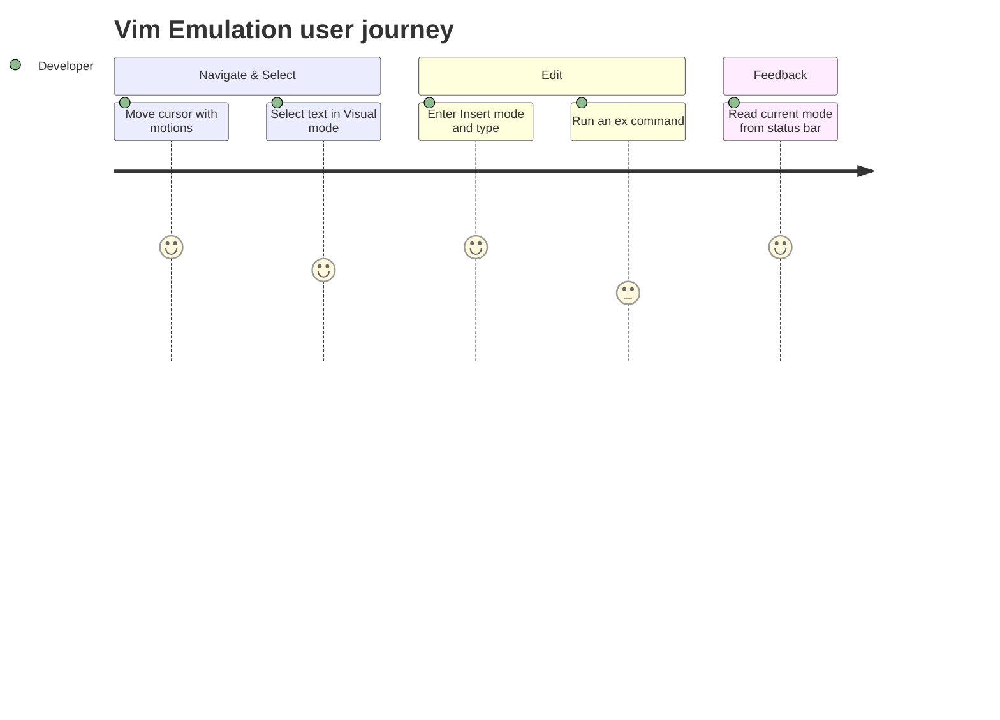

# Screens — F014_VimEmulation

**Non-web adaptation note:** Zode is a native GPUI desktop editor, not a web app — this `generic-source` profile has no route list or screen-list registry, so `SCR###` codes are omitted per session convention. The rows below describe the editor UI surfaces this feature touches instead of routed pages.

## Screen List

| Surface Name | What User Sees | What User Can Do |
|--------------|-----------------|-------------------|
| Editor pane (Vim-enabled) | The normal code/text editor, with the cursor's shape/behavior and text-insertion rules changed by the current Vim mode | Navigate, select, insert, replace, and edit text entirely via keyboard commands instead of mouse + arrow keys |
| Mode indicator (status bar) | A colored label at the bottom of the window showing the current mode ("NORMAL", "INSERT", "REPLACE", "VISUAL", "VISUAL LINE", "VISUAL BLOCK", "SELECT" for Helix), plus any in-progress keystroke count/operator/macro-recording indicator | Glance at the current mode and any pending multi-key command before typing the next key |
| Ex command line | A `:`-prefixed input line that appears when the developer presses `:` in Normal mode | Type and submit a command-line instruction (save, search-and-replace, run a shell command, jump to a line) that acts on the buffer or a text range |

## User Journey

1. Developer opens a file in the editor pane with Vim mode enabled and starts in Normal mode, shown by the mode indicator reading "NORMAL".
2. Developer navigates and selects text using keyboard commands; the mode indicator updates live as they enter Visual or Insert mode.
3. Developer presses `:` to open the ex command line, types a command, and submits it — the command runs against the editor pane and the ex command line closes.
4. Developer returns to Normal mode (mode indicator reads "NORMAL" again) and continues editing.

