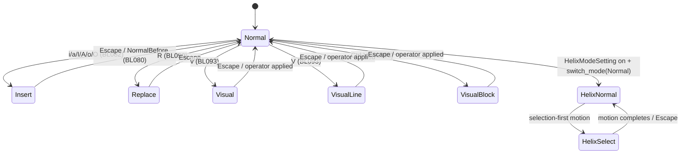

# F014_VimEmulation: Technical Spec

**Priority**: P1
**Type**: mixed
**Generated**: 2026-08-07

## Overview

`crates/vim` is a self-contained modal-editing emulation layer wrapping `editor::Editor`. It re-implements Vim's normal/insert/visual/replace mode machine, its motion and text-object vocabulary, ex (`:`) commands, macro record/replay, and a Helix-mode variant, entirely as GPUI `Action`s dispatched on top of the existing editor rather than a fork of it. It activates only when `Editor.use_modal_editing` is set (`crates/editor/src/editor.rs:3665-3670`), which the workspace sets from `VimModeSetting` at editor-construction time (`crates/editor/src/editor.rs:2498`). Vim state is scoped per-editor (`crates/vim/src/vim.rs:509-535`) and per-workspace persisted state (marks) is scoped by `WorkspaceId` in a dedicated SQLite domain.

## Polymorphic Behavior

**Deviation note:** the discriminator documented below (`vim::state::Mode`) is not registered as a `MODEL###`/`DISC-###` entry in `docs/generated/entities.md` — the canonical entities registry only covers `MODEL010_Editor.mode` (`EditorMode`, DISC-009: SingleLine/AutoHeight/Full — UI chrome, unrelated to Vim). `Mode` is Vim's own internal state field (`crates/vim/src/state.rs:509-511` `Vim.mode`/`Vim.last_mode`), so it is documented directly from source per this feature's own Key Entities, following the `--feature-specs` instruction to cover "the Vim mode state machine ... if discriminator-shaped."

### DISC-F014-01 — Vim.mode (`crate::state::Mode`)

| Value         | Render                                                                                                                                                                                                | Validation                                                                                                                                         | Persistence                                                                                                                                  |
| ------------- | ----------------------------------------------------------------------------------------------------------------------------------------------------------------------------------------------------- | -------------------------------------------------------------------------------------------------------------------------------------------------- | -------------------------------------------------------------------------------------------------------------------------------------------- |
| `Normal`      | Mode indicator shows "NORMAL"; motions move the cursor; keys are interpreted as commands/operators                                                                                                    | Typed characters do not insert text; unrecognized multi-key sequences accumulate on the operator-pending stack                                     | No DB write; in-memory `Vim.mode` only                                                                                                       |
| `Insert`      | Mode indicator shows "INSERT" (or "(insert) NORMAL" when `temp_mode` one-shot is active); relative line numbers turn off if `toggle_relative_line_numbers` is set                                     | Typed characters insert directly into the buffer                                                                                                   | Buffer edits are grouped into one undo transaction per insert session (`current_tx`, `crates/vim/src/vim.rs:1201-1213`)                      |
| `Replace`     | Mode indicator shows "REPLACE"                                                                                                                                                                        | Typed characters overwrite existing characters instead of inserting; `UndoReplace` reverts one overwritten char at a time using `vim.replacements` | Overwritten original text is buffered in `Vim.replacements` (in-memory only) for `UndoReplace`                                               |
| `Visual`      | Mode indicator shows "VISUAL"; selection follows the cursor character-wise                                                                                                                            | Motions extend the selection instead of moving a bare cursor                                                                                       | On leaving, selection endpoints are written to the `` `< ``/`` `> `` visual marks (`create_visual_marks`, `crates/vim/src/vim.rs:1243-1245`) |
| `VisualLine`  | Mode indicator shows "VISUAL LINE"; selection snaps to whole lines                                                                                                                                    | Same as `Visual` but line-granular                                                                                                                 | Same visual-mark write as `Visual`                                                                                                           |
| `VisualBlock` | Mode indicator shows "VISUAL BLOCK"; selection is column-rectangular, implemented internally as multiple single-line selections (`vim.rs:1249-1277` comment: "we cheat ... and use multiple cursors") | Same as `Visual`, but edits (insert/change) apply to every selected row                                                                            | Same visual-mark write; converts back to a single cursor when leaving block mode                                                             |
| `HelixNormal` | Mode indicator shows "NORMAL" (Helix skin); active only when `HelixModeSetting` is on                                                                                                                 | Selection-first semantics: motions select before acting, per Helix conventions                                                                     | Same persistence path as `Normal`                                                                                                            |
| `HelixSelect` | Mode indicator shows "SELECT" (Helix skin)                                                                                                                                                            | Analogous to `Visual` under Helix's selection model                                                                                                | Same persistence path as `Visual`                                                                                                            |

**Source:** `crates/vim/src/state.rs:42-81` (enum + `Display`/`is_visual`/`is_helix`), `crates/vim/src/vim.rs:1181-1330` (`switch_mode` transition logic), `crates/vim/src/mode_indicator.rs:88-178` (per-mode render).

## Cross-Cutting Logic

### Requirements

| Code   | Description                                                                                                  | Endpoint/Handler                                                                                                                      | Verifiable |
| ------ | ------------------------------------------------------------------------------------------------------------ | ------------------------------------------------------------------------------------------------------------------------------------- | ---------- |
| FR-001 | Vim emulation only intercepts keystrokes when `Editor.use_modal_editing` is true                             | `Editor::use_modal_editing`, `Vim::new`                                                                                               | yes        |
| FR-002 | Every Vim command is a discrete, independently keybindable/palette-reachable `Action` in the `vim` namespace | `actions!(vim, [...])` blocks across `motion.rs`, `normal.rs`, `visual.rs`, `object.rs`, `replace.rs`, `digraph.rs`, `change_list.rs` | yes        |

**Source:** `crates/editor/src/editor.rs:3665-3670`, `crates/vim/src/vim.rs:551-553`

### Business Rules

_(See itemized entries below.)_

### BR-001_ModeGatesTextInsertion

**Linked FR:** FR-001
**Source:** `crates/vim/src/vim.rs:1181-1216`
**Applies to:** every keystroke while an editor has Vim enabled
**Rule:** Text is only inserted into the buffer while `Vim.mode` is `Insert`, `Replace`, or (transiently) `temp_mode`. In `Normal`/`Visual`/Helix modes, keystrokes are interpreted as motions/operators/text objects and never mutate the buffer directly.

**Pseudocode:**

```text
on keystroke k:
  if vim.mode in {Insert, Replace} or vim.temp_mode:
    forward k as raw text insertion to editor
  else:
    resolve k (with any pending count/operator) to a vim::Action
    dispatch that action instead of inserting text
```

### BR-002_GlobalMarksTrackTheirOwningPath

**Linked FR:** —
**Source:** `crates/vim/src/state.rs:417-478`
**Applies to:** marks named with an uppercase letter or digit (global marks) vs. lowercase (buffer-local marks)
**Rule:** A mark name is classified global if its first character is uppercase or a digit (`is_global_mark`, `state.rs:480-484`). Global marks additionally persist which file path they point at (`vim_global_marks_paths` table) so they resolve across buffer/session reloads; buffer-local marks persist only their point inside `vim_marks`, keyed by that file's path.

**Pseudocode:**

```text
on mark write for name -> points:
  if is_global_mark(name) and path changed since last write:
    persist (workspace_id, name, path) to vim_global_marks_paths
  if points changed since last write:
    persist (workspace_id, name, path, points) to vim_marks
```

### Decision Logic

N/A — no user-facing decision logic beyond DISC-F014-01 Polymorphic Behavior. Vim's remaining branching (operator × motion dispatch in `normal_motion`, `crates/vim/src/normal.rs:383-470`; ex-command parsing in `command_interceptor`, `crates/vim/src/command.rs:1845-2042`) is single-field dispatch over the `Operator`/ex-command-name enums driving _which internal routine runs_, not a ≥2-predicate render/interaction/flow branch with an independently observable UI outcome distinct from "the requested edit/motion happened" — it is the feature's core mechanism, already covered by the User Stories and DISC-F014-01 above, not a separate business decision.

### State Machines

_(See itemized entries below.)_

### SM-001_VimModeLifecycle

**kind:** entity
**Linked FR:** FR-001
**Source:** `crates/vim/src/vim.rs:1181-1330`, `crates/vim/src/state.rs:42-81`
**States:** Normal, Insert, Replace, Visual, VisualLine, VisualBlock, HelixNormal, HelixSelect



**Transition rules:**

- `Normal -> Insert`: guard = one of `InsertAfter`/`InsertBefore`/`InsertFirstNonWhitespace`/`InsertEndOfLine`/`InsertLineAbove`/`InsertLineBelow` dispatched (BL082); side effect = cursor repositioned per the specific action before the mode flips.
- `Insert -> Normal`: guard = `NormalBefore` (Escape) or `temp_mode` auto-return (BL080); side effect = the insert-session's buffer edits are grouped into the transaction started at `current_tx` (`vim.rs:1201,1255-1259`).
- `* -> VisualBlock` from another visual mode: side effect = `visual_block_motion` re-derives a rectangular multi-cursor selection from the prior visual anchor (`vim.rs:1249-1254`).
- `Visual*/HelixSelect -> Normal`: side effect = `create_visual_marks` writes the `` `< ``/`` `> `` marks from the outgoing selection (`vim.rs:1243-1245`), unless `leave_selections` was requested by the caller.
- `switch_mode` always clears `operator_stack`, the selected register, and any running ex-command task (`vim.rs:1204-1206`) on every transition, regardless of source/target mode.

### Algorithms

None.

### External Integrations

None — Vim emulation is entirely in-process editor state; it makes no external process/network calls of its own (compare to Terminal/Git/LSP features).

### Verification

- **SC-007** — Toggling `Editor.use_modal_editing` off stops Vim from intercepting any keystroke; toggling it back on resumes interception without restarting the editor (covers FR-001)
- **SC-008** — Every Vim command registered under the `vim` namespace is independently reachable via keybinding AND command palette, with no command requiring another command to fire first (covers FR-002)

---

**Client behavior:** see
[`behavior-logic.md`](../../generated/behavior-logic.md) (client-side patterns — debounce, optimistic UI, polling, upload, realtime),
[`permissions.md`](../../system/permissions.md) (feature flags / experiments / env / locale gates),
[`screen-flow.md`](../../generated/screen-flow.md) (guards / deep-link state restoration / unsaved-changes protection).

## User Stories

### US052_NavigateTextWithVimMotions — Navigate text with Vim motions (Priority: P1)

**What happens:** While Vim mode is active and the editor is in Normal mode, pressing a motion key (`w`, `e`, `b`, `j`, `k`, etc.), optionally prefixed by a count, moves the cursor by the documented Vim unit (word/subword/line/paragraph/etc.) rather than by a single character.
**Why this priority:** Motion is the baseline interaction of the entire feature — every other Vim capability (operators, text objects, visual selection) composes with motions, so it must work before anything else does.
**Independent Test:** Enable Vim mode, place the cursor at the start of a 3-word line, press `w` twice, and confirm the cursor lands at the start of the third word.

**Acceptance Scenarios:**

1. **Given** the cursor is at the start of a line with 3 words and Vim mode is Normal, **When** the developer presses `w` twice, **Then** the cursor lands at the start of the third word.
2. **Given** a count prefix `3w` is typed, **When** it is executed, **Then** the motion repeats 3 times as a single operation (not three separate undo steps).

**Requirements fulfilled:**

- **FR-003** Motion keys resolve to a `Motion` enum value and move (or, combined with an operator, act on) the cursor by that unit — dispatched via `Vim::normal_motion`
  **Source:** `crates/vim/src/motion.rs:46-176` (enum), `crates/vim/src/normal.rs:383-393` (`None => self.move_cursor(...)`), `crates/vim/src/motion.rs:423` (`register`)

**Rules enforced:**

### BR-003_CountPrefixRepeatsMotion

**Linked FR:** FR-003
**Source:** `crates/vim/src/normal.rs:383-393`
**Applies to:** any motion dispatched through `normal_motion`
**Rule:** A numeric prefix typed before a motion is captured as `times: Option<usize>` and passed through to `move_cursor`/the relevant operator-motion function, which repeats the underlying motion that many times as one logical action (one undo step when combined with a change operator).

**Pseudocode:**

```text
on motion key m with pending count n (default 1):
  resolved = Motion::from_key(m)
  if no operator pending:
    move_cursor(resolved, times=n)
  else:
    dispatch_operator_over(pending_operator, resolved, times=n)
```

**Verification:**

- **SC-001** Pressing a bare motion key moves the cursor by exactly one unit of that motion; a count-prefixed motion moves it by exactly that many units (covers FR-003, BR-003)

---

### US053_EnterVimInsertMode — Enter Vim insert mode (Priority: P1)

**What happens:** Pressing `i`/`a`/`I`/`A`/`o`/`O` in Normal mode repositions the cursor per that key's documented Vim semantics (before/after cursor, line start, line end, new line above/below) and switches `Vim.mode` to `Insert`.
**Why this priority:** Insert mode is the only way to add new text under Vim emulation; without it the feature would be read-only navigation.
**Independent Test:** Place the cursor mid-line in Normal mode, press `A`, and confirm the cursor jumps to end of line and the mode indicator switches to "INSERT".

**Acceptance Scenarios:**

1. **Given** the cursor is mid-line in Normal mode, **When** the developer presses `A`, **Then** the cursor jumps to the end of the line and the mode switches to Insert.
2. **Given** Insert mode is active, **When** the developer types characters, **Then** they are inserted at the cursor position without overwriting existing text.

**Requirements fulfilled:**

- **FR-004** `InsertAfter`/`InsertBefore`/`InsertFirstNonWhitespace`/`InsertEndOfLine`/`InsertLineAbove`/`InsertLineBelow` reposition the cursor and call `switch_mode(Mode::Insert, ...)`
  **Source:** `crates/vim/src/normal.rs:36-58` (`actions!` declarations), `crates/vim/src/vim.rs:1181-1216` (`switch_mode`)

**Rules enforced:** BR-001 (see Cross-Cutting Logic) — applies here as the concrete mode transition that lets typed characters insert.

**State transitions:** SM-001 (see Cross-Cutting Logic) — `Normal -> Insert` edge.

**Verification:**

- **SC-002** After any of `i/a/I/A/o/O`, the cursor is positioned per that key's Vim semantics and subsequently typed characters appear at that exact position (covers FR-004)

---

### US054_SelectTextInVimVisualMode — Select text in Vim visual mode (Priority: P1)

**What happens:** `v`, `V`, and `Ctrl-V` switch the mode to character-wise, line-wise, and block-wise visual selection respectively; subsequent motions extend the selection instead of just moving the cursor.
**Why this priority:** Visual selection is the precondition for most delete/yank/change/indent operations acting on a precise, user-chosen range rather than a single motion's worth of text.
**Independent Test:** Place the cursor at the start of a 3-line block, press `V` then `jj`, and confirm all 3 lines are selected line-wise.

**Acceptance Scenarios:**

1. **Given** the cursor is at the start of a 3-line block, **When** the developer presses `V` then `jj`, **Then** all 3 lines are selected line-wise.
2. **Given** `Ctrl-V` visual-block mode is active, **When** the developer moves down two lines and right three columns, **Then** the selection is a 3x3 rectangular block, not three independent line selections.

**Requirements fulfilled:**

- **FR-005** `ToggleVisual`/`ToggleVisualLine`/`ToggleVisualBlock` switch mode and motions performed afterward extend the active selection
  **Source:** `crates/vim/src/visual.rs:23-68` (`actions!` + enter logic), `crates/vim/src/vim.rs:1247-1277` (selection adjustment on mode switch)

**Rules enforced:** BR-001, BR-002 (see Cross-Cutting Logic) — leaving any visual mode writes the `` `< ``/`` `> `` marks (BR-002's persistence path).

**State transitions:** SM-001 (see Cross-Cutting Logic) — `Normal -> Visual/VisualLine/VisualBlock` edges and their exits.

**Verification:**

- **SC-003** Toggling a visual sub-mode selects exactly the documented granularity (char/line/block), and applying `d`/`x` afterward deletes exactly the selected range (covers FR-005, SM-001)

---

### US055_RunVimExCommand — Run a Vim ex command (Priority: P2)

**What happens:** Pressing `:` opens the ex command line; submitting a recognized command (e.g. `:w`, `:%s/a/b/g`, `:12`, `:!ls`) parses any leading range, resolves the command name, and executes the corresponding action against the buffer or a shell process. An unrecognized command surfaces an error toast instead of doing nothing.
**Why this priority:** Ex commands cover range-based and configuration operations that motions/operators cannot express, but they are used less often than motion/insert/visual, hence "should" rather than "must" in `user-stories.md`.
**Independent Test:** With a buffer containing "foo" three times, run `:%s/foo/bar/g` and confirm all three occurrences become "bar".

**Acceptance Scenarios:**

1. **Given** a buffer contains the word "foo" three times, **When** the developer runs `:%s/foo/bar/g`, **Then** all three occurrences become "bar".
2. **Given** the developer types an ex command that matches no known command/range, **When** they submit it, **Then** an error notification is shown and the buffer is left unchanged.
3. **Given** an ex command references a mark that was never set (e.g. `:'q,.d`), **When** it is submitted, **Then** the command fails with an error notification rather than silently operating on a wrong range.

**Requirements fulfilled:**

- **FR-006** `command_interceptor` parses a leading `CommandRange`, then dispatches to `GoToLine`/`ReplaceCommand`/`VimSet`/`ShellExec`/other ex-command actions based on the remaining query text
  **Source:** `crates/vim/src/command.rs:1845-1988` (`command_interceptor`), `crates/vim/src/command.rs:1725-1741` (`GoToLine`/`YankCommand`/`WithRange`/`WithCount`/`VimSet`/`VimSave`/`VimSplit` action declarations)

**Rules enforced:**

### BR-004_ExCommandRangeMarkMustExist

**Linked FR:** FR-006
**Source:** `crates/vim/src/command.rs:1366-1374`
**Applies to:** any ex-command range endpoint of the form `'{mark}`
**Rule:** Resolving a `Position::Mark` range endpoint requires the named mark to exist (`vim.get_mark` returns `Some(Mark::Local(_))`) and to contain at least one anchor; otherwise the range resolution fails with `anyhow::bail!("mark {name} not set")` or `"mark {name} contains empty anchors"`, which is surfaced to the user via `notify_err` (e.g. `command.rs:891-898`, `command.rs:935-943`) rather than silently defaulting to a range.

**Pseudocode:**

```text
on ex-command range endpoint '{name}:
  mark = vim.get_mark(name)
  if mark is None: fail("mark {name} not set")
  if mark.anchors.is_empty(): fail("mark {name} contains empty anchors")
  else: use mark.anchors.last() as the row
# failure propagates to workspace.notify_err -> user-visible error toast
```

**Verification:**

- **SC-004** A recognized ex command with a valid range executes and mutates the buffer/range as documented; an ex command with an unresolvable range or unknown command name never silently no-ops — it always produces a visible error notification (covers FR-006, BR-004)

---

### US056_RepeatLastVimChange — Repeat the last Vim change (Priority: P2)

**What happens:** `.` re-executes the most recent change-producing command at the current cursor position; `q{register}` starts/stops recording a macro into that register, and `@@` replays the last-played macro.
**Why this priority:** Repeat/macro is a productivity multiplier on top of the core edit vocabulary, not required for Vim emulation to be usable at all — "should", not "must".
**Independent Test:** Delete a word with `dw`, move the cursor elsewhere, press `.`, and confirm the word under the new cursor position is deleted the same way.

**Acceptance Scenarios:**

1. **Given** the developer just deleted a word with `dw`, **When** the cursor moves elsewhere and `.` is pressed, **Then** the word under the new cursor position is deleted the same way.
2. **Given** the developer records a macro into register `q` with `qq...q`, **When** they play it back with `@q` (or repeat with `@@`), **Then** the exact recorded keystroke sequence is replayed.

**Requirements fulfilled:**

- **FR-007** `Repeat`/`ToggleRecord`/`ReplayLastRecording` replay a buffered sequence of `ReplayableAction`s, substituting `repeatable_insert` translations for insert-mode entry actions so the repeat re-enters insert the same way
  **Source:** `crates/vim/src/normal/repeat.rs:1-59` (`actions!` + `should_replay`/`repeatable_insert`)

**Rules enforced:** BR-001 (see Cross-Cutting Logic) — repeated insert-mode actions still gate text mutation on `Insert`/`Replace`/`temp_mode`.

**Verification:**

- **SC-005** `.` reproduces the exact edit of the last change-producing command at the new cursor location; a recorded macro replays its exact original keystroke sequence, character-for-character (covers FR-007)

---

### US057_SelectVimTextObject — Select a Vim text object (Priority: P2)

**What happens:** An operator+object combo (`diw`, `ci(`, `da"`, etc.) resolves the object half (word, sentence, paragraph, quoted string, bracketed block, tag, etc.) to a concrete text range via `Object::range`, using the `around: bool` flag to decide whether delimiters are included, then hands that range to the pending operator (delete/change/yank/etc.).
**Why this priority:** Text objects are a compositional layer over operators/motions — valuable but not required for baseline navigation/insertion/selection, hence "should".
**Independent Test:** Place the cursor inside `"hello"` and run `ci"`; confirm the contents between the quotes are deleted and insert mode starts inside them.

**Acceptance Scenarios:**

1. **Given** the cursor is inside `"hello"`, **When** the developer runs `ci"`, **Then** the contents between the quotes are deleted and insert mode starts inside them.
2. **Given** the cursor is inside `(hello)`, **When** the developer runs `da(`, **Then** the parentheses and their contents are deleted (the "around" variant includes delimiters).

**Requirements fulfilled:**

- **FR-008** `Object::range(map, selection, around, times)` computes the object's range for each `Object` variant (`Word`, `Subword`, `Sentence`, `Paragraph`, `Quotes`, `Parentheses`, `SquareBrackets`, `CurlyBrackets`, `AngleBrackets`, `Tag`, `Method`, `Class`, `Comment`, `IndentObj`, `Argument`, `EntireFile`, etc.); `around=false` ("inner") excludes delimiters, `around=true` ("around") includes them
  **Source:** `crates/vim/src/object.rs:21-45` (`Object` enum), `crates/vim/src/object.rs:567-598` (`range`, `Word`/`Subword` inner-vs-around branch)

**Rules enforced:** BR-001 (see Cross-Cutting Logic) — the operator applied after object resolution (e.g. `c` in `ci"`) is what actually mutates the buffer and switches to Insert mode.

**Verification:**

- **SC-006** For a given operator+object combo, the selected range exactly matches the documented inner/around boundary for that object type, and the paired operator acts on exactly that range (covers FR-008)

---

### Edge Cases

| Scenario                                                                                       | Behavior                                                                                                                                                                                                                                   |
| ---------------------------------------------------------------------------------------------- | ------------------------------------------------------------------------------------------------------------------------------------------------------------------------------------------------------------------------------------------ |
| Ex command references a range endpoint mark that was never set                                 | `Position::buffer_row` returns `Err("mark {name} not set")`; surfaced via `notify_err` as an error toast, buffer unchanged (`command.rs:1366-1374`)                                                                                        |
| Two visual-mode selections overlap during rapid mode switching (e.g. `v` then immediately `V`) | `switch_mode` re-derives the selection from the prior visual anchor rather than compounding it (`vim.rs:1249-1277`)                                                                                                                        |
| `use_modal_editing` is false (Vim mode disabled) mid-session                                   | All Vim `Action`s remain registered but `Vim::new`/mode dispatch is gated off at the editor level; keystrokes fall through to normal (non-modal) editor behavior (`editor.rs:3665-3670`)                                                   |
| A global mark's file has been deleted/moved since the mark was set                             | Stored `vim_global_marks_paths` row still resolves to the last-known path; on load, `loaded()` looks up a live `ProjectPath` for that path and silently skips wiring the mark if no matching worktree/buffer is found (`state.rs:362-383`) |

## Key Entities

| Entity                                 | Table                          | Key Columns                                                     | Purpose                                                                                                            |
| -------------------------------------- | ------------------------------ | --------------------------------------------------------------- | ------------------------------------------------------------------------------------------------------------------ |
| `vim_marks` (via `VimDb`)              | `vim_marks`                    | `workspace_id`, `mark_name`, `path`, `value`                    | Persists buffer-local Vim marks (cursor positions) per workspace + file path so they survive editor/session reload |
| `vim_global_marks_paths` (via `VimDb`) | `vim_global_marks_paths`       | `workspace_id`, `mark_name`, `path`                             | Persists which file path a global (uppercase/digit-named) mark currently points at                                 |
| `Vim` (in-memory, not a DB table)      | —                              | `mode`, `last_mode`, `operator_stack`, `search`, `replacements` | Per-editor Vim session state: current mode, pending operator/count, replace-mode undo buffer                       |
| `Editor` (`MODEL010_Editor`)           | — (in-memory `Entity<Editor>`) | `use_modal_editing`                                             | Gate field that turns Vim emulation on/off for a given editor instance                                             |

## Artifact References

| Artifact        | File                                                        | Codes Used                                                                                                                                                             | Reviewed |
| --------------- | ----------------------------------------------------------- | ---------------------------------------------------------------------------------------------------------------------------------------------------------------------- | -------- |
| System Overview | [system-overview.md](../../system-overview.md)              | —                                                                                                                                                                      | [x]      |
| Architecture    | [architecture.md](../../docs/system/architecture.md)        | —                                                                                                                                                                      | [x]      |
| Feature List    | [feature-list.md](../../docs/generated/feature-list.md)     | F014                                                                                                                                                                   | [x]      |
| Entities        | [entities.md](../../docs/generated/entities.md)             | MODEL010                                                                                                                                                               | [x]      |
| Screens         | [screens.md](../F014_VimEmulation/screens.md)               | —                                                                                                                                                                      | [x]      |
| Behavior Logic  | [behavior-logic.md](../../docs/generated/behavior-logic.md) | BL074, BL075, BL076, BL077, BL078, BL079, BL080, BL081, BL082, BL083, BL084, BL085, BL086, BL087, BL088, BL089, BL090, BL091, BL092, BL093, BL123, BL140, BL198, BL199 | [x]      |
| User Stories    | [user-stories.md](../../docs/generated/user-stories.md)     | US052, US053, US054, US055, US056, US057                                                                                                                               | [x]      |
| Business Rules  | [business-rules.md](../../docs/system/business-rules.md)    | —                                                                                                                                                                      | [x]      |

**Rule:** Every code listed in Codes Used MUST exist in its source artifact. Orphan refs = reviewer critical. This profile (`generic-source`, no route-list/screen-list) has no `ROUTE###`/`SCR###`/`PERM###` codes to bridge, so the API Map and Permissions Matrix rows are intentionally omitted.

## Assumptions

- `HelixModeSetting` and `VimSettings::default_mode` are read once at `Vim::new` construction time (`vim.rs:555-570`); toggling Helix mode mid-session is assumed to require re-entering Normal mode to take effect, since `switch_mode` only maps `Normal`/`Visual` to their Helix equivalents at transition time (`vim.rs:1231-1237`), not retroactively for the current mode.
- Mark persistence (`vim_marks`/`vim_global_marks_paths`) is assumed to be best-effort: writes are `detach_and_log_err`'d background tasks (`state.rs:454-477`, `state.rs:716-720`), so a crash between the in-memory update and the DB write can leave a mark not persisted, with no user-visible indication.
- `ShellExec`/`:!` commands (BL123, BL198) are assumed to inherit the workspace's project working directory and shell (`Shell::System`) rather than any Vim-specific shell configuration, since `command.rs:2467-2488` reads `project.first_project_directory(cx)` directly.

## Source Code References

<!-- v26.0.0 (A3, F15 DRY): this is the ONE related-files table for the spec — the "Order"
column doubles as ## Source Walkthrough's related-files table (recommended reading sequence,
1 = read first). Do NOT author a second, independent file-list table under Source Walkthrough. -->

| Order | Symbol                          | Path                                                                  | Purpose                                                             |
| ----- | ------------------------------- | --------------------------------------------------------------------- | ------------------------------------------------------------------- |
| 1     | `Mode` enum                     | `crates/vim/src/state.rs:42-81`                                       | Defines the modal state machine every other file dispatches against |
| 2     | `Vim` struct + `switch_mode`    | `crates/vim/src/vim.rs:509-535`, `crates/vim/src/vim.rs:1181-1330`    | Per-editor session state and the mode-transition entry point        |
| 3     | `Motion` enum + `normal_motion` | `crates/vim/src/motion.rs:46-176`, `crates/vim/src/normal.rs:383-470` | Cursor-movement vocabulary and operator×motion dispatch             |
| 4     | `Object` enum + `range`         | `crates/vim/src/object.rs:21-45`, `crates/vim/src/object.rs:567-598`  | Text-object vocabulary and inner/around range resolution            |
| 5     | `command_interceptor`           | `crates/vim/src/command.rs:1845-1988`                                 | Ex (`:`) command line parsing/dispatch                              |
| 6     | `VimDb`                         | `crates/vim/src/state.rs:1768-1909`                                   | SQLite persistence for buffer-local and global marks                |
| 7     | `ModeIndicator`                 | `crates/vim/src/mode_indicator.rs:1-189`                              | Status-bar rendering of the current mode                            |

## Unresolved Questions

1. **Helix-mode coverage depth**: `crates/vim/src/helix.rs` (2586 lines) and its `helix/` submodules (boundary, duplicate, object, paste, select, surround) were sampled at the `BL077`/`BL078` level (action declarations) but not walked line-by-line; whether every Helix action has full behavioral parity with upstream Helix, or is a partial emulation, is not confirmed from this pass.
2. **Macro register conflict**: `state.rs`/`repeat.rs` do not show what happens if a user starts recording (`q{reg}`) into a register that already holds recorded content — whether it's silently overwritten or appended — from the code read in this pass.
3. **Mark persistence failure visibility**: `detach_and_log_err` (state.rs:457, 476, 679, 719) logs DB write failures but does not surface them to the user; whether this is an intentional "best-effort, invisible" design choice or an unaddressed gap is not stated in source or business-rules.md.

## Source Walkthrough

1. **File:** `crates/vim/src/state.rs:42-81` — why start here: defines `Mode`, the enum every mode-dependent behavior in the crate switches on.
2. **File:** `crates/vim/src/vim.rs:509-570` — next: the `Vim` struct that holds `mode`/`last_mode` per editor, and `Vim::new`, the construction/gating entry point tied to `Editor.use_modal_editing`.
3. **File:** `crates/vim/src/mode_indicator.rs:88-178` — next: renders the current mode to the status bar, the only UI surface for this feature.
4. **File:** `crates/vim/src/normal.rs:383-470` — last: the business logic that ties a keystroke's `(Motion, Option<Operator>)` pair to the concrete edit/navigation it performs.

### Call Hierarchy

```text
Keystroke -> Vim::action registered handler (per actions! block, e.g. motion.rs/normal.rs/visual.rs)
          -> Vim::normal_motion(motion, operator, times) [normal.rs:383]
               -> operator == None:      Vim::move_cursor
               -> operator == Some(Op):  Vim::{change,delete,yank,indent,rewrap,shell_command,convert}_motion
          -> Vim::switch_mode(new_mode) [vim.rs:1181] on mode-changing actions (i/a/v/V/Ctrl-V/Escape/R/...)
               -> Vim::create_visual_marks -> VimGlobals::serialize_buffer_marks -> VimDb::set_marks (background task)
```

**Related files:** see `## Source Code References` above — the **Order** column on that table
IS this section's related-files table, re-cast with the reading sequence (F15 DRY: one table,
never two).

## DB Impact per Event

| Event/Endpoint                                                              | Table                    | Columns                                      | Operation         | Value Derivation                                                                                                                                | Source                                                                 |
| --------------------------------------------------------------------------- | ------------------------ | -------------------------------------------- | ----------------- | ----------------------------------------------------------------------------------------------------------------------------------------------- | ---------------------------------------------------------------------- |
| Buffer edit while a global (uppercase/digit) mark is set on that buffer     | `vim_global_marks_paths` | `workspace_id`, `mark_name`, `path`          | INSERT OR REPLACE | `path` derived from the buffer's live project-relative absolute path at write time; `mark_name` is the literal mark character typed by the user | `crates/vim/src/state.rs:450-458`                                      |
| Buffer edit while any mark is set on that buffer (`serialize_buffer_marks`) | `vim_marks`              | `workspace_id`, `mark_name`, `path`, `value` | INSERT OR REPLACE | `value` is the mark's buffer `Point` (row, column) at the time of serialization, JSON-encoded                                                   | `crates/vim/src/state.rs:470-477`, `crates/vim/src/state.rs:1804-1830` |
| User deletes a global mark (``d`X`` / `:delmarks` on an uppercase mark)     | `vim_global_marks_paths` | `workspace_id`, `mark_name`                  | DELETE            | N/A — deletion keyed by mark name only                                                                                                          | `crates/vim/src/state.rs:674-680`, `crates/vim/src/state.rs:1897-1909` |
| User deletes any Vim mark (buffer-local or global)                          | `vim_marks`              | `workspace_id`, `mark_name`, `path`          | DELETE            | N/A — deletion keyed by workspace/mark/path                                                                                                     | `crates/vim/src/state.rs:712-720`, `crates/vim/src/state.rs:1854-1867` |
