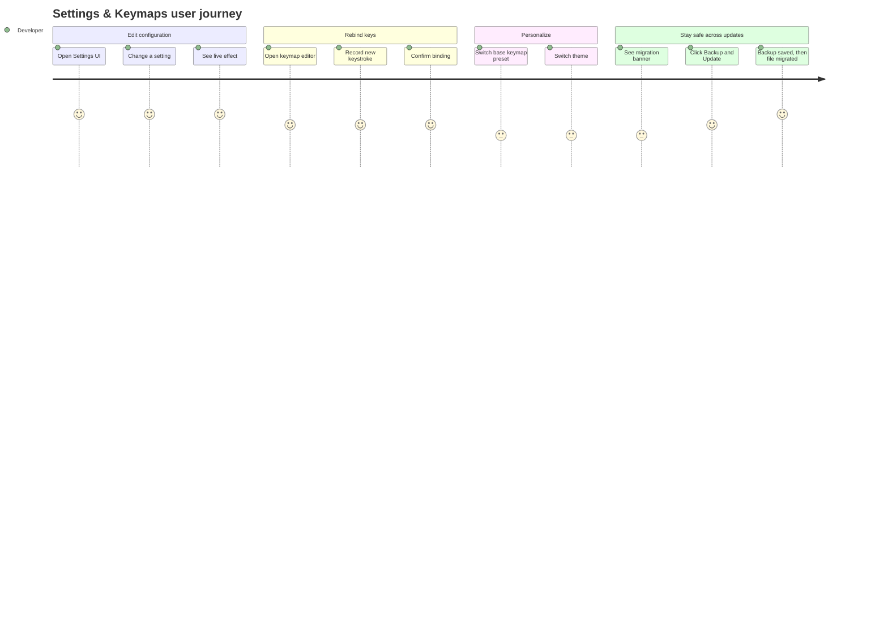

# Screens — F015_SettingsAndKeymaps

<!-- generic-source profile: Zode has no route-list.md/screen-list.md (desktop GPUI app, not a
web app with routes). SCR### codes are intentionally omitted rather than fabricated. The table
below describes the GPUI panel/view surface in place of a web Screen List. -->

## Screen List

| View Name             | Owning File                                                        | What User Sees                                                                                                                                            | What User Can Do                                                                                                                                                             |
| --------------------- | ------------------------------------------------------------------ | --------------------------------------------------------------------------------------------------------------------------------------------------------- | ---------------------------------------------------------------------------------------------------------------------------------------------------------------------------- |
| SettingsWindow        | `crates/settings_ui/src/settings_ui.rs:720`                        | A dedicated settings window with a navigation sidebar (files/sections), a search box, and a form-style page of setting fields for the selected section    | Search settings by name, jump between User/Global/Project settings files, edit individual fields (toggle, text, number, dropdown), jump to a specific settings file by index |
| KeymapEditor          | `crates/keymap_editor/src/keymap_editor.rs:432`                    | A searchable, filterable table of every action and its bound keystroke(s), source (default/base-keymap/user), and any conflicting bindings                | Filter/search actions and keystrokes, edit or create a binding, delete a binding, copy an action name or context predicate, toggle a conflicts-only filter                   |
| KeybindingEditorModal | `crates/keymap_editor/src/keymap_editor.rs:2453`                   | A modal dialog for editing/creating one keybinding: a keystroke-capture input, the action name, optional action arguments, and a context predicate field  | Record a new keystroke combination, edit action arguments, confirm or cancel the change                                                                                      |
| BaseKeymapSelector    | `crates/onboarding/src/base_keymap_picker.rs:45`                   | A modal picker listing available base keymap presets (Default, VS Code, Sublime, Vim, etc.)                                                               | Select a preset to apply as the base keymap layer                                                                                                                            |
| ThemeSelector         | `crates/theme_selector/src/theme_selector.rs` (delegate at `:337`) | A modal picker listing available themes with a live preview as you move the selection                                                                     | Select a theme to apply immediately; reload themes from disk (dev/theme-authoring workflow)                                                                                  |
| MigrationBanner       | `crates/zed/src/zed/migrate.rs:25`                                 | A toolbar banner shown above the settings/keymap editor when a deprecated schema field is detected, naming the exact backup filename that will be created | Click "Backup and Update" to trigger the backup-then-migrate flow                                                                                                            |

## User Journey

1. Developer opens the SettingsWindow and searches for a setting (for example, "font size"),
   changes its value, and sees the change reflected live in any open editor.
2. Developer opens the KeymapEditor, searches for an action, opens the KeybindingEditorModal to
   record a new keystroke, and confirms — the new binding is active immediately.
3. Developer opens the BaseKeymapSelector and picks a preset from another editor — its bindings
   activate immediately across all open windows.
4. Developer opens the ThemeSelector and previews themes by moving the selection, then confirms
   one — the new theme applies immediately.
5. Developer opens a settings or keymap file that uses a deprecated schema field; the
   MigrationBanner appears above the editor. Developer clicks "Backup and Update" — a backup file
   is written first, then the live file is rewritten in the current schema, and the banner
   disappears.

