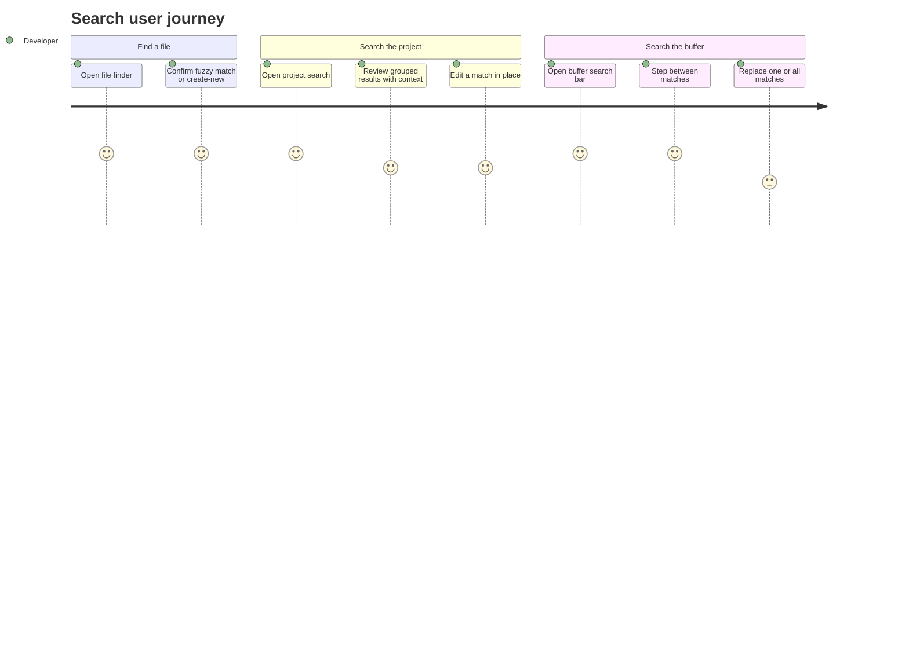

# Screens — F016_Search

**Non-web adaptation note (`generic-source` profile):** zode has no route-list/screen-list —
this is a Rust/GPUI desktop app, not a web app. There is no `SCR###` catalog to bridge to; the
surfaces below are a modal picker, a toolbar-item results view, and an in-editor bar, all opened
by dispatching actions/keybindings rather than navigating to a URL. The tab switcher
(`crates/tab_switcher`, US066) and the rest of the command palette's own command-listing UI belong
to the App Shell feature area per `feature-list.md`/`user-stories.md` — only the command palette's
invocation-logging behavior (BL146) is in this feature's scope, so it is not given its own surface
row below.

## Screen List

_Non-web adaptation: no `SCR###` codes — `generic-source` profile has no screen-list.md catalog._

| Surface | Kind | What User Sees | What User Can Do |
|---------|------|-----------------|-------------------|
| File Finder | Modal picker | A ranked list of project files matching the typed fuzzy query, with recent-history entries interleaved, and a "create new file" row when nothing matches | Type to filter; arrow through results; confirm to open (or split-open with the secondary modifier); toggle a filter/split option menu |
| Project Search View | Pane item (tab), rendered as an editable multi-buffer | Query/include/exclude input fields, option toggles (whole word, case sensitive, regex, include ignored), and matched lines grouped by file with surrounding context; a "+"-suffixed count and notice when the result cap is hit | Submit a query; toggle search options and filters; edit matched text directly in the results (changes apply to the real file); replace one or all matches |
| Buffer Search Bar | In-editor toolbar bar (appears above the active editor) | The current query, a match counter ("N of M"), and option toggles (whole word, case sensitive, regex, selection-only, replace) | Type a query; step to next/previous match; toggle search options; expand to show a replace field and replace one or all matches |

## User Journey

1. Developer presses the file-finder keybinding, sees a modal picker, types a fuzzy fragment of a filename, and confirms the top-ranked result — the file opens in the active pane.
2. If the typed fragment matches no existing file, the developer instead sees a "create new file" entry at the bottom of the list and can confirm it to create and open that path.
3. Developer opens project search, submits a query, and watches matches stream in grouped by file with context; if the project is large enough to hit the result cap, they see the count suffixed with "+" rather than an exact number.
4. Developer edits a matched line directly inside the project search results view — the change is written to the real underlying file, since the results are a live multi-buffer, not a static list.
5. Developer opens the buffer search bar in the file they're editing, types a query, and cycles between highlighted matches with Next/Previous; optionally expands the replace field and replaces one match or all of them.
6. Independently of the three find surfaces above, every command the developer confirms through the command palette is logged in the background (no visible UI change) so future searches within the palette itself rank familiar commands higher.

