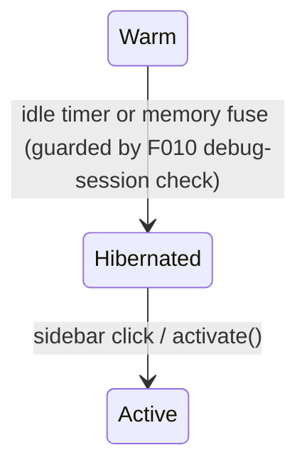

# FLOW001_ProjectActivityHibernationCascade

> Tracks what a `Project.activity` transition (Active/Warm/Hibernated) does to OTHER entities
> once it fires. The `activity` state machine itself (4 states, 4 edges) is already fully
> documented as `SM-001_ProjectActivityLifecycle` in F013 — see SM-001 in F013 for the entry
> conditions and full transition table. This flow exists only for what SM-001 cannot express:
> a cross-feature guard sourced from F010's debug-session state, and the cross-entity cascade
> the `Warm -> Hibernated` / `Hibernated -> Active` edges fan out to five other entities
> (`Worktree`, `Terminal`, `ProjectPanel`, `LanguageServer`/Prettier, `Repository`).

**Subject entity:** `Project` . **State field:** `activity`
**Enum source:** `crates/project/src/project.rs:342-357` --- `Active, Warm, Hibernated`

---

## States

See SM-001 in F013 (`docs/features/F013_WorkspaceAndProjectManagement/technical-spec.md`) for the
full States table and entry/terminal analysis. Not repeated here per the SM-### vs FLOW### DRY
boundary.

**Note on `Active` in this flow's diagram:** `Active` is shown here only as the target of `T2`
(`Hibernated -> Active`); this file deliberately omits the `Active <-> Warm` edge (pure
focus/defocus, no cross-entity fan-out — SM-001-only, see above), so `Active` correctly has no
outgoing edge drawn in _this_ reduced diagram. It is not a stuck state: SM-001's full diagram in
F013 shows `Active -> Warm` on focus loss. This is a scope note, not a `LIVENESS:` risk.

---

## State Diagram

<!-- Reduced to only the two cascading edges this flow documents; the other two edges
     (Active<->Warm, pure focus/defocus, no cross-entity fan-out) are SM-001-only. -->

---

## Transitions

<!-- Only the two edges that fan out to other entities. Active<->Warm has no cross-entity
     cascade (see SM-001 in F013) and is intentionally omitted here. -->

| #   | From -> To             | Trigger type | Trigger                                                                                         | Guard (must hold)                                                                                                                 | Side effects (cross-entity)                                                                                                                                                                                                                                                                                        | Source                                                                                                                           |
| --- | ---------------------- | ------------ | ----------------------------------------------------------------------------------------------- | --------------------------------------------------------------------------------------------------------------------------------- | ------------------------------------------------------------------------------------------------------------------------------------------------------------------------------------------------------------------------------------------------------------------------------------------------------------------ | -------------------------------------------------------------------------------------------------------------------------------- |
| T1  | `Warm -> Hibernated`   | scheduled    | idle timer (`hibernate_after`) OR memory-pressure fuse poll (`MEMORY_FUSE_POLL_INTERVAL` = 30s) | no active (non-terminated) debug session in `DapStore` (F010 cross-feature guard); no dirty buffer racing a live autosave setting | `LspStore::hibernate` detached; `PrettierStore::hibernate`; every `Worktree::pause_scanning()`; `Terminal::limit_scroll_history` if `background_scroll_history_lines` set; `Event::ActivityChanged` emitted -> `ProjectPanel` recomputes `stale_diagnostic_paths`                                                  | `crates/project/src/project.rs:4838-4879` (`try_hibernate_resources`), `:4888-4893` (`has_active_debug_session`), `:4764` (emit) |
| T2  | `Hibernated -> Active` | user-action  | sidebar click on hibernated project -> `MultiWorkspace::activate` -> `wake_project`             | previous label was `Hibernated` (guarded by `reconcile_resource_activity`, matching on `previous` not just `new`)                 | `LspStore::wake`; every `Worktree::resume_scanning(cx)` (open-buffer worktrees first); `Repository::refresh_all_repositories`; `Terminal::restore_scroll_history_limit` for every terminal; `Event::ActivityChanged` -> `ProjectPanel` recomputes `stale_diagnostic_paths` (clears dimmed badges once re-verified) | `crates/project/src/project.rs:4958-5001` (`wake_resources`), `:4788-4807` (`reconcile_resource_activity`)                       |

### In-state recurring behaviors (NOT transitions)

- Deferred-hibernate retry: while `Hibernated` was requested but blocked by T1's guard, `schedule_hibernate_retry` re-invokes `try_hibernate_resources` on a fixed interval until the debug session ends or the dirty buffer is no longer racing autosave — the label never actually reaches `Hibernated` resource-wise until the retry succeeds. `crates/project/src/project.rs:4926-4938`.

---

## Guard & Cascade Rules

<!-- The genuine cross-entity/cross-feature content SM-001 cannot express: which OTHER
     entity's field each cascade touches, and the exact call site. -->

| #   | Edge                                           | Actor                              | Guard                                                                                                                                                                     | Cascade / side effect                                                                                                                                                                                                                                                                              | Source                                                                                                                                                                                                                             |
| --- | ---------------------------------------------- | ---------------------------------- | ------------------------------------------------------------------------------------------------------------------------------------------------------------------------- | -------------------------------------------------------------------------------------------------------------------------------------------------------------------------------------------------------------------------------------------------------------------------------------------------- | ---------------------------------------------------------------------------------------------------------------------------------------------------------------------------------------------------------------------------------- |
| 1   | `Warm -> Hibernated`                           | `Project::try_hibernate_resources` | `DapStore::sessions()` has no session where `!is_terminated()` (F010 cross-feature dependency — a running debug thread blocks hibernation even before the LSP is touched) | Hibernation deferred via `schedule_hibernate_retry`, not abandoned                                                                                                                                                                                                                                 | `crates/project/src/project.rs:4839,4888-4893`                                                                                                                                                                                     |
| 2   | `Warm -> Hibernated`                           | `Project::try_hibernate_resources` | none (unconditional once guards in row 1 clear)                                                                                                                           | `Worktree.scanning_paused` flips `false -> true` on every worktree in the project; background scanner tasks dropped                                                                                                                                                                                | `crates/worktree/src/worktree.rs:1190-1200` (`Local::pause_scanning`)                                                                                                                                                              |
| 3   | `Warm -> Hibernated`                           | `Project::try_hibernate_resources` | `ProjectSettings.background_scroll_history_lines` is `Some(n)` (opt-in, default off)                                                                                      | `Terminal.pre_hibernate_scroll_history` set to the prior `scrolling_history` size; scrollback capped to `n` lines                                                                                                                                                                                  | `crates/terminal/src/terminal.rs:1328-1345` (`limit_scroll_history`), `crates/project/src/terminals.rs:604-617`                                                                                                                    |
| 4   | `Warm -> Hibernated` (label flip, synchronous) | `Project::set_activity`            | none                                                                                                                                                                      | Emits `Event::ActivityChanged`; `ProjectPanel` subscriber recomputes `stale_diagnostic_paths` via `Project::is_diagnostic_summary_stale` — existing `diagnostic_summaries` counts are deliberately left untouched (only the staleness flag changes), rendering the badge dimmed instead of removed | `crates/project/src/project.rs:4764`, `crates/project_panel/src/project_panel.rs:723-738` (event handler), `:1084-1104` (`stale_diagnostic_paths` recompute), `crates/project/src/project.rs:4722` (`is_diagnostic_summary_stale`) |
| 5   | `Hibernated -> Active`                         | `Project::wake_resources`          | `previous == Hibernated` (a `Warm -> Active` bounce never runs this row — see SM-001 BR-003)                                                                              | `Worktree.scanning_paused` flips back `true -> false`, background scanners restart, worktrees with an open buffer resumed first                                                                                                                                                                    | `crates/worktree/src/worktree.rs:1208-1214` (`Local::resume_scanning`), `crates/project/src/project.rs:4974-4984`                                                                                                                  |
| 6   | `Hibernated -> Active`                         | `Project::wake_resources`          | same as row 5                                                                                                                                                             | `Terminal.pre_hibernate_scroll_history` consumed and cleared; scrollback cap lifted (does not recover already-dropped lines)                                                                                                                                                                       | `crates/terminal/src/terminal.rs:1346-1355` (`restore_scroll_history_limit`), `crates/project/src/terminals.rs:618-`(follow-on lines)                                                                                              |
| 7   | `Hibernated -> Active`                         | `Project::wake_resources`          | same as row 5                                                                                                                                                             | `Repository` (via `GitStore::refresh_all_repositories`) — one project-wide git-status refresh, unlike diagnostics which recompute per-path on the `ActivityChanged` event                                                                                                                          | `crates/project/src/project.rs:4991-4992`                                                                                                                                                                                          |

---

## Entry Contract

This flow's two edges only run as a continuation of `SM-001_ProjectActivityLifecycle`'s own
`Warm -> Hibernated` and `Hibernated -> Active` edges (F013). It has no independent entry point.

## Exit Contract

Row 4/7's `ProjectPanel`/`Repository` refresh and row 2/5/6's `LspStore`/`Worktree`/`Terminal`
resource restoration are the last observable effects of a wake — no further downstream flow
consumes them beyond ordinary UI re-render.

---

## Open Questions

- **Q:** `has_active_debug_session` (row 1) is checked once, synchronously, before
  `LspStore::hibernate` is kicked off as a detached background `Task`. If a debug session starts
  in the window between that check passing and the detached task actually finishing, nothing
  re-checks `activity`. The source comment (`crates/project/src/project.rs:4824-4837`) calls this
  an accepted, bounded gap rather than a bug — flagging it here since it is a genuine cross-feature
  (F010) race the F013 spec's BR-002 prose does not spell out at this level of detail.
- **LIVENESS:** none found — `Hibernated` (entered only via the scheduled T1 edge) has a live,
  unconditional manual exit (T2, sidebar click), and the deferred-hibernate retry loop
  (`schedule_hibernate_retry`) is itself a bounded, self-cancelling retry rather than a stuck state.
- **LIVENESS:** `Active` (entered via T2, the `Hibernated -> Active` user-action edge) is not a
  stuck state — this flow's reduced diagram deliberately omits its `Active -> Warm` exit (a pure
  focus/defocus transition with no cross-entity fan-out, already fully documented in SM-001,
  F013's technical-spec). The false "no outgoing transition" reading is an artifact of this file's
  intentionally-narrowed scope (see the `## States` note above), not a real liveness gap.
