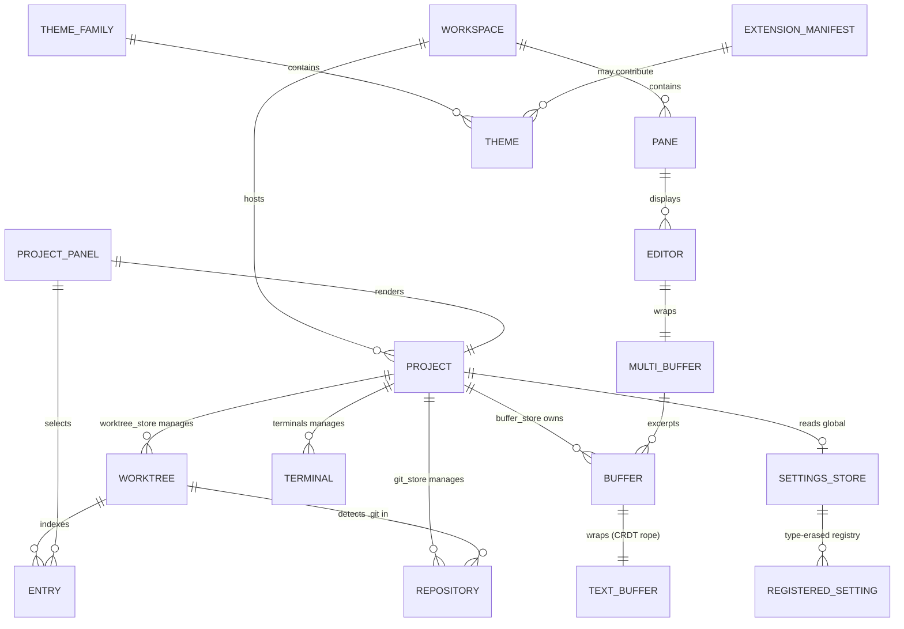

<!-- layout-exempt: rebuild-spec owns all docs/system|features|generated|flows paths -->
<!-- Output path: docs/generated/entities.md -->
<!-- SOURCE-SHAPE ADAPTATION: Zode is a native GPUI desktop app (Rust structs held as `Entity<T>`
     in-process), not a web app with a DB schema. "Entity" here = architecturally central Rust
     struct/enum, not a persisted DB row. `Constraints` column repurposed for Rust-level
     invariants (ownership, uniqueness via typed ID, Option=nullable). No FK/PK in the SQL sense
     except crates/db (sqlite) rows, called out explicitly where used. -->

# Entities

**Project**: Zode
**Rewritten**: 2026-08-04 against the post-fork tree (187 packages / 178 crates).

**What changed from the original pass**: the `Thread`/`Message` entities (sourced from
`crates/agent/src/thread.rs`) are removed entirely — that crate no longer exists. Several fields
on entities in crates this fork deliberately left unchanged (`editor`, `project`, `workspace`)
still exist in the struct definitions but are now **vestigial**: nothing in this fork ever
populates them, because the subsystem that used to (collaboration, AI agents, edit prediction)
was removed. Each is called out explicitly below rather than silently dropped from the field
list — the field is real, accurately transcribed from source; only its behavior changed.

## Entity Relationship Diagram

## Entities

### Workspace

**Source**: `crates/workspace/src/workspace.rs:1343`

**Description**: Top-level window content model. One `Workspace` per OS window; hosts panes/docks/panels, owns the active `Project`, and is the root for app-wide action dispatch (`register_action`, workspace.rs:7460). Held as `Entity<Workspace>`.

| Attribute | Type | Constraints | Description |
|-----------|------|-------------|-------------|
| weak_self | WeakEntity<Self> | | Self-reference for callbacks |
| center | PaneGroup | NOT NULL | Root split-pane tree of the main editor area |
| left_dock / bottom_dock / right_dock | Entity<Dock> | NOT NULL | The three dockable panel containers |
| panes | Vec<Entity<Pane>> | NOT NULL | All panes in this window |
| active_pane | Entity<Pane> | NOT NULL | Currently focused pane |
| status_bar | Entity<StatusBar> | NOT NULL | Bottom status bar |
| project | Entity<Project> | NOT NULL, 1 per Workspace | The workspace's active project |
| database_id | Option<WorkspaceId> | nullable, FK-like → `crates/db` sqlite row | Persisted-session identity |
| app_state | Arc<AppState> | NOT NULL | Shared app-global services |
| follower_states | HashMap<CollaboratorId, FollowerState> | | **Vestigial** — live-share follow-mode state; the field still exists but is never populated, since the collaboration subsystem that would add entries to it was removed |
| session_id | Option<String> | nullable | **Vestigial** — collaboration session identifier; always `None` in this fork |
| multi_workspace | Option<WeakEntity<MultiWorkspace>> | nullable | Parent container when multiple workspaces share a window |
| open_mode (call-param) | OpenMode (enum) | NOT NULL, not persisted | How this Workspace was attached to its window on open — see Discriminator |

**Relationships**:
- One-to-One with `Project` (a `Workspace` holds exactly one `Entity<Project>`; multiple workspaces can share worktrees only in Local mode, not the Project entity itself)
- One-to-Many with `Pane` (via `panes`)
- One-to-Many with `Dock`/panels (via left/bottom/right_dock)

**Discriminator Fields**:

| Field | DISC-### | Values | Description |
|-------|----------|--------|-------------|
| open_mode (call-param) | DISC-001 | NewWindow, Add, Activate | How a workspace is attached to a window on open — new window vs. added-inactive vs. added-and-activated |

---

### Project

**Source**: `crates/project/src/project.rs:213`

**Description**: Per-workspace-root coordinator. The central hub tying together worktrees, buffers, LSP, DAP (debugger), git, tasks, and collaboration state for one open project (which may span multiple worktrees).

| Attribute | Type | Constraints | Description |
|-----------|------|-------------|-------------|
| active_entry | Option<ProjectEntryId> | nullable | Currently selected file-tree entry |
| languages | Arc<LanguageRegistry> | NOT NULL | Registry of known languages/grammars |
| dap_store | Entity<DapStore> | NOT NULL | Debug Adapter Protocol session store |
| worktree_store | Entity<WorktreeStore> | NOT NULL | Owns all `Worktree` entities for this project |
| buffer_store | Entity<BufferStore> | NOT NULL | Owns all open `Buffer` entities |
| git_store | Entity<GitStore> | NOT NULL | Owns all `Repository` entities detected |
| lsp_store | Entity<LspStore> | NOT NULL | Language server processes + requests |
| task_store | Entity<TaskStore> | NOT NULL | Runnable tasks (tasks.json) |
| context_server_store | Entity<ContextServerStore> | NOT NULL | MCP server connections |
| terminals | Terminals | NOT NULL | Open terminal instances for this project |
| client_state | ProjectClientState (enum) | NOT NULL | Local always in this fork; the `Shared`/`Collab` variants still exist in the enum (kept for a test-only helper, `mark_as_collab_for_testing`) but are never constructed by any real code path — see discriminator |
| collaborators | HashMap<proto::PeerId, Collaborator> | | **Vestigial** — always empty; nothing populates it since the collaboration subsystem was removed |
| fs | Arc<dyn Fs> | NOT NULL | Filesystem abstraction (real or in-memory) |
| remote_client | Option<Entity<RemoteClient>> | nullable | Set when this is a remote-dev project (SSH) — this path is live and rebuilt in this fork on a direct connection, not through the removed collaboration relay |
| settings_observer | Entity<SettingsObserver> | NOT NULL | Watches project-local settings files |
| agent_location | Option<AgentLocation> | nullable | **Vestigial** — always `None`; nothing populates it since the AI agent subsystem was removed |

**Relationships**:
- One-to-Many with `Worktree` (via `worktree_store`)
- One-to-Many with `Buffer` (via `buffer_store`)
- One-to-Many with `Repository` (via `git_store`)
- One-to-Many with `Terminal` (via `terminals`)
- Many-to-One with `Workspace` (a Project belongs to one Workspace at a time, but Projects can outlive being displayed, e.g. headless/remote)

**Discriminator Fields**:

| Field | DISC-### | Values | Description |
|-------|----------|--------|-------------|
| client_state | DISC-002 | Local, Shared { .. }, Collab { .. } | Always `Local` in this fork. `Shared`/`Collab` variants remain in the enum only because a test-support helper (`mark_as_collab_for_testing`) constructs them; no production code path does |

---

### Worktree

**Source**: `crates/worktree/src/worktree.rs:92` (enum), `:128` (LocalWorktree), `:155` (RemoteWorktree), `:171` (Snapshot)

**Description**: A single filesystem root's live index/watcher — the in-memory mirror of one directory tree opened in a project. Two variants: `Local` (owns a filesystem scanner) and `Remote` (mirrors a host's worktree over the wire).

| Attribute | Type | Constraints | Description |
|-----------|------|-------------|-------------|
| (enum) Worktree | Local(LocalWorktree) \| Remote(RemoteWorktree) | NOT NULL | Discriminated union — see Discriminator Fields |
| snapshot.id | WorktreeId | PK-like, unique per project | Stable identifier for this worktree |
| snapshot.abs_path | Arc<SanitizedPath> | NOT NULL | Root absolute path on disk |
| snapshot.entries_by_path | SumTree<Entry> | NOT NULL | Indexed file/dir entries, path-ordered |
| snapshot.entries_by_id | SumTree<PathEntry> | NOT NULL | Same entries, id-ordered |
| snapshot.scan_id / completed_scan_id | usize | NOT NULL | Generation counters for in-flight vs. completed filesystem scans |
| LocalWorktree.fs | Arc<dyn Fs> | NOT NULL | Filesystem abstraction used for scanning |
| LocalWorktree.visible | bool | NOT NULL | Whether shown in the UI file tree |
| LocalSnapshot.git_repositories | TreeMap<ProjectEntryId, LocalRepositoryEntry> | | Git repos discovered under this worktree |
| RemoteWorktree.project_id | u64 | NOT NULL | Remote project session id |
| RemoteWorktree.replica_id | ReplicaId | NOT NULL | CRDT replica identity for remote edits |

**Relationships**:
- Many-to-One with `Project` (via `WorktreeStore`)
- One-to-Many with `Entry` (via `entries_by_path`/`entries_by_id`)
- One-to-Many with `Repository` (a worktree may contain 0..N nested git repos, including submodules)

**Discriminator Fields**:

| Field | Code | Values | Description |
|-------|----------|--------|-------------|
| Worktree (enum variant) | DISC-003 | Local, Remote | Local = filesystem-backed with its own background scanner; Remote = mirrors a host worktree's snapshot over RPC, no direct disk access |

---

### Entry

**Source**: `crates/worktree/src/worktree.rs:3555`

**Description**: A single file or directory entry indexed inside a `Worktree`.

| Attribute | Type | Constraints | Description |
|-----------|------|-------------|-------------|
| id | ProjectEntryId | PK-like, unique within worktree | Stable entry identity (survives renames within a scan) |
| kind | EntryKind (enum) | NOT NULL | UnloadedDir, PendingDir, Dir, File — see Discriminator |
| path | Arc<RelPath> | NOT NULL | Path relative to worktree root |
| inode | u64 | NOT NULL | OS inode number |
| mtime | Option<MTime> | nullable | Last-modified time |
| is_ignored | bool | NOT NULL | Excluded by `.gitignore` |
| is_hidden | bool | NOT NULL | Dotfile / hidden-dir member |
| is_always_included | bool | NOT NULL | Forced into search results despite exclusions |
| is_external | bool | NOT NULL | Reachable only via a symlink outside the worktree |
| is_private | bool | NOT NULL | Treated as a `.env`-like secret file |
| size | u64 | NOT NULL | File size in bytes |

**Relationships**:
- Many-to-One with `Worktree` (via `entries_by_path`/`entries_by_id` SumTree)

**Discriminator Fields**:

| Field | Code | Values | Description |
|-------|----------|--------|-------------|
| kind | DISC-004 | UnloadedDir, PendingDir, Dir, File | Lazy-load state of a directory (not yet scanned / scan in flight / scanned) vs. a plain file |

---

### TextBuffer (crates/text `Buffer`)

**Source**: `crates/text/src/text.rs:59`

**Description**: The raw CRDT rope-backed text storage layer — replicated, undoable text with no language awareness. Wrapped by `language::Buffer` (below) to add syntax/diagnostics.

| Attribute | Type | Constraints | Description |
|-----------|------|-------------|-------------|
| snapshot | BufferSnapshot | NOT NULL | Immutable point-in-time text state |
| history | History | NOT NULL | Undo/redo transaction log |
| deferred_ops | OperationQueue<Operation> | NOT NULL | Remote ops not yet applicable (waiting on causal deps) |
| lamport_clock | clock::Lamport | NOT NULL | Logical clock for CRDT ordering |
| subscriptions | Topic<usize> | NOT NULL | Change-notification fanout |
| BufferSnapshot.visible_text / deleted_text | Rope | NOT NULL | Live text vs. tombstoned (deleted-but-retained-for-CRDT) text |
| BufferSnapshot.version | clock::Global | NOT NULL | Vector-clock version of this snapshot |
| BufferSnapshot.remote_id | BufferId | PK-like, unique | Cross-replica buffer identity |
| BufferSnapshot.replica_id | ReplicaId | NOT NULL | Which replica (client) authored ops in this snapshot |

**Relationships**:
- One-to-One with `language::Buffer` (wrapped by, not referenced from — `language::Buffer.text: TextBuffer`)

**Discriminator Fields**: None (see `language::Buffer.line_ending`/`Capability` below for the meaningful discriminators at this layer).

---

### Buffer (crates/language, language-aware)

**Source**: `crates/language/src/buffer.rs:98`

**Description**: In-memory representation of a source file including text, syntax tree, git status, and diagnostics. This is the `Buffer` most of the app (Editor, Project) actually holds.

| Attribute | Type | Constraints | Description |
|-----------|------|-------------|-------------|
| text | TextBuffer | NOT NULL | The wrapped CRDT text layer (see above) |
| file | Option<Arc<dyn File>> | nullable | Filesystem binding; None = unsaved scratch buffer |
| language | Option<Arc<Language>> | nullable | Detected/assigned language for syntax highlighting |
| syntax_map | Mutex<SyntaxMap> | NOT NULL | Tree-sitter parse tree(s), possibly multi-language (embedded langs) |
| diagnostics | TreeMap<LanguageServerId, DiagnosticSet> | | LSP diagnostics, keyed per language server |
| capability | Capability (enum) | NOT NULL | ReadWrite, Read, ReadOnly — see Discriminator |
| has_conflict | bool | NOT NULL | On-disk file changed since last load/save |
| saved_mtime | Option<MTime> | nullable | mtime at last load/save, for conflict detection |
| saved_version / preview_version | clock::Global | NOT NULL | Version vectors marking saved state |
| branch_state | Option<BufferBranchState> | nullable | Set when this buffer is a "branch" (e.g. diff preview) of another buffer |
| encoding | &'static Encoding | NOT NULL | Text encoding (UTF-8, etc.) used on disk |
| has_bom | bool | NOT NULL | Byte-order-mark presence |
| remote_selections | TreeMap<ReplicaId, SelectionSet> | | Populated per-replica selection state, keyed by `ReplicaId` — this mechanism is shared with SSH remote development's buffer replication (still live), not solely the removed collaboration path; whether it currently receives any entries in a fork with no other-replica collaborator was not independently re-verified |
| parse_status | watch::Receiver<ParseStatus> | NOT NULL | Idle/Parsing state of the tree-sitter background parse (buffer.rs:120) |

**Relationships**:
- Many-to-One with `Project` (via `BufferStore`)
- One-to-One with `TextBuffer` (composition, `text` field)
- Many-to-One with `Language` (optional)
- One-to-Many with `MultiBuffer` (a Buffer may be excerpted into 0..N MultiBuffers)

**Discriminator Fields**:

| Field | Code | Values | Description |
|-------|----------|--------|-------------|
| capability | DISC-005 | ReadWrite, Read, ReadOnly | ReadWrite = normal editable replica; Read = mutable replica toggled to read-only display; ReadOnly = a replica that structurally cannot accept edits (e.g. remote follower without write access) |
| parse_status | DISC-006 | Idle, Parsing | Whether tree-sitter parsing is in flight — gates whether syntax-dependent features use stale vs. fresh tree |

---

### MultiBuffer

**Source**: `crates/multi_buffer/src/multi_buffer.rs:73`

**Description**: Combines excerpts from one or more `Buffer`s into a single addressable text view — backs search results, diagnostics lists, diff views, and every `Editor` (even single-file editors use a singleton MultiBuffer).

| Attribute | Type | Constraints | Description |
|-----------|------|-------------|-------------|
| snapshot | RefCell<MultiBufferSnapshot> | NOT NULL | Current excerpt layout snapshot |
| buffers | BTreeMap<BufferId, BufferState> | NOT NULL | Source buffers contributing excerpts |
| diffs | HashMap<BufferId, DiffState> | | Per-buffer git-diff overlay state |
| singleton | bool | NOT NULL | True = exactly one buffer/one excerpt (the common "plain file editor" case) |
| history | History | NOT NULL | Multi-buffer-level undo history |
| capability | Capability (enum) | NOT NULL | Shares the `Capability` enum with `Buffer`'s discriminator |
| title | Option<String> | nullable | Explicit tab title override (else derived from path) |

**Relationships**:
- One-to-Many with `Buffer` (via `buffers` map — excerpts)
- One-to-One with `Editor` (an Editor owns exactly one `Entity<MultiBuffer>`)

**Discriminator Fields**: None (delegates to Buffer's `capability` discriminator).

---

### Editor

**Source**: `crates/editor/src/editor.rs:1131`

**Description**: The visual text-editor UI component — cursor/selection management, scrolling, code actions, completions, diagnostics rendering, edit predictions. The single most-instantiated "view" struct in the app; also used to render read-only diff/output panes.

| Attribute | Type | Constraints | Description |
|-----------|------|-------------|-------------|
| buffer | Entity<MultiBuffer> | NOT NULL | The text being edited/displayed |
| display_map | Entity<DisplayMap> | NOT NULL | Soft-wrap/fold/inlay presentation layer over the buffer |
| selections | SelectionsCollection | NOT NULL | Current cursor(s)/selection ranges |
| scroll_manager | ScrollManager | NOT NULL | Viewport scroll position/state |
| mode | EditorMode (enum) | NOT NULL | Full editor vs. single-line vs. auto-height, etc. — see Discriminator |
| project | Option<Entity<Project>> | nullable | Set when this editor is backed by a real project (None for standalone/scratch editors) |
| workspace | Option<(WeakEntity<Workspace>, Option<WorkspaceId>)> | nullable | Owning workspace, if any |
| completion_provider | Option<Rc<dyn CompletionProvider>> | nullable | Pluggable completions source (LSP; no AI provider registers itself anymore) |
| semantics_provider | Option<Rc<dyn SemanticsProvider>> | nullable | Pluggable hover/goto-def/references source |
| edit_prediction_provider | Option<RegisteredEditPredictionDelegate> | nullable | **Vestigial** — always `None`; the AI inline-completion crate that used to register here was removed |
| active_edit_prediction | Option<EditPredictionState> | nullable | **Vestigial** — always `None`, follows from the above |
| diagnostics_max_severity | DiagnosticSeverity | NOT NULL | Filter threshold for shown diagnostics |
| read_only | bool | NOT NULL | Blocks all edit operations regardless of buffer capability |
| leader_id | Option<CollaboratorId> | nullable | **Vestigial** — always `None`; there is no other collaborator to follow |
| show_git_blame_gutter / show_git_blame_inline | bool | NOT NULL | Git-blame display toggles |

**Relationships**:
- One-to-One with `MultiBuffer` (owns exactly one)
- Many-to-One with `Project` (optional)
- Many-to-One with `Workspace` (optional, via weak ref)
- Referenced by `ProjectPanel` (`filename_editor: Entity<Editor>`) and many other panels for inline rename/filter inputs

**Discriminator Fields**:

| Field | Code | Values | Description |
|-------|----------|--------|-------------|
| mode | DISC-007 | (EditorMode variants, e.g. Full, SingleLine, AutoHeight — see `editor.rs`) | Governs which UI chrome (gutter, breadcrumbs, minimap) renders and whether multi-line input is permitted |

---

### SettingsStore

**Source**: `crates/settings/src/settings_store.rs:145`

**Description**: Central settings registry. ~40 crates register a schema via `impl Settings for FooSettings`; the store merges default/user/global/extension/server/project-local JSON layers by precedence and notifies registrants on change.

| Attribute | Type | Constraints | Description |
|-----------|------|-------------|-------------|
| setting_values | HashMap<TypeId, Box<dyn AnySettingValue>> | NOT NULL | Type-erased registry of every registered settings struct |
| default_settings | Rc<SettingsContent> | NOT NULL | Baseline shipped defaults |
| user_settings | Option<UserSettingsContent> | nullable | User's `settings.json` overrides |
| global_settings | Option<Box<SettingsContent>> | nullable | Org/device-wide overrides |
| extension_settings | Option<Box<SettingsContent>> | nullable | Settings contributed by installed extensions |
| server_settings | Option<Box<SettingsContent>> | nullable | Remote-dev server-side overrides |
| local_settings | BTreeMap<(WorktreeId, Arc<RelPath>), SettingsContent> | | Per-directory project-local `.zed/settings.json` overrides |
| merged_settings | Rc<SettingsContent> | NOT NULL | Precomputed result of merging all layers by precedence |
| file_errors | BTreeMap<SettingsFile, SettingsParseResult> | | Parse errors surfaced per settings source |

**Relationships**:
- One-to-Many with `RegisteredSetting` (global `inventory::collect!` registry, not stored on the struct itself)
- Referenced by nearly every other entity indirectly (e.g. `Worktree`, `Editor`, `Terminal` all read effective settings through this store)

**Discriminator Fields**:

| Field | Code | Values | Description |
|-------|----------|--------|-------------|
| SettingsFile (enum, precedence-ordered) | DISC-008 | Default, Global, User, Server, Project((WorktreeId, RelPath)) | Determines merge precedence: Project > Server > User ≈ Global > Default (see `Ord` impl in settings_store.rs) |

---

### Theme / ThemeFamily

**Source**: `crates/theme/src/theme.rs:192` (ThemeFamily), `:208` (Theme)

**Description**: The color/typography data model for the whole UI. A `ThemeFamily` groups related `Theme` variants (e.g. Atelier family → Cave/Dune/Forest…); each `Theme` carries appearance + full style set.

| Attribute | Type | Constraints | Description |
|-----------|------|-------------|-------------|
| ThemeFamily.id | String | PK-like, unique | Family identifier |
| ThemeFamily.themes | Vec<Theme> | NOT NULL | Member themes |
| ThemeFamily.scales | ColorScales | NOT NULL | Shared color-ramp source data (legacy, slated for removal per doc comment) |
| Theme.id | String | PK-like, unique | Theme identifier |
| Theme.name | SharedString | NOT NULL | Display name |
| Theme.appearance | Appearance (enum) | NOT NULL | Light or Dark — see Discriminator |
| Theme.styles | ThemeStyles | NOT NULL | Full style bundle: system/accent/player/syntax/status colors + window background appearance |

**Relationships**:
- One-to-Many: `ThemeFamily` → `Theme`
- Referenced (contributed) by `ExtensionManifest.themes` (extension-provided theme files, loaded via `theme_extension`)

**Discriminator Fields**:

| Field | Code | Values | Description |
|-------|----------|--------|-------------|
| appearance | DISC-009 | Light, Dark | Governs default contrast assumptions and which system-appearance the theme is auto-selected for |

---

### GitStore / Repository

**Source**: `crates/project/src/git_store.rs:95` (GitStore), `:281` (RepositorySnapshot), `:334` (Repository)

**Description**: `GitStore` owns all `Repository` entities detected within a `Project`'s worktrees. `Repository` wraps a working copy's status, branch, and history state and dispatches git operations as background jobs.

| Attribute | Type | Constraints | Description |
|-----------|------|-------------|-------------|
| RepositorySnapshot.id | RepositoryId | PK-like, unique | Repository identity within the project |
| RepositorySnapshot.statuses_by_path | SumTree<StatusEntry> | NOT NULL | Per-file git status (modified/added/etc.), path-indexed |
| RepositorySnapshot.work_directory_abs_path | Arc<Path> | NOT NULL | Working-copy root on disk |
| RepositorySnapshot.branch | Option<Branch> | nullable | Current checked-out branch (None = detached HEAD) |
| RepositorySnapshot.branch_list | Arc<[Branch]> | NOT NULL | All known local/remote branches |
| RepositorySnapshot.head_commit | Option<CommitDetails> | nullable | Current HEAD commit metadata |
| RepositorySnapshot.merge | MergeDetails | NOT NULL | In-progress merge/rebase/cherry-pick state |
| RepositorySnapshot.stash_entries | GitStash | NOT NULL | Stash list |
| RepositorySnapshot.linked_worktrees | Arc<[GitWorktree]> | | Other `git worktree` checkouts linked to this repo |
| Repository.commit_message_buffer | Option<Entity<Buffer>> | nullable | Live editor buffer for an in-progress commit message |
| Repository.pending_ops | SumTree<PendingOps> | | Queued git operations not yet executed |
| Repository.job_sender / active_jobs | mpsc::UnboundedSender / HashMap<JobId, JobInfo> | NOT NULL | Async git-command job queue |

**Relationships**:
- Many-to-One with `GitStore` (via job dispatch), which is One-to-One with `Project`
- Many-to-One with `Worktree` (a Repository's work directory is anchored inside one or more worktrees, or above them via `WorkDirectory::AboveProject`)
- Optional One-to-One with `Buffer` (commit message editor)

**Discriminator Fields**:

| Field | Code | Values | Description |
|-------|----------|--------|-------------|
| WorkDirectory (enum) | DISC-010 | InProject { relative_path }, AboveProject { absolute_path, location_in_repo } | Whether the `.git` root is inside the opened project folder or in an ancestor directory (project root is a subfolder of the repo) |

---

### ProjectPanel

**Source**: `crates/project_panel/src/project_panel.rs:135`

**Description**: The file-tree sidebar panel UI — renders `Worktree`/`Entry` data as an interactive tree with drag/drop, rename, and diagnostics badges.

| Attribute | Type | Constraints | Description |
|-----------|------|-------------|-------------|
| project | Entity<Project> | NOT NULL | Project whose worktrees are rendered |
| workspace | WeakEntity<Workspace> | NOT NULL | Owning workspace (weak to avoid cycles) |
| marked_entries | Vec<SelectedEntry> | NOT NULL | Multi-selected entries (for bulk ops) |
| selection | Option<SelectedEntry> | nullable | Primary/focused selection |
| filename_editor | Entity<Editor> | NOT NULL | Inline single-line editor used for rename/new-file input |
| clipboard | Option<ClipboardEntry> | nullable | Cut/copy buffer for paste operations |
| diagnostics / diagnostic_counts | HashMap<(WorktreeId, Arc<RelPath>), ...> | | Per-file diagnostic severity/count overlays |
| drag_target_entry | Option<DragTarget> | nullable | Current drag-and-drop hover target |

**Relationships**:
- Many-to-One with `Project`
- Many-to-One with `Workspace`
- References `Entry` (via worktree snapshots, not owned)
- Owns one `Editor` (rename/filename input)

**Discriminator Fields**: None (see `Entry.kind` for the underlying tree-node discriminator this panel renders against).

---

### Terminal

**Source**: `crates/terminal/src/terminal.rs:852`

**Description**: A single embedded terminal instance (wraps the Alacritty terminal emulator core). Owned by a `Project`'s `Terminals` registry; rendered inside panes/panels.

| Attribute | Type | Constraints | Description |
|-----------|------|-------------|-------------|
| terminal_type | TerminalType | NOT NULL | Discriminates task-runner terminal vs. interactive shell, etc. |
| term | Arc<FairMutex<Term<ZedListener>>> | NOT NULL | The underlying Alacritty terminal grid/state |
| matches | Vec<RangeInclusive<AlacPoint>> | | Current search-highlight matches |
| last_content | TerminalContent | NOT NULL | Cached rendered content snapshot |
| task | Option<TaskState> | nullable | Set when this terminal was spawned to run a `tasks.json` task rather than an interactive shell |
| vi_mode_enabled | bool | NOT NULL | Vi-style terminal navigation toggle |
| is_remote_terminal | bool | NOT NULL | True for terminals opened on a remote-dev host |
| child_exited | Option<ExitStatus> | nullable | Set once the shell/process has exited |
| activation_script | Vec<String> | | Shell init commands (e.g. venv activation) run on spawn |

**Relationships**:
- Many-to-One with `Project` (via `Terminals` registry, `project.rs:242`)

**Discriminator Fields**:

| Field | Code | Values | Description |
|-------|----------|--------|-------------|
| task (presence) | DISC-011 | Some(TaskState), None | Some = this terminal is running a defined task and reports exit status/output back to `tasks_ui`; None = plain interactive shell with no task lifecycle |

---

### ExtensionManifest

**Source**: `crates/extension/src/extension_manifest.rs:82`

**Description**: Deserialized `extension.toml` schema describing what a Zed extension provides (themes, languages, grammars, language servers, MCP context servers, agent servers, slash commands, debug adapters).

| Attribute | Type | Constraints | Description |
|-----------|------|-------------|-------------|
| id | Arc<str> | PK-like, unique | Extension identifier |
| name | String | NOT NULL | Display name |
| version | Arc<str> | NOT NULL | Semver-ish version string |
| schema_version | SchemaVersion | NOT NULL | Manifest format version — see Discriminator |
| lib | LibManifestEntry | NOT NULL | WASM entry-point config |
| themes / icon_themes / languages | Vec<RelPathBuf> | | Contributed asset file paths |
| grammars | BTreeMap<Arc<str>, GrammarManifestEntry> | | Tree-sitter grammars contributed |
| language_servers | BTreeMap<LanguageServerName, LanguageServerManifestEntry> | | LSP servers contributed |
| context_servers | BTreeMap<Arc<str>, ContextServerManifestEntry> | | MCP servers contributed |
| agent_servers | BTreeMap<Arc<str>, AgentServerManifestEntry> | | **Vestigial** — the manifest schema still accepts this field for backward compatibility with existing extensions, but nothing in this fork consumes it (the AI agent subsystem was removed) |
| language_model_providers | BTreeMap<Arc<str>, LanguageModelProviderManifestEntry> | | **Vestigial** — same as above; nothing consumes it now that the LLM provider subsystem was removed |
| capabilities | Vec<ExtensionCapability> | | Sandboxed permissions requested (e.g. process-exec allowlist) |
| debug_adapters / debug_locators | BTreeMap<Arc<str>, ...> | | DAP adapters/locators contributed |

**Relationships**:
- One-to-Many with `Theme` (via `themes` file list, loaded lazily by `theme_extension`)
- One-to-Many with language servers, grammars, context servers, agent servers, LLM providers (all keyed maps above)

**Discriminator Fields**:

| Field | Code | Values | Description |
|-------|----------|--------|-------------|
| schema_version | DISC-012 | (versioned enum, legacy `OldExtensionManifest` vs. current `ExtensionManifest`) | Determines which manifest parser/migration path is applied when loading `extension.toml` |
| ExtensionCapability (enum, per-entry) | DISC-013 | ProcessExec, DownloadFile, NpmInstallPackage | Which sandboxed permission class a capability grant belongs to (crates/extension/src/capabilities.rs:14) — ProcessExec allows running an allowlisted command, DownloadFile allows fetching from an allowlisted host, NpmInstallPackage allows installing an allowlisted npm package |

---

## Validation Rules

### Buffer (language)

| Rule | Field | Constraint | Error Message |
|------|-------|------------|---------------|
| CapabilityGate | capability | Edits rejected unless `Capability::ReadWrite` | (no user-facing message; edit operations are simply no-ops/errors at the API level — `editable()` guard) |
| ConflictDetection | saved_mtime vs. on-disk mtime | Buffer flagged `has_conflict = true` if disk mtime advances past `saved_mtime` without a matching save | "This file has changed on disk" (UI toast) |

### Worktree / Entry

| Rule | Field | Constraint | Error Message |
|------|-------|------------|---------------|
| ScanGeneration | scan_id / completed_scan_id | Snapshot reads must not observe a scan generation newer than `completed_scan_id` | N/A (internal consistency invariant, not user-facing) |

### SettingsStore

| Rule | Field | Constraint | Error Message |
|------|-------|------------|---------------|
| PrecedenceOrdering | SettingsFile (Ord impl) | Project > Server > User/Global > Default, enforced by the `Ord` implementation used when merging | Settings parse errors surfaced per-file via `file_errors: BTreeMap<SettingsFile, SettingsParseResult>` |

### ExtensionManifest

| Rule | Field | Constraint | Error Message |
|------|-------|------------|---------------|
| CapabilityAllowlist | capabilities (ProcessExec) | `allow_exec` checks the requested command+args against the extension's declared `ExtensionCapability::ProcessExec` entries before permitting a sandboxed extension to spawn a process | (returns `Result`; caller surfaces "Extension attempted to run a disallowed command" style error) |

---

## Summary

- **Total Entities**: 14 (Workspace, Project, Worktree, Entry, TextBuffer, Buffer (language), MultiBuffer, Editor, SettingsStore, Theme/ThemeFamily, GitStore/Repository, ProjectPanel, Terminal, ExtensionManifest)
- **Total Relationships**: 17 (see ERD + per-entity Relationships sections; down from 20 after removing Thread/Message and their 3 relationships)
- **Total Discriminators assigned**: 13 (sequential, no gaps — renumbered after removing Message's 4 discriminators)

## Scope Notes / Limits

- This is a native GPUI desktop app, not a web app with a DB-backed schema — "entities" are architecturally central Rust structs held as `Entity<T>`, not persisted rows. The only genuine persisted storage is `crates/db` (sqlite, workspace/session state) and `crates/settings`/`crates/theme` config files; these were not modeled as their own row-level schema.
- This document covers the most architecturally central types, not an exhaustive struct inventory. Entities not covered but referenced (`LanguageRegistry`, `Language`, `LspStore`, `DapStore`, `TaskStore`, `ContextServerStore`, `RemoteClient`, `Pane`/`PaneGroup`/`Dock`) are named in Relationships but not given their own full field breakdown.
- Field lists for large structs (`Editor` has 100+ fields, `Workspace` has 45+, `Project` has 30+) are curated to the fields with real cross-entity or behavioral significance, not a full transcription of every private field.
- The `Thread`/`Message`/`LanguageModel` entities from the original pass are gone from this document because `crates/agent` (their source) no longer exists in this fork — not because they were curated out.
