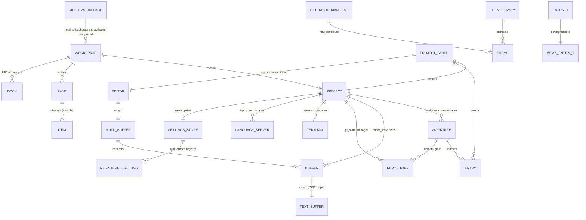

<!-- layout-exempt: rebuild-spec owns all docs/system|features|generated|flows paths -->
<!-- Output path: docs/generated/entities.md -->
<!-- SOURCE-SHAPE ADAPTATION: Zode/zode is a native GPUI desktop app (Rust structs held as
     `Entity<T>` in-process), not a web app with a DB schema. "Entity" here = architecturally
     central Rust struct/enum, not a persisted DB row. `Constraints` column repurposed for
     Rust-level invariants (ownership, uniqueness via typed ID, Option=nullable). No FK/PK in
     the SQL sense except crates/db (sqlite) rows, called out explicitly where used.
     MODEL### codes assigned per code-formats.md (project-scoped, sequential by discovery
     order) so feature specs/FS.1 researchers can cross-reference entities by ID. -->

# Entities

**Project**: Zode (Zode Editor fork)
**Generated**: 2026-08-07

## Entity Relationship Diagram

## Entities

### MultiWorkspace

**MODEL001_MultiWorkspace**

**Source**: `crates/workspace/src/multi_workspace.rs:317`

**Description**: Per-OS-window container introduced by this fork's multi-project-hibernation feature. Owns every `Workspace`/`Project` pair open in one window, tracks which is the visibly active one, and drives idle-timeout hibernation of the rest.

| Attribute              | Type                                  | Constraints | Description                                                                                       |
| ---------------------- | ------------------------------------- | ----------- | ------------------------------------------------------------------------------------------------- |
| window_id              | WindowId                              | NOT NULL    | OS window this container belongs to                                                               |
| retained_workspaces    | Vec<Entity<Workspace>>                | NOT NULL    | Background workspaces explicitly kept alive (not the active one)                                  |
| project_groups         | Vec<ProjectGroupState>                | NOT NULL    | Per-project bookkeeping (linked worktrees, activity)                                              |
| active_workspace       | Entity<Workspace>                     | NOT NULL    | The one workspace currently shown in the window                                                   |
| sidebar / sidebar_open | Option<Box<dyn SidebarHandle>> / bool |             | Always-visible project rail (added this fork, see `crates/sidebar`)                               |
| hibernate_timers       | HashMap<EntityId, Task<()>>           |             | Pending hibernate-after-idle timers keyed by workspace `EntityId`; dropping the `Task` cancels it |
| previous_focus_handle  | Option<FocusHandle>                   | nullable    | Focus to restore after switching workspaces                                                       |

**Relationships**:

- One-to-Many with `Workspace` (retains N background + 1 active per window)
- One-to-One with `Workspace` for `active_workspace`

**Discriminator Fields**: None directly (see `Project.activity` for the per-project lifecycle state this container drives).

---

### Workspace

**MODEL002_Workspace**

**Source**: `crates/workspace/src/workspace.rs:1341`

**Description**: Top-level window-content model. One `Workspace` per open project-in-a-window slot (a window may hold several via `MultiWorkspace`); hosts panes/docks/status bar, owns the active `Project`, and is the root for app-wide action dispatch. Held as `Entity<Workspace>`.

| Attribute                            | Type                                   | Constraints                                | Description                                                 |
| ------------------------------------ | -------------------------------------- | ------------------------------------------ | ----------------------------------------------------------- |
| weak_self                            | WeakEntity<Self>                       |                                            | Self-reference for callbacks                                |
| center                               | PaneGroup                              | NOT NULL                                   | Root split-pane tree of the main editor area                |
| left_dock / bottom_dock / right_dock | Entity<Dock>                           | NOT NULL                                   | The three dockable panel containers                         |
| panes                                | Vec<Entity<Pane>>                      | NOT NULL                                   | All panes in this window slot                               |
| active_pane                          | Entity<Pane>                           | NOT NULL                                   | Currently focused pane                                      |
| status_bar                           | Entity<StatusBar>                      | NOT NULL                                   | Bottom status bar                                           |
| project                              | Entity<Project>                        | NOT NULL, 1 per Workspace                  | The workspace's active project                              |
| database_id                          | Option<WorkspaceId>                    | nullable, FK-like → `crates/db` sqlite row | Persisted-session identity                                  |
| app_state                            | Arc<AppState>                          | NOT NULL                                   | Shared app-global services                                  |
| follower_states                      | HashMap<CollaboratorId, FollowerState> |                                            | Live-share follow-mode state                                |
| session_id                           | Option<String>                         | nullable                                   | Collaboration session identifier                            |
| multi_workspace                      | Option<WeakEntity<MultiWorkspace>>     | nullable                                   | Parent container when this window hosts multiple workspaces |
| active_worktree_creation             | ActiveWorktreeCreation                 | NOT NULL                                   | In-flight state for creating a linked git worktree          |
| bounds / centered_layout             | Bounds<Pixels> / bool                  | NOT NULL                                   | Window geometry persistence                                 |

**Relationships**:

- One-to-One with `Project` (a `Workspace` holds exactly one `Entity<Project>`)
- Many-to-One with `MultiWorkspace` (0 or 1 parent; a standalone single-project window has none)
- One-to-Many with `Pane` (via `panes`)
- One-to-Many with `Dock` (via left/bottom/right_dock)

**Discriminator Fields**:

| Field                                                      | DISC-### | Values         | Description                                                                                                                                                                                       |
| ---------------------------------------------------------- | -------- | -------------- | ------------------------------------------------------------------------------------------------------------------------------------------------------------------------------------------------- |
| open_mode (call-param, `OpenMode` enum, workspace.rs:1422) | DISC-001 | NewWindow, Add | How a workspace is attached to a window on open — brand-new OS window vs. added to an existing window's `MultiWorkspace` (Add covers both deserialization-restore and live add-or-activate flows) |

---

### Project

**MODEL003_Project**

**Source**: `crates/project/src/project.rs:215`

**Description**: Per-workspace-root coordinator. The central hub tying together worktrees, buffers, LSP, DAP (debugger), git, tasks, and terminals for one open project (which may span multiple worktrees). Carries this fork's multi-project hibernation lifecycle (`activity` field).

| Attribute            | Type                                 | Constraints | Description                                                                                               |
| -------------------- | ------------------------------------ | ----------- | --------------------------------------------------------------------------------------------------------- |
| active_entry         | Option<ProjectEntryId>               | nullable    | Currently selected file-tree entry                                                                        |
| activity             | ProjectActivity (enum)               | NOT NULL    | Active / Warm / Hibernated — see Discriminator                                                            |
| languages            | Arc<LanguageRegistry>                | NOT NULL    | Registry of known languages/grammars                                                                      |
| dap_store            | Entity<DapStore>                     | NOT NULL    | Debug Adapter Protocol session store                                                                      |
| agent_server_store   | Entity<AgentServerStore>             | NOT NULL    | External ACP agent-server process registry (contributed by extensions)                                    |
| bookmark_store       | Entity<BookmarkStore>                | NOT NULL    | Bookmarked locations                                                                                      |
| breakpoint_store     | Entity<BreakpointStore>              | NOT NULL    | Debugger breakpoints                                                                                      |
| task_store           | Entity<TaskStore>                    | NOT NULL    | Runnable tasks (tasks.json)                                                                               |
| user_store           | Entity<UserStore>                    | NOT NULL    | Local user/account state                                                                                  |
| worktree_store       | Entity<WorktreeStore>                | NOT NULL    | Owns all `Worktree` entities for this project                                                             |
| buffer_store         | Entity<BufferStore>                  | NOT NULL    | Owns all open `Buffer` entities                                                                           |
| git_store            | Entity<GitStore>                     | NOT NULL    | Owns all `Repository` entities detected                                                                   |
| lsp_store            | Entity<LspStore>                     | NOT NULL    | Language server process lifecycle + requests                                                              |
| context_server_store | Entity<ContextServerStore>           | NOT NULL    | MCP server connections                                                                                    |
| image_store          | Entity<ImageStore>                   | NOT NULL    | Open image-preview buffers                                                                                |
| terminals            | Terminals                            | NOT NULL    | Open terminal instances for this project                                                                  |
| client_state         | ProjectClientState (enum)            | NOT NULL    | Local / Shared / Collab mode — see discriminator                                                          |
| collaborators        | HashMap<proto::PeerId, Collaborator> |             | Remote collaborators in a shared project                                                                  |
| fs                   | Arc<dyn Fs>                          | NOT NULL    | Filesystem abstraction (real or in-memory)                                                                |
| remote_client        | Option<Entity<RemoteClient>>         | nullable    | Set when this is a remote-dev project                                                                     |
| settings_observer    | Entity<SettingsObserver>             | NOT NULL    | Watches project-local settings files                                                                      |
| toolchain_store      | Option<Entity<ToolchainStore>>       | nullable    | Per-language toolchain selection                                                                          |
| agent_location       | Option<AgentLocation>                | nullable    | `{buffer, position}` — where an external agent server is currently editing                                |
| hibernate_retry      | Option<Task<()>>                     | nullable    | Deferred hibernate retry (e.g. blocked by an unsaved buffer or active debug session); dropping cancels it |

**Relationships**:

- One-to-Many with `Worktree` (via `worktree_store`)
- One-to-Many with `Buffer` (via `buffer_store`)
- One-to-Many with `Repository` (via `git_store`)
- One-to-Many with `Terminal` (via `terminals`)
- One-to-Many with `LanguageServer` (via `lsp_store`)
- Many-to-One with `Workspace` (a Project belongs to one Workspace at a time)

**Discriminator Fields**:

| Field        | DISC-### | Values                                                                                         | Description                                                                                                                                                                                                                                                                                                                                                                                                                                       |
| ------------ | -------- | ---------------------------------------------------------------------------------------------- | ------------------------------------------------------------------------------------------------------------------------------------------------------------------------------------------------------------------------------------------------------------------------------------------------------------------------------------------------------------------------------------------------------------------------------------------------- |
| client_state | DISC-002 | Local, Shared { remote_id }, Collab { sharing_has_stopped, capability, remote_id, replica_id } | Local = single-player; Shared = hosting a collab session; Collab = joined someone else's shared project                                                                                                                                                                                                                                                                                                                                           |
| activity     | DISC-003 | Active, Warm, Hibernated                                                                       | Active = this project's workspace is focused, never a hibernation candidate; Warm = unfocused but still fully live, hibernates after an idle timer; Hibernated = idle long enough to be torn down. **Caveat** (see project memory): this is the _label_ driving lifecycle decisions — the underlying LSP/resource layer may lag behind the label by a deferred barrier, so `Hibernated` does not always mean resources have actually stopped yet. |

---

### Worktree

**MODEL004_Worktree**

**Source**: `crates/worktree/src/worktree.rs:92` (enum), `:128` (LocalWorktree), `:160` (RemoteWorktree), `:176` (Snapshot)

**Description**: A single filesystem root's live index/watcher — the in-memory mirror of one directory tree opened in a project. Two variants: `Local` (owns a filesystem scanner) and `Remote` (mirrors a host's worktree over the wire).

| Attribute                            | Type                                           | Constraints                 | Description                                                                             |
| ------------------------------------ | ---------------------------------------------- | --------------------------- | --------------------------------------------------------------------------------------- |
| (enum) Worktree                      | Local(LocalWorktree) \| Remote(RemoteWorktree) | NOT NULL                    | Discriminated union — see Discriminator Fields                                          |
| Snapshot.id                          | WorktreeId                                     | PK-like, unique per project | Stable identifier for this worktree                                                     |
| Snapshot.abs_path                    | Arc<SanitizedPath>                             | NOT NULL                    | Root absolute path on disk                                                              |
| Snapshot.entries_by_path             | SumTree<Entry>                                 | NOT NULL                    | Indexed file/dir entries, path-ordered                                                  |
| Snapshot.entries_by_id               | SumTree<PathEntry>                             | NOT NULL                    | Same entries, id-ordered                                                                |
| Snapshot.scan_id / completed_scan_id | usize                                          | NOT NULL                    | Generation counters for in-flight vs. completed filesystem scans                        |
| LocalWorktree.fs                     | Arc<dyn Fs>                                    | NOT NULL                    | Filesystem abstraction used for scanning                                                |
| LocalWorktree.visible                | bool                                           | NOT NULL                    | Whether shown in the UI file tree                                                       |
| LocalWorktree.scanning_paused        | bool                                           | NOT NULL                    | Set while the project is Warm/Hibernated so scans don't run against a defocused project |
| LocalSnapshot.git_repositories       | TreeMap<ProjectEntryId, LocalRepositoryEntry>  |                             | Git repos discovered under this worktree                                                |
| RemoteWorktree.project_id            | u64                                            | NOT NULL                    | Remote project session id                                                               |
| RemoteWorktree.replica_id            | ReplicaId                                      | NOT NULL                    | CRDT replica identity for remote edits                                                  |

**Relationships**:

- Many-to-One with `Project` (via `WorktreeStore`)
- One-to-Many with `Entry` (via `entries_by_path`/`entries_by_id`)
- One-to-Many with `Repository` (a worktree may contain 0..N nested git repos, including submodules)

**Discriminator Fields**:

| Field                                 | DISC-### | Values                                                                        | Description                                                                                                                            |
| ------------------------------------- | -------- | ----------------------------------------------------------------------------- | -------------------------------------------------------------------------------------------------------------------------------------- |
| Worktree (enum variant)               | DISC-004 | Local, Remote                                                                 | Local = filesystem-backed with its own background scanner; Remote = mirrors a host worktree's snapshot over RPC, no direct disk access |
| WorkDirectory (enum, worktree.rs:207) | DISC-005 | InProject { relative_path }, AboveProject { absolute_path, location_in_repo } | Whether a detected git repo's `.git` root sits inside the opened project folder or in an ancestor directory                            |

---

### Entry

**MODEL005_Entry**

**Source**: `crates/worktree/src/worktree.rs:3632` (struct), `:3674` (EntryKind enum)

**Description**: A single file or directory entry indexed inside a `Worktree`.

| Attribute          | Type              | Constraints                     | Description                                            |
| ------------------ | ----------------- | ------------------------------- | ------------------------------------------------------ |
| id                 | ProjectEntryId    | PK-like, unique within worktree | Stable entry identity (survives renames within a scan) |
| kind               | EntryKind (enum)  | NOT NULL                        | UnloadedDir, PendingDir, Dir, File — see Discriminator |
| path               | Arc<RelPath>      | NOT NULL                        | Path relative to worktree root                         |
| inode              | u64               | NOT NULL                        | OS inode number                                        |
| mtime              | Option<MTime>     | nullable                        | Last-modified time                                     |
| canonical_path     | Option<Arc<Path>> | nullable                        | Resolved path if this entry is reached via a symlink   |
| is_ignored         | bool              | NOT NULL                        | Excluded by `.gitignore`                               |
| is_hidden          | bool              | NOT NULL                        | Dotfile / hidden-dir member                            |
| is_always_included | bool              | NOT NULL                        | Forced into search results despite exclusions          |
| is_external        | bool              | NOT NULL                        | Reachable only via a symlink outside the worktree      |
| is_private         | bool              | NOT NULL                        | Treated as a `.env`-like secret file                   |
| size               | u64               | NOT NULL                        | File size in bytes                                     |
| is_fifo            | bool              | NOT NULL                        | Entry is a named pipe, not a regular file              |

**Relationships**:

- Many-to-One with `Worktree` (via `entries_by_path`/`entries_by_id` SumTree)

**Discriminator Fields**:

| Field | DISC-### | Values                             | Description                                                                                  |
| ----- | -------- | ---------------------------------- | -------------------------------------------------------------------------------------------- |
| kind  | DISC-006 | UnloadedDir, PendingDir, Dir, File | Lazy-load state of a directory (not yet scanned / scan in flight / scanned) vs. a plain file |

---

### Entity<T> / WeakEntity<T>

**MODEL006_EntityHandle**

**Source**: `crates/gpui/src/app/entity_map.rs:246` (AnyEntity), `:414` (Entity<T>), `:740` (WeakEntity<T>)

**Description**: GPUI's own state-handle primitive, not a domain type — included because nearly every other entity in this document (`Workspace`, `Project`, `Buffer`, …) is only ever held as `Entity<T>`, never as a bare struct. A strong `Entity<T>` retains its target alive in the global `EntityMap`; a `WeakEntity<T>` does not and must be `.upgrade()`d before use, returning `None` once the target is dropped.

| Attribute             | Type                          | Constraints                  | Description                                                                                                          |
| --------------------- | ----------------------------- | ---------------------------- | -------------------------------------------------------------------------------------------------------------------- |
| Entity.any_entity     | AnyEntity                     | NOT NULL                     | Type-erased handle (id + refcount bookkeeping); `Entity<T>` wraps it with a `PhantomData<T>` for compile-time typing |
| Entity.entity_type    | PhantomData<fn(T) -> T>       |                              | Zero-sized type tag, no runtime footprint                                                                            |
| AnyEntity.entity_id   | EntityId                      | PK-like, unique process-wide | Stable identity independent of type                                                                                  |
| AnyEntity.entity_type | TypeId                        | NOT NULL                     | Rust `TypeId` of the concrete `T`, used for downcasting `AnyView`/`AnyEntity`                                        |
| AnyEntity.entity_map  | Weak<RwLock<EntityRefCounts>> | NOT NULL                     | Back-reference to the global entity table for refcounting on Drop                                                    |
| WeakEntity.any_entity | AnyWeakEntity                 | NOT NULL                     | Non-retaining counterpart of `AnyEntity`                                                                             |

**Relationships**:

- One-to-One: every strong `Entity<T>` has exactly one corresponding `WeakEntity<T>` obtainable via `.downgrade()`
- Referenced by every other struct-based entity in this document as their storage/ownership mechanism (e.g. `Workspace.panes: Vec<Entity<Pane>>`)

**Discriminator Fields**: None (`Entity<T>` vs `WeakEntity<T>` is an ownership-strength distinction, not a behavioral enum — documented here as prose, not DISC).

---

### TextBuffer (crates/text `Buffer`)

**MODEL007_TextBuffer**

**Source**: `crates/text/src/text.rs:59`

**Description**: The raw CRDT rope-backed text storage layer — replicated, undoable text with no language awareness. Wrapped by `language::Buffer` (below) to add syntax/diagnostics.

| Attribute                                  | Type                      | Constraints              | Description                                                   |
| ------------------------------------------ | ------------------------- | ------------------------ | ------------------------------------------------------------- |
| snapshot                                   | BufferSnapshot            | NOT NULL                 | Immutable point-in-time text state                            |
| history                                    | History                   | NOT NULL                 | Undo/redo transaction log                                     |
| deferred_ops                               | OperationQueue<Operation> | NOT NULL                 | Remote ops not yet applicable (waiting on causal deps)        |
| deferred_replicas                          | HashSet<ReplicaId>        |                          | Replicas whose ops are currently deferred                     |
| lamport_clock                              | clock::Lamport            | NOT NULL                 | Logical clock for CRDT ordering                               |
| subscriptions                              | Topic<usize>              | NOT NULL                 | Change-notification fanout                                    |
| BufferSnapshot.visible_text / deleted_text | Rope                      | NOT NULL                 | Live text vs. tombstoned (deleted-but-retained-for-CRDT) text |
| BufferSnapshot.version                     | clock::Global             | NOT NULL                 | Vector-clock version of this snapshot                         |
| BufferId                                   | NonZeroU64 (newtype)      | PK-like, unique, never 0 | Cross-replica buffer identity                                 |

**Relationships**:

- One-to-One with `language::Buffer` (wrapped by, not referenced from — `language::Buffer.text: TextBuffer` — see below)

**Discriminator Fields**: None (see `language::Buffer.capability`/`.parse_status` for the meaningful discriminators at the layer above).

---

### Buffer (crates/language, language-aware)

**MODEL008_Buffer**

**Source**: `crates/language/src/buffer.rs:98`

**Description**: In-memory representation of a source file including text, syntax tree, git status, and diagnostics. This is the `Buffer` most of the app (Editor, Project) actually holds.

| Attribute                       | Type                                     | Constraints | Description                                                                |
| ------------------------------- | ---------------------------------------- | ----------- | -------------------------------------------------------------------------- |
| snapshot                        | BufferSnapshot                           | NOT NULL    | Wraps the CRDT `TextBuffer` snapshot                                       |
| file                            | Option<Arc<dyn File>>                    | nullable    | Filesystem binding; None = unsaved scratch buffer                          |
| language                        | Option<Arc<Language>>                    | nullable    | Detected/assigned language for syntax highlighting                         |
| syntax_map                      | Mutex<SyntaxMap>                         | NOT NULL    | Tree-sitter parse tree(s), possibly multi-language (embedded langs)        |
| diagnostics                     | TreeMap<LanguageServerId, DiagnosticSet> |             | LSP diagnostics, keyed per language server                                 |
| capability                      | Capability (enum)                        | NOT NULL    | ReadWrite, Read, ReadOnly — see Discriminator                              |
| has_conflict                    | bool                                     | NOT NULL    | On-disk file changed since last load/save                                  |
| saved_mtime                     | Option<MTime>                            | nullable    | mtime at last load/save, for conflict detection                            |
| saved_version / preview_version | clock::Global                            | NOT NULL    | Version vectors marking saved state                                        |
| branch_state                    | Option<BufferBranchState>                | nullable    | Set when this buffer is a "branch" (e.g. diff preview) of another buffer   |
| encoding                        | &'static Encoding                        | NOT NULL    | Text encoding (UTF-8, etc.) used on disk                                   |
| has_bom                         | bool                                     | NOT NULL    | Byte-order-mark presence                                                   |
| remote_selections               | TreeMap<ReplicaId, SelectionSet>         |             | Collaborators' live cursor/selection state                                 |
| parse_status                    | (watch::Sender/Receiver<ParseStatus>)    | NOT NULL    | Idle/Parsing state of the tree-sitter background parse — see Discriminator |

**Relationships**:

- Many-to-One with `Project` (via `BufferStore`)
- One-to-One with `TextBuffer` (composition, `snapshot` wraps a `text::BufferSnapshot`)
- Many-to-One with `Language` (optional)
- One-to-Many with `MultiBuffer` (a Buffer may be excerpted into 0..N MultiBuffers)

**Discriminator Fields**:

| Field        | DISC-### | Values                    | Description                                                                                                                                                                                      |
| ------------ | -------- | ------------------------- | ------------------------------------------------------------------------------------------------------------------------------------------------------------------------------------------------ |
| capability   | DISC-007 | ReadWrite, Read, ReadOnly | ReadWrite = normal editable replica; Read = mutable replica toggled to read-only display; ReadOnly = a replica that structurally cannot accept edits (e.g. remote follower without write access) |
| parse_status | DISC-008 | Idle, Parsing             | Whether tree-sitter parsing is in flight — gates whether syntax-dependent features use stale vs. fresh tree                                                                                      |

---

### MultiBuffer

**MODEL009_MultiBuffer**

**Source**: `crates/multi_buffer/src/multi_buffer.rs:73`

**Description**: Combines excerpts from one or more `Buffer`s into a single addressable text view — backs search results, diagnostics lists, diff views, and every `Editor` (even single-file editors use a singleton MultiBuffer).

| Attribute  | Type                            | Constraints | Description                                                                 |
| ---------- | ------------------------------- | ----------- | --------------------------------------------------------------------------- |
| snapshot   | RefCell<MultiBufferSnapshot>    | NOT NULL    | Current excerpt layout snapshot                                             |
| buffers    | BTreeMap<BufferId, BufferState> | NOT NULL    | Source buffers contributing excerpts                                        |
| diffs      | HashMap<BufferId, DiffState>    |             | Per-buffer git-diff overlay state                                           |
| singleton  | bool                            | NOT NULL    | True = exactly one buffer/one excerpt (the common "plain file editor" case) |
| history    | History                         | NOT NULL    | Multi-buffer-level undo history                                             |
| title      | Option<String>                  | nullable    | Explicit tab title override (else derived from path)                        |
| capability | Capability (enum)               | NOT NULL    | Shares the `Capability` enum with `Buffer`'s discriminator                  |

**Relationships**:

- One-to-Many with `Buffer` (via `buffers` map — excerpts)
- One-to-One with `Editor` (an Editor owns exactly one `Entity<MultiBuffer>`)

**Discriminator Fields**: None (delegates to Buffer's `capability` discriminator).

---

### Editor

**MODEL010_Editor**

**Source**: `crates/editor/src/editor.rs:1131` (struct), `:498` (EditorMode enum)

**Description**: The visual text-editor UI component — cursor/selection management, scrolling, code actions, completions, diagnostics rendering, edit predictions. The single most-instantiated "view" struct in the app; also used to render read-only diff/output panes and single-line inputs (e.g. `ProjectPanel.filename_editor`).

| Attribute                | Type                                                 | Constraints | Description                                                                            |
| ------------------------ | ---------------------------------------------------- | ----------- | -------------------------------------------------------------------------------------- |
| buffer                   | Entity<MultiBuffer>                                  | NOT NULL    | The text being edited/displayed                                                        |
| display_map              | Entity<DisplayMap>                                   | NOT NULL    | Soft-wrap/fold/inlay presentation layer over the buffer                                |
| selections               | SelectionsCollection                                 | NOT NULL    | Current cursor(s)/selection ranges                                                     |
| scroll_manager           | ScrollManager                                        | NOT NULL    | Viewport scroll position/state                                                         |
| mode                     | EditorMode (enum)                                    | NOT NULL    | Full editor vs. single-line vs. auto-height — see Discriminator                        |
| project                  | Option<Entity<Project>>                              | nullable    | Set when this editor is backed by a real project (None for standalone/scratch editors) |
| workspace                | Option<(WeakEntity<Workspace>, Option<WorkspaceId>)> | nullable    | Owning workspace, if any                                                               |
| completion_provider      | Option<Rc<dyn CompletionProvider>>                   | nullable    | Pluggable completions source (LSP, snippets, etc.)                                     |
| semantics_provider       | Option<Rc<dyn SemanticsProvider>>                    | nullable    | Pluggable hover/goto-def/references source                                             |
| edit_prediction_provider | Option<RegisteredEditPredictionDelegate>             | nullable    | Inline-completion provider registration                                                |
| active_edit_prediction   | Option<EditPredictionState>                          | nullable    | Currently-shown inline suggestion                                                      |
| diagnostics_max_severity | DiagnosticSeverity                                   | NOT NULL    | Filter threshold for shown diagnostics                                                 |
| read_only                | bool                                                 | NOT NULL    | Blocks all edit operations regardless of buffer capability                             |
| leader_id                | Option<CollaboratorId>                               | nullable    | Set when following another collaborator's cursor                                       |
| autoindent_mode          | Option<AutoindentMode>                               | nullable    | Governs auto-indent behavior on edit                                                   |
| use_modal_editing        | bool                                                 | NOT NULL    | Vim-mode gate                                                                          |

**Relationships**:

- One-to-One with `MultiBuffer` (owns exactly one)
- Many-to-One with `Project` (optional)
- Many-to-One with `Workspace` (optional, via weak ref)
- Referenced by `ProjectPanel` (`filename_editor: Entity<Editor>`) and many other panels for inline rename/filter inputs

**Discriminator Fields**:

| Field | DISC-### | Values                                                                                                                                          | Description                                                                                              |
| ----- | -------- | ----------------------------------------------------------------------------------------------------------------------------------------------- | -------------------------------------------------------------------------------------------------------- |
| mode  | DISC-009 | SingleLine, AutoHeight { min_lines, max_lines }, Full { scale_ui_elements_with_buffer_font_size, show_active_line_background, sizing_behavior } | Governs which UI chrome (gutter, breadcrumbs, minimap) renders and whether multi-line input is permitted |

---

### Pane / Item

**MODEL011_Pane**

**Source**: `crates/workspace/src/pane.rs:397` (Pane struct), `crates/workspace/src/item.rs:167` (Item trait), `:122` (ItemEvent enum)

**Description**: `Pane` is a tab strip/split-pane container holding an ordered stack of `Item`s (each a `Box<dyn ItemHandle>`). `Item` is a trait, not a struct — `Editor`, terminal views, diagnostics lists, etc. all implement it, so a Pane is polymorphic over its tab contents.

| Attribute          | Type                        | Constraints | Description                                               |
| ------------------ | --------------------------- | ----------- | --------------------------------------------------------- |
| items              | Vec<Box<dyn ItemHandle>>    | NOT NULL    | Ordered tabs in this pane                                 |
| active_item_index  | usize                       | NOT NULL    | Currently focused tab                                     |
| activation_history | Vec<ActivationHistoryEntry> | NOT NULL    | MRU tab-activation order (for "go to last tab")           |
| preview_item_id    | Option<EntityId>            | nullable    | The one tab shown in italic "preview" (single-click) mode |
| zoomed             | bool                        | NOT NULL    | Whether this pane is temporarily maximized                |
| workspace          | WeakEntity<Workspace>       | NOT NULL    | Owning workspace                                          |
| project            | WeakEntity<Project>         | NOT NULL    | Owning project                                            |
| nav_history        | NavHistory                  | NOT NULL    | Back/forward navigation stack for this pane               |
| toolbar            | Entity<Toolbar>             | NOT NULL    | Per-pane toolbar (breadcrumbs, search, etc.)              |
| max_tabs           | Option<NonZeroUsize>        | nullable    | Optional cap that triggers LRU tab eviction               |

**Relationships**:

- Many-to-One with `Workspace` (via `panes` Vec)
- One-to-Many with `Item` (trait-object tabs, via `items`)

**Discriminator Fields**: None on `Pane` itself. `ItemEvent` (item.rs:122) is an event enum, not a stored discriminator field, so it is out of scope for DISC.

---

### SettingsStore

**MODEL012_SettingsStore**

**Source**: `crates/settings/src/settings_store.rs:145`

**Description**: Central settings registry. Dozens of crates register a schema via `impl Settings for FooSettings`; the store merges default/user/global/extension/server/project-local JSON layers by precedence and notifies registrants on change.

| Attribute          | Type                                                  | Constraints | Description                                                |
| ------------------ | ----------------------------------------------------- | ----------- | ---------------------------------------------------------- |
| setting_values     | HashMap<TypeId, Box<dyn AnySettingValue>>             | NOT NULL    | Type-erased registry of every registered settings struct   |
| default_settings   | Rc<SettingsContent>                                   | NOT NULL    | Baseline shipped defaults                                  |
| user_settings      | Option<UserSettingsContent>                           | nullable    | User's `settings.json` overrides                           |
| global_settings    | Option<Box<SettingsContent>>                          | nullable    | Org/device-wide overrides                                  |
| extension_settings | Option<Box<SettingsContent>>                          | nullable    | Settings contributed by installed extensions               |
| server_settings    | Option<Box<SettingsContent>>                          | nullable    | Remote-dev server-side overrides                           |
| local_settings     | BTreeMap<(WorktreeId, Arc<RelPath>), SettingsContent> |             | Per-directory project-local `.zed/settings.json` overrides |
| merged_settings    | Rc<SettingsContent>                                   | NOT NULL    | Precomputed result of merging all layers by precedence     |
| editorconfig_store | Entity<EditorconfigStore>                             | NOT NULL    | `.editorconfig` layer, merged alongside JSON settings      |
| file_errors        | BTreeMap<SettingsFile, SettingsParseResult>           |             | Parse errors surfaced per settings source                  |

**Relationships**:

- One-to-Many with `RegisteredSetting` (global `inventory::collect!` registry, not stored on the struct itself)
- Referenced by nearly every other entity indirectly (many-to-one: any number of entities read one global `SettingsStore`; e.g. `Worktree`, `Editor`, `Terminal` all read effective settings through it)

**Discriminator Fields**:

| Field                                   | DISC-### | Values                                                        | Description                                                                                                   |
| --------------------------------------- | -------- | ------------------------------------------------------------- | ------------------------------------------------------------------------------------------------------------- |
| SettingsFile (enum, precedence-ordered) | DISC-010 | Default, Global, User, Server, Project((WorktreeId, RelPath)) | Determines merge precedence: Project > Server > User ≈ Global > Default (see `Ord` impl in settings_store.rs) |

---

### Theme / ThemeFamily

**MODEL013_Theme**

**Source**: `crates/theme/src/theme.rs:192` (ThemeFamily), `:208` (Theme), `:54` (Appearance enum)

**Description**: The color/typography data model for the whole UI. A `ThemeFamily` groups related `Theme` variants (e.g. a family → several named variants); each `Theme` carries appearance + full style set.

| Attribute                 | Type              | Constraints     | Description                                                                                 |
| ------------------------- | ----------------- | --------------- | ------------------------------------------------------------------------------------------- |
| ThemeFamily.id            | String            | PK-like, unique | Family identifier                                                                           |
| ThemeFamily.name / author | SharedString      | NOT NULL        | Display metadata                                                                            |
| ThemeFamily.themes        | Vec<Theme>        | NOT NULL        | Member themes                                                                               |
| ThemeFamily.scales        | ColorScales       | NOT NULL        | Shared color-ramp source data (doc-marked for future removal)                               |
| Theme.id                  | String            | PK-like, unique | Theme identifier                                                                            |
| Theme.name                | SharedString      | NOT NULL        | Display name                                                                                |
| Theme.appearance          | Appearance (enum) | NOT NULL        | Light or Dark — see Discriminator                                                           |
| Theme.styles              | ThemeStyles       | NOT NULL        | Full style bundle: system/accent/player/syntax/status colors + window background appearance |

**Relationships**:

- One-to-Many: `ThemeFamily` → `Theme`
- Many-to-One: `ExtensionManifest` may contribute additional `Theme` files (via `ExtensionManifest.themes` path list, loaded lazily by `theme_extension`)

**Discriminator Fields**:

| Field      | DISC-### | Values      | Description                                                                                     |
| ---------- | -------- | ----------- | ----------------------------------------------------------------------------------------------- |
| appearance | DISC-011 | Light, Dark | Governs default contrast assumptions and which system-appearance the theme is auto-selected for |

---

### GitStore / Repository

**MODEL014_Repository**

**Source**: `crates/project/src/git_store.rs:95` (GitStore), `:281` (RepositorySnapshot), `:334` (Repository)

**Description**: `GitStore` owns all `Repository` entities detected within a `Project`'s worktrees. `Repository` wraps a working copy's status, branch, and history state and dispatches git operations as background jobs; `RepositorySnapshot` is its immutable, cheaply-cloned read view.

| Attribute                                  | Type                                            | Constraints     | Description                                                                    |
| ------------------------------------------ | ----------------------------------------------- | --------------- | ------------------------------------------------------------------------------ |
| GitStore.repositories                      | HashMap<RepositoryId, Entity<Repository>>       | NOT NULL        | All detected repos, keyed by id                                                |
| GitStore.active_repo_id                    | Option<RepositoryId>                            | nullable        | Repo shown in the Git panel                                                    |
| RepositorySnapshot.id                      | RepositoryId                                    | PK-like, unique | Repository identity within the project                                         |
| RepositorySnapshot.statuses_by_path        | SumTree<StatusEntry>                            | NOT NULL        | Per-file git status (modified/added/etc.), path-indexed                        |
| RepositorySnapshot.work_directory_abs_path | Arc<Path>                                       | NOT NULL        | Working-copy root on disk                                                      |
| RepositorySnapshot.original_repo_abs_path  | Arc<Path>                                       | NOT NULL        | Original repo's working dir (differs from above for a `git worktree` checkout) |
| RepositorySnapshot.branch                  | Option<Branch>                                  | nullable        | Current checked-out branch (None = detached HEAD)                              |
| RepositorySnapshot.branch_list             | Arc<[Branch]>                                   | NOT NULL        | All known local/remote branches                                                |
| RepositorySnapshot.head_commit             | Option<CommitDetails>                           | nullable        | Current HEAD commit metadata                                                   |
| RepositorySnapshot.merge                   | MergeDetails                                    | NOT NULL        | In-progress merge/rebase/cherry-pick state                                     |
| RepositorySnapshot.stash_entries           | GitStash                                        | NOT NULL        | Stash list                                                                     |
| RepositorySnapshot.linked_worktrees        | Arc<[GitWorktree]>                              |                 | Other `git worktree` checkouts linked to this repo                             |
| Repository.commit_message_buffer           | Option<Entity<Buffer>>                          | nullable        | Live editor buffer for an in-progress commit message                           |
| Repository.pending_ops                     | SumTree<PendingOps>                             |                 | Queued git operations not yet executed                                         |
| Repository.job_sender / active_jobs        | mpsc::UnboundedSender / HashMap<JobId, JobInfo> | NOT NULL        | Async git-command job queue                                                    |

**Relationships**:

- Many-to-One with `GitStore`, which is One-to-One with `Project`
- Many-to-One with `Worktree` (a Repository's work directory is anchored inside one or more worktrees, or above them via `WorkDirectory::AboveProject`)
- Optional One-to-One with `Buffer` (commit message editor)

**Discriminator Fields**: None new (delegates to `WorkDirectory`, defined under `Worktree` above since it lives in `crates/worktree`).

---

### ProjectPanel

**MODEL015_ProjectPanel**

**Source**: `crates/project_panel/src/project_panel.rs:135`

**Description**: The file-tree sidebar panel UI — renders `Worktree`/`Entry` data as an interactive tree with drag/drop, rename, and diagnostics badges. Its diagnostic-count cache is hibernation-aware in this fork (see `stale_diagnostic_paths`).

| Attribute                       | Type                                     | Constraints | Description                                                                                                                                |
| ------------------------------- | ---------------------------------------- | ----------- | ------------------------------------------------------------------------------------------------------------------------------------------ |
| project                         | Entity<Project>                          | NOT NULL    | Project whose worktrees are rendered                                                                                                       |
| workspace                       | WeakEntity<Workspace>                    | NOT NULL    | Owning workspace (weak to avoid cycles)                                                                                                    |
| marked_entries                  | Vec<SelectedEntry>                       | NOT NULL    | Multi-selected entries (for bulk ops)                                                                                                      |
| selection                       | Option<SelectedEntry>                    | nullable    | Primary/focused selection                                                                                                                  |
| filename_editor                 | Entity<Editor>                           | NOT NULL    | Inline single-line editor used for rename/new-file input                                                                                   |
| clipboard                       | Option<ClipboardEntry>                   | nullable    | Cut/copy buffer for paste operations                                                                                                       |
| diagnostics / diagnostic_counts | HashMap<(WorktreeId, Arc<RelPath>), ...> |             | Per-file diagnostic severity/count overlays                                                                                                |
| stale_diagnostic_paths          | HashSet<(WorktreeId, Arc<RelPath>)>      |             | Paths whose diagnostic count is left over from a hibernated LSP generation — rendered dimmed instead of the normal color until re-verified |
| drag_target_entry               | Option<DragTarget>                       | nullable    | Current drag-and-drop hover target                                                                                                         |

**Relationships**:

- Many-to-One with `Project`
- Many-to-One with `Workspace`
- Many-to-One with `Entry` (references via worktree snapshots, does not own them)
- One-to-One with `Editor` (owns its `filename_editor` instance)

**Discriminator Fields**: None (see `Entry.kind` for the underlying tree-node discriminator this panel renders against).

---

### Terminal

**MODEL016_Terminal**

**Source**: `crates/terminal/src/terminal.rs:854` (struct), `:846` (TerminalType enum)

**Description**: A single embedded terminal instance (wraps the Alacritty terminal emulator core). Owned by a `Project`'s `Terminals` registry; rendered inside panes/panels. Trims and restores its scrollback across hibernation in this fork (`pre_hibernate_scroll_history`).

| Attribute                    | Type                              | Constraints | Description                                                                                                            |
| ---------------------------- | --------------------------------- | ----------- | ---------------------------------------------------------------------------------------------------------------------- |
| terminal_type                | TerminalType (enum)               | NOT NULL    | Pty vs. DisplayOnly — see Discriminator                                                                                |
| term                         | Arc<FairMutex<Term<ZedListener>>> | NOT NULL    | The underlying Alacritty terminal grid/state                                                                           |
| pre_hibernate_scroll_history | Option<usize>                     | nullable    | This terminal's `scrolling_history` size before it was last shrunk to save memory on hibernate; `None` if never shrunk |
| matches                      | Vec<RangeInclusive<AlacPoint>>    |             | Current search-highlight matches                                                                                       |
| last_content                 | TerminalContent                   | NOT NULL    | Cached rendered content snapshot                                                                                       |
| task                         | Option<TaskState>                 | nullable    | Set when this terminal was spawned to run a `tasks.json` task rather than an interactive shell                         |
| vi_mode_enabled              | bool                              | NOT NULL    | Vi-style terminal navigation toggle                                                                                    |
| is_remote_terminal           | bool                              | NOT NULL    | True for terminals opened on a remote-dev host                                                                         |
| child_exited                 | Option<ExitStatus>                | nullable    | Set once the shell/process has exited                                                                                  |
| activation_script            | Vec<String>                       |             | Shell init commands (e.g. venv activation) run on spawn                                                                |

**Relationships**:

- Many-to-One with `Project` (via `Terminals` registry, `project.rs`)

**Discriminator Fields**:

| Field         | DISC-### | Values                            | Description                                                                                                                               |
| ------------- | -------- | --------------------------------- | ----------------------------------------------------------------------------------------------------------------------------------------- |
| terminal_type | DISC-012 | Pty { pty_tx, info }, DisplayOnly | Pty = a real spawned process (interactive shell or task); DisplayOnly = a terminal rendering fixed content with no live process behind it |

---

### LanguageServer

**MODEL017_LanguageServer**

**Source**: `crates/lsp/src/lsp.rs:99`

**Description**: One running LSP server process and its JSON-RPC channel. Managed per-project by `LspStore` (`crates/project/src/lsp_store.rs`); one `LanguageServer` per configured server per project.

| Attribute                                 | Type                              | Constraints     | Description                                                                   |
| ----------------------------------------- | --------------------------------- | --------------- | ----------------------------------------------------------------------------- |
| server_id                                 | LanguageServerId                  | PK-like, unique | Identifies this running server instance                                       |
| name                                      | LanguageServerName                | NOT NULL        | Configured server name (e.g. `rust-analyzer`)                                 |
| binary                                    | LanguageServerBinary              | NOT NULL        | Resolved executable path + args/env                                           |
| capabilities                              | RwLock<ServerCapabilities>        | NOT NULL        | LSP `ServerCapabilities` negotiated at initialize                             |
| configuration                             | Arc<DidChangeConfigurationParams> | NOT NULL        | Last config payload sent to the server (kept for log display)                 |
| notification_handlers / response_handlers | Arc<Mutex<HashMap<...>>>          | NOT NULL        | Registered callbacks keyed by method name / request id                        |
| pending_respond_tasks                     | PendingRespondTasks               | NOT NULL        | In-flight `on_custom_request` computations, cancellable via `$/cancelRequest` |
| server                                    | Arc<Mutex<Option<Child>>>         | nullable        | The OS child process handle; `None` after the server exits                    |
| workspace_folders                         | Option<Arc<Mutex<BTreeSet<Uri>>>> | nullable        | LSP workspace folders registered with this server                             |
| root_uri                                  | Uri                               | NOT NULL        | Root URI advertised to the server at initialize                               |

**Relationships**:

- Many-to-One with `Project` (via `LspStore`)
- One-to-Many with `Buffer` (diagnostics keyed by `LanguageServerId` in `Buffer.diagnostics`)

**Discriminator Fields**: None (`LanguageServerSelector` — `Id`/`Name` — is a lookup-key enum, not a behavioral discriminator on stored state).

---

### ExtensionManifest

**MODEL018_ExtensionManifest**

**Source**: `crates/extension/src/extension_manifest.rs:82`

**Description**: Deserialized `extension.toml` schema describing what a Zode extension provides (themes, languages, grammars, language servers, MCP context servers, agent servers, slash commands, debug adapters, LLM providers).

| Attribute                        | Type                                                      | Constraints     | Description                                                       |
| -------------------------------- | --------------------------------------------------------- | --------------- | ----------------------------------------------------------------- |
| id                               | Arc<str>                                                  | PK-like, unique | Extension identifier                                              |
| name                             | String                                                    | NOT NULL        | Display name                                                      |
| version                          | Arc<str>                                                  | NOT NULL        | Semver-ish version string                                         |
| schema_version                   | SchemaVersion (newtype i32)                               | NOT NULL        | Manifest format version, used to select the parser/migration path |
| lib                              | LibManifestEntry                                          | NOT NULL        | WASM entry-point config                                           |
| themes / icon_themes / languages | Vec<RelPathBuf>                                           |                 | Contributed asset file paths                                      |
| grammars                         | BTreeMap<Arc<str>, GrammarManifestEntry>                  |                 | Tree-sitter grammars contributed                                  |
| language_servers                 | BTreeMap<LanguageServerName, LanguageServerManifestEntry> |                 | LSP servers contributed                                           |
| context_servers                  | BTreeMap<Arc<str>, ContextServerManifestEntry>            |                 | MCP servers contributed                                           |
| agent_servers                    | BTreeMap<Arc<str>, AgentServerManifestEntry>              |                 | External agent servers contributed (run as terminal sessions)     |
| slash_commands                   | BTreeMap<Arc<str>, SlashCommandManifestEntry>             |                 | Slash commands contributed                                        |
| language_model_providers         | BTreeMap<Arc<str>, LanguageModelProviderManifestEntry>    |                 | LLM provider integrations contributed                             |
| capabilities                     | Vec<ExtensionCapability> (enum)                           |                 | Sandboxed permissions requested — see Discriminator               |
| debug_adapters / debug_locators  | BTreeMap<Arc<str>, ...>                                   |                 | DAP adapters/locators contributed                                 |

**Relationships**:

- One-to-Many with `Theme` (via `themes` file list, loaded lazily by `theme_extension`)
- One-to-Many with `LanguageServer` configuration (via `language_servers`), context servers, agent servers, and LLM providers (all keyed maps above)

**Discriminator Fields**:

| Field                                                                            | DISC-### | Values                                                                                                                   | Description                                                                                                                                                                                                                               |
| -------------------------------------------------------------------------------- | -------- | ------------------------------------------------------------------------------------------------------------------------ | ----------------------------------------------------------------------------------------------------------------------------------------------------------------------------------------------------------------------------------------- |
| ExtensionCapability (enum, per-entry, `crates/extension/src/capabilities.rs:14`) | DISC-013 | ProcessExec(ProcessExecCapability), DownloadFile(DownloadFileCapability), NpmInstallPackage(NpmInstallPackageCapability) | Which sandboxed permission class a capability grant belongs to — ProcessExec allows running an allowlisted command, DownloadFile allows fetching from an allowlisted host, NpmInstallPackage allows installing an allowlisted npm package |

---

## Validation Rules

### Buffer (language)

| Rule              | Field                         | Constraint                                                                                             | Error Message                                                                                     |
| ----------------- | ----------------------------- | ------------------------------------------------------------------------------------------------------ | ------------------------------------------------------------------------------------------------- |
| CapabilityGate    | capability                    | Edits rejected unless `Capability::ReadWrite`                                                          | (no user-facing message; edit operations are no-ops/errors at the API level — `editable()` guard) |
| ConflictDetection | saved_mtime vs. on-disk mtime | Buffer flagged `has_conflict = true` if disk mtime advances past `saved_mtime` without a matching save | "This file has changed on disk" (UI toast)                                                        |

### Worktree / Entry

| Rule           | Field                         | Constraint                                                                                   | Error Message                                         |
| -------------- | ----------------------------- | -------------------------------------------------------------------------------------------- | ----------------------------------------------------- |
| ScanGeneration | scan_id / completed_scan_id   | Snapshot reads must not observe a scan generation newer than `completed_scan_id`             | N/A (internal consistency invariant, not user-facing) |
| ScanPause      | LocalWorktree.scanning_paused | Background scanner must not run while a project sits at `ProjectActivity::Warm`/`Hibernated` | N/A (internal invariant)                              |

### SettingsStore

| Rule               | Field                   | Constraint                                                                                       | Error Message                                                                                          |
| ------------------ | ----------------------- | ------------------------------------------------------------------------------------------------ | ------------------------------------------------------------------------------------------------------ |
| PrecedenceOrdering | SettingsFile (Ord impl) | Project > Server > User/Global > Default, enforced by the `Ord` implementation used when merging | Settings parse errors surfaced per-file via `file_errors: BTreeMap<SettingsFile, SettingsParseResult>` |

### ExtensionManifest

| Rule                | Field                      | Constraint                                                                                                                                                            | Error Message                                                                                   |
| ------------------- | -------------------------- | --------------------------------------------------------------------------------------------------------------------------------------------------------------------- | ----------------------------------------------------------------------------------------------- |
| CapabilityAllowlist | capabilities (ProcessExec) | Requested command+args checked against the extension's declared `ExtensionCapability::ProcessExec` entries before permitting a sandboxed extension to spawn a process | Returns `Result`; caller surfaces "Extension attempted to run a disallowed command" style error |

### Project / MultiWorkspace (hibernation)

| Rule                    | Field                              | Constraint                                                                                                                                                                                                                                                            | Error Message                                                                                          |
| ----------------------- | ---------------------------------- | --------------------------------------------------------------------------------------------------------------------------------------------------------------------------------------------------------------------------------------------------------------------- | ------------------------------------------------------------------------------------------------------ |
| HibernateGuard          | activity, hibernate_retry          | A project with an active debug session or an in-flight autosave is not hibernated; the transition is deferred and retried instead of forced                                                                                                                           | N/A (internal invariant — see `try_hibernate_resources` FR8)                                           |
| FirstWorkspaceRetention | MultiWorkspace.retained_workspaces | A window's first (never-independently-retained) `Workspace` is not added to `retained_workspaces` on `activate()` unless it already was — its `Entity<Workspace>` can be dropped on first switch-away even though its `Project` (tracked separately, weakly) lives on | N/A (internal invariant, documented risk — see project memory `zode_first_workspace_entity_drop_risk`) |

---

## Summary

- **Total Entities**: 18 (MultiWorkspace, Workspace, Project, Worktree, Entry, Entity<T>/WeakEntity<T>, TextBuffer, Buffer (language), MultiBuffer, Editor, Pane/Item, SettingsStore, Theme/ThemeFamily, GitStore/Repository, ProjectPanel, Terminal, LanguageServer, ExtensionManifest)
- **Total Relationships**: 24 (see ERD + per-entity Relationships sections)
- **Total Discriminators assigned**: 13 (sequential, no gaps)

## Scope Notes / Limits

- This is a native GPUI desktop app, not a web app with a DB-backed schema — "entities" are architecturally central Rust structs/enums held as `Entity<T>` (or, for `ExtensionManifest`/settings content, plain deserialized structs), not persisted rows. The only genuine persisted storage is `crates/db` (sqlite, workspace/session state) and the `crates/settings`/`crates/theme` config-file layers; these were not modeled as their own row-level schema, consistent with breadth-over-depth guidance for a ~1,760-source-file monorepo.
- **Correction from the prior run of this artifact**: the previous `data-model.md` documented an AI "agent conversation" cluster (`Thread`, `Message`, `UserMessage`/`AgentMessage`, `LanguageModel` trait object) sourced to `crates/agent/src/thread.rs`. That crate does not exist in this repository — `crates/` has no `agent` member (confirmed against the current 189-crate workspace list and `grep -rl "acp::" crates` returning zero matches; the root `Cargo.toml` no longer declares `agent-client-protocol` either, the ACP stack having since been deleted outright). That entire entity cluster has been removed from this draft as unverifiable/stale; the only `Thread` struct that exists in source today is `crates/project/src/debugger/session.rs:122`, a DAP debug-session thread wrapping `dap::Thread` — an unrelated, much smaller type, and not significant enough to warrant its own MODEL### block (no distinguishing fields beyond stack frames).
- ~1,760 source files exist; this document covers the ~18 most architecturally central types the scout report and cross-crate reference density point to, not an exhaustive struct inventory. Entities named in Relationships but not given their own full field breakdown include `LanguageRegistry`, `Language`, `LspStore`, `DapStore`, `TaskStore`, `ContextServerStore`, `AgentServerStore`, `RemoteClient`, `Dock`, `PaneGroup` — available on request.
- Field lists for large structs (`Editor` has 130+ fields, `Workspace` has 45+, `Project` has 30+, `Pane` has 40+) are curated to the fields with real cross-entity or behavioral significance, not a full transcription of every private field.
- This fork adds a multi-project hibernation lifecycle not present in upstream Zed (`Project.activity`, `MultiWorkspace.hibernate_timers`, `ProjectPanel.stale_diagnostic_paths`, `Terminal.pre_hibernate_scroll_history`, `Project.hibernate_retry`, `Worktree.scanning_paused`) and an always-visible project rail (`MultiWorkspace.sidebar`, `crates/sidebar`) — both called out explicitly above since they are the parts of this data model most likely to diverge from any upstream-Zode documentation a future reader might consult instead.
- `Project.activity` is a _label_ only — per this repo's own working notes, the label can say `Hibernated` while the underlying LSP/worktree-scanner/terminal resource layer has not actually stopped yet (a deferred barrier). Any feature spec that branches on this field should account for that lag rather than treating the enum as a real-time resource-state oracle.
