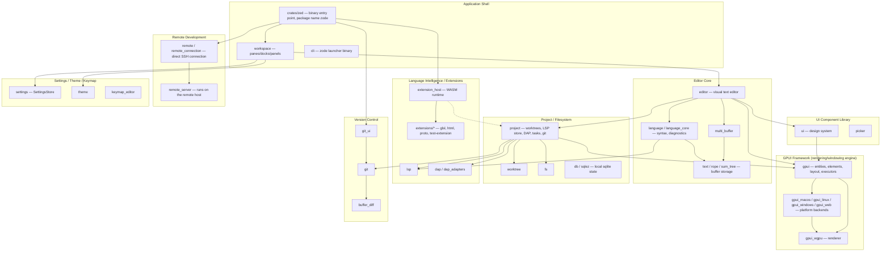
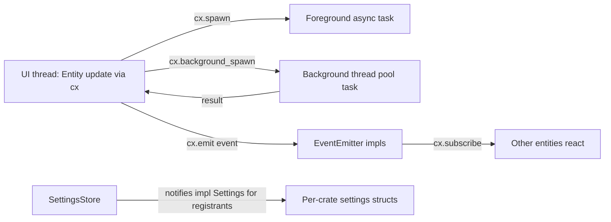
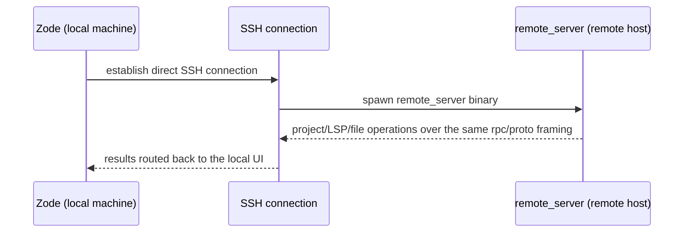

# Architecture

**Rewritten 2026-08-04** against the post-fork tree (187 packages / 178 crates). This fork
removed authentication, cloud/collaboration, AI/agent, edit-prediction, auto-update, and
telemetry/crash-reporting — see `plans/260726-1531-remove-auth-cloud-hard-fork/plan.md` for the
full 12-phase history of what changed and why.

<!-- Stack: Rust workspace (generic-source profile), native GPUI desktop app.
     Verified via root Cargo.toml (187 workspace members), rust-toolchain.toml (channel 1.94.1,
     targets: wasm32-wasip2 [extensions], wasm32-unknown-unknown [gpui-web], x86_64-unknown-linux-musl [remote server]). -->

## System Architecture

The binary `crates/zed` (package name `zode`) statically links the in-workspace library crates.
There is no client/server split of any kind anymore — no cloud backend, no collaboration server.
The only outbound network paths are the disclosed extension registry (`api.zed.dev`) and
per-language-server downloads from each server's own distributor.

## Tech Stack

| Layer | Technology | Version / Evidence |
|-------|------------|---------|
| Language | Rust | toolchain `1.94.1`, `rust-toolchain.toml` |
| UI framework | GPUI (in-house, `crates/gpui`) | GPU-accelerated retained-mode UI; own entity/element/layout system (Taffy flex layout) |
| Rendering backend | `gpui_wgpu` (wgpu) + platform backends | `gpui_macos` (Cocoa/Metal via objc2), `gpui_linux` (X11/Wayland), `gpui_windows` (Win32/Direct3D), `gpui_web` (wasm32-unknown-unknown, experimental) |
| Text/buffer engine | `text`, `rope`, `sum_tree` (in-house rope + B-tree index) | `crates/text/src/text.rs` `Buffer` |
| Language intelligence | `lsp` (custom LSP client), tree-sitter grammars via `grammars`/`languages` | LSP client transport, not tower-lsp |
| Extension runtime | WASM via `extension_host`, targets `wasm32-wasip2` | confirmed in `rust-toolchain.toml` targets |
| Local persistence | SQLite via `sqlez` (thin async wrapper) + `db` | app state (workspace layout, kv store) |
| Remote development | direct SSH connection via `remote`/`remote_connection`, running `remote_server` on the host | rebuilt in this fork — no relay server |
| Async runtime | GPUI's own executor (`cx.spawn`, `cx.background_spawn`); `gpui_tokio` bridges Tokio only where a dep requires it | not tokio-first |
| Build/workspace | Cargo workspace, resolver "2", 187 members | root `Cargo.toml` |
| Packaging targets | macOS/Linux/Windows native, `x86_64-unknown-linux-musl` (remote server), WASM (extensions + experimental web) | `rust-toolchain.toml` |

## Concurrency & Event Model

GPUI supplies its own concurrency and pub/sub primitives in place of an OS/web-framework thread
pool or message broker:

- **Entity model**: nearly every major struct (`Editor`, `Project`, `Workspace`) is held as
  `Entity<T>`, mutated only through `cx.update`/`cx.update_in` — enforced single-writer discipline
  (per project `CLAUDE.md`).
- **Scheduler abstraction**: `crates/scheduler` — deterministic time abstraction backing timers,
  with a fake implementation for tests.
- **Action dispatch**: `actions!()` macro + `.on_action()` handlers function as the app's
  "controller layer" for user-triggered commands.

## Remote Development (replaces the old client/server collaboration split)

This is the only host-boundary-crossing path in the system, and it is entirely opt-in (the user
explicitly connects to a remote host). The core editing experience (Editor Core,
Project/Filesystem, Language Intelligence) runs fully local with no network dependency at all.

## Notes / Limits

- No REST/GraphQL/gRPC API surface exists; this app has no API-gateway layer.
- SSH remote development is the single least-tested change in this fork relative to upstream Zed
  — it was rebuilt rather than salvaged, since the original path assumed collaboration
  infrastructure (`collab`) that no longer exists. See Phase 11's `network-verification.md` for
  what's been verified so far.
