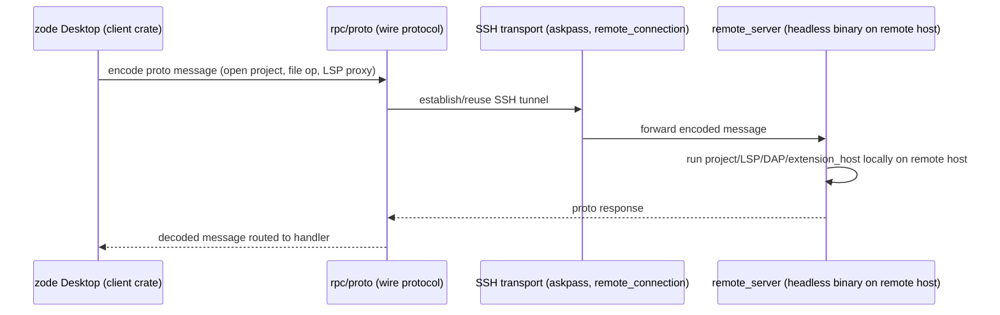

# Architecture

<!-- Stack: Rust workspace (generic-source profile), native GPUI desktop app ("Zode", a Zed fork).
     Verified via root Cargo.toml (180 crate members + 4 extensions + 3 tooling crates, resolver "2"),
     and direct [dependencies] inspection of crates/zed, crates/workspace, crates/project, crates/editor,
     crates/extension_host, crates/git_ui, crates/sidebar, crates/title_bar, crates/client, crates/rpc,
     crates/proto, crates/remote, crates/remote_server, crates/remote_connection, crates/collections
     Cargo.toml [dependencies] sections (see scout-report.md for full per-crate inventory).
     CORRECTION vs. upstream Zed / a prior draft of this doc: this fork carries NO `agent`, `collab`,
     `livekit_api`/`livekit_client`, or `language_model`/provider crates — none of those directories
     exist under crates/ and none are workspace members. The only trace of the AI-agent feature is a
     single unused `agent-client-protocol = "=0.11.1"` entry in the root [workspace.dependencies]
     table with zero consuming crates (`grep -rn agent-client-protocol crates/*/Cargo.toml` = no
     matches) — vestigial from stripping that feature, not a live subsystem. Git log confirms an
     explicit `collab_ui` removal (commit ad901af "restore the title bar lost with the collab_ui
     removal"). Treat any AI/Agent or Collaboration section from a generic Zode writeup as INVALID
     for this repo. -->

## System Architecture

The binary `crates/zed` (`default-members`) statically links ~176 in-workspace library crates
(180 crate paths total, 176 are libraries plus benchmarks/test-only crates). There is no
client/server split, no collaboration backend, and no AI/agent subsystem in this fork — `client`,
`rpc`, and `proto` exist solely to support **remote development** (SSH-based `remote_server` /
`remote_connection`, confirmed in `crates/remote_server/Cargo.toml` depending on `client`, `rpc`,
`proto`, `project`, `extension_host`) and telemetry, not real-time multiplayer collaboration. The
app is 100% local-first: Editor Core, Project/Filesystem, Language Intelligence, and Extensions
all run with no network dependency; the only network-facing crates are `remote`/`remote_server`
(opt-in SSH remoting), `extension_host` (fetching extensions), `http_client`, and `client` (update
checks / telemetry upload).

```mermaid
graph TB
    subgraph "Application Shell"
        ZED[crates/zed — binary entry point]
        WS[workspace — panes/docks/panels, multi-workspace + hibernation]
        SIDEBAR[sidebar — always-visible project rail]
        TITLEBAR[title_bar — window chrome + search bar]
        CLI[cli — zed launcher binary]
    end

    subgraph "GPUI Framework (rendering/windowing engine)"
        GPUI[gpui — entities, elements, layout, executors]
        PLAT[gpui_macos / gpui_linux / gpui_windows / gpui_web — platform backends]
        WGPU[gpui_wgpu — renderer]
    end

    subgraph "Editor Core"
        EDITOR[editor — visual text editor]
        LANG[language / language_core — syntax, diagnostics]
        TEXT[text / rope / sum_tree — buffer storage]
        MB[multi_buffer]
        VIM[vim — modal editing]
    end

    subgraph "Project / Filesystem"
        PROJECT[project — worktrees, LSP store, DAP, tasks, git, hibernation]
        WORKTREE[worktree]
        FS[fs]
        DB[db / sqlez — local sqlite state]
        RECENT[recent_projects]
    end

    subgraph "Language Intelligence / Extensions"
        LSP[lsp]
        EXT_HOST[extension_host — WASM runtime]
        EXTENSIONS[extensions/* — glsl, html, proto, test-extension]
        DAP[dap / dap_adapters — debugger protocol]
    end

    subgraph "Remote Development (opt-in, SSH)"
        CLIENT[client — auth/telemetry/websocket transport]
        RPC[rpc / proto — wire protocol]
        REMOTE[remote / remote_connection]
        REMOTE_SRV[remote_server — headless binary, musl target]
    end

    subgraph "Version Control"
        GIT[git]
        GIT_UI[git_ui]
        BUFFER_DIFF[buffer_diff]
    end

    subgraph "Settings / Theme / Keymap"
        SETTINGS[settings / settings_content — SettingsStore]
        THEME[theme / theme_settings]
        KEYMAP[keymap_editor]
    end

    subgraph "UI Component Library"
        UI[ui — design system, 106 files]
        PICKER[picker]
    end

    ZED --> WS
    WS --> EDITOR
    ZED --> TITLEBAR
    ZED --> SIDEBAR
    ZED --> EXT_HOST
    ZED --> GIT_UI
    ZED --> CLIENT

    EDITOR --> MB --> TEXT
    EDITOR --> LANG --> TEXT
    EDITOR --> PROJECT
    EDITOR --> UI
    EDITOR --> GPUI
    EDITOR --> VIM

    PROJECT --> WORKTREE
    PROJECT --> FS
    PROJECT --> LSP
    PROJECT --> DAP
    PROJECT --> GIT
    PROJECT --> RPC
    PROJECT --> GPUI
    PROJECT --> DB

    LANG --> LSP
    EXT_HOST --> EXTENSIONS
    EXT_HOST -.-> PROJECT

    CLIENT --> RPC --> REMOTE_SRV
    REMOTE --> RPC
    REMOTE --> REMOTE_SRV
    GIT_UI --> GIT --> BUFFER_DIFF
    GIT_UI --> REMOTE_CONNECTION[remote_connection]

    WS --> SETTINGS
    WS --> THEME
    WS --> RECENT
    SIDEBAR --> PROJECT
    SIDEBAR --> RECENT
    TITLEBAR --> GIT_UI
    TITLEBAR --> RECENT
    UI --> GPUI

    GPUI --> PLAT
    GPUI --> WGPU
    PLAT --> WGPU
```

## Tech Stack

| Layer                 | Technology                                                                                                                                                    | Version / Evidence                                                                                                                                   |
| --------------------- | ------------------------------------------------------------------------------------------------------------------------------------------------------------- | ---------------------------------------------------------------------------------------------------------------------------------------------------- |
| Language              | Rust                                                                                                                                                          | toolchain per `rust-toolchain.toml`                                                                                                                  |
| UI framework          | GPUI (in-house, `crates/gpui`)                                                                                                                                | GPU-accelerated retained-mode UI; own entity/element/layout system (Taffy flex layout)                                                               |
| Rendering backend     | `gpui_wgpu` (wgpu) + platform backends                                                                                                                        | `gpui_macos` (Cocoa/Metal via objc2), `gpui_linux` (X11/Wayland), `gpui_windows` (Win32/Direct3D), `gpui_web` (wasm32-unknown-unknown, experimental) |
| Text/buffer engine    | `text`, `rope`, `sum_tree` (in-house rope + B-tree index)                                                                                                     |                                                                                                                                                      |
| Language intelligence | `lsp` (custom LSP client), tree-sitter grammars via `grammars`/`languages`                                                                                    | LSP client transport, not tower-lsp                                                                                                                  |
| Debugging             | `dap` / `dap_adapters` (Debug Adapter Protocol client)                                                                                                        | separate from the language-server layer                                                                                                              |
| Extension runtime     | WASM via `extension_host`, in-tree extensions under `extensions/*` (glsl, html, proto, test-extension)                                                        |                                                                                                                                                      |
| Local persistence     | SQLite via `sqlez` (thin async wrapper) + `db`                                                                                                                | app/window/multi-workspace state, KV store                                                                                                           |
| Remote development    | `client` + `rpc`/`proto` (custom binary wire protocol) + `remote`/`remote_connection` + `remote_server` (headless binary, `x86_64-unknown-linux-musl` target) | SSH-based remoting only — **no collaboration backend, no multiplayer, no AI agent** in this fork                                                     |
| Async runtime         | GPUI's own executor (`cx.spawn`, `cx.background_spawn`); `gpui_tokio` bridges Tokio only where a dependency requires it                                       | not tokio-first                                                                                                                                      |
| Build/workspace       | Cargo workspace, resolver "2", 180 crate paths (`crates/*`) + 4 `extensions/*` + 3 `tooling/*`                                                                | root `Cargo.toml`                                                                                                                                    |
| Packaging targets     | macOS/Linux/Windows native, musl (remote server), WASM (extensions + experimental web)                                                                        | `rust-toolchain.toml`                                                                                                                                |

**Removed relative to upstream Zed** (verified absent from workspace members and `crates/`): `agent`,
`agent_ui`, `acp_thread`, `collab` (server binary), `language_model` + per-vendor provider crates
(`anthropic`, `open_ai`, `google_ai`, `bedrock`, `ollama`, …), `livekit_api`/`livekit_client`,
`edit_prediction*` (Zeta). This is a lean, non-AI, non-collaborative editor fork centered on local
editing, multi-project workflows, and remote (SSH) development.

## Concurrency & Event Model

- **Entity model**: nearly every major struct (`Editor`, `Project`, `Workspace`) is held as
  `Entity<T>`, mutated only through `cx.update`/`cx.update_in` — enforced single-writer discipline
  (per project `CLAUDE.md`).
- **Scheduler abstraction**: `crates/scheduler` provides a deterministic time abstraction backing
  timers, with a fake implementation for tests.
- **Action dispatch**: `actions!()` macro + `.on_action()` handlers function as the app's
  "controller layer" for user-triggered commands (keybindings, command palette, menus).
- **Multi-project hibernation** (this fork's signature feature, per `workspace/src/multi_workspace.rs`,
  `sidebar/src/rail.rs`, `project/src/project.rs`): a project can be moved to a hibernated state —
  LSP servers, terminals, prettier instances, and the git store are torn down/deferred while the
  `Workspace`/`Project` entities and their on-disk session record persist, so it can be woken again
  without a full re-open. Note (see `zode_activity_label_vs_resource_state` memory): the
  activity-state label and the underlying resource teardown are reported separately and can
  diverge because the teardown is barrier-deferred.

## Data Flow

### Remote Development (SSH), not Collaboration

This is the only "client/server" boundary in the system, and it is a single-user remote-editing
session (one desktop talking to one remote host it controls over SSH) — not a multi-user
collaboration server. There is no Postgres-backed backend, no room/channel model, and no WebRTC
calling in this repository.

## Notes / Limits

- Diagrams are derived from scout-report.md subsystem groupings plus direct `[dependencies]`
  inspection of a representative crate sample (`zed`, `workspace`, `project`, `editor`,
  `extension_host`, `git_ui`, `sidebar`, `title_bar`, `client`, `rpc`, `proto`, `remote`,
  `remote_server`, `remote_connection`, `collections`); not every one of the 180 crate paths was
  individually verified — smaller leaf/utility crates are trusted from the scout report's per-crate
  purpose descriptions rather than re-sampled here.
- No REST/GraphQL/gRPC API surface exists; the "System Architecture" diagram intentionally has no
  API-gateway layer, unlike the generic template.
- This doc corrects a materially wrong prior draft that assumed upstream Zed's `agent`/`collab`/
  `livekit`/`language_model` subsystems were present in this repo. Anyone extending this doc should
  re-verify crate presence against root `Cargo.toml` workspace members before adding sections for
  AI/agent or collaboration — they do not exist here as of this scan.
- Not investigated in this pass: exact wire-protocol message catalog inside `proto`/`rpc` (would
  need a dedicated protocol-spec pass); full extension WASM ABI surface in `extension_api`.
