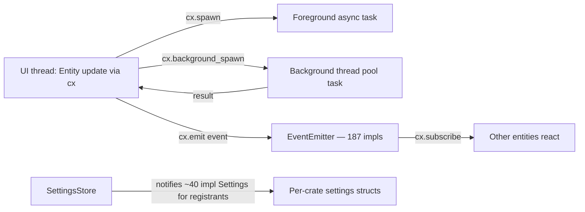
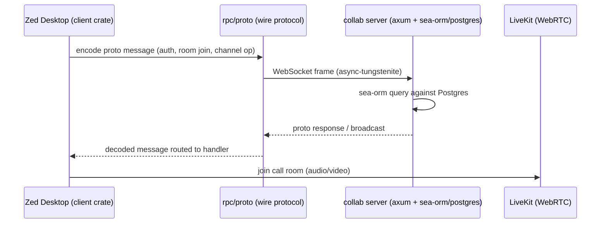

# Architecture

> [!CAUTION]
> **STALE — do not treat this document as a description of the current code.**
> It was generated on 2026-07-26 against the pre-fork tree of 240 packages /
> 232 crates. The hard fork has since removed 54 crates and gutted several
> more; the workspace is now 186 packages / 178 crates.
>
> Anything here describing accounts, sign-in, collaboration, calls, channels,
> AI agents, LLM providers, edit prediction, auto-update or crash reporting is
> **fiction** — that code no longer exists. Feature codes F007, F008, F013,
> F019, F020, F021 and F022 in particular no longer have an implementation.
>
> Regeneration is deliberately deferred until the fork is green and verified
> (`/tkm:rebuild-spec` after phase 11). Running it against a half-cut tree
> would just produce a second stale document.

<!-- Stack: Rust workspace (generic-source profile), native GPUI desktop app.
     Verified via root Cargo.toml (241 workspace members), rust-toolchain.toml (channel 1.94.1,
     targets: wasm32-wasip2 [extensions], wasm32-unknown-unknown [gpui-web], x86_64-unknown-linux-musl [remote server]),
     and dependency sampling of crates/editor, crates/gpui, crates/project, crates/agent, crates/collab,
     crates/zed Cargo.toml [dependencies] sections (see scout-report.md for full per-crate inventory). -->

## System Architecture

The binary `crates/zed` (`default-members`) statically links ~230 in-workspace library crates. There
is no client/server web split in the desktop app itself — `collab` is a separately-deployed backend
binary that the desktop client talks to over a custom RPC/proto protocol (not HTTP routes), confirmed
in `crates/collab/Cargo.toml` (axum + sea-orm + sqlx + tokio, its own binary target) vs. `crates/zed`
(gpui-based binary, no axum/sea-orm deps).

```mermaid
graph TB
    subgraph "Application Shell"
        ZED[crates/zed — binary entry point]
        WS[workspace — panes/docks/panels]
        CLI[cli — zed launcher binary]
    end

    subgraph "GPUI Framework (rendering/windowing engine)"
        GPUI[gpui — entities, elements, layout, executors]
        PLAT[gpui_macos / gpui_linux / gpui_windows / gpui_web — platform backends]
        WGPU[gpui_wgpu — renderer]
    end

    subgraph "Editor Core"
        EDITOR[editor — visual text editor]
        LANG[language / language_core — syntax, diagnostics]
        TEXT[text / rope / sum_tree — buffer storage]
        MB[multi_buffer]
    end

    subgraph "Project / Filesystem"
        PROJECT[project — worktrees, LSP store, DAP, tasks, git]
        WORKTREE[worktree]
        FS[fs]
        DB[db / sqlez — local sqlite state]
    end

    subgraph "Language Intelligence / Extensions"
        LSP[lsp]
        EXT_HOST[extension_host — WASM runtime]
        EXTENSIONS[extensions/* — glsl, html, proto, test-extension]
        DAP[dap / dap_adapters]
    end

    subgraph "AI / Agent"
        AGENT[agent — Thread engine]
        AGENT_UI[agent_ui]
        LANG_MODEL[language_model — provider abstraction]
        PROVIDERS[anthropic / open_ai / google_ai / bedrock / ollama / ... — per-vendor clients]
        EDIT_PRED[edit_prediction* — Zeta inline completion]
    end

    subgraph "Collaboration & Networking (separate deployable)"
        CLIENT[client — auth/websocket to collab]
        RPC[rpc / proto — wire protocol]
        COLLAB[collab server binary — axum + sea-orm/postgres]
        LIVEKIT[livekit_api / livekit_client — calls]
    end

    subgraph "Version Control"
        GIT[git]
        GIT_UI[git_ui]
        BUFFER_DIFF[buffer_diff]
    end

    subgraph "Settings / Theme / Keymap"
        SETTINGS[settings — SettingsStore]
        THEME[theme]
        KEYMAP[keymap_editor]
    end

    subgraph "UI Component Library"
        UI[ui — design system, 106 files]
        PICKER[picker]
    end

    ZED --> WS
    WS --> EDITOR
    ZED --> AGENT_UI
    ZED --> EXT_HOST
    ZED --> GIT_UI
    ZED --> CLIENT

    EDITOR --> MB --> TEXT
    EDITOR --> LANG --> TEXT
    EDITOR --> PROJECT
    EDITOR --> UI
    EDITOR --> GPUI

    PROJECT --> WORKTREE
    PROJECT --> FS
    PROJECT --> LSP
    PROJECT --> DAP
    PROJECT --> GIT
    PROJECT --> RPC
    PROJECT --> GPUI

    LANG --> LSP
    EXT_HOST --> EXTENSIONS
    EXT_HOST -.-> PROJECT

    AGENT --> LANG_MODEL --> PROVIDERS
    AGENT --> PROJECT
    AGENT --> DB
    AGENT_UI --> AGENT
    EDIT_PRED --> EDITOR

    CLIENT --> RPC --> COLLAB
    CLIENT --> LIVEKIT
    GIT_UI --> GIT --> BUFFER_DIFF

    WS --> SETTINGS
    WS --> THEME
    UI --> GPUI

    GPUI --> PLAT
    GPUI --> WGPU
    PLAT --> WGPU
```

## Tech Stack

| Layer | Technology | Version / Evidence |
|-------|------------|---------|
| Language | Rust | toolchain `1.94.1`, `rust-toolchain.toml` |
| UI framework | GPUI (in-house, `crates/gpui`) | GPU-accelerated retained-mode UI; own entity/element/layout system (Taffy flex layout `taffy = "=0.9.0"`) |
| Rendering backend | `gpui_wgpu` (wgpu) + platform backends | `gpui_macos` (Cocoa/Metal via objc2), `gpui_linux` (X11/Wayland), `gpui_windows` (Win32/Direct3D), `gpui_web` (wasm32-unknown-unknown, experimental) |
| Text/buffer engine | `text`, `rope`, `sum_tree` (in-house CRDT-like rope + B-tree index) | `crates/text/src/text.rs:59 Buffer` |
| Language intelligence | `lsp` (custom LSP client), tree-sitter grammars via `grammars`/`languages` | LSP client transport, not tower-lsp |
| Extension runtime | WASM via `extension_host`, targets `wasm32-wasip2` | confirmed in `rust-toolchain.toml` targets |
| Local persistence | SQLite via `sqlez` (thin async wrapper) + `db` | app state (workspace layout, kv store) |
| AI/LLM integration | `language_model` abstraction + per-vendor client crates | `anthropic`, `open_ai`, `google_ai`, `bedrock`, `mistral`, `ollama`, `lmstudio`, `deepseek`, `open_router`, `vercel`, `x_ai`, `copilot` |
| Agent protocol | ACP (Agent Client Protocol) via `agent-client-protocol` dep + `acp_thread` | `crates/agent/Cargo.toml` dep `agent-client-protocol.workspace = true` |
| Collab server (separate binary) | axum 0.6 (WS/HTTP), sea-orm 1.1.10 + sqlx 0.8 (Postgres), tokio (full) | `crates/collab/Cargo.toml` — distinct dependency profile from the desktop `zed` binary |
| Client↔collab wire protocol | Custom binary RPC (`rpc`, `proto` crates) over WebSocket (`async-tungstenite`) | not REST/gRPC |
| Calls/media | LiveKit (WebRTC) via `livekit_api`/`livekit_client`; `audio`, `denoise` | |
| Async runtime | GPUI's own executor (`cx.spawn`, `cx.background_spawn`); `gpui_tokio` bridges Tokio only where a dep requires it (e.g. AWS SDK) | not tokio-first; 360 files use `cx.spawn`, 153 use `cx.background_spawn` per scout report |
| Build/workspace | Cargo workspace, resolver "2", 241 members | root `Cargo.toml` |
| Packaging targets | macOS/Linux/Windows native, `x86_64-unknown-linux-musl` (remote server), WASM (extensions + experimental web) | `rust-toolchain.toml` |

## Concurrency & Event Model

GPUI supplies its own concurrency and pub/sub primitives in place of an OS/web-framework thread pool
or message broker (confirmed via scout report's Background Logic Source Inventory, `[SIGNAL_INFERRED]`):

- **Entity model**: nearly every major struct (`Editor`, `Project`, `Workspace`, `Thread`) is held as
  `Entity<T>`, mutated only through `cx.update`/`cx.update_in` — enforced single-writer discipline
  (per project `CLAUDE.md`, cross-checked against `gpui` crate structure).
- **Scheduler abstraction**: `crates/scheduler/src/scheduler.rs:72 pub trait Scheduler` — deterministic
  time abstraction backing timers, with a fake implementation for tests.
- **Action dispatch**: `actions!()` macro (128 files) + `.on_action()` handlers (133 files) function as
  the app's "controller layer" for user-triggered commands.

## Client / Server Split (Collaboration)

This is the only client/server boundary in the system; it is optional (collaboration/AI-cloud
features) — the core editing experience (Editor Core, Project/Filesystem, Language Intelligence)
runs fully local with no network dependency.

## Notes / Limits

- Diagrams are derived from scout-report.md subsystem groupings plus direct `[dependencies]`
  inspection of six representative crates (`editor`, `gpui`, `project`, `agent`, `collab`, `zed`);
  not every one of the 241 workspace crates' Cargo.toml was individually verified — smaller
  leaf/utility crates (e.g. `clock`, `paths`, `env_var`) are trusted from the scout report's
  per-crate purpose descriptions rather than re-sampled here.
- No REST/GraphQL/gRPC API surface exists (per scout report `## Detected API Kind: N/A`); the
  "System Architecture" diagram intentionally has no API-gateway layer, unlike the generic template.
- Edit-prediction (Zeta) and AI/Agent subsystems overlap in `edit_prediction*` vs `agent*` crates;
  this doc treats them as sibling subsystems per scout grouping rather than merging them, since their
  Cargo.toml dependency sets do not overlap significantly (edit_prediction depends on editor directly;
  agent depends on project/language_model).
