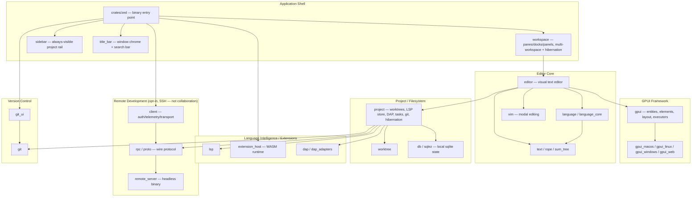
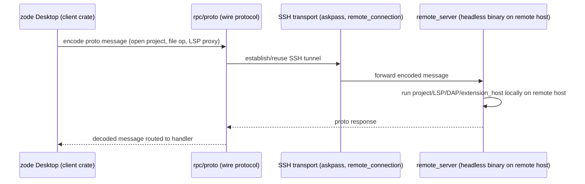

# System Overview

**Project**: Zed (zode fork)
**Generated**: 2026-08-07
**Architecture Type**: Native multi-platform desktop application (GPUI-based). Local-first — no collaboration/multiplayer backend, no AI-agent subsystem (both removed in this fork; see Notes below).

## Executive Summary

Zode is a native, GPU-accelerated code editor written in Rust, built on the project's own in-house UI framework, GPUI (`crates/gpui`). The workspace is a single Cargo monorepo of 180 workspace-member crate paths under `crates/` (179 top-level crate directories plus one nested derive-macro crate, `crates/refineable/derive_refineable`), plus 4 in-tree extension crates under `extensions/` (glsl, html, proto, test-extension — built against `extension_api`, loaded dynamically as WASM at runtime, not statically linked) and 3 dev-tooling crates under `tooling/` (compliance, perf, xtask). The workspace compiles to one primary binary (`crates/zed`, declared as `default-members`) that runs on macOS, Linux, and Windows, with an experimental WASM/web rendering backend (`crates/gpui_web`).

Architecturally the system is organized as concentric layers rather than a client/server split: GPUI (rendering, windowing, entity/event model, async executors/`Scheduler`) underpins an editor-core layer (`text`/`rope`/`sum_tree` for buffer storage, `language`/`language_core` for syntax/diagnostics-aware buffers, `multi_buffer`, `editor`), which is coordinated by a project layer (`project`, `worktree`, `workspace`, `fs`, `db`) that wires in Language Server Protocol (`lsp`, `languages`) and Debug Adapter Protocol (`dap`, `dap_adapters`, `debugger_ui`) support, a WASM extension host (`extension_host`), settings/theme/keymap infrastructure (`settings`, `settings_content`, `theme`, migration engine in `migrator`), and a large first-party UI component library (`ui`, 106 files). There is **no** AI/agent subsystem and **no** real-time collaboration server in this fork — see `architecture.md`'s correction note (verified: no `agent`/`collab`/`livekit`/`language_model` crates exist under `crates/`; only a single unused `agent-client-protocol` version pin remains in `[workspace.dependencies]` with zero consumers).

Recent work on this fork has focused on window chrome and multi-project ergonomics: a restored/expanded `title_bar` (with `application_menu`, and a newly added search bar), a new `platform_title_bar` crate for OS-native tab/window-control integration, and a `sidebar` crate implementing an always-visible project rail alongside multi-project hibernation support in `workspace`/`project` (activity-state tracking distinct from actual resource teardown — see `crates/project`'s activity/hibernation logic).

This is a desktop application, not a web app: there are no HTTP routes or "screens" in the routed-navigation sense (route-list/screen-list/screen-flow/api-map artifacts are out of scope for this project per the generic-source stack profile). The nearest analogues to "screens" are GPUI `Render`-implementing entities (`Editor`, `Workspace`, dock panels, `sidebar`), and the nearest analogue to a request-routing layer is Zed's `actions!()`/`#[derive(Action)]` dispatch mechanism (101+ files register custom-command-style actions per the scout's Background Logic inventory) combined with the `impl EventEmitter<...>` / `cx.subscribe` pub-sub pattern used for inter-entity communication.

For per-subsystem crate detail and the full background-logic inventory, see [scout-report.md](scout-report.md).

## System Architecture

### High-Level Architecture

### Technology Stack

| Layer | Technology | Version |
|-------|------------|---------|
| Language | Rust | per `rust-toolchain.toml` |
| UI framework | GPUI (in-house, `crates/gpui`) | GPU-accelerated retained-mode UI, own entity/element/layout system |
| Rendering | `gpui_wgpu` + platform backends | `gpui_macos`, `gpui_linux`, `gpui_windows`, `gpui_web` (experimental) |
| Text/buffer engine | `text`, `rope`, `sum_tree` | in-house rope + B-tree index |
| Language intelligence | `lsp` (custom client), tree-sitter grammars | not tower-lsp |
| Debugging | `dap` / `dap_adapters` | Debug Adapter Protocol |
| Extension runtime | WASM via `extension_host` | in-tree extensions: glsl, html, proto, test-extension |
| Local persistence | SQLite via `sqlez` + `db` | app/window/multi-workspace state |
| Remote development | `client` + `rpc`/`proto` + `remote_server` | SSH-based remoting only — no collaboration backend |
| Async runtime | GPUI's own executor (`cx.spawn`, `cx.background_spawn`) | not Tokio-first (`gpui_tokio` bridges select dependencies only) |
| Build/workspace | Cargo workspace, resolver "2", 180 crate paths (179 top-level + 1 nested) + 4 extensions + 3 tooling crates | root `Cargo.toml` |

## Data Flow

This is the only "client/server" boundary in the system, and it is a single-user remote-editing session (one desktop talking to one remote host it controls over SSH) — not a multi-user collaboration server. There is no Postgres-backed backend, no room/channel model, and no WebRTC calling in this repository. For local (non-remote) operation, data flow is entirely in-process: user input → GPUI action dispatch → entity update (`cx.update`) → LSP/DAP/git/extension calls dispatched as background tasks → results routed back via entity events (`cx.emit`/`cx.subscribe`).

## Key Design Decisions

### Decision 1: A first-party UI framework (GPUI) instead of an existing GUI toolkit

**Context**: A code editor needs low-latency, GPU-accelerated text rendering and fine-grained control over layout, input, and cross-platform windowing that general-purpose Rust GUI crates did not offer at the performance/control level Zed's editor core requires.

**Decision**: Build and own GPUI (`crates/gpui`) as the foundation: an entity/context model (`Entity<T>`, `Context<T>`, `App`), Taffy-based flexbox layout, per-platform rendering backends (`gpui_macos`, `gpui_linux`, `gpui_windows`, `gpui_wgpu` shared renderer, experimental `gpui_web`), and its own async executor abstractions (`cx.spawn`, `cx.background_spawn`, `Task<T>`) rather than depending on Tokio directly (`gpui_tokio` is a bridge crate for the few dependencies, e.g. AWS SDK, that require Tokio).

**Rationale**: Owning the framework lets the editor co-design the rendering pipeline with the text/rope data structures for performance, and gives one consistent concurrency/entity model (`Entity<T>`, events, actions) used uniformly across every subsystem — avoiding a patchwork of different UI-toolkit and async idioms.

### Decision 2: A custom binary RPC protocol for remote (SSH) development, not a REST API

**Context**: Remote development (editing a project that lives on another machine over SSH) needs low-latency bidirectional messaging between the desktop client and a headless server process running on the remote host — a shape that a request/response HTTP API is not naturally suited to.

**Decision**: Define a custom wire protocol (`crates/proto`) and shared RPC framing (`crates/rpc`) used symmetrically by the desktop client (`client`) and the `remote_server` headless binary launched over SSH, rather than exposing REST/GraphQL routes.

**Rationale**: A typed message protocol over a persistent connection supports low-latency bidirectional push (file changes, LSP proxying) more naturally than polling or per-request HTTP, and lets client and server share the same generated message types. This is also why no `api-map`/route-list artifact applies to this codebase — the only "API surface" is these protocol messages, not HTTP routes, and there is no separately-deployed collaboration server on the other end (unlike upstream Zed).

### Decision 3: WASM sandboxing for third-party extensions

**Context**: Extensions (language grammars, themes, LSP/DAP adapters) are third-party code that must not be able to crash or compromise the host editor process, while still needing controlled access to project files and network in specific cases.

**Decision**: Compile extensions to a WASM target and run them inside a sandboxed runtime hosted by `crates/extension_host`, with a stable Rust API surface (`crates/extension_api`) that extension authors code against, and calls dispatched off the main thread via `cx.background_spawn`. A per-extension capability-grant system (`ExtensionCapability::ProcessExec`/`DownloadFile`/`NpmInstallPackage`) further restricts what a sandboxed extension may do at runtime.

**Rationale**: WASM sandboxing isolates untrusted extension code from the host process (memory safety, no arbitrary syscalls) while still allowing extensions to be distributed as portable binaries across all supported platforms; the bundled in-tree extensions (`extensions/glsl`, `extensions/html`, `extensions/proto`, `extensions/test-extension`) validate the same API path used by third-party publishers.

## Security Overview

- **Authentication**: SSH remote development uses `crates/askpass` (including `encrypted_password.rs`) for interactive/non-interactive SSH credential prompts; `crates/client` handles telemetry/update-check auth via OS-keychain-backed credential storage (`crates/credentials_provider`, `crates/zed_credentials_provider`).
- **Authorization**: No traditional RBAC/route-guard system exists (single local user, no multi-tenant surface). What this codebase calls "authorization" reduces to capability/trust gates: the extension WASM sandbox's per-extension capability allowlist, the buffer `Capability` (ReadWrite/Read/ReadOnly) edit gate, and a local worktree-trust boundary (`crates/project/src/trusted_worktrees.rs`) gating whether a project may spawn LSP/git tooling. See `permissions-matrix.md` for the full PERM### catalog.
- **Data Encryption**: Network transport relies on `crates/http_client_tls`/`reqwest_client` for TLS on outbound HTTP (extension downloads, update checks, telemetry); no application-level at-rest encryption layer was identified (local SQLite state via `crates/db`/`sqlez` is unencrypted on disk, consistent with a local developer tool).
- **API Security**: N/A — no HTTP API surface exposed by this application; the only wire protocol (`rpc`/`proto`) is the SSH-tunneled remote-development transport described above.

## Scalability

- **Current Capacity**: Single-user desktop process per running instance; scaling is per-editor-instance (large files, many open buffers/worktrees, and — per this fork's multi-project hibernation work — many simultaneously open projects) rather than concurrent-request throughput. There is no server-side component with multi-client scaling concerns in this fork.
- **Scaling Strategy**: Async task offloading via GPUI's `cx.background_spawn`/`Scheduler` abstraction keeps LSP requests, extension calls, and indexing off the UI thread; large-file/large-project performance relies on the `Rope`/`SumTree` data structures for efficient text indexing and `Worktree` for incremental filesystem watching rather than full re-scans. The scout's Background Logic inventory treats `cx.background_spawn(` + `.detach()`/`.detach_and_log_err()` co-occurring in the same file (62 confirmed queue-worker files) as the reliable fire-and-forget worker signal, distinct from the many more files using `Task<`/`cx.spawn(` for ordinary awaited-in-place async UI work. Multi-project hibernation adds a further scaling lever: inactive projects are marked hibernated at the activity-state layer, though actual LSP/resource teardown may be deferred behind a barrier — activity label and resource state are not always in lockstep.
- **Performance Targets**: No explicit numeric SLOs were found in scanned sources; `tooling/perf` exists as an in-repo benchmarking harness and `crates/*_benchmarks` crates (`worktree_benchmarks`, `fs_benchmarks`, `project_benchmarks`) provide micro-benchmarks, but this pass found no documented target latencies/throughput figures to cite — flagged as a gap for a deeper performance-focused research pass if needed.

## Notes / Limits

- This document previously (2026-07-26 draft) described an "optional collaboration backend service" and an "AI/agent subsystem" layered on the editor core. Both are **absent from this fork** — verified via `ls crates` (no `agent`, `collab`, `call`, `channel`, `livekit_api`, `livekit_client`, or `language_model` directories) and `grep -rn agent-client-protocol crates/*/Cargo.toml` (zero consuming crates). Git history confirms an explicit `collab_ui` removal (commit `ad901af`). Any prior writeup describing collaboration/AI-agent features for this repository should be treated as invalid.
